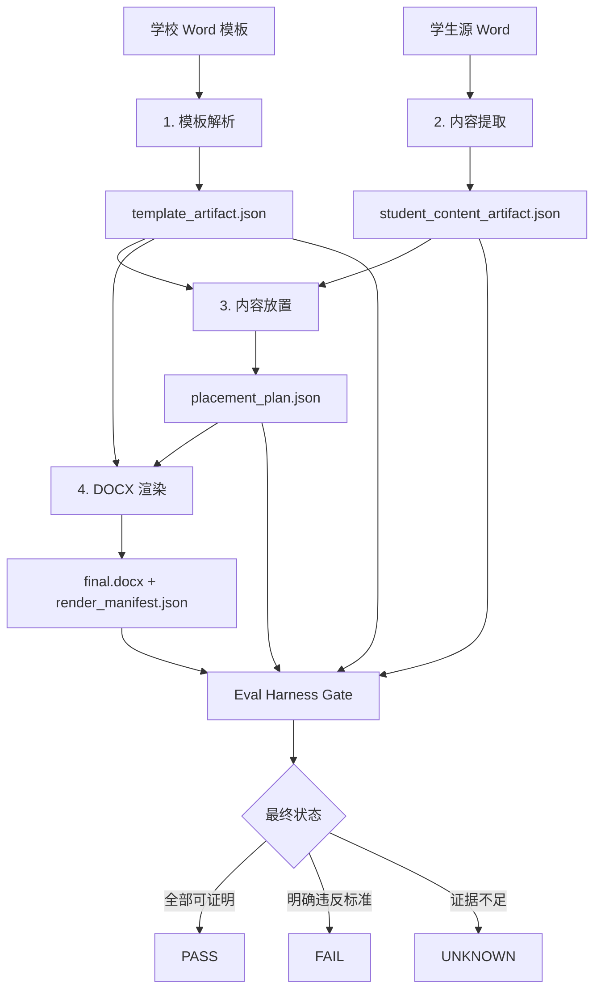

# DocFit 当前文档入口

Last updated: 2026-06-22

一句话结论：DocFit 的业务流程只有四个阶段：模板解析、内容提取、内容放置、DOCX 渲染；评测驱动开发是验收方法，不是业务阶段。

## 这个项目是什么

DocFit v3 要把学生论文 Word 转成目标学校要求的 Word。它的产品目标不是“生成一个能打开的文件”，而是让四个业务阶段都能证明：

- 学校模板被正确理解；
- 用户可见内容没有被静默丢弃；
- 每个内容都有明确去向；
- 最终 Word 按已验证计划生成；
- 缺标准、缺证据、缺检查器时输出 `UNKNOWN`，不能假装成功。

当前真实状态：Bootstrap 链路能跑；real-core-v0 能生成 Word 和报告，但完整业务 gate 仍会因为模板、内容、放置和渲染问题返回 `FAIL` / `UNKNOWN`。

## 业务四阶段

| 阶段 | 输入 | 输出 | 失败说明什么 |
| --- | --- | --- | --- |
| 1. 模板解析 | 学校 Word 模板 | `template_artifact.json` | 系统还没有正确理解目标学校模板结构、样式、区域和可填写位置 |
| 2. 内容提取 | 学生源 Word | `student_content_artifact.json` | 系统还不能证明学生可见内容被完整识别，没有静默丢弃 |
| 3. 内容放置 | 模板理解结果 + 学生内容 | `placement_plan.json` | 系统还不知道每段学生内容应该进入模板里的哪个位置 |
| 4. DOCX 渲染 | 放置计划 + 模板底稿 | `final.docx`、`render_manifest.json` | 系统还不能证明最终 Word 是按放置计划生成的 |

Eval Harness 检查这些阶段的产物，输出 `PASS` / `FAIL` / `UNKNOWN`。它是开发和验收控制层，不是第五个业务阶段。

## 当前开发主线

当前主线是 `real-core-v0` 真实学校转换链路。它不是“目录迁移项目”，也不是“只生成一个 Word 文件”的项目；它要把真实学校样例拆进四个业务阶段，并让 gate 在证据不足或结果错误时阻断。

| 优先级 | 当前要修的流程 | 为什么先修它 |
| --- | --- | --- |
| 1 | 学生内容提取 | 先证明源 Word 的可见内容被识别，旧封面、旧目录等源格式内容不会进入目标正文 |
| 2 | 内容放置 | 再证明每段学生内容进入目标学校模板的具体位置，而不是全部追加到末尾 |
| 3 | DOCX 渲染 | 最后证明最终 Word 按放置计划生成，没有模板说明文字和追加式输出 |
| 4 | 模板解析/模板质量 | 如果恢复严格模板验收口径，再继续补齐复杂样式、页码、section 和页面级证据 |

## 业务流程图



读图时记住三条边界：

| 边界 | 说明 |
| --- | --- |
| 业务只有四阶段 | 模板解析、内容提取、内容放置、DOCX 渲染 |
| Eval Harness 不是业务阶段 | 它检查阶段产物，决定能不能通过 |
| `docfit convert` 只是编排 | 任一阶段 `FAIL` 或 `UNKNOWN` 都不能宣称转换成功 |

## 当前模板侧支撑流程

当前真实学校模板还有一个支撑流程：

```text
学校原始模板 Word -> template-generate -> generated_template.docx -> template-gap -> 差距报告
```

这个流程用于准备和检查可填写模板。它服务于模板解析和模板质量验收，但不是业务四阶段之外新增的业务主线。

## 当前长期文档

| 文档 | 维护内容 |
| --- | --- |
| `docs/current/README.md` | 项目目标、业务四阶段、当前主线、读文档顺序 |
| `docs/current/contracts-and-gates.md` | 四阶段产物、判定、AI 边界 |
| `docs/current/template-generation.md` | 模板生成支撑流程：字段、执行、证据、template-gap |
| `docs/current/template-generation-stage-optimization.md` | 模板生成各阶段代码优化地图：当前实现、下一步改哪里、first_bad_stage 定位 |
| `docs/current/template-generation-evaluation.md` | 模板生成评测与测试架构：最终 gap、阶段检查骨架、测试边界 |
| `docs/current/template-generation-open-gaps.md` | 模板生成当前待核实差距：哪些是已确认问题，哪些还要逐项验证 |
| `docs/current/project-directory-structure.md` | 新增文件时才需要看的目录职责 |

## 读文档顺序

| 你要做什么 | 先读 |
| --- | --- |
| 理解项目整体 | 本文件 |
| 判断状态能不能通过 | `docs/current/contracts-and-gates.md` |
| 修改模板生成、字段或 gap 报告 | `docs/current/template-generation.md` |
| 讨论模板生成各阶段代码怎么优化 | `docs/current/template-generation-stage-optimization.md` |
| 核实模板生成当前差距 | `docs/current/template-generation-open-gaps.md` |
| 讨论模板生成评测或测试架构 | `docs/current/template-generation-evaluation.md` |
| 看当前进展和下一步 | `STATUS.md` |
| 新增输入、输出、标准、测试或文档 | `DIRECTORY_STRUCTURE.md`，它会指向完整规则 `docs/current/project-directory-structure.md` |

目录规则只解决“新文件放哪里”。理解项目时先看流程、门禁和当前状态。
