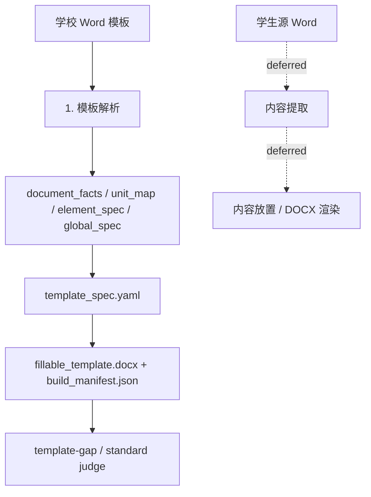

# DocFit 当前文档入口

Last updated: 2026-06-27

一句话结论：DocFit 的长期产品目标可以扩展到模板、学生内容、放置和渲染；**当前工程主线只做模板阶段**，学生内容提取、放置和渲染先不制作标准。

## 这个项目是什么

DocFit v3 的长期目标是把学生论文 Word 转成目标学校要求的 Word。当前阶段先把学校模板理解和可填写模板生成做扎实，因为学生链路还没有定义清楚。

当前必须证明：

- 学校模板被正确理解；
- 模板生成 T1-T5 阶段产物可追踪；
- `fillable_template.docx` 和最终模板 gap 可被检查；
- 缺标准、缺证据、缺检查器时输出 `UNKNOWN`，不能假装成功。

当前不要求证明：

- 学生源 Word 的内容抽取标准；
- 每段学生内容进入哪个模板位置；
- 最终论文渲染 Word 的完整验收。

这些后续环节需要等流程、阶段边界和产物模型清楚后，再制作标准。

## 当前启用范围

| 范围 | 当前状态 | 产物或说明 |
| --- | --- | --- |
| 模板生成 T1-T5 | active | `document_facts.json`、`unit_map.yaml`、`element_spec.yaml`、`global_spec.yaml`、`template_spec.yaml` |
| 可填写模板构建 | active | `fillable_template.docx`、`build_manifest.json` |
| 模板 gap / 标准裁判 | active / in progress | `template_gap_report.*`；标准裁判模块已规划，待实现 |
| 学生内容提取 | deferred | 流程和阶段未定义清楚，不制作标准 |
| 内容放置 | deferred | 依赖学生内容产物，不制作标准 |
| DOCX 渲染 | deferred | 依赖放置计划，不制作标准 |

## 业务流程图



读图时记住三条边界：

| 边界 | 说明 |
| --- | --- |
| 当前只验收模板侧 | 只做学校模板理解、可填写模板生成、模板 gap 和阶段标准裁判 |
| 学生链路暂缓 | 内容提取、内容放置、最终渲染没有清晰流程，不能制作签收标准 |
| Eval Harness 不是业务阶段 | 它只检查已启用范围的产物，决定能不能通过 |

## 当前模板侧流程

当前真实学校模板还有一个支撑流程：

```text
学校原始模板 Word -> template-generate -> fillable_template.docx + template_spec.yaml -> template-gap -> 差距报告
```

这个流程就是当前主线。学生论文转换链路等后续阶段清楚后，再从这里继续往后接。

## 当前长期文档

| 文档 | 维护内容 |
| --- | --- |
| `docs/current/README.md` | 项目目标、当前模板主线、读文档顺序 |
| `docs/current/contracts-and-gates.md` | 当前启用范围、判定、AI 边界 |
| `docs/current/template-generation.md` | 模板生成支撑流程：字段、执行、证据、template-gap |
| `docs/current/template-generation-stage-standards.md` | 模板生成 T1-T5 阶段标准：准备方式、使用环节、标准质量和 verify 报告的区别 |
| `docs/current/template-generation-stage-standard-quality.md` | 阶段标准质量衡量：已有代码、缺口、补全顺序、调用方式和命名规范 |
| `docs/current/template-generation-stage-optimization.md` | 模板生成各阶段代码优化地图：当前实现、下一步改哪里、first_bad_stage 定位 |
| `docs/current/template-generation-evaluation.md` | 模板生成评测与测试架构：最终 gap、阶段检查骨架、测试边界 |
| `docs/current/template-generation-open-gaps.md` | 模板生成当前待核实差距：哪些是已确认问题，哪些还要逐项验证 |
| `docs/current/project-directory-structure.md` | 新增文件时才需要看的目录职责 |

## 读文档顺序

| 你要做什么 | 先读 |
| --- | --- |
| 理解项目整体 | 本文件 |
| 判断模板阶段状态能不能通过 | `docs/current/contracts-and-gates.md` |
| 修改模板生成、字段或 gap 报告 | `docs/current/template-generation.md` |
| 查看 T1-T5 标准如何准备、给谁用 | `docs/current/template-generation-stage-standards.md` |
| 讨论阶段标准质量衡量怎么实现 | `docs/current/template-generation-stage-standard-quality.md` |
| 讨论模板生成各阶段代码怎么优化 | `docs/current/template-generation-stage-optimization.md` |
| 核实模板生成当前差距 | `docs/current/template-generation-open-gaps.md` |
| 讨论模板生成评测或测试架构 | `docs/current/template-generation-evaluation.md` |
| 看当前进展和下一步 | `STATUS.md` |
| 新增输入、输出、标准、测试或文档 | `DIRECTORY_STRUCTURE.md`，它会指向完整规则 `docs/current/project-directory-structure.md` |

目录规则只解决“新文件放哪里”。理解项目时先看流程、门禁和当前状态。
