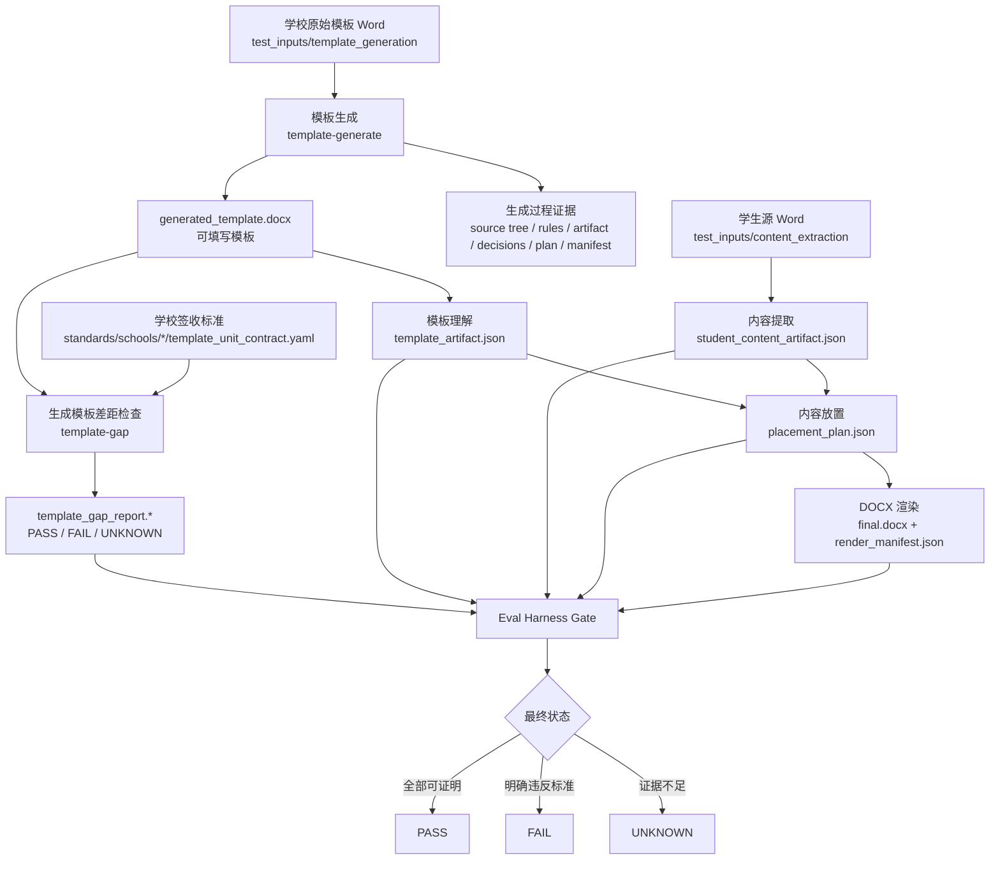

# DocFit 当前文档入口

Last updated: 2026-06-21

一句话结论：长期维护的当前项目文档放在 `docs/current/`；`docs/plans/`、`docs/human/` 只放计划、讨论、审查和历史过程。

## 这个项目是什么

DocFit v3 是一个评测框架优先的 DOCX 转换原型。它的产品目标不是“生成一个 Word”，而是用确定性证据证明：

- 学校模板被正确理解；
- 用户可见内容没有被静默丢弃；
- 每个内容都有明确去向；
- 最终 Word 按已验证计划生成；
- 缺标准、缺证据、缺检查器时输出 `UNKNOWN`，不能假装成功。

当前真实状态：Bootstrap 链路能跑；real-core-v0 能生成 Word 和报告，但完整业务 gate 仍会因为模板、内容、放置和渲染问题返回 `FAIL` / `UNKNOWN`。

## 整体流程图

读图时记住三条边界：

| 边界 | 说明 |
| --- | --- |
| `template-generate` 只生成模板 | 它不读取 `--school`，也不证明学校格式合格 |
| `template-gap` 才检查学校标准 | 它用签收标准检查被测 `generated_template.docx` |
| `docfit convert` 只是编排 | 任一阶段 `FAIL` 或 `UNKNOWN` 都不能宣称转换成功 |

## 当前长期文档

| 文档 | 维护内容 |
| --- | --- |
| `docs/current/README.md` | 项目边界、整体流程图、读文档顺序 |
| `docs/current/contracts-and-gates.md` | 阶段、字段、产物、判定、AI 边界 |
| `docs/current/template-generation.md` | 模板生成阶段：流程、字段、执行、证据、template-gap |
| `docs/current/project-directory-structure.md` | 目录职责和文件应该放哪里 |

## 读文档顺序

| 你要做什么 | 先读 |
| --- | --- |
| 理解项目整体 | 本文件 |
| 判断状态能不能通过 | `docs/current/contracts-and-gates.md` |
| 修改模板生成、字段或 gap 报告 | `docs/current/template-generation.md` |
| 新增输入、输出、标准、测试或文档 | `DIRECTORY_STRUCTURE.md`，它会指向完整规则 `docs/current/project-directory-structure.md` |
| 看当前进展和下一步 | `STATUS.md` |

## `docs/` 目录规则

| 目录 | 用途 |
| --- | --- |
| `docs/current/` | 长期维护的当前项目文档 |
| `docs/plans/` | 执行计划、历史方案、阶段拆解 |
| `docs/human/` | 人工审查、讨论材料、历史过程、迁移指针 |
| `docs/agents/` | 面向 coding agent 的操作手册 |

不要把长期维护正文继续放到 `docs/human/`。
