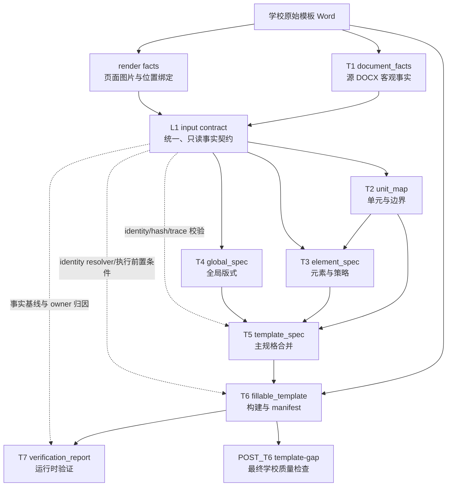

# 模板生成架构与数据契约

Last updated: 2026-07-21

一句话结论：本文是模板生成 `T1/L1/T2/T3/T4/T5/T6/T7/POST_T6` 的长期阶段契约；它定义每个阶段负责什么、依赖什么、输出什么以及如何证明信息没有丢失。实施步骤、旧逻辑删除清单和某次运行结果不在本文维护。

## 1. 文档职责

本文是模板生成阶段架构、职责、输入输出和上下游数据契约的唯一长期事实源。模板生成运行入口和公开产物的稳定规则也应逐步收敛到本文；旧文档只保留迁移指针或历史背景。

模板生成文档按下面的方式分工：

| 文档 | 负责回答 |
| --- | --- |
| 本文 | 当前产品入口、公开产物、阶段职责、输入输出、身份、不变量和 route 契约是什么？ |
| `docs/current/template-generation-testing.md` | 每个阶段如何验收，哪些标准和 gate 能证明质量？ |
| `docs/status/INDEX.md` / `full_summary.json` | 当前有哪些未闭环影响，真实运行现在哪个阶段阻塞？ |
| `docs/plans/**` | 从当前实现迁移到契约状态时，本轮具体改什么、删什么、怎么验证？ |

本文只陈述当前有效契约。实现覆盖、未闭环影响和验证证据统一见 `docs/status/INDEX.md`；具体修改方案统一见 `docs/plans/`。

## 2. 总体数据流

长期目标数据流：



核心规则：

1. T1 和 render 只记录客观事实，不输出单元、元素策略或验收结论。
2. L1 在 T2/T3/T4 开始前封存，作为这些阶段唯一的事实输入。
3. T3 同时依赖 L1 和对应 route 的 T2 输出；L1 不包含 T2 判断。
4. L1 是 T2-T7 共享的事实身份与回查底座，但只有 T2/T3/T4 使用 L1 做语义判断。
5. T5 只合并已经明确的 T2/T3/T4 契约；可用 L1 校验 hash、身份和 source trace，不重新推断上游语义。
6. T6 只执行 T5 规格；可用 L1 解析物理身份、校验源 package 和执行前置条件，不根据 L1 新增或改变动作语义。
7. T7 使用 L1 做 expected-vs-observed 对账和 owner 归因；POST_T6 以被测 Word 和学校标准做质量检查，二者都不能反向改写上游事实。

## 3. 共享身份模型

所有阶段必须沿用同一组稳定身份，不得在中间投影中重新发明坐标。

| 身份 | 表示什么 | 主要用途 |
| --- | --- | --- |
| `source_seq` | 一个按阅读顺序编号的可见源节点，通常对应段落、单元格文本块或其他 flow item | 跨阶段定位和人工沟通 |
| `source_ref` | 源 DOCX/OOXML 中可回查的位置 | 回到原始包和调试证据 |
| `raw_run_id` | 一个物理 `<w:r>` | 精确编辑、删除和样式追踪 |
| `logical_run_id` | 相邻且有效样式一致的 raw run 组合 | T3 原子语义观察和稳定分组 |
| `span_id` | T3 可独立判断和执行的 run/字符范围 | 同段多策略、局部删除和 slot 替换 |
| `object_id` | 图片、文本框、内容控件、脚注或未知可见对象 | 对象绑定和遗漏检查 |
| `page_no` / `render_target_id` | 页面和视觉渲染定位 | 文本与视觉证据对齐 |
| `unit_id` | T2 判断出的模板单元身份 | T3/T5 的结构上下文 |
| `element_id` | T3 确定性物化后的元素身份 | T5/T6 执行和最终追踪 |

身份不变量：

- `raw_run_id` 和 `logical_run_id` 必须能回查文字、样式、父 `source_seq` 和源位置。
- `span_id` 必须绑定一个或多个 run，或绑定明确的 run 内字符范围。
- AI 不能自造权威 `source_seq`、run、span、unit 或 element 身份。
- 投影可以省略当前阶段不需要的字段，但不能切断回查关系。

## 4. L1 统一事实契约

### 4.1 目标能力

L1 把 T1 事实和 render/page/object binding 整理成下游统一读取的只读事实契约。它存在的意义是消除各阶段各自维护的事实投影，而不是在 T1 后增加另一套语义判断。

### 4.2 封存时点

```text
T1 facts ready
+ render facts ready / explicit unavailable reason
→ seal L1
→ start T2/T3/T4
```

render 失败不阻止 L1 封存，但 L1 必须记录 `not_available` 和可追责原因。下游不得把缺少视觉证据解释为视觉判断已经完成。

### 4.3 必需内容

| 集合 | 必须表达 |
| --- | --- |
| `source_text_index` | source 节点、文本、样式、原子文本事实、run refs、page/bbox binding |
| `run_index` | raw/logical run 的文字、有效样式、父 source、源位置和合并关系 |
| `source_object_index` | 图片、文本框、内容控件、脚注、未知对象及其绑定状态 |
| `layout_fact_index` | sections、页眉页脚、fields、breaks、numbering 客观事实 |
| `visual_page_index` | 页面图片引用、渲染引擎、页数、page layout、render 状态和错误 |
| `coverage` | 文本、run、对象和视觉事实的已绑定、未绑定与不可用范围 |
| `input_hashes` | 源模板、T1 facts 和 render facts 的稳定 hash；下游产物另行记录 L1 artifact hash |

L1 artifact hash 必须以 JSON 持久化后的 canonical view 计算，内存 dict key 类型变化不得导致落盘后无法重算。当前编号产物为：

```text
01.5_l1_input_contract.json
01.6_t2_l1_stage_input.json
01.8_t4_l1_stage_input.json
```

`08_agent_render_packet.json` 不再作为产物或阶段输入。render packet 构造代码只属于 L1 之前的 render facts 采集实现；run-backed 单阶段入口缺少 sealed L1 时必须失败，不得回退旧 packet。

### 4.4 禁止内容

L1 不允许输出：

- `unit_id`、单元边界或目录条目判断；
- `policy`、`role`、`fill_source`、`fixed`、`generated`；
- `confidence`、AI proposal、accepted/rejected decision；
- 学校签收标准、gold、judge 状态；
- AI observation bundle、bridge summary 或 route quality。

这些内容属于 T2/T3/T4 或后置运行报告，不属于统一事实输入。

### 4.5 唯一输入规则

T2/T4 的 code 和 AI 路线、T3 的唯一 AI 路线都只能通过 L1 或由 L1 构造的阶段输入读取客观事实。阶段实现不得直接读取：

- `document_facts`；
- render packet；
- 私有 `page_text_index`；
- 私有 `global_layout_facts`；
- 与 L1 并行存在的第二套 run/object/page 投影。

### 4.6 下游受限使用规则

L1 的“全链路共享”不表示每个阶段都可以基于 L1 重新做语义判断。下游对 L1 的使用分为三类：

| 使用类型 | 阶段 | 允许用途 |
| --- | --- | --- |
| 语义判断 | T2/T4 code 与 AI；T3 AI | 从 L1 或 L1 派生的 Stage Input 识别单元、元素策略和全局版式 |
| 身份与执行 | T5/T6 | 校验 L1 hash 和引用；解析 source/run/span/object 身份；检查源 package 和动作前置条件；记录执行证据 |
| 验证与诊断 | T7/judge/route-eval；POST_T6 可选 | 对账输入、决策、动作和结果；定位 first bad stage、root cause 和 owner |

共同约束：

1. T5 不得因为重新查看 L1 文本或视觉事实而补猜 unit、policy、role 或 layout decision；缺少语义必须退回对应上游阶段。
2. T6 必须同时接收源 DOCX package、T5 规格和 sealed L1 identity resolver/hash。L1 只用于定位、hash/precondition 校验和审计，不用于决定删除、保留、填充或生成策略。
3. T6 不得复制或重新构造一套独立的 run/span/source 映射；无法通过 L1 身份精确绑定时必须拒绝扩大动作范围，并记录结构化失败原因。
4. T7 可以读取 L1 和 T5/T6 产物判断事实、引用或执行是否一致，但不得修改 L1、上游决策或业务产物。
5. POST_T6 的学校质量结论只来自被测 Word 和已签收标准；L1 只可用于诊断归因，不能把 gold 或 judge 结论反写进事实层。

## 5. 阶段依赖矩阵

| 阶段 | 事实输入 | 前置语义输入 | 权威输出 | 主要消费者 |
| --- | --- | --- | --- | --- |
| T1 | 源模板 DOCX | 无 | `document_facts` | L1、verifier |
| L1 | T1 facts、render facts | 无 | `l1_input_contract` | T2-T7、judge、route-eval；POST_T6 可用于诊断 |
| T2 | L1 | 无 | `unit_map` | T3、T5、verifier |
| T3 | L1 | 本次运行唯一的 T2 最终结果 | `element_spec` | T5、T6、verifier |
| T4 | L1 | 无；如需单元页面语义只能显式读取对应 T2 | `global_spec` | T5、T6、verifier |
| T5 | L1（仅 hash、身份和 trace 校验） | T2、T3、T4 | `template_spec` | T6、verifier |
| T6 | 源 DOCX package、L1 identity resolver/hash | T5 | `06.1_fillable_template.docx`、`build_manifest` | T7、POST_T6 |
| T7 | L1、T5/T6 运行产物、最终 DOCX | verification contracts | `verification_report` | full summary、人工排查 |
| POST_T6 | 被测 Word；L1 可选且仅用于诊断 | 学校签收标准 | `template_gap_report` | full summary、发布判断 |

### 5.1 各阶段核心输出字段

本节只定义各阶段权威产物中用于表达阶段判断、建立身份引用和驱动下游的**核心正式字段**，不是完整 schema。`artifact_type`、`artifact_version`、`producer`、`created_at`、`input_hashes` 等通用元数据不在表中重复；调试视图、AI observation、proposal、运行缓存和兼容 alias 也不是阶段正式输出字段。完整序列化形状仍以实现、schema 和对应阶段测试为准。

| 阶段 | 权威产物 | 核心正式字段 | 条件字段或集合 | 明确不属于该阶段输出 |
| --- | --- | --- | --- | --- |
| T1 | `document_facts` | `metadata.source_template_hash`、`body_flow[]`、`runs[]`、`unknown_objects[]`、`indexes`、`data` | `body_flow[]` 中的 `source_seq`、`source_ref`、文本、样式和对象位置；`runs[]` 中的 raw run 身份与样式；`data` 中的分节、字段、表格、页眉页脚、分页和编号事实 | `unit_id`、元素 `policy`、`confidence`、`page_policy`、学校合格性 |
| L1 | `l1_input_contract` | `input_hashes`、统一 source/run/span/object/page 身份集合和索引、render binding | render/page/object binding、unknown/coverage 信息 | T2/T3/T4 语义判断、gold、judge 结论 |
| T2 | `unit_map` | `units[].unit_id`、`name`、`order`、`source_seq_range`、`source_seq_refs`、`source_range`、`source_refs`、`page_policy` | `page_policy.start`、`page_policy.scope`；`confidence`、`anchors`、`evidence`、`flags`、`open_questions`、`taxonomy_review_queue` | 旧 `page` 对象及 `page_break/page_isolation/allow_multi_page/keep_together`；元素 `policy/role/fill_source`；T6 Word 动作 |
| T3 | `element_spec` | `elements[].element_id`、`unit_id`、`stable_id`、`order`、source/run/span identities、`content`、`policy`、`role` | `fill_source`；`generated.field_type`；`confidence`、`evidence`、`flags`、`ai_traces` | T2 单元分页判断、T4 全局版式、具体 Word 执行动作 |
| T4 | `global_spec` | `section_profiles[]`、`default_font`、`page_numbering`、`header_footer`、`numbering_rules` | section boundary、页面尺寸/边距、页码格式、页眉页脚引用、版式证据和 `flags` | T2 单元身份与分页语义、T3 元素策略、T6 动作结果 |
| T5 | `template_spec` | `l1_input_contract_ref`、`global`、`units[]`、`units[].page_policy`、`units[].section_profile_refs`、`units[].elements[]` | `review_flags`、`review_decisions`、上游 hash 和绑定 trace | 重新推断 T2/T3/T4 语义；旧 `units[].page` 对象；执行状态或最终 Word 质量结论 |
| T6 | `06.1_fillable_template.docx`、`build_manifest` | `output`、`actions_executed[]`、`actions_requiring_review[]`、`identity_resolution`、`observed_layout_effects` | `slots[]`、`generated_fields[]`、`page_breaks[]`、`section_breaks[]`、`keep_together[]`、`page_policy_results[]`、`output_ref` | 新增或修改 T2/T3/T4 语义；把动作名当成 T2 指标；以 `executed` 代替最终效果观察 |
| T7 | `verification_report` | 阶段 `status`、结构化 `findings[]`、`first_bad_stage`、expected/observed、owner/root cause | 各阶段摘要、coverage、hash/ref/action/effect 对账 | 修改业务产物、补写上游语义、学校 gold 反写 |
| POST_T6 | `template_gap_report` | 最终学校标准检查的 `status`、checks/findings、expected/observed mismatch、证据和 owner | 最终 Word 页面、样式、内容、对象和结构差异 | 作为 T1-T6 的业务输出；反向修改阶段产物 |

T2 分页策略的正式形状固定为：

```yaml
page_policy:
  start: document_start | new_page | same_page_allowed | unknown
  scope: single_page_exclusive | page_range_exclusive | shareable_flow | unknown
```

这里的 `page_policy` 是 T2 的语义判断。T6 中的 `insert_page_break_before_unit`、`insert_section_break_before_unit`、`set_keep_together_unit`，以及 manifest 中的 `page_breaks/section_breaks/keep_together`，是把 T5 规格落实到 Word 的动作和效果证据，不是 T2 输出字段。

## 6. T1：源 DOCX 事实

| 契约项 | 要求 |
| --- | --- |
| 目标能力 | 完整记录源 DOCX 中可观察到的文字、run、样式、字段、分节、表格、页眉页脚和可见对象事实 |
| 输入 | 源模板 DOCX package |
| 输出 | `document_facts` |
| 允许判断 | XML 类型、物理结构、可观察属性、读取顺序、引用关系 |
| 禁止判断 | 单元、标题语义、元素策略、是否应删除、置信度、学校合格性 |
| 关键不变量 | 每个可见事实可回查；run join 不断裂；未知对象显式记录 |

## 7. T2：单元与边界

| 契约项 | 要求 |
| --- | --- |
| 目标能力 | 根据 L1 事实识别模板单元、顺序、边界范围和分页归属 |
| 输入 | L1 |
| 输出 | `unit_map` |
| 允许判断 | `unit_id`、边界、顺序、page ownership、边界置信度和 open questions |
| 禁止判断 | 元素 policy、局部 instruction 删除、slot 类型、最终 Word 合格性 |
| 身份 | 单元必须引用 L1 `source_seq`，不能复制一套不可回查文本 |
| 关键不变量 | 每个 source 节点被一个单元认领或明确 unknown/contested；边界不 silent overlap |

### 7.1 T2 AI 事实输入与预处理

T2 AI 不直接读取 DOCX、`code_raw unit_map`、merged 结果或学校标准。运行入口先从 sealed L1 构造只读 stage packet，再投影为 `t2_full_document` evidence。当前输入由以下几类事实组成：

| 信息类型 | 进入模型的字段 | 用途 |
| --- | --- | --- |
| 文档摘要 | `source_seq_count`、真实渲染 `page_count`、`render_status` | 判断证据规模及分页事实是否可用 |
| 顺序与正文 | 每行 `source_seq`、`text`、`flow_item_type`、`render_target_id`、已有的 `page_no` | 建立全文顺序，并让输出能回绑 L1 身份 |
| 显著文本事实 | `alignment`、`dominant_font_size_pt`，以及仅在为真或存在时保留的 bold、tab、line break、leader、trailing token | 辅助区分标题、目录条目、正文与表单内容；不重复传完整 run/bbox |
| 真实分页位置 | `page_summary` 的每页首尾 `source_seq`；每个有文本页面首行的 `starts_new_rendered_page` 和可用时的 `page_top_ratio` | 让模型按真实渲染页理解分页，不根据估算页号虚构边界 |
| 分页/分节事实 | break 的 `kind`、`type`、`paragraph_index`，并预对齐成 `after_source_seq` | 把 OOXML break/section 位置转换成与 AI 输出同一 `source_seq` 坐标系 |
| 页面视觉证据 | `visual_ref`、页号、图片 hash、宽高、类型；多模态消息附带真实页图 | 让 T2 先看页面级版面，再回到 rows 绑定 `source_seq`；文本 JSON 不暴露本机路径 |

预处理遵循以下顺序：

1. 从 sealed L1 白名单投影，保留原始 `source_seq`、文本事实、flow 类型和 render binding。
2. 删除重复或低判别信息，例如 `char_count`、默认 `false` 值、完整 bbox；本机图片路径只保留在隐藏 attachment 字段，发送多模态消息时使用，不进入 prompt 文本。
3. 只有 `render_status=real_render` 时才生成页首与 `page_summary`；projection fallback 不推测分页位置。
4. 用 L1 的 flow `order` 把 paragraph break/section break 对齐为 `after_source_seq`；文档末尾 body `sectPr` 对齐到最后一个 source 节点。
5. 对最终 evidence 递归执行 firewall，禁止 `unit_map`、`unit_id`、policy、standard、gold、judge 等代码结论或评测信息进入模型。

以上是 AI 观察输入，不是 T2 的判定结果。T2 质量优化可以继续调整 prompt 和模型，但所有判断必须基于这套 L1 Interface，并以 `source_seq` 回绑。

## 8. T3：元素与策略

### 8.1 目标能力

T3 在 T2 单元内，把 L1 的 source/run 事实整理为可执行 span 和元素，并由 AI 判断每个元素是固定内容、模板默认内容、填写内容、系统生成内容还是应删除说明。程序不拥有第二套元素策略判断。

### 8.2 输入

```text
T3 stage input
= sealed L1
+ current run's single final T2 output
```

正式输入产物只有 `03.0_t3_hierarchical_stage_input.json`。它由本次运行选定的唯一 T2 最终结果直接构建，并绑定 L1 hash、最终 T2 结果的 hash 和当前 source render hash；`01.7_t3_l1_compatibility_input.json`、`03.0_t3_unit_windows.json` 和 observation bundle 内的 `unit_windows` 均已退出，不得作为旁路输入恢复。

T3 节点树至少包含：

- L1 hash、T2 hash、route id、window id；
- unit id、单元顺序、source 范围和相邻单元上下文；
- source 段落文本、样式、原子文本事实、page/bbox；
- raw/logical run 的文字、有效样式和稳定身份；
- 可独立判断的 atomic span；
- 与当前 source/span 绑定的对象事实；
- 页面图片和局部 crop 引用，以及视觉是否真实可用。

### 8.3 唯一正式输出

T3 只有一个正式结果：`03_element_spec.yaml`，其 `route.route_id=ai`。`route.availability` 必须随该最终结果向下传递：

- AI 判断和身份物化可用时为 `AVAILABLE`；
- AI 未运行、失败或无法形成可绑定判断时为 `NOT_AVAILABLE`，最终结果只包含保守 safe Keep；
- safe Keep 只能防止扩大删除/填充，不能把 `NOT_AVAILABLE` 提升为 `AVAILABLE`。

每个 T3 element 必须表达：

- 确定性 `element_id`、`unit_id` 和顺序；
- `span_refs`、`raw_run_ids`、`logical_run_ids`、`source_seq_refs`；
- authoritative content，内容必须由 L1 span 组合得到；
- `policy`、`role`、`confidence`、`origin` 和证据；
- fill/generated/manual 的条件语义；
- AI decision/member/resolution、safe-fallback 或人工待决 trace。

`03.1_t3_ai_element_observation.yaml`、`03.1.5_t3_sparse_decision_trace.json` 和 `12_t3_materialization_trace.json` 是原始判断、稀疏遍历和程序自检证据，不是平行 route，也不是第二个 T3 最终结果。

### 8.4 策略枚举

T3 全链路使用同一组 canonical policy：

```text
fixed
template_default
fill
generated
instruction_remove
```

不允许在 bridge 或执行阶段再维护另一套同义枚举。

条件字段：

| policy | 必需字段 |
| --- | --- |
| `fill` | `fill_source` |
| `generated` | `generated.field_type` |
| `instruction_remove` | removal reason / evidence |

### 8.5 AI 输入输出规则

- 模型只能引用 L1 已存在的 source/run/span/object/page 身份。
- 模型输出 span decisions，不自造权威 `element_id`。
- authoritative content 由确定性物化从 L1 读取，不采信模型改写文本。
- 只提供文件路径不算使用了视觉证据；multimodal Adapter 必须真正发送图片内容。
- text-only Adapter 必须声明 `visual_evidence_used=false`。
- 缺少证据时使用低置信 Keep 或 safe Keep，并在最终 route 上保留真实 availability；不能为了覆盖率硬认领。

### 8.6 集合与覆盖不变量

- 不同 span 可以属于同一 `source_seq`，这不构成冲突。
- 相同 span、相同 policy 可以合并或确认。
- 相同 span、不同 policy 才是策略冲突。
- 相邻且 policy/role/语义一致的 span 可以确定性组合成一个 element。
- coverage 以 span 为主，source_seq 只作为摘要。
- 每个 span 最终必须属于 accepted element、unknown、contested 或 explicit ignore；不允许 silent gap。

### 8.7 程序自检边界

T3 程序只负责：

- 校验 L1/T2/source-render 身份和层级树 schema；
- 校验节点动作矩阵、直接 child 引用和唯一 atomic coverage；
- 展开 direct/inherited/fallback，按精确 run/span 身份物化；
- 对无效、缺失、冲突或不可执行判断执行 safe Keep；
- 在 `t3_materialization_trace` 中记录 accepted/fallback、未匹配 claim、未认领 source run、对象残留和 before/after hash。

这些检查回答“AI 结果能否安全、完整地落到最终契约”，不生成 Code 策略，不做 Code/AI 对账，也不产生 Merge 结果。旧 layered proposal/schema、flat T3 prompt/responder、agent T3 overlay 和兼容输入都不是 T3 契约的一部分。

## 9. T4：全局版式

| 契约项 | 要求 |
| --- | --- |
| 目标能力 | 根据 L1 sections、fields、页眉页脚、numbering 和视觉页面事实形成全局版式规则 |
| 输入 | L1；需要单元页面语义时显式读取对应 T2 route |
| 输出 | `global_spec` |
| 允许判断 | section profile、页码、页眉页脚、页面规则和编号规则 |
| 禁止判断 | T3 元素 policy、学生内容放置、学校最终合格性 |
| 关键不变量 | 每个规则可回查 L1 layout/page evidence；视觉不可用时显式 unknown |

T4 质量优化不在本文展开；其事实输入必须迁移到 L1 Interface。

## 10. T5：主规格合并

| 契约项 | 要求 |
| --- | --- |
| 目标能力 | 合并 T2 单元、T3 元素和 T4 全局版式形成模板解析主规格 |
| 输入 | `unit_map`、`element_spec`、`global_spec`、sealed L1 hash/identity lookup |
| 输出 | `template_spec` |
| 允许判断 | 引用完整性、L1 hash 一致性、unit-element-section 绑定、合并冲突和 review flags |
| 禁止判断 | 根据 L1 重新识别单元、重新分类 policy、补猜页面事实或创建上游未声明的动作语义 |
| 关键不变量 | 上游身份和 flags 保留；不存在悬空引用；所有输入绑定同一 L1 hash；事实回查不产生新语义 |

## 11. T6：构建与执行

| 契约项 | 要求 |
| --- | --- |
| 目标能力 | 根据 T5 规格对源 DOCX package 做可追踪修改，生成可填写模板 |
| 输入 | 源 DOCX package、`template_spec`、sealed L1 identity resolver/hash |
| 输出 | `06.1_fillable_template.docx`、`build_manifest` |
| 允许动作 | 用 L1 定位并校验 source/run/span 后，按 T5 删除说明、生成 slot/field、保留固定结构、应用已明确版式动作 |
| 禁止判断 | 根据 L1 重新推断 T2/T3/T4 语义、扩大无法精确绑定的动作范围、以执行成功替代质量验收 |
| 关键不变量 | 源 package hash 与 L1 匹配；不重建第二套身份索引；每个动作有执行前置条件和 source/span/element trace；无内部 marker；最终 DOCX 必须被重新解析并观察到分页、分节、keep 和 slot 效果，不能只信 manifest 的 `executed` |

## 12. T7 与 POST_T6：验证和最终差距

### T7

T7 读取 sealed L1、T5/T6 运行产物和最终 DOCX，汇总运行时结构验证，说明是否存在 schema、hash、引用、执行前置条件、动作结果或 coverage 问题。T6/T7 的动作结果必须包含对最终 DOCX 的 fresh observation，并绑定最终文件 hash；复用历史 run 的 judge 也必须重新执行这一步，不能信任旧 `07_verification_report.json`。T7 可以用 L1 做 expected-vs-observed 对账并定位 first bad stage、root cause 和 owner，但不重新推断 T2/T3/T4 业务语义，也不读取学校 gold 来修改业务产物。

### POST_T6

POST_T6 使用已签收学校标准检查被测 `06.1_fillable_template.docx`，输出最终 gap。L1 不是学校质量判断的必需输入，但可以作为事实 trace 帮助归因到前置阶段。POST_T6 不能把学校标准、gold 或 judge 结论反写进 L1，也不能通过修改报告掩盖上游错误。

## 13. Route 与单链结果契约

一次完整运行只有一条按阶段向下的数据链，每个阶段必须选出一个最终结果；下一阶段只消费这个最终结果和它的 availability，不能在同一运行里自行改读其他 route。

T2/T4 可以同时保留三条可比较 route：

| route | 含义 |
| --- | --- |
| `code_raw` | 确定性规则基于同一 L1/T2 route 产生的独立结果 |
| `ai_raw` | AI 基于同一事实契约产生的独立观察或判断 |
| `merged` | 经过身份绑定、比较、风险判断和冲突处理后的权威结果 |

共同要求：

- 三条 route 的事实输入必须来自同一 L1 hash。
- route 不可用时必须给出阶段契约级原因。
- required route 为 `NOT_AVAILABLE` 时质量状态必须为 `UNKNOWN`；`OUT_OF_SCOPE` 只有在存在可用权威 route 时才不阻断。
- `AVAILABLE` 只说明产物存在且可评，不说明质量通过。
- merged 必须证明 accepted decision 被下游消费，或逐项记录未消费原因。
- AI-primary 只能在真实样本 route-eval 证明 AI 不劣于 code 且 merged 不劣于两者后晋升。

T3 是例外：只有 `ai` route 和一个 canonical `element_spec`，没有 `code_raw`、`merged` 或 merge delta。T3 的程序自检 trace 不计作 route。T3 最终 availability 必须原样进入 T5；T5/T6 不得因 safe Keep 产物结构完整而把上游 `NOT_AVAILABLE` 当成质量可用。

## 14. 兼容和废弃规则

兼容视图只能由当前权威产物派生，不得拥有独立语义。迁移期 Adapter 必须满足：

1. 只有一个事实源，不能让新旧消费者并行读取不同输入。
2. 明确消费者、退出条件和删除计划。
3. 兼容视图不得加入权威产物不存在的判断。
4. 所有消费者迁移后必须删除 Adapter 和旧 artifact 身份，不能永久保留 deprecated 分支。

长期禁止：

- T2/T3/T4 直接读取 T1/render 的私有投影；
- 同一字段在多个阶段以不同名字表达同一语义；
- AI 输出只落 side artifact、下游不消费却宣称 merged 完成；
- 用单测通过、artifact 存在、`PASS/SIGNABLE` 或单次 replay 代替真实能力完成。
- 用“没有 finding”替代 required-check ledger，或让未消费的标准字段静默通过。

## 15. 契约变更规则

修改阶段职责、输入输出、共享身份或 route 规则时：

1. 先更新本文对应契约，说明生产者、消费者和不变量变化。
2. 若是具体实施，更新已有 issue/plan；同一轮不新建第二套 execution plan。
3. 更新 `template-generation.md` 中受影响的当前运行说明。
4. 更新 `template-generation-evaluation.md` 中相应证明边界和 gate。
5. 用真实样本、反例、残留扫描和 route-eval 证明契约成立。
6. 未完全落地的条款必须留在 plan/status 中，不能在本文或总结里写成已完成。
