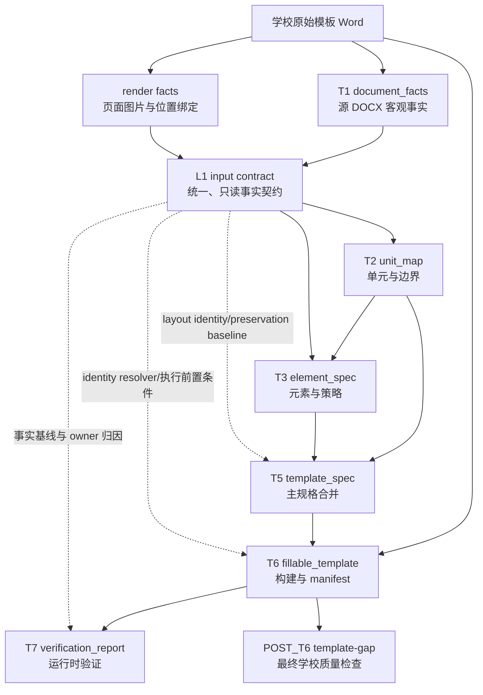

# 模板生成架构与数据契约

Last updated: 2026-07-26

一句话结论：本文是模板生成 `T1/L1/T2/T3/T4/T5/T6/T7/POST_T6` 的长期阶段契约；当前 copy-first 路线暂停并跳过 T4，T4 只保留为未来“重建或修复全局版式”能力的预留编号。本文定义每个启用阶段负责什么、依赖什么、输出什么以及如何证明信息没有丢失。实施步骤、旧逻辑删除清单和某次运行结果不在本文维护。

## 1. 文档职责

本文是模板生成阶段架构、职责、输入输出和上下游数据契约的唯一长期事实源。模板生成运行入口和公开产物的稳定规则也应逐步收敛到本文；旧文档只保留迁移指针或历史背景。

模板生成文档按下面的方式分工：

| 文档 | 负责回答 |
| --- | --- |
| 本文 | 当前产品入口、公开产物、阶段职责、输入输出、身份、不变量和 route 契约是什么？ |
| `docs/current/template-generation-testing.md` | 每个阶段如何验收，哪些标准和 gate 能证明质量？ |
| `docs/status/INDEX.md` / `full_summary.json` | 当前有哪些未闭环影响，真实运行现在哪个阶段阻塞？ |
| `docs/plans/**` | 从当前实现迁移到契约状态时，本轮具体改什么、删什么、怎么验证？ |

本文只陈述当前有效契约。实现覆盖、未闭环影响和验证证据统一见 `docs/status/INDEX.md`；具体修改方案统一见 `docs/plans/`。

## 2. 总体数据流

长期目标数据流：



核心规则：

1. T1 和 render 只记录客观事实，不输出单元、元素策略或验收结论。
2. L1 在 T2/T3 开始前封存，作为 AI 阶段唯一的事实输入，并保存源 DOCX 的全局版式事实和身份。
3. T3 同时依赖 L1 和本次运行发布的 T2 final；L1 不包含 T2 判断。
4. L1 是 T2-T7 共享的事实身份与回查底座；当前只有 T2/T3 使用 L1 做 AI 语义判断，T5/T6 使用 L1 的版式事实做确定性绑定和源版式保护。
5. T4 当前暂停：正式生成不调用 T4 AI、不产出 T4 observation/final、不设置 T4 availability gate，也不要求下游兼容历史 `04_*` 产物。
6. T5 只合并已经发布的 T2/T3 final，并把 T2 单元确定性绑定到 L1 中的源 section identity；不得重新推断全局版式。
7. T6 只执行 T5 final；先复制源 DOCX package，默认保留源 section、页面设置、页眉页脚、页码、样式和编号，只执行 T2/T3 已明确且通过 L1 前置条件校验的局部动作。
8. T2/T3 final 的 `availability=NOT_AVAILABLE` 必须保守向下传播；T4 暂停不能被解释为 `NOT_AVAILABLE`，也不能阻塞 T5/T6。
9. T7 对最终 DOCX 做 fresh observation，并用 L1 检查源版式是否被意外破坏；POST_T6 以被测 Word 和学校标准做质量检查，二者都不能反向改写上游事实。

### 2.1 统一 Final Publisher 边界

每个阶段内部可以自由改变算法和候选组合，但结束前必须经过统一最终发布边界。发布结果固定包含：

```yaml
stage_id: T2
result_role: final
artifact_type: unit_map
availability:
  status: AVAILABLE
  reason: null
input_refs:
  l1:
    artifact: 01.5_l1_input_contract.json
    sha256: "..."
lineage:
  producer_mode: ai
  selected_from:
    - route_id: ai_raw
      sha256: "..."
```

`lineage` 只用于诊断，消费者不得按 `producer_mode` 或 `route_id` 分支。运行内以 `FinalStageResult` 作为强约束句柄；落盘后以稳定 canonical 文件名和 `result_role=final` 识别。把 AI observation、非 final route candidate、诊断 evidence 或普通 `dict` 误传给正式下游时，必须在阶段边界立即失败。8.2 节定义的命名调试入口可以在进入正式消费者前构造只对本次调试有效的本地 final handle；这不改变生产链的 Final Publisher 规则。

稳定 final 文件名为：

| 阶段 | canonical final |
| --- | --- |
| T1 | `01_document_facts.json` |
| L1 | `01.5_l1_input_contract.json` |
| T2 | `02_unit_map.yaml` |
| T3 | `03_element_spec.yaml` |
| T4 | 暂停；不产出 canonical final |
| T5 | `05_template_spec.yaml` |
| T6 | `06.1_fillable_template.docx` + `06.2_build_manifest.json` |
| T7 | `07_verification_report.json` |

带编号小数的 observation、candidate、merge 或 trace 文件，只能在对应阶段契约明确允许时作为诊断证据，不能作为业务输入。T2 不生成 Code 或 Merged 文件；历史 `01.8_t4_l1_stage_input.json`、`04.1_t4_ai_layout_observation.yaml` 和 `04_global_spec.yaml` 不属于当前生产输出。

## 3. 共享身份模型

所有阶段必须沿用同一组稳定身份，不得在中间投影中重新发明坐标。

| 身份 | 表示什么 | 主要用途 |
| --- | --- | --- |
| `source_seq` | 一个按阅读顺序编号的可见源节点，通常对应段落、单元格文本块或其他 flow item | 跨阶段定位和人工沟通 |
| `source_ref` | 源 DOCX/OOXML 中可回查的位置 | 回到原始包和调试证据 |
| `raw_run_id` | 一个物理 `<w:r>` | 精确编辑、删除和样式追踪 |
| `logical_run_id` | 相邻且有效样式一致的 raw run 组合 | T3 原子语义观察和稳定分组 |
| `span_id` | T3 可独立判断和执行的 run/字符范围 | 同段多策略、局部删除和 slot 替换 |
| `object_id` | 图片、文本框、内容控件、脚注或未知可见对象 | 对象绑定和遗漏检查 |
| `page_no` / `render_target_id` | 页面和视觉渲染定位 | 文本与视觉证据对齐 |
| `unit_id` | T2 判断出的模板单元身份 | T3/T5 的结构上下文 |
| `element_id` | T3 确定性物化后的元素身份 | T5/T6 执行和最终追踪 |

身份不变量：

- `raw_run_id` 和 `logical_run_id` 必须能回查文字、样式、父 `source_seq` 和源位置。
- `span_id` 必须绑定一个或多个 run，或绑定明确的 run 内字符范围。
- AI 不能自造权威 `source_seq`、run、span、unit 或 element 身份。
- 投影可以省略当前阶段不需要的字段，但不能切断回查关系。

## 4. L1 统一事实契约

### 4.1 目标能力

L1 把 T1 事实和 render/page/object binding 整理成下游统一读取的只读事实契约。它存在的意义是消除各阶段各自维护的事实投影，而不是在 T1 后增加另一套语义判断。

### 4.2 封存时点

```text
T1 facts ready
+ render facts ready / explicit unavailable reason
→ seal L1
→ start T2/T3
```

render 失败不阻止 L1 封存，但 L1 必须记录 `not_available` 和可追责原因。下游不得把缺少视觉证据解释为视觉判断已经完成。

### 4.3 必需内容

| 集合 | 必须表达 |
| --- | --- |
| `source_text_index` | source 节点、文本、样式、原子文本事实、run refs、page/bbox binding |
| `run_index` | raw/logical run 的文字、有效样式、父 source、源位置和合并关系 |
| `source_object_index` | 图片、文本框、内容控件、脚注、未知对象及其绑定状态 |
| `layout_fact_index` | sections、页眉页脚、fields、breaks、numbering 客观事实 |
| `visual_page_index` | 页面图片引用、渲染引擎、页数、page layout、render 状态和错误 |
| `coverage` | 文本、run、对象和视觉事实的已绑定、未绑定与不可用范围 |
| `input_hashes` | 源模板、T1 facts 和 render facts 的稳定 hash；下游产物另行记录 L1 artifact hash |

L1 artifact hash 必须以 JSON 持久化后的 canonical view 计算，内存 dict key 类型变化不得导致落盘后无法重算。当前编号产物为：

```text
01.5_l1_input_contract.json
01.6_t2_l1_stage_input.json
```

`08_agent_render_packet.json` 不再作为产物或阶段输入。render packet 构造代码只属于 L1 之前的 render facts 采集实现；run-backed 单阶段入口缺少 sealed L1 时必须失败，不得回退旧 packet。

### 4.4 禁止内容

L1 不允许输出：

- `unit_id`、单元边界或目录条目判断；
- `policy`、`role`、`fill_source`、`fixed`、`generated`；
- `confidence`、AI proposal、accepted/rejected decision；
- 学校签收标准、gold、judge 状态；
- AI observation bundle、旧候选/hint 结果或 route quality。

这些内容属于 T2/T3 或后置运行报告，不属于统一事实输入；暂停的 T4 不拥有当前生产语义。

### 4.5 唯一输入规则

T2/T3 的唯一 AI 路线，都只能通过 L1 或由 L1 构造的阶段输入读取客观事实。阶段实现不得直接读取：

- `document_facts`；
- render packet；
- 私有 `page_text_index`；
- 私有 `global_layout_facts`；
- 与 L1 并行存在的第二套 run/object/page 投影。

### 4.6 下游受限使用规则

L1 的“全链路共享”不表示每个阶段都可以基于 L1 重新做语义判断。下游对 L1 的使用分为三类：

| 使用类型 | 阶段 | 允许用途 |
| --- | --- | --- |
| 语义判断 | T2 AI；T3 AI | 从 L1 或 L1 派生的 Stage Input 识别单元和元素策略 |
| 身份、版式保护与执行 | T5/T6 | 校验 L1 hash 和引用；把 T2 单元绑定到 L1 section；解析 source/run/span/object 身份；复制并保护源 package 的全局版式；检查动作前置条件并记录执行证据 |
| 验证与诊断 | T7/judge/route-eval；POST_T6 可选 | 对账输入、决策、动作和最终 DOCX；检查源 section/page/header/footer/numbering 是否被意外破坏；定位 first bad stage、root cause 和 owner |

共同约束：

1. T5 不得因为重新查看 L1 文本或视觉事实而补猜 unit、policy 或 role；它可以机械投影 L1 section identity/range 并与 T2 source range 求交，但该绑定不是新的版式语义。
2. T6 必须同时接收源 DOCX package、T5 规格和 sealed L1 identity resolver/hash。L1 只用于定位、hash/precondition 校验和审计，不用于决定删除、保留、填充或生成策略。
3. T6 不得复制或重新构造一套独立的 run/span/source 映射；无法通过 L1 身份精确绑定时必须拒绝扩大动作范围，并记录结构化失败原因。
4. T7 可以读取 L1 和 T5/T6 产物判断事实、引用或执行是否一致，但不得修改 L1、上游决策或业务产物。
5. POST_T6 的学校质量结论只来自被测 Word 和已签收标准；L1 只可用于诊断归因，不能把 gold 或 judge 结论反写进事实层。

## 5. 阶段依赖矩阵

| 阶段 | 事实输入 | 前置语义输入 | 权威输出 | 主要消费者 |
| --- | --- | --- | --- | --- |
| T1 | 源模板 DOCX | 无 | `document_facts` | L1、verifier |
| L1 | T1 facts、render facts | 无 | `l1_input_contract` | T2、T3、T5、T6、T7、judge、route-eval；POST_T6 可用于诊断 |
| T2 | L1 | 无 | `unit_map` | T3、T5、verifier |
| T3 | L1 | 本次运行唯一的 T2 final | `element_spec` | T5、verifier |
| T4 | — | — | 暂停；无生产输出 | 未来仅在需要重建或修复全局版式时重新立项 |
| T5 | L1（hash、身份、源 section 和版式保护基线） | T2/T3 final | `template_spec` | T6、verifier |
| T6 | 源 DOCX package、L1 identity resolver/hash | T5 final | `06.1_fillable_template.docx`、`build_manifest` | T7、POST_T6 |
| T7 | L1、T5/T6 运行产物、最终 DOCX | verification contracts | `verification_report` | full summary、人工排查 |
| POST_T6 | 被测 Word；L1 可选且仅用于诊断 | 学校签收标准 | `template_gap_report` | full summary、发布判断 |

### 5.1 各阶段核心输出字段

本节只定义各阶段权威产物中用于表达阶段判断、建立身份引用和驱动下游的**核心正式字段**，不是完整 schema。`artifact_type`、`artifact_version`、`producer`、`created_at`、`input_hashes` 等通用元数据不在表中重复；调试视图、AI observation、proposal、运行缓存和兼容 alias 也不是阶段正式输出字段。完整序列化形状仍以实现、schema 和对应阶段测试为准。

| 阶段 | 权威产物 | 核心正式字段 | 条件字段或集合 | 明确不属于该阶段输出 |
| --- | --- | --- | --- | --- |
| T1 | `document_facts` | `metadata.source_template_hash`、`body_flow[]`、`runs[]`、`unknown_objects[]`、`indexes`、`data` | `body_flow[]` 中的 `source_seq`、`source_ref`、文本、样式和对象位置；`runs[]` 中的 raw run 身份与样式；`data` 中的分节、字段、表格、页眉页脚、分页和编号事实 | `unit_id`、元素 `policy`、`confidence`、`page_policy`、学校合格性 |
| L1 | `l1_input_contract` | `input_hashes`、统一 source/run/span/object/page/section 身份集合和索引、render binding | render/page/object binding、unknown/coverage 信息、源全局版式事实 | T2/T3 语义判断、gold、judge 结论 |
| T2 | `unit_map` | `units[].unit_id`、`unit_name`、`boundary.start_page/end_page`、`order`、`page_refs`、`source_seq_range`、`source_seq_refs`、`source_refs`、`page_policy` | 页面到 L1 的绑定 trace、`flags`、`open_questions` | AI 自报 source 边界或 `page_policy`；元素 `policy/role/fill_source`；T6 Word 动作 |
| T3 | `element_spec` | `elements[].element_id`、`unit_id`、`stable_id`、`order`、source/run identities、可无损执行时的 `spans[]`、`content`、`policy`、`role` | `fill_source`；`generated.field_type`；`confidence`、`evidence`、`flags`、`ai_traces` | T2 单元分页判断、全局版式、具体 Word 执行动作 |
| T4 | — | 无；阶段暂停 | 无 | 当前生产链中的任何业务、availability 或质量判断 |
| T5 | `template_spec` | `l1_input_contract_ref`、源版式保护引用、`units[]`、`units[].page_policy`、L1 section binding refs、`units[].elements[]` | `review_flags`、`review_decisions`、上游 hash 和绑定 trace | 重新推断 T2/T3 语义或全局版式；旧 `units[].page` 对象；执行状态或最终 Word 质量结论 |
| T6 | `06.1_fillable_template.docx`、`build_manifest` | `output`、`actions_executed[]`、`actions_requiring_review[]`、`identity_resolution`、`observed_layout_effects` | `slots[]`、`generated_fields[]`、`page_breaks[]`、`section_breaks[]`、`keep_together[]`、`page_policy_results[]`、源版式 preservation/diff evidence、`output_ref` | 新增或修改 T2/T3 语义；无明确动作时重建源全局版式；把动作名当成 T2 指标；以 `executed` 代替最终效果观察 |
| T7 | `verification_report` | 阶段 `status`、结构化 `findings[]`、`first_bad_stage`、expected/observed、owner/root cause | 各阶段摘要、coverage、hash/ref/action/effect 对账 | 修改业务产物、补写上游语义、学校 gold 反写 |
| POST_T6 | `template_gap_report` | 最终学校标准检查的 `status`、checks/findings、expected/observed mismatch、证据和 owner | 最终 Word 页面、样式、内容、对象和结构差异 | 作为 T1-T6 的业务输出；反向修改阶段产物 |

T2 分页策略由程序按单元位置固定派生：

```yaml
page_policy:
  start: document_start | new_page
  scope: page_range_exclusive
```

第一个单元使用 `document_start`，后续单元使用 `new_page`。`page_range_exclusive` 只表示单元拥有自己的连续页面范围，不表示单页单元必须整体 keep-together。T6 中的 page break、section break 及 manifest 效果证据，是把 T5 规格落实到 Word 的动作，不是新的 T2 判断。

## 6. T1：源 DOCX 事实

| 契约项 | 要求 |
| --- | --- |
| 目标能力 | 完整记录源 DOCX 中可观察到的文字、run、样式、字段、分节、表格、页眉页脚和可见对象事实 |
| 输入 | 源模板 DOCX package |
| 输出 | `document_facts` |
| 允许判断 | XML 类型、物理结构、可观察属性、读取顺序、引用关系 |
| 禁止判断 | 单元、标题语义、元素策略、是否应删除、置信度、学校合格性 |
| 关键不变量 | 每个可见事实可回查；run join 不断裂；未知对象显式记录 |

## 7. T2：单元与边界

| 契约项 | 要求 |
| --- | --- |
| 目标能力 | 根据真实渲染页和每页 L1 事实，把整份模板划分为独占连续页面的顶层单元 |
| 输入 | sealed L1 的真实页图、页面绑定和客观页面事实 |
| 输出 | AI raw `02.2_t2_ai_unit_observation.yaml`；唯一 final `02_unit_map.yaml` |
| 允许判断 | `unit_id`、`unit_name`、`boundary.start_page/end_page` |
| 禁止判断 | 元素 policy、局部 instruction 删除、slot 类型、最终 Word 合格性 |
| 身份 | AI 只声明页面范围；程序从 page binding 确定性生成 L1 source 引用 |
| 关键不变量 | 每个真实渲染页恰好属于一个单元；范围连续、无 gap/overlap；没有 AI 或真实渲染时不发布 T2 final |

### 7.1 T2 AI 事实输入与预处理

T2 AI 不直接读取 DOCX、学校标准或任何预判单元。运行入口从 sealed L1 构造只读 stage packet，再按页组织输入：每一页先发送页面图片，随后发送该页客观文字与结构事实。

| 信息类型 | 进入模型的字段 | 用途 |
| --- | --- | --- |
| 文档摘要 | 真实渲染 `page_count`、`render_status`、render hash | 确认页面坐标和输入完整性 |
| 页面视觉证据 | `page_no/page_ref`、真实页图、图片 hash、宽高 | 判断页面标题、版式、内容连续性和页面组功能 |
| 页面正文事实 | 本页可见节点的 `source_seq`、`source_ref`、`text`、`kind`、阅读顺序或 bbox | 补足小字可读性，并为程序后续绑定 L1 |
| 分页/分节事实 | 本页真实存在的 page break 或 section break 机械事实 | 辅助理解页面转换，不预判单元边界 |
| 完整性 | image availability、content binding completeness、未绑定对象 | 阻止在缺图或绑定不完整时发布结果 |

预处理遵循以下顺序：

1. 要求 `render_status=real_render`，并确认页数、页图和 page binding 一致。
2. 按 `page_no` 排序，每页图片在前、客观事实在后；本机路径不写入 prompt 文本。
3. 对 evidence 递归执行 firewall，禁止单元预判、policy、gold、standard 或 judge 结论进入模型。
4. MiniMax 只返回一个 JSON：`units[].unit_id/unit_name/boundary.start_page/end_page`。
5. schema 校验第一页、最后一页、相邻连续性、页码范围和 ID 唯一性；失败即停止。
6. 程序按页面范围展开 `page_refs/source_seq_refs/source_refs`，派生固定 `page_policy`，发布唯一 T2 final。

T2 生产链只有 AI 页面分组，不存在 code candidate、投票、comparison、overlay 或 merged 选择。默认 live 文本和视觉 provider 均为 MiniMax；replay/bundle 只用于离线复现相同契约。

正式运行与单阶段调试使用不同的编排模块，并只共享模型 provider：

| 模块 | 职责 | 边界 |
| --- | --- | --- |
| `agent/observation_runtime.py` | 完整模板生成的 live/replay/bundle 运行与 T2 final 发布 | 生产入口；不得导入单阶段调试模块 |
| `agent/observation_stage.py` | `template stage t2|t3` 和兼容命令的独立调试 | 可以构造仅供本次调试使用的本地 handle，不进入正式链；T4 暂停后不保留生产含义的调试入口 |
| `agent/observation_providers.py` | MiniMax/Kimi responder、额度回退和 API trace | 只提供模型调用能力，不决定阶段 final |
| `t2_ai.py` | T2 page-native 校验、物化和唯一生产 publisher | 所有正式 T2 final 必须经此处发布 |

`agent/loop.py` 只依赖正式 runtime。CLI 可以调用单阶段调试模块，但正式 runtime
不得反向依赖 CLI 或调试适配器。

## 8. T3：元素与策略

### 8.1 目标能力

T3 在 T2 单元内，把 L1 的 source/run 事实整理为可执行 span 和元素，并由 AI 判断每个元素是固定内容、模板默认内容、填写内容、系统生成内容还是应删除说明。程序不拥有第二套元素策略判断。

### 8.2 正式输入与分层 Stage Input

```text
T3 stage input
= sealed L1
+ current run's published T2 final
```

T3 正式业务入口只接受 `stage_id=T2`、`result_role=final`、`artifact_type=unit_map` 的 `02_unit_map.yaml`。AI observation、任何非 final T2 产物、缺少 final metadata 的普通映射或 L1 hash 不一致的 T2 结果不得直接进入完整模板生成或正式阶段验收。

当前 `docfit template stage t3` 是 AI observation 的独立调试入口，不是上述正式业务入口。为了允许开发者固定或手工调整 T2 单元范围后只观察 T3，它可以通过 `--t2-artifact` 接受一份带 `units[]` 的普通 `unit_map`，并仅在本次调试进程内为其补齐 T2 final 元数据，使统一的 T3 builder 能够消费。这个适配器不重新调用 T2 AI，也不要求重新执行 T2 page-native 完整覆盖校验；这是调试边界内的有意能力，不应单独判定为生产链契约问题。

调试适配产生的本地 T2 final 只表示“操作者选择用这份单元范围测试 T3”，不证明 T2 输出正确，也不能作为 T2 质量、T3 正式 isolated/cascade 准确率或完整模板生成通过的证据。只有当普通 `unit_map` 绕过该命名调试入口进入 `template verify`、正式 Final 链或发布产物时，才构成阶段边界问题。

正式输入产物只有 `03.0_t3_hierarchical_stage_input.json`。它由 sealed L1 和本次运行唯一 T2 final 直接构建，最少包含：

```yaml
artifact_type: t3_hierarchical_stage_input
artifact_version: t3-hierarchical-input-1.1
contract:
  l1_hash: "..."
  source_render_hash: "..."
  t2_final:
    stage_id: T2
    artifact: 02_unit_map.yaml
    sha256: "..."
    availability: AVAILABLE
  t2_final_hash: "..."
  stage_input_version: t3-hierarchical-input-1.1
tree_hash: "..."
unit_roots: []
nodes: []
```

`tree_hash` 绑定 contract、unit roots 和完整节点集合；审计时间不参与该 hash。T3 final 还必须在 `input_refs.t3_stage_input` 中保存这份 Stage Input 的 artifact hash，从而形成 `T2 final → T3 Stage Input → T3 final` 的可重算链。

T3 节点树至少包含：

- `unit → table/paragraph/source_object → row/cell → paragraph → run → span` 的可回查父子关系；
- 每个节点唯一的 `ref`、`source_kind`、`parent_ref`、`child_refs`、`member_leaf_refs` 和 ancestor refs；
- unit id、单元顺序、source 范围、相邻上下文及直接 child 摘要；
- source 段落文本、样式、原子文本事实、page/bbox；
- raw/logical run 的文字、有效样式和稳定身份；
- 预先确定的 atomic span、`raw_run_id + [start,end)` 和原始文本；
- field、content control、text box、image、footnote 与未知 source object 的事实和绑定状态；
- `children_complete`、identity、visual 等 completeness；
- 页面图片或局部 crop 的 visual ref、bbox、hash、coverage 和真实附件。

节点 evidence 只包含当前 target、直接 children 摘要、必要 ancestor/context 和与 target 绑定的视觉证据。Stage Input firewall 禁止 `policy`、`role`、`core_action`、gold、standard、judge 或下游 `template_spec` 等判断字段进入模型输入。

`01.7_t3_l1_compatibility_input.json`、`03.0_t3_unit_windows.json` 和 observation bundle 内的 `unit_windows` 均已退出，不得作为旁路输入恢复。

### 8.3 中间动作契约

AI 对当前节点只输出四种 result：

```text
keep
fill
delete
split
```

`split` 是递归控制动作，不是最终元素 policy。各层允许的终局动作如下：

| 节点类型 | 可直接终局 | 说明 |
| --- | --- | --- |
| `unit`、`table` | `keep` | 只有结构和全部后代都应保留时才能整体终局；否则 Split |
| `row`、`cell`、`paragraph` | `keep`、`fill` | 内容用途一致时可整体终局；混合内容必须 Split |
| `run` | `keep`、`fill`、`delete` | run 内动作不一致时 Split 到预生成 span |
| `span` | `keep`、`fill`、`delete` | atomic leaf，不能继续 Split |
| `field`、`content_control` | `keep`、`fill` | 只使用已有对象身份 |
| `text_box`、`image`、`footnote`、其他 source object | `keep` | 当前不允许对象级删除或自由生成 |

所有有完整直接 children 的非叶节点都可以选择 `split`，但必须满足：

- `inspect_child_refs` 只能引用合法直接 child，至少包含一个 child 且不能重复；
- 未被 inspect 的直接 child 默认继承安全 Keep；
- inline `child_decisions` 只能针对同时出现在 `inspect_child_refs` 中的直接 child，且必须是终局动作；
- `default_child_result` 固定为 Keep；
- children 或 identity 不完整时，不允许用终局动作覆盖整个容器。

动作安全约束：

- `fill` 必须声明内容来源；系统生成字段同时声明 field；
- `delete` 只允许精确 run/span，必须是 high confidence 并给出明确原因；
- AI 不能创建 target、child、run、span、字符范围或 authoritative content；
- 非法动作、越界引用、证据不完整、调用失败、深度或调用预算耗尽都转为低置信 safe Keep，并保留结构化原因；
- safe Keep 是失败时唯一允许扩大的动作，不能用 fallback Code policy 替代 AI 判断。

### 8.4 Stop-or-descend、覆盖与中间证据

T3 从每个 `unit_root` 开始执行：

1. 只把当前节点和直接 children evidence 交给 AI。
2. 合法终局动作停止下钻；动作确定性展开到该节点全部 atomic leaves。
3. `split` 只访问声明的直接 children；未访问 child 继承 Keep。
4. 叶级 coverage 记录 `resolved_result`、decision ref、decision status、resolution、confidence、source/run/span 身份和条件语义。
5. 程序把 coverage 归一化为每个预期 atomic leaf 恰好一条结果；缺失、重叠或额外 member 都是显式 validation error，重叠结果按 contested Keep 处理。

`decision_status` 说明模型判断是否可接受；`resolution` 说明动作怎样到达 atomic leaf，两者不能混用：

```text
decision_status: accepted | manual_review | failed | fallback | contested
resolution:      direct | inherited | fallback | contested
```

T3 的中间证据固定分工如下：

| 产物 | 内容 | 是否正式结果 |
| --- | --- | --- |
| `03.0_t3_hierarchical_stage_input.json` | T2 final/L1 绑定、节点树、完整性和视觉事实 | 否；正式输入审计 |
| `03.1_t3_ai_element_observation.yaml` | atomic observation items、object items、demotions、open questions 和过程质量摘要 | 否；AI 原始判断证据 |
| `03.1.5_t3_sparse_decision_trace.json` | 停止层级、调用记录、稀疏 decisions、完整 atomic coverage、预算和 resolution counts | 否；递归与覆盖自检 |
| `12_t3_materialization_trace.json` | accepted/fallback、run claim 绑定、冲突、对象残留、safe Keep、before/after hash | 否；最终物化自检 |

这些产物不能被下游重新物化成另一份 element policy，也不构成 Code/AI/Merge 平行路线。

### 8.5 唯一正式输出

T3 只有一个正式结果：`03_element_spec.yaml`。消费者通过顶层 Final Publisher metadata 识别它，不按 `route_id` 或 `producer_mode` 选择业务输入：

```yaml
artifact_type: element_spec
stage_id: T3
result_role: final
availability:
  status: AVAILABLE | NOT_AVAILABLE
  reason: null
input_refs:
  l1: {artifact: 01.5_l1_input_contract.json, sha256: "..."}
  t2_final: {artifact: 02_unit_map.yaml, sha256: "..."}
  t3_stage_input:
    artifact: 03.0_t3_hierarchical_stage_input.json
    sha256: "..."
lineage:
  producer_mode: ai
  selected_from:
    - artifact: 03.1_t3_ai_element_observation.yaml
      route_id: ai_raw
      sha256: "..."
elements:
  - element_id: "..."
    stable_id: "..."
    unit_id: "..."
    order: 1
    policy: fixed
    role: fixed_text
    source_refs: []
    source_seq_refs: []
    raw_run_ids: []
    logical_run_ids: []
    content: "..."
    style: "..."
    spans: []
    confidence: high
    evidence: []
    agent_traces: []
    flags: []
ai_traces: []
flags: []
```

每个 element 的正式内容至少包括：

- 确定性 `element_id`、`stable_id`、`unit_id` 和顺序；
- `source_refs`、`source_seq_refs`、`raw_run_ids`、`logical_run_ids`；
- 从 L1/source run 重新组合的 authoritative `content`，不采信模型改写文本；
- canonical `policy`、`role`、style、confidence、evidence 和 flags；
- `fill_source/fill_field`、`generated.field_type` 或 `removal_reason` 等条件字段；
- decision/member/resolution 和 safe-fallback 进入 element `agent_traces`，并汇总到顶层 `ai_traces`；
- 只有可无损执行的精确 span 才进入 `spans[]`；混合、局部不完整或冲突 span 保留在中间 trace，并在正式执行语义上降级 safe Keep。

availability 的当前含义：

- 形成至少一个结构化 AI observation item 时可发布 `AVAILABLE`；item 级 fallback、manual review 和对象残留仍必须在过程指标中披露，不能据此宣称质量通过；
- AI 未运行、整体失败或没有 observation item 时发布 `NOT_AVAILABLE`，最终 element shell 只包含保守 safe Keep；
- safe Keep 只能防止扩大删除/填充，不能把 `NOT_AVAILABLE` 提升为 `AVAILABLE`。

### 8.6 策略枚举

T3 全链路使用同一组 canonical policy：

```text
fixed
template_default
fill
generated
instruction_remove
```

不允许在物化或执行阶段再维护另一套同义枚举。

条件字段：

| policy | 必需字段 |
| --- | --- |
| `fill` | `fill_source` |
| `generated` | `generated.field_type` |
| `instruction_remove` | removal reason / evidence |

### 8.7 AI 输入输出规则

- 模型只能引用 L1 已存在的 source/run/span/object/page 身份。
- 模型输出 span decisions，不自造权威 `element_id`。
- authoritative content 由确定性物化从 L1 读取，不采信模型改写文本。
- 只提供文件路径不算使用了视觉证据；multimodal Adapter 必须真正发送图片内容。
- text-only Adapter 必须声明 `visual_evidence_used=false`。
- 缺少证据时使用低置信 Keep 或 safe Keep，并在最终结果上保留真实 availability；不能为了覆盖率硬认领。

### 8.8 集合与覆盖不变量

- 不同 span 可以属于同一 `source_seq`，这不构成冲突。
- 相同 span、相同 policy 可以合并或确认。
- 相同 span、不同 policy 才是策略冲突。
- 相邻且 policy/role/语义一致的 span 可以确定性组合成一个 element。
- coverage 以 span 为主，source_seq 只作为摘要。
- 每个 span 最终必须属于 accepted element、unknown、contested 或 explicit ignore；不允许 silent gap。

### 8.9 程序自检边界

T3 程序只负责：

- 校验 L1/T2/source-render 身份和层级树 schema；
- 校验节点动作矩阵、直接 child 引用和唯一 atomic coverage；
- 展开 direct/inherited/fallback，按精确 run/span 身份物化；
- 对无效、缺失、冲突或不可执行判断执行 safe Keep；
- 在 `t3_materialization_trace` 中记录 accepted/fallback、未匹配 claim、未认领 source run、对象残留和 before/after hash。

这些检查回答“AI 结果能否安全、完整地落到最终契约”，不生成 Code 策略，不做 Code/AI 对账，也不产生 Merge 结果。T3 不执行 Word 动作；T5 保留 element contract，T6 才把 T3 policy 转成可追踪的 Word 动作。旧 layered proposal/schema、flat T3 prompt/responder、agent T3 overlay 和兼容输入都不是 T3 契约的一部分。

## 9. T4：暂停并跳过

当前产品采用 copy-first 路线：T6 从学校原始模板整包复制 DOCX，再执行 T2/T3 已明确的局部内容和分页动作。源 DOCX 已携带 section、页面尺寸与边距、页眉页脚、页码、样式和编号定义；这些事实由 T1/L1 记录，默认由复制动作保留，而不是由 AI 重新生成。

因此 T4 当前契约为：

| 契约项 | 要求 |
| --- | --- |
| 状态 | 暂停；生产链直接跳过 |
| 输入 | 无 |
| 输出 | 无；不写 `01.8_t4_l1_stage_input.json`、`04.1_t4_ai_layout_observation.yaml` 或 `04_global_spec.yaml` |
| availability | 不存在 T4 gate；跳过 T4 不等于 `NOT_AVAILABLE` |
| 下游 | T5 不读取 T4；T7/POST_T6 从最终 DOCX 验证源版式是否被保留 |
| 历史产物 | 只作历史运行证据，不是兼容输入 |

暂停 T4 不表示忽略全局版式。当前版式责任重新分配为：

1. T1/L1 记录源 section、页面设置、页眉页脚、fields、breaks 和 numbering 客观事实及稳定身份。
2. T5 用 T2 source range 与 L1 section identity/range 做确定性绑定，不调用 AI 补猜 section 语义。
3. T6 整包复制源 DOCX，并保护承载 `sectPr`、header/footer relationship、PAGE field、styles 和 numbering 的 OOXML；没有显式业务动作时不得重建这些结构。
4. T7 对最终 DOCX 做 fresh observation，并报告源版式 preservation mismatch；POST_T6 继续负责学校最终质量。

只有产品需要从空白 Word 重建版式、跨模板转换、自动修复页面/页眉页脚/页码，或让版式判断产生可执行 OOXML 动作时，才重新启用 T4。重新启用必须先定义可执行动作合同和最终 Word 效果验收，不能恢复只产出 side artifact 而下游不消费的观察阶段。

## 10. T5：主规格合并

| 契约项 | 要求 |
| --- | --- |
| 目标能力 | 合并 T2 单元和 T3 元素，并绑定 L1 源 section/版式保护身份，形成模板解析主规格 |
| 输入 | T2 final `unit_map`、T3 final `element_spec`、sealed L1 hash/identity/layout lookup |
| 输出 | T5 final `template_spec` |
| 允许判断 | 引用完整性、L1 hash 一致性、unit-element 绑定、T2 source range 与 L1 section range 的机械求交、合并冲突和 review flags |
| 禁止判断 | 根据 L1 重新识别单元、重新分类 policy、补猜全局版式或创建上游未声明的动作语义 |
| 关键不变量 | 拒绝非 final T2/T3 输入；上游身份、availability 和 flags 保留；不存在悬空引用；所有输入绑定同一 L1 hash；T4 暂停不进入 availability；section 绑定只引用 L1 事实，不产生新语义 |

## 11. T6：构建与执行

| 契约项 | 要求 |
| --- | --- |
| 目标能力 | 根据 T5 规格对源 DOCX package 做可追踪修改，生成可填写模板 |
| 输入 | 源 DOCX package、T5 final `template_spec`、sealed L1 identity resolver/hash |
| 输出 | `06.1_fillable_template.docx`、`build_manifest` |
| 允许动作 | 整包复制源 DOCX；用 L1 定位并校验 source/run/span 后，按 T5 删除说明、生成 slot/field、保留固定结构和执行 T2 分页动作 |
| 禁止判断 | 根据 L1 重新推断 T2/T3 语义；在没有明确新能力合同的情况下重建或改写源 section、页面设置、页眉页脚、页码、样式和编号；扩大无法精确绑定的动作范围；以执行成功替代质量验收 |
| 关键不变量 | 源 package hash 与 L1 匹配；源全局版式默认保留；删除/插入不能静默丢失 `sectPr`、header/footer relationship、PAGE field、styles 或 numbering；不重建第二套身份索引；每个动作有执行前置条件和 source/span/element trace；最终 DOCX 必须被重新解析并观察到分页、分节、keep、slot 和版式 preservation 效果 |

## 12. T7 与 POST_T6：验证和最终差距

### T7

T7 读取 sealed L1、T5/T6 运行产物和最终 DOCX，汇总运行时结构验证，说明是否存在 schema、hash、引用、执行前置条件、动作结果、coverage 或源版式 preservation 问题。T6/T7 的动作结果必须包含对最终 DOCX 的 fresh observation，并绑定最终文件 hash；复用历史 run 的 judge 也必须重新执行这一步，不能信任旧 `07_verification_report.json`。T7 必须对账源与输出的 section、页面设置、页眉页脚、PAGE field、styles 和 numbering；可以定位 first bad stage、root cause 和 owner，但不重新推断 T2/T3 业务语义，也不读取学校 gold 来修改业务产物。

### POST_T6

POST_T6 使用已签收学校标准检查被测 `06.1_fillable_template.docx`，输出最终 gap。L1 不是学校质量判断的必需输入，但可以作为事实 trace 帮助归因到前置阶段。POST_T6 不能把学校标准、gold 或 judge 结论反写进 L1，也不能通过修改报告掩盖上游错误。

## 13. AI Observation 与单一 Final 链

一次完整运行只有一条 canonical 数据链。T3 依赖 T2 final，T5 再汇合 T2/T3 final 与 L1 的事实身份/版式保护基线；暂停的 T4 不在 DAG 中。

各阶段 route 形态固定为：

| 阶段 | route | final 形成方式 |
| --- | --- | --- |
| T2 | `ai_raw` | AI 页面分组通过 schema、页面覆盖和 L1 绑定校验后发布唯一 `unit_map` final |
| T3 | `ai_raw` | AI 元素判断通过层级、身份、coverage 和物化校验后发布唯一 `element_spec` final |
| T4 | — | 暂停；无 observation、route 或 final |

内部 observation 与候选共同要求：

- T2/T3 的 AI observation 必须绑定本次运行的同一 L1 hash。
- route 不可用时必须给出阶段契约级原因。
- route-eval 评价 T2/T3 各自唯一的 AI canonical 输出；T4 应显示为明确的 skipped/reserved，而不是缺失、失败或候选路线。
- Final Publisher 负责 schema、L1 identity/hash、availability 和 canonical 标准化，再发布唯一 final。

final 共同要求：

1. `stage_id`、`result_role=final`、`artifact_type`、稳定文件名、结构化 availability 必须一致。
2. 每个 final 记录直接上游 final 的 artifact hash；T3 另记录其 Stage Input hash。
3. T5 availability 是 T2/T3 required final 的保守合并；T4 暂停不参与聚合；T6/T7 继续传递，不得自动升级。
4. `AVAILABLE` 只说明结果可供下游使用，不说明质量通过。
5. T6 动作只从 T5 final 构造；`generation_model`、T2/T3 候选和 trace 不能作为旁路动作源。
6. T7、judge、route-eval 可以读取候选做诊断，但不得把诊断路线重新接回业务链。

T2/T3 都只有 AI 判断路线和一个 canonical final，没有 Code/Merge final。T4 当前没有路线。程序自检、materializer 和 trace 不计作 route，也不能绕过 Final Publisher。

## 14. 兼容和废弃规则

兼容视图只能由当前权威产物派生，不得拥有独立语义。迁移期 Adapter 必须满足：

1. 只有一个事实源，不能让新旧消费者并行读取不同输入。
2. 明确消费者、退出条件和删除计划。
3. 兼容视图不得加入权威产物不存在的判断。
4. 所有消费者迁移后必须删除 Adapter 和旧 artifact 身份，不能永久保留 deprecated 分支。

8.2 节的 T3 独立调试适配器不是迁移期兼容视图：它是命名明确、输出不进入正式验收的开发工具，可以长期保留，也不要求设置退出或删除计划。它仍不得被完整模板生成或正式阶段验收复用。

长期禁止：

- T2/T3 直接读取 T1/render 的私有投影；
- 同一字段在多个阶段以不同名字表达同一语义；
- AI 输出只落 side artifact、下游不消费却宣称阶段完成；
- 用单测通过、artifact 存在、`PASS/SIGNABLE` 或单次 replay 代替真实能力完成。
- 用“没有 finding”替代 required-check ledger，或让未消费的标准字段静默通过。

## 15. 契约变更规则

修改阶段职责、输入输出、共享身份或 route 规则时：

1. 先更新本文对应契约，说明生产者、消费者和不变量变化。
2. 若是具体实施，更新已有 issue/plan；同一轮不新建第二套 execution plan。
3. 更新 `template-generation.md` 中受影响的当前运行说明。
4. 更新 `template-generation-evaluation.md` 中相应证明边界和 gate。
5. 用真实样本、反例、残留扫描和 route-eval 证明契约成立。
6. 未完全落地的条款必须留在 plan/status 中，不能在本文或总结里写成已完成。
