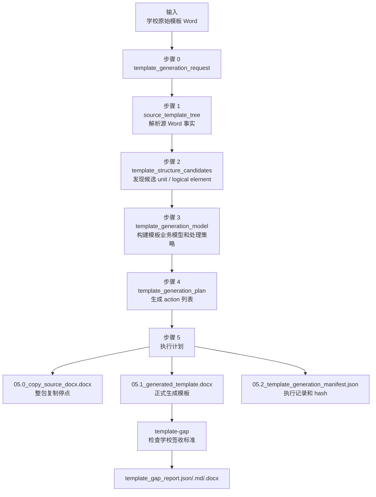

# 模板生成当前主线

Last updated: 2026-06-22

一句话结论：模板生成是当前模板侧支撑流程，只负责把学校原始模板 Word 变成 `generated_template.docx` 和过程证据；它不是 DocFit 四个业务阶段之外新增的业务阶段，学校格式是否合格必须交给 `template-gap` 判定。

## 支撑流程边界

```text
学校原始模板 Word -> generated_template.docx + 生成过程证据
```

`template-generate` 当前只接受 `--template` 和 `--out`，不接受 `--school`，也不读取学校签收标准。这个边界不是临时缺口：正常产品生成流程应只要求用户提供学校原始模板 Word，不能要求每个学校先准备 `standards/schools/**` 里的人工签收标准。

学校标准检查在生成后运行：

```text
generated_template.docx + template_unit_contract.yaml -> template_gap_report.*
```

这里的 `template_unit_contract.yaml` 是开发期和验收期的裁判标准，用来检查已知样例，不是 `template-generate` 的正常业务输入。

## 模板生成策略优化

一句话结论：当前生成器先整包复制源 Word，再按计划局部 patch；代码已经按五步证据链拆成模块，阶段一会给可见元素分配 `source_seq`，阶段二写 `template_structure_candidates` 并能合并连续说明文字、表格同一行 label/value 和跨段落业务句，阶段三写单一 `template_generation_model`，copy-only 单元会做受限内部识别，说明文字可以进入 cleanup，但填写痕迹不会自动变成学生内容 slot。

各阶段代码优化地图、下一步改哪里和 `first_bad_stage` 快速定位见：

- `docs/current/template-generation-stage-optimization.md`

评测和测试架构、阶段检查骨架、最终 gap 如何接入见：

- `docs/current/template-generation-evaluation.md`

历史方案、迁移原因和执行记录见：

- `docs/plans/template-generation-flow-optimization.md`

注意：历史方案中关于“学校标准或学生内容台账作为生成策略输入”的设想已经废弃。当前口径以本文和 `docs/current/template-generation-open-gaps.md` 为准。

当前默认 copy-only 仍按 `unit_id` 排除列表作为全局基线。排除默认仅复制的单元：

| unit_id | 中文含义 | 当前处理 |
| --- | --- | --- |
| `abstract_cn` | 中文摘要 | 继续逐元素分析和局部 patch |
| `abstract_en` | 英文摘要 | 继续逐元素分析和局部 patch |
| `toc` | 目录族，包括普通目录、图目录、表目录的字段或占位要求 | 继续逐元素分析和局部 patch |
| `body_main` | 正文 | 继续逐元素分析和局部 patch |
| `references` | 参考文献 | 继续逐元素分析和局部 patch |

模板生成支撑流程当前不读取学生源 Word，也不根据某一次学生源内容台账决定 copy-only / patch。下一层判断也不应依赖 `standards/schools/**` 作为生成输入；它应该从学校原始模板自身的可见结构、文字、样式、占位符、表格、字段和通用产品规则推断内容责任。签名、日期、教师意见、成绩评定等线下人工填写区域可以继续仅复制；源模板中明确承载学生内容或系统生成内容的区域，才应进入局部 patch、slot 或 generated field 路径。`generation_mode = whole_unit_copy` 不是验收结论，只说明生成流程不会为该单元生成自动填充 slot；内部说明文字、格式要求和示例仍可以被识别并清理。真实 Word 是否合格仍由 `template-gap` 判定。

## 模板生成流程图



## 阶段一：解析源 Word，生成 `source_template_tree`

一句话结论：这一阶段只把学校原始 Word 解析成“源文件里实际观察到了什么”，不判断这些内容是不是学校签收规则，也不证明最终生成模板合格。

说明：在本文上面的流程图里，这一步对应 `B --> C`。

| 项 | 当前真实实现 |
| --- | --- |
| 输入 | `--template` 指向的学校原始模板 Word |
| 生产者 | `src/docfit/stages/template_generate/source_tree.py::inspect_source_template_docx` |
| 上游 | `generate_template` 先调用 `build_template_generation_request` 记录源文件路径、hash、输出目录和生成策略 |
| 下游 | `build_template_structure_candidates(source_tree)` 用它发现候选 unit / logical element；`build_template_generation_model` 用候选结构整理模板业务模型和处理策略 |
| 正式输出 | `--out/artifacts/source_template_tree.json` |
| 调试输出 | `test_outputs/debug/template_generation/<验证名>/.../02_source_template_tree.json` 或调试快照目录里的同名步骤文件 |

当前代码顺序是：

```python
request = build_template_generation_request(...)
source_tree = inspect_source_template_docx(source_template_docx)
structure_candidates = build_template_structure_candidates(source_tree)
generation_model = build_template_generation_model(request, structure_candidates)
```

这里要注意：`source_tree` 不是从 `request` 对象里读出来的，而是再次用同一个 `source_template_docx` 路径直接解析 Word。`request` 负责记录本次任务，`source_template_tree` 负责记录源 Word 事实。

`inspect_source_template_docx` 内部实际做四件事：

| 步骤 | 代码动作 | 产物含义 |
| --- | --- | --- |
| 1 | 调用 `inspect_generated_template_docx(source_template_docx)` | 复用底层 Word / OOXML inspector 读取这份源模板 Word |
| 2 | 读取底层 `data.paragraphs`、`data.tables`、`data.headers_footers`、`data.sections`、`data.fields`、`data.numbering_definitions` 等 | 保留段落、表格、页眉页脚、分节、字段、编号等源 Word 事实 |
| 3 | 调用 `_body_flow_from_inspection(inspected)` | 当前把可见段落、表格单元格、页眉页脚压成带 `node_id`、`source_seq`、`source_ref`、`order`、`text`、`style_details` 的可见节点序列 |
| 4 | 组装 `artifact_type = source_template_tree` 的 JSON | 写出 metadata、layers、indexes、warnings 和底层 raw data |

`source_template_tree` 的主要结构：

| 字段 | 用途 |
| --- | --- |
| `metadata.source_template_docx` | 本次解析的是哪份学校原始 Word |
| `metadata.source_template_hash` | 源 Word hash，用来防止后续证据串错文件 |
| `layers.package_global.numbering_definitions` | Word 包级编号定义 |
| `layers.section_rules` | 分节、纸张、页边距、页码、页眉页脚引用等页面事实 |
| `layers.header_footer` | 页眉页脚 part 里的可见文本和来源位置 |
| `layers.body_flow` | 后续规则发现最常用的正文可见节点序列 |
| `layers.unknown_objects` | 当前解析器不能稳定解释的可见对象，需要保留为风险或待复核 |
| `indexes.by_source_ref` | 通过 OOXML 位置反查 `node_id` |
| `indexes.by_source_seq` | 通过阶段一原始可见元素序号反查 `node_id`、`source_ref`、文本摘要和结构层 |
| `indexes.body_order` | 正文可见节点顺序 |
| `warnings` | 解析阶段发现的问题，主要来自 unknown visible objects |
| `data` | 底层 inspector 的原始解析结果，供 debug 和后续构建继续使用 |

`layers.body_flow[]` 里的每个节点大致长这样：

| 字段 | 含义 |
| --- | --- |
| `node_id` | 解析阶段分配的节点 ID，例如 `body_0001` |
| `source_seq` | 解析阶段分配的原始可见元素序号，从 1 开始递增；后续阶段只能引用，不能重编号 |
| `source_seq_label` | 给人看的定位标签，例如 `源模板元素 003` |
| `structure_layer` | `body_flow` 或 `header_footer`；后续 unit 发现会过滤掉页眉页脚 |
| `flow_item_type` / `kind` | `paragraph`、`table_cell`、`header`、`footer` 等 |
| `source_ref` | OOXML 来源位置，例如 `word/document.xml:p[3]` |
| `order` | 可见内容排序依据 |
| `container_ref` | 如果来自表格单元格，这里记录所属表格 |
| `text` | 解析到的可见文字 |
| `style` / `style_details` | Word 样式、字体、字号、加粗、对齐、行距等 |
| `structural_signals` | 是否居中、短文本、大字号、加粗、像标题、像说明文字等启发式信号 |

当前实现中，`source_seq` 是全流程定位锚点。阶段二合并元素时要保留
`source_seq_refs[]`，例如说明“这个 logical element 由源模板元素 3、4、5
合并而来”；阶段三生成 slot、protected zone、cleanup 或 unresolved question
时继续保留这些序号；阶段四 action 和阶段五 manifest 要写
`affected_source_seq_refs[]`。这样人工和 AI 都可以直接说“源模板元素 12
不应该被删除”，再回查第一次把 12 判成说明文字或 cleanup 的阶段。

这一阶段明确不做这些事：

| 不做什么 | 应该看哪一步 |
| --- | --- |
| 不判断“这是封面、摘要、正文还是参考文献” | 下一步 `template_structure_candidates` |
| 不决定元素最终是固定保留、学生填写、自动生成还是删除说明文字 | 下一步候选识别给 `role_hint` 和证据，再由生成模型 materialize 最终策略 |
| 不读取学校签收标准 | 生成后的 `template-gap` |
| 不证明 `generated_template.docx` 最终真的长对了 | `generated_template_tree.json` 和 `template_gap_report.*` |
| 不让 AI 改写事实或状态 | 只能由确定性解析和后续检查器产出证据 |

如果 `source_template_tree.json` 缺内容，`first_bad_stage` 是 `01_source_parse`，应该优先看 `inspect_source_template_docx` 和底层 Word / OOXML inspector；不应该先改 action plan、manifest 或 gap 报告。

## 当前真实命令

模板生成：

```bash
uv run docfit eval template-generate \
  --template test_inputs/template_generation/school-hunannongye-requirement.docx \
  --out test_outputs/debug/template_generation/school-hunannongye-requirement/eval_runs/template_generate
```

生成模板差距检查：

```bash
uv run docfit eval template-gap \
  --school hunannongye \
  --generated-template test_outputs/debug/template_generation/school-hunannongye-requirement/eval_runs/template_generate/generated_template.docx \
  --out test_outputs/debug/template_generation/school-hunannongye-requirement/eval_runs/template_gap_hunannongye
```

模板生成聚焦测试：

```bash
uv run pytest tests/contract/test_template_generate.py -q
```

## 产物流转

| 顺序 | 产物 | 生产者 | 消费者 | 能证明什么 |
| --- | --- | --- | --- | --- |
| 1 | `source_template_tree.json` | 源 Word inspector | rule discovery、artifact builder | 源 Word 里观察到了什么 |
| 2 | `template_structure_candidates.json` | `structure_candidates.py` | generation model、debug | 系统推断出的候选 unit / logical element、`role_hint`、`source_seq_refs` 和 evidence |
| 3 | `template_generation_model.json` | `generation_model.py` | plan builder、debug | 系统如何把候选结构 materialize 成模板业务地图、unit 策略、slots、protected zones、cleanup |
| 4 | `template_generation_plan.json` | `plan.py` | generator executor | 生成器准备执行哪些动作，每个 action 影响哪些 `source_seq` |
| 5 | `generated_template.docx` | `executor.py` | template-gap、后续 placement/render | 本次生成的可填写模板 Word |
| 6 | `template_generation_manifest.json` | `manifest.py` | 审计、debug、e2e 解释 | 生成器实际执行了什么 |
| 7 | `generated_template_tree.json` | generated-template inspector | template-gap checker | 被测生成 Word 实际结构 |
| 8 | `template_gap_report.*` | template-gap checker | coverage、e2e、人工排查 | 生成模板差距和阻断状态 |

## 字段规则

新增字段前必须写清楚：

| 项 | 说明 |
| --- | --- |
| 字段名 | 完整路径，例如 `template_artifact.data.units[].unit_id` |
| 业务含义 | 用中文说清它代表什么 |
| 生产者 | 哪个阶段或代码写入 |
| 消费者 | 哪个阶段、检查器或报告读取 |
| 判定影响 | 是否影响 `PASS` / `FAIL` / `UNKNOWN` |
| 缺失后果 | `FAIL`、`UNKNOWN`、`needs_review` 或不阻断 |
| 默认值 | 是否允许默认；不允许就写“无默认” |
| AI 边界 | AI 是否能改；默认不能改状态、标准和证据 |
| 证据要求 | 是否需要 `source_ref`、`output_ref`、hash 或审计记录 |
| 测试要求 | 需要补哪个 contract/e2e/regression 测试 |

这些字段不能靠猜默认：

```text
unit_id
element_id
policy
required
slot_id
source_ref
source_seq
source_seq_refs
affected_source_seq_refs
output_ref
style rule
page rule
field kind
check status
evidence_refs
```

本轮计划新增或明确的模板生成字段：

| 字段 | 含义 | 生产者 | 消费者 | 判定影响 | 缺失后果 | AI 边界 | 测试 |
| --- | --- | --- | --- | --- | --- | --- | --- |
| `source_template_tree.layers.body_flow[].source_seq` | 阶段一给每个原始可见元素分配的稳定序号，从 1 开始递增 | `source_tree.py` | 后续所有模板生成阶段、debug、报告、AI RCA | 证据链基础字段；后续 verifier 配置后，缺失或重复应阻断 | 无默认；缺失或重复时不能可靠定位源元素，应为 `FAIL` 或 `UNKNOWN` | AI 可以引用，不能改写或补造 | `tests/contract/test_template_generate.py` |
| `source_template_tree.layers.body_flow[].source_seq_label` | 给人看的序号标签，例如 `源模板元素 003` | `source_tree.py` | debug、报告、人工沟通 | 不独立决定门禁；辅助定位 | 可由 `source_seq` 派生；缺失会降低可读性 | AI 可以引用，不能当成裁判 | `tests/contract/test_template_generate.py` |
| `*.source_seq_refs[]` | 后续阶段对象引用的阶段一原始可见元素序号列表，例如合并 3、4、5 后写 `[3, 4, 5]` | `structure_candidates.py` 起，后续阶段透传 | generation model、plan、manifest、phase check、报告 | 证明合并、slot、cleanup、protected zone 的来源 | 源驱动对象缺失时应标为 `UNKNOWN`；配置 verifier 后可阻断 | AI 不能补造序号，只能解释已有序号 | `tests/contract/test_template_generate.py` |
| `template_generation_plan.actions[].affected_source_seq_refs[]` | action 实际影响哪些阶段一原始可见元素，例如删除元素 12 | `plan.py` | `executor.py`、manifest、debug、报告 | 证明 Word 修改动作影响范围 | 修改型 action 缺失时应为 `UNKNOWN` 或 `needs_review` | AI 不能改动作影响范围 | `tests/contract/test_template_generate.py` |
| `template_generation_manifest.actions_executed[].affected_source_seq_refs[]` | 执行记录继续保留 action 的原始元素序号 | `manifest.py` / `executor.py` | 审计、first_bad_stage、人工复核 | 证明执行结果可回溯到源元素 | 缺失时 manifest 不能完整解释修改来源 | AI 只能引用分析 | `tests/contract/test_template_generate.py` |
| `template_structure_candidates.units[].elements[].role_hint` | 阶段二给阶段三看的候选角色，例如说明文字候选、学生填写候选、人工填写候选 | `structure_candidates.py` | `generation_model.py`、debug 排查 | 不直接决定 `PASS` / `FAIL` / `UNKNOWN`；只影响阶段三策略输入 | 缺失时策略仍可运行，但证据链不完整 | AI 不能直接改运行产物，只能解释 | `tests/contract/test_template_generate.py` |
| `template_structure_candidates.units[].elements[].evidence[]` | 支撑候选角色的 source_ref、source_seq 和启发式来源 | `structure_candidates.py` | `generation_model.py`、debug 排查 | 不直接决定门禁；作为策略可追溯证据 | 缺失时策略仍可运行，但证据链不完整 | AI 不能补造证据 | `tests/contract/test_template_generate.py` |
| `template_generation_model.units[].elements[].candidate_policy` | 阶段三保留的阶段二候选 policy，用来说明最终 `policy` 是怎么 materialize 出来的 | `generation_model.py` | plan、debug、人工排查 | 不直接决定门禁；最终 `policy` 才进入 slot / cleanup / protected zone | 缺失时仍可按最终 `policy` 执行，但难以解释阶段二/三差异 | AI 不能改运行产物 | `tests/contract/test_template_generate.py` |

## first_bad_stage 判断

| 现象 | 先看什么 | first_bad_stage | 应该改哪里 |
| --- | --- | --- | --- |
| 输入文件拿错 | `00_input_source_template.docx` | `00_input_request` | 调用命令或 profile 绑定 |
| 源 Word 内容没被解析出来 | `01_source_template_tree.json` | `01_source_parse` | `inspect_source_template_docx` |
| unit 没识别或识别错 | `02_template_structure_candidates.json` | `02_structure_discovery` | `build_template_structure_candidates` |
| 人工指出“源模板元素 12 不该被删或合并错” | 先用 `source_seq = 12` 查阶段二 `source_seq_refs[]`，再查阶段三 cleanup / plan action | `02_structure_discovery` / `03_generation_model` / `04_plan_build` | 先定位 12 第一次被标成什么角色，再改对应阶段 |
| 候选角色或最终策略错 | `02_template_structure_candidates.json` 的 `role_hint` / `candidate_policy`，以及 `03_template_generation_model.json` 的最终 `policy` / `unit_strategies` | `02_structure_discovery` 或 `03_generation_model` | `structure_candidates.py` 或 `generation_model.py` |
| 应整体复制却变成 patch | `03_template_generation_model.json` 的 `unit_strategies[]` | `03_generation_model` | `build_template_generation_model` |
| 决策对但 action 错 | `04_template_generation_plan.json` | `04_plan_build` | `build_template_generation_plan` |
| `05.0_copy_source_docx.docx` 已经不对 | 打开 `05.0` | `05_action_execution` | 整包复制和输入 DOCX |
| `05.0` 对但 `05.1_generated_template.docx` 不对 | 对比 `05.0` 和 `05.1` | `05_action_execution` | `execute_template_generation_plan` |
| manifest 看不出做了什么 | `05.2_template_generation_manifest.json` | `05_action_execution` | `build_template_generation_manifest` |
| gap 报告大面积误报 | 先看 `generated_template_tree.json` 和 unit 定位 | `06_final_template_gap` | generated-template inspector / gap checker |

不要看到最终 Word 不对就直接改 gap 报告或最终渲染；先定位问题第一次出现在哪一步。

## 真实运行证据要求

每次真实运行至少留下：

| 证据 | 默认位置 | 用途 |
| --- | --- | --- |
| `summary.json` | `--out/summary.json` | 本次命令状态、blocked_at、artifacts 索引 |
| `pm_report.md` | `--out/pm_report.md` | 人读结果说明 |
| `findings.json` | `--out/findings.json` | 机器可读问题列表 |
| `generated_template.docx` | `--out/generated_template.docx` | 模板生成支撑流程的正式 Word 输出 |
| 模板生成 JSON 产物 | `--out/artifacts/*.json` | request、source tree、structure candidates、generation model、plan、manifest |
| 阶段编号调试快照 | `test_outputs/debug/template_generation/<验证名>/` | first_bad_stage 排查 |
| diff / 对比证据 | `05.0_copy_source_docx.docx` vs `05.1_generated_template.docx` | 判断整包复制后被哪些局部 action 改变 |
| gap 报告 | `template-gap --out/artifacts/template_gap_report.*` | 证明生成 Word 是否满足学校签收标准 |

当前调试快照使用阶段对齐编号：
`00` 表示运行输入、请求和上下文；`01` 到 `05` 分别对应
`01_source_parse`、`02_structure_discovery`、`03_generation_model`、`04_plan_build`、
`05_action_execution`；小数点只表示阶段内子产物，不用于保留旧产物名兼容文件。
如果同一目录后续纳入最终模板差距检查，可用 `06` 表示
`06_final_template_gap`；`99` 留给 debug index 这类非阶段索引文件。

## 最近一次验证记录

| 日期 | 目的 | 命令 | 状态 | 结论 |
| --- | --- | --- | --- | --- |
| 2026-06-21 | 验证 CLI 参数边界 | `uv run docfit eval template-generate --help` | `PASS` | 只支持 `--template`、`--out`、`--help` |
| 2026-06-21 | 验证模板生成合同测试 | `uv run pytest tests/contract/test_template_generate.py -q` | `PASS` | `9 passed in 0.65s`；覆盖 copy-only 受限内部识别、说明文字 cleanup、填写痕迹不生成 cover slot |
| 2026-06-21 | 验证合同测试矩阵 | `uv run pytest tests/contract -q` | `PASS` | `71 passed in 13.05s` |
| 2026-06-21 | 验证拆分后模板生成产物链 | `uv run docfit eval template-generate --template test_inputs/template_generation/school-hunannongye-requirement.docx --out test_outputs/debug/template_generation/school-hunannongye-requirement/eval_runs/template_generate_split_check` | `PASS` | 写出 7 个 public JSON artifact 和 00-10 debug 快照；manifest 记录 84 个执行动作、31 个 slot、0 个待人工 review 动作、43 个 copy-only 内部 cleanup 动作 |
| 2026-06-21 | 验证模板生成产物链 | `uv run docfit eval template-generate --template test_inputs/template_generation/school-hunannongye-requirement.docx --out test_outputs/debug/template_generation/school-hunannongye-requirement/eval_runs/doc_reorg_template_generate_hunannongye_20260621` | `PASS` | 写出 `generated_template.docx`、artifacts、manifest；manifest 记录 143 个执行动作、53 个 slot、0 个待人工 review 动作 |
| 2026-06-21 | 验证生成 Word 进入 gap | `uv run docfit eval template-gap --school hunannongye --generated-template test_outputs/debug/template_generation/school-hunannongye-requirement/eval_runs/doc_reorg_template_generate_hunannongye_20260621/generated_template.docx --out test_outputs/debug/template_generation/school-hunannongye-requirement/eval_runs/doc_reorg_template_gap_hunannongye_20260621` | `FAIL` | gap summary 为 `FAIL + UNKNOWN`，`passed=128`、`failed=27`、`unknown=137` |
| 2026-06-22 | 验证阶段二/三目标产物切换和 `source_seq` 追踪 | `uv run pytest tests/contract/test_template_generate.py -q` | `PASS` | `9 passed`；覆盖 `template_structure_candidates`、`template_generation_model`、阶段编号 debug、action 来源序号 |
| 2026-06-22 | 验证合同测试矩阵 | `uv run pytest tests/contract -q` | `PASS` | `71 passed`；真实 real-core 链路没有说明文字泄漏回归 |
| 2026-06-22 | 验证阶段二 logical element 合并增强 | `uv run pytest tests/contract/test_template_generate.py -q` | `PASS` | `11 passed`；覆盖表格 label/value 合并、跨段落业务句 continuation 合并和 `source_seq_refs[]` 保留 |
| 2026-06-22 | 验证合同测试矩阵 | `uv run pytest tests/contract -q` | `PASS` | `73 passed`；阶段二合并增强没有破坏现有消费者 |
| 2026-06-22 | 验证真实模板生成命令 | `uv run docfit eval template-generate --template test_inputs/template_generation/school-hunannongye-requirement.docx --out test_outputs/debug/template_generation/school-hunannongye-requirement/eval_runs/template_generate_stage2_merge_check` | `PASS` | 真实湖南农业大学模板生成命令仍能写出生成模板和阶段产物 |

这说明模板生成支撑流程能跑并能进入学校标准检查；不说明湖南农业大学生成模板已经合格。

## 当前最小下一步

如果继续推进模板生成质量，下一步不是再切产物名，也不是让生成器依赖学校签收标准，而是强化“只从源模板推断”的能力：

- copy-only / patch 不能只靠全局 `unit_id` 基线，要结合源模板里的结构、占位符、字段、表格和上下文判断；
- 致谢、附录等条件单元先按源模板自身证据识别为固定保留、用户填写、系统生成或需要人工确认，不读取某一次学生源内容台账，也不读取 `standards/schools/**`；
- 源模板证据不足时要写入 `unresolved_questions[]` 或待复核动作，不能伪装成确定策略；
- `template-gap` 仍负责用已签收样例标准检查生成 Word，不能用 manifest 或 `template_generation_model` 替代。

当前待核实差距清单见：

- `docs/current/template-generation-open-gaps.md`
