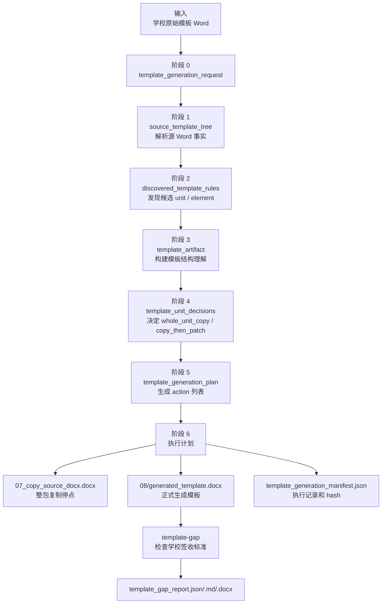

# 模板生成当前主线

Last updated: 2026-06-21

一句话结论：模板生成阶段只负责把学校原始模板 Word 变成 `generated_template.docx` 和过程证据；学校格式是否合格必须交给 `template-gap` 判定。

## 阶段边界

```text
学校原始模板 Word -> generated_template.docx + 生成过程证据
```

`template-generate` 当前只接受 `--template` 和 `--out`，不接受 `--school`，也不读取学校签收标准。

学校标准检查在生成后运行：

```text
generated_template.docx + template_unit_contract.yaml -> template_gap_report.*
```

## 模板生成策略优化

一句话结论：当前生成器先整包复制源 Word，再按计划局部 patch；下一步优化重点是把“仅复制、填写、生成、人工处理、待确认”做成可解释的策略选择，而不是只靠单元 ID 排除列表。

完整计划、流程图、产物流转和排查入口见：

- `docs/plans/template-generation-flow-optimization.md`

当前代码第一版仍按 `unit_id` 排除列表实现。排除默认仅复制的单元：

| unit_id | 中文含义 | 当前处理 |
| --- | --- | --- |
| `abstract_cn` | 中文摘要 | 继续逐元素分析和局部 patch |
| `abstract_en` | 英文摘要 | 继续逐元素分析和局部 patch |
| `toc` | 目录族，包括普通目录、图目录、表目录的字段或占位要求 | 继续逐元素分析和局部 patch |
| `body_main` | 正文 | 继续逐元素分析和局部 patch |
| `references` | 参考文献 | 继续逐元素分析和局部 patch |

阶段一整理标准时，下一层判断要看内容责任：学生源文档中有致谢或附录内容、或学校标准要求这些单元承载学生内容时，它们也不应被当成固定 copy-only 单元；签名、日期、教师意见、成绩评定等线下人工填写区域可以继续仅复制。`generation_mode = whole_unit_copy` 不是验收结论，只说明生成阶段不会重建或填写该单元内部元素；真实 Word 是否合格仍由 `template-gap` 判定。

## 模板生成流程图



## F -> G：解析源 Word，生成 `source_template_tree`

一句话结论：这一阶段只把学校原始 Word 解析成“源文件里实际观察到了什么”，不判断这些内容是不是学校签收规则，也不证明最终生成模板合格。

说明：在更长的生成流程图里，这一步写成 `F --> G["解析源 Word<br/>source_template_tree"]`；在本文上面的简化流程图里，它对应 `B --> C`。

| 项 | 当前真实实现 |
| --- | --- |
| 输入 | `--template` 指向的学校原始模板 Word |
| 生产者 | `src/docfit/stages/template_generate/runner.py::inspect_source_template_docx` |
| 上游 | `generate_template` 先调用 `build_template_generation_request` 记录源文件路径、hash、输出目录和生成策略 |
| 下游 | `infer_template_rules(source_tree)` 用它发现候选 unit / element；`build_template_artifact` 用它整理模板结构理解 |
| 正式输出 | `--out/artifacts/source_template_tree.json` |
| 调试输出 | `test_outputs/debug/template_generation/<验证名>/.../02_source_template_tree.json` 或调试快照目录里的同名步骤文件 |

当前代码顺序是：

```python
request = build_template_generation_request(...)
source_tree = inspect_source_template_docx(source_template_docx)
discovered_rules = infer_template_rules(source_tree)
```

这里要注意：`source_tree` 不是从 `request` 对象里读出来的，而是再次用同一个 `source_template_docx` 路径直接解析 Word。`request` 负责记录本次任务，`source_template_tree` 负责记录源 Word 事实。

`inspect_source_template_docx` 内部实际做四件事：

| 步骤 | 代码动作 | 产物含义 |
| --- | --- | --- |
| 1 | 调用 `inspect_generated_template_docx(source_template_docx)` | 复用底层 Word / OOXML inspector 读取这份源模板 Word |
| 2 | 读取底层 `data.paragraphs`、`data.tables`、`data.headers_footers`、`data.sections`、`data.fields`、`data.numbering_definitions` 等 | 保留段落、表格、页眉页脚、分节、字段、编号等源 Word 事实 |
| 3 | 调用 `_body_flow_from_inspection(inspected)` | 把可见段落、表格单元格、页眉页脚压成带 `node_id`、`source_ref`、`order`、`text`、`style_details` 的可见节点序列 |
| 4 | 组装 `artifact_type = source_template_tree` 的 JSON | 写出 metadata、layers、indexes、warnings 和底层 raw data |

`source_template_tree` 的主要结构：

| 字段 | 用途 |
| --- | --- |
| `metadata.source_template_docx` | 本次解析的是哪份学校原始 Word |
| `metadata.source_template_hash` | 源 Word hash，用来防止后续证据串错文件 |
| `layers.package_global.numbering_definitions` | Word 包级编号定义 |
| `layers.section_rules` | 分节、纸张、页边距、页码、页眉页脚引用等页面事实 |
| `layers.header_footer` | 页眉页脚 part 里的可见文本和来源位置 |
| `layers.body_flow` | 后续规则发现最常用的正文可见节点序列 |
| `layers.unknown_objects` | 当前解析器不能稳定解释的可见对象，需要保留为风险或待复核 |
| `indexes.by_source_ref` | 通过 OOXML 位置反查 `node_id` |
| `indexes.body_order` | 正文可见节点顺序 |
| `warnings` | 解析阶段发现的问题，主要来自 unknown visible objects |
| `data` | 底层 inspector 的原始解析结果，供 debug 和后续构建继续使用 |

`layers.body_flow[]` 里的每个节点大致长这样：

| 字段 | 含义 |
| --- | --- |
| `node_id` | 解析阶段分配的节点 ID，例如 `body_0001` |
| `structure_layer` | `body_flow` 或 `header_footer`；后续 unit 发现会过滤掉页眉页脚 |
| `flow_item_type` / `kind` | `paragraph`、`table_cell`、`header`、`footer` 等 |
| `source_ref` | OOXML 来源位置，例如 `word/document.xml:p[3]` |
| `order` | 可见内容排序依据 |
| `container_ref` | 如果来自表格单元格，这里记录所属表格 |
| `text` | 解析到的可见文字 |
| `style` / `style_details` | Word 样式、字体、字号、加粗、对齐、行距等 |
| `structural_signals` | 是否居中、短文本、大字号、加粗、像标题、像说明文字等启发式信号 |

这一阶段明确不做这些事：

| 不做什么 | 应该看哪一步 |
| --- | --- |
| 不判断“这是封面、摘要、正文还是参考文献” | 下一步 `discovered_template_rules` |
| 不决定元素是固定保留、学生填写、自动生成还是删除说明文字 | 下一步 rule discovery 和 element policy |
| 不读取学校签收标准 | 生成后的 `template-gap` |
| 不证明 `generated_template.docx` 最终真的长对了 | `generated_template_tree.json` 和 `template_gap_report.*` |
| 不让 AI 改写事实或状态 | 只能由确定性解析和后续检查器产出证据 |

如果 `source_template_tree.json` 缺内容，`first_bad_stage` 是 `source_parse`，应该优先看 `inspect_source_template_docx` 和底层 Word / OOXML inspector；不应该先改 action plan、manifest 或 gap 报告。

## 当前真实命令

模板生成：

```bash
uv run docfit eval template-generate \
  --template test_inputs/template_generation/school-hunannongye-requirement.docx \
  --out test_outputs/debug/template_generation/school-hunannongye-requirement/eval_runs/template_generate
```

生成模板差距检查：

```bash
uv run docfit eval template-gap \
  --school hunannongye \
  --generated-template test_outputs/debug/template_generation/school-hunannongye-requirement/eval_runs/template_generate/generated_template.docx \
  --out test_outputs/debug/template_generation/school-hunannongye-requirement/eval_runs/template_gap_hunannongye
```

模板生成聚焦测试：

```bash
uv run pytest tests/contract/test_template_generate.py -q
```

## 产物流转

| 顺序 | 产物 | 生产者 | 消费者 | 能证明什么 |
| --- | --- | --- | --- | --- |
| 1 | `source_template_tree.json` | 源 Word inspector | rule discovery、artifact builder | 源 Word 里观察到了什么 |
| 2 | `discovered_template_rules.json` | rule discovery | artifact builder、debug | 系统推断出的候选规则 |
| 3 | `template_artifact.json` | artifact builder | decisions、plan、placement/render 上下文 | 系统如何理解源模板 |
| 4 | `template_unit_decisions.json` | decision builder | plan builder | 每个 unit 怎么处理 |
| 5 | `template_generation_plan.json` | plan builder | generator executor | 生成器准备执行哪些动作 |
| 6 | `generated_template.docx` | generator executor | template-gap、后续 placement/render | 本次生成的可填写模板 Word |
| 7 | `template_generation_manifest.json` | generator executor | 审计、debug、e2e 解释 | 生成器实际执行了什么 |
| 8 | `generated_template_tree.json` | generated-template inspector | template-gap checker | 被测生成 Word 实际结构 |
| 9 | `template_gap_report.*` | template-gap checker | coverage、e2e、人工排查 | 生成模板差距和阻断状态 |

## 字段规则

新增字段前必须写清楚：

| 项 | 说明 |
| --- | --- |
| 字段名 | 完整路径，例如 `template_artifact.data.units[].unit_id` |
| 业务含义 | 用中文说清它代表什么 |
| 生产者 | 哪个阶段或代码写入 |
| 消费者 | 哪个阶段、检查器或报告读取 |
| 判定影响 | 是否影响 `PASS` / `FAIL` / `UNKNOWN` |
| 缺失后果 | `FAIL`、`UNKNOWN`、`needs_review` 或不阻断 |
| 默认值 | 是否允许默认；不允许就写“无默认” |
| AI 边界 | AI 是否能改；默认不能改状态、标准和证据 |
| 证据要求 | 是否需要 `source_ref`、`output_ref`、hash 或审计记录 |
| 测试要求 | 需要补哪个 contract/e2e/regression 测试 |

这些字段不能靠猜默认：

```text
unit_id
element_id
policy
required
slot_id
source_ref
output_ref
style rule
page rule
field kind
check status
evidence_refs
```

## first_bad_stage 判断

| 现象 | 先看什么 | first_bad_stage | 应该改哪里 |
| --- | --- | --- | --- |
| 输入文件拿错 | `00_input_source_template.docx` | input | 调用命令或 profile 绑定 |
| 源 Word 内容没被解析出来 | `02_source_template_tree.json` | source_parse | `inspect_source_template_docx` |
| unit 没识别或识别错 | `03_discovered_template_rules.json` | unit_detection | `infer_template_rules` |
| 元素策略错 | `03_discovered_template_rules.json` 的 elements | element_policy | `_element_policy` 或规则发现 |
| 应整体复制却变成 patch | `05_template_unit_decisions.json` | mode_selection | `build_template_unit_decisions` |
| 决策对但 action 错 | `06_template_generation_plan.json` | plan_build | `build_template_generation_plan` |
| `07_copy_source_docx.docx` 已经不对 | 打开 `07` | copy_execution | 整包复制和输入 DOCX |
| `07` 对但 `08_generated_template.docx` 不对 | 对比 `07` 和 `08` | action_execution | `execute_template_generation_plan` |
| manifest 看不出做了什么 | `09_template_generation_manifest.json` | trace_missing | `build_template_generation_manifest` |
| gap 报告大面积误报 | 先看 `generated_template_tree.json` 和 unit 定位 | gap_region_or_evidence | generated-template inspector / gap checker |

不要看到最终 Word 不对就直接改 gap 报告或最终渲染；先定位问题第一次出现在哪一步。

## 真实运行证据要求

每次真实运行至少留下：

| 证据 | 默认位置 | 用途 |
| --- | --- | --- |
| `summary.json` | `--out/summary.json` | 本次命令状态、blocked_at、artifacts 索引 |
| `pm_report.md` | `--out/pm_report.md` | 人读结果说明 |
| `findings.json` | `--out/findings.json` | 机器可读问题列表 |
| `generated_template.docx` | `--out/generated_template.docx` | 模板生成阶段正式 Word 输出 |
| 模板生成 JSON 产物 | `--out/artifacts/*.json` | request、source tree、rules、artifact、decisions、plan、manifest |
| 00-10 调试快照 | `test_outputs/debug/template_generation/<验证名>/` | first_bad_stage 排查 |
| diff / 对比证据 | `07_copy_source_docx.docx` vs `08_generated_template.docx` | 判断整包复制后被哪些局部 action 改变 |
| gap 报告 | `template-gap --out/artifacts/template_gap_report.*` | 证明生成 Word 是否满足学校签收标准 |

## 最近一次验证记录

| 日期 | 目的 | 命令 | 状态 | 结论 |
| --- | --- | --- | --- | --- |
| 2026-06-21 | 验证 CLI 参数边界 | `uv run docfit eval template-generate --help` | `PASS` | 只支持 `--template`、`--out`、`--help` |
| 2026-06-21 | 验证模板生成合同测试 | `uv run pytest tests/contract/test_template_generate.py -q` | `PASS` | `9 passed in 1.02s` |
| 2026-06-21 | 验证模板生成产物链 | `uv run docfit eval template-generate --template test_inputs/template_generation/school-hunannongye-requirement.docx --out test_outputs/debug/template_generation/school-hunannongye-requirement/eval_runs/doc_reorg_template_generate_hunannongye_20260621` | `PASS` | 写出 `generated_template.docx`、artifacts、manifest；manifest 记录 143 个执行动作、53 个 slot、0 个待人工 review 动作 |
| 2026-06-21 | 验证生成 Word 进入 gap | `uv run docfit eval template-gap --school hunannongye --generated-template test_outputs/debug/template_generation/school-hunannongye-requirement/eval_runs/doc_reorg_template_generate_hunannongye_20260621/generated_template.docx --out test_outputs/debug/template_generation/school-hunannongye-requirement/eval_runs/doc_reorg_template_gap_hunannongye_20260621` | `FAIL` | gap summary 为 `FAIL + UNKNOWN`，`passed=128`、`failed=27`、`unknown=137` |

这说明模板生成阶段能跑并能进入学校标准检查；不说明湖南农业大学生成模板已经合格。

## 当前最小下一步

补 `unit-level generation trace`，让 `template_unit_decisions.json`、`template_generation_plan.json`、`template_generation_manifest.json` 能清楚回答：

- 每个 unit 是 `whole_unit_copy` 还是 `copy_then_patch`；
- 每个 unit 的 source range 是什么；
- 每个 unit 实际执行了哪些 action；
- 哪些 action 被跳过，因为该 unit 是整体复制；
- 生成后这个 unit 是否能在输出里重新定位。
