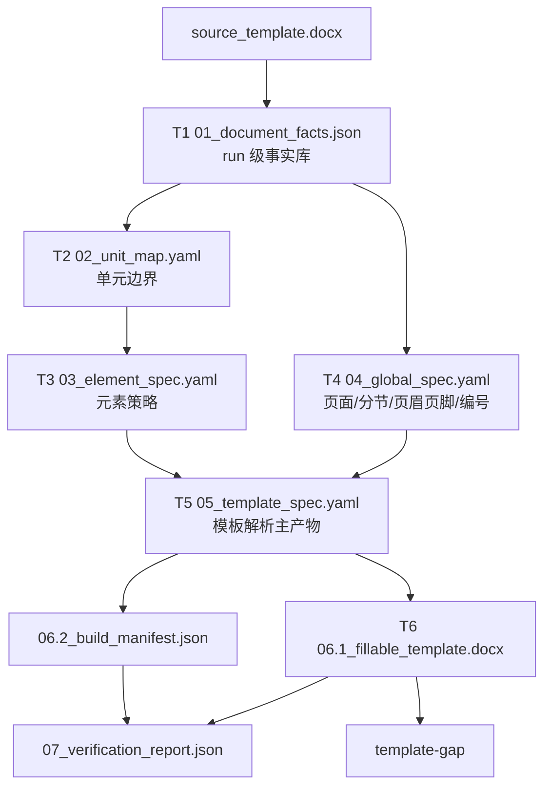

# 模板解析与可填模板生成当前主线

Last updated: 2026-07-11

一句话结论：当前 canonical 研发入口是 `docfit template generate|stage|verify|inspect`。
`generate` 默认离线生成可填模板，`stage` 固定某次 run 后调试 T2/T3/T4 AI 观察，
`verify` 一次运行生成、最终 gap、阶段裁判和 route-eval，`inspect` 只读查看已有 run。
旧 `docfit eval template-*` 命令暂作兼容 alias。

各阶段的长期职责、依赖、输入输出、共享身份和 code/AI/merged route 规则，以 `docs/current/template-generation-stage-contracts.md` 为准；本文只说明当前真实运行入口和产物，不承载实施计划。

## 支撑流程边界

```text
学校原始模板 Word
  -> 01_document_facts.json
  -> 02_unit_map.yaml
  -> 03_element_spec.yaml
  -> 04_global_spec.yaml
  -> 05_template_spec.yaml
  -> 06.1_fillable_template.docx + 06.2_build_manifest.json
  -> 07_verification_report.json
```

`template generate` 只接受 `--template` 和 `--out`，不接受 `--school`，也不读取学校签收标准。普通模板解析只要求用户提供学校原始模板 Word；`template verify` 是开发评测和已签收学校验收入口，会接收 `--school` 并读取 `standards/targets/**` 来裁判本次真实生成的各阶段产物质量。

学校标准检查仍在生成后运行：

```text
06.1_fillable_template.docx + final_template.expected.yaml -> template_gap_report.*
```

`template-gap` 里的 `generated_template` 仍是历史检查术语，含义是“被测业务生成模板”。新生成器传入的是 `06.1_fillable_template.docx`。

模板解析阶段的学校标准文件使用专用命名，不再沿用旧数字阶段标准入口：

```text
standards/targets/<target_id>/v1/template_generation/t1_document_facts.standard.yaml
standards/targets/<target_id>/v1/template_generation/t2_unit_pagination.standard.yaml
standards/targets/<target_id>/v1/template_generation/t3_element_policy.standard.yaml
standards/targets/<target_id>/v1/template_generation/t4_global_layout.standard.yaml
standards/targets/<target_id>/v1/template_generation/t5_template_spec.standard.yaml
```

这些文件只覆盖各自阶段：T1 是源 DOCX 事实；T2 是单元识别、单元顺序、边界范围和分页归属；T3 是元素策略；T4 是全局版式；T5 是 `template_spec` 合并契约。它们不做旧路径兼容。

## 当前数据流



旧 `source_template_tree.json`、`template_structure_candidates.json`、`template_generation_model.json`、`template_generation_plan.json` 和 `template_artifact.json` 已不再作为公开文件落盘。仍参与算法的中间模型只在单次运行内消费；对外事实以编号产物和 `99_template_generation_debug_index.json` 为准。

## 核心产物

| 顺序 | 产物 | 生产者 | 消费者 | 能证明什么 |
| --- | --- | --- | --- | --- |
| 1 | `01_document_facts.json` | Word/OOXML inspector | T2/T3/T4/T6/verifier | 源模板里可见事实、run id、样式、字段、分节、未知对象 |
| 2 | `02_unit_map.yaml` | deterministic unit mapper | T3/T5/verifier | 单元边界、顺序、source range、page_start |
| 3 | `03_element_spec.yaml` | deterministic element classifier | T5/T6/verifier | 元素策略、fill_source、manual/generated 语义和证据 |
| 4 | `04_global_spec.yaml` | global rule builder | T5/T6/verifier | 页面、分节、页眉页脚、页码、编号和默认样式规则 |
| 5 | `05_template_spec.yaml` | spec merger | T6、后续 placement/render 包装、verifier | 模板解析阶段主产物 |
| 6 | `06.1_fillable_template.docx` | builder | template-gap、后续渲染 | 可填写 Word 模板，fill/manual_only 使用 SDT tag |
| 7 | `06.2_build_manifest.json` | builder | verifier、审计、人工排查 | 每个构建 action、source refs、output ref、状态 |
| 8 | `07_verification_report.json` | deterministic verifier | summary、gate、人工排查 | T1-T6 的 `PASS/FAIL/UNKNOWN` 和 `first_bad_stage` |

## 字段规则

新增或修改字段前必须说明：字段含义、生产者、消费者、是否参与判定、缺失后果、默认值、AI 是否可改、证据要求和测试要求。

这些字段不能靠猜默认：

```text
unit_id
element_id
policy
role
fill_source
source_ref
source_seq
raw_run_id
logical_run_id
source_seq_refs
affected_source_seq_refs
output_ref
sdt_tag
field_type
page_start
section_profile
section_profile_refs
section_profiles[].boundary
page_numbering.display.status
check status
evidence_refs
```

## 可填模板规则

`06.1_fillable_template.docx` 从源模板整包复制后做局部减法构建：

- `fixed/template_default` 原样保留。
- `instruction_remove` 删除说明文字，保留必要 OOXML 结构。
- `fill/manual_only` 写入 Word SDT 内容控件，`w:tag` 为稳定 `element_id` 或 `unit_id.element_id`。
- `generated` 目前写入可定位的 generated SDT/字段占位证据，后续可升级为低层 OOXML Word field。
- 输出 Word 不能包含 `[[DOCFIT_*]]` 内部文本 marker。
- `06.2_build_manifest.json` 必须记录每个 action 的 source refs、source_seq、output_ref 和执行状态。

## 三态 verifier

T1-T6 verifier 使用 `PASS/FAIL/UNKNOWN`：

| 阶段 | 主要检查 | 阻断例子 |
| --- | --- | --- |
| T1 | artifact/schema/hash、id、run 追踪、unknown visible objects | 未建模可见对象为 `UNKNOWN` |
| T2 | required unit、顺序、source range、page_start、confidence flags | required unit 缺失为 `FAIL`；低/中置信未审为 `UNKNOWN` |
| T3 | policy/role/fill_source、manual/generated 语义、AI trace、confidence flags | fill 缺 `fill_source` 为 `FAIL`；低/中置信未审为 `UNKNOWN` |
| T4 | section profile、boundary、页码证据、页眉页脚 part、编号规则 | section boundary 或页码证据缺失为 `UNKNOWN`；检测到页码但缺 PAGE 字段证据为 `FAIL` |
| T5 | schema、id 唯一、unit-section 引用存在、range 相交、review flags | unit 无法绑定 section 为 `UNKNOWN`；引用不存在或 range 不相交为 `FAIL` |
| T6 | DOCX 有效、无 marker、SDT tag、manifest hash/action | marker 残留或 SDT 缺失为 `FAIL` |

聚合报告字段：

```json
{
  "status": "UNKNOWN",
  "first_bad_stage": "T2",
  "stages": [{"stage": "T1", "status": "PASS"}, {"stage": "T2", "status": "UNKNOWN"}]
}
```

任一阶段 `FAIL/UNKNOWN`，不能宣称模板解析成功。

## first_bad_stage 判断

| 现象 | 先看什么 | first_bad_stage | 应该改哪里 |
| --- | --- | --- | --- |
| 输入文件拿错 | `template_generation_request.json` | `T0/input` | CLI/profile 绑定 |
| 源 Word 内容没解析出来 | `01_document_facts.json` | `T1` | inspector / OOXML 解析 |
| unit 没识别或识别错 | `02_unit_map.yaml`，兼容视图 `template_structure_candidates.json` | `T2` | 单元发现规则 |
| 元素策略错 | `03_element_spec.yaml`，兼容视图 `template_generation_model.json` | `T3` | 元素分类和策略 materialize |
| 页面/分节规则缺失 | `04_global_spec.yaml`、`02_unit_map.yaml` | `T2/T4` | 页面规则抽取 |
| template_spec 引用断裂 | `05_template_spec.yaml` | `T5` | spec 合并 |
| Word 构建动作错 | `06.2_build_manifest.json`、`06.1_fillable_template.docx` | `T6` | builder/executor |
| gap 报告仍失败 | `generated_template_tree.json` 和 `template_gap_report.*` | `template-gap` 或更早 | 先回查 T1-T6 first_bad_stage |

不要看到最终 Word 不对就直接改 gap 报告或最终渲染；先定位问题第一次出现在哪一步。

## 当前命令

首选全流程质量入口：

```bash
uv run docfit template verify \
  --school hunannongye \
  --template inputs/targets/hunannongye/raw/source_template.docx \
  --out /private/tmp/docfit_template_generation_full_hunannongye
```

完整流程默认不调用 LLM API，以保证日常生成和回归可复现。需要同时生成 T2/T3
文本观察和 T4 视觉观察时，显式使用 `--ai live`：

```bash
KIMI_API_KEY=... MINIMAX_API_KEY=... \
uv run docfit template verify \
  --school hunannongye \
  --template inputs/targets/hunannongye/raw/source_template.docx \
  --out /private/tmp/docfit_template_generation_full_hunannongye \
  --ai live
```

统一 AI 模式为 `--ai off|live|replay|bundle`。`generate` / `verify` 默认 `off`；
`--llm` 只是 `--ai live` 的兼容简写。replay 用 `--replay <transcript.json>`，
bundle 用 `--bundle <observation_bundle.json>`。旧 `--agent-*` 只保留在兼容 alias 中。
live API 配置统一读取 `DOCFIT_TEMPLATE_AGENT_TEXT_PROVIDER`、
`DOCFIT_TEMPLATE_AGENT_VISION_PROVIDER` 和对应 provider 的 `<PROVIDER>_API_KEY` /
`<PROVIDER>_BASE_URL` / `<PROVIDER>_MODEL`。所有 live API 调用共用一份按能力角色定义的
provider 策略：文本（T2/T3）为 `MiniMax -> 额度耗尽时 Kimi -> UNKNOWN`，视觉（T4）为
`MiniMax -> UNKNOWN`。Kimi 当前只配置了文本端点，不能接管 T4 图片输入；若以后增加兼容
视觉 provider，应在同一策略中增加 fallback。单阶段 `template stage` 和
`generate/verify --ai live` 使用同一套策略。显式把文本 provider 设为 Kimi 时仍只使用
Kimi，不启用反向回退。同一次全流程共享 provider 额度熔断状态：MiniMax 在文本阶段确认
额度耗尽后，后续文本直接回退 Kimi，T4 则先复用可用缓存、未命中缓存的页面输出 UNKNOWN。
API trace 分开记录真实网络调用、缓存命中、额度熔断跳过和 `fallback_used`。

固定输出结构：

```text
<run_root>/
  eval_runs/template_generate/
  eval_runs/template_gap/
  eval_runs/template_generation_judge/
  full_summary.json
  full_summary.md
```

`full_summary.json` 是全流程质量报告入口，包含 `status`、`first_bad_stage`、`stage_statuses`、`quality_report.stage_cards[]`、`route_eval`、`gates`、`owner_summary`、`top_blockers` 和 `next_verification`。`quality_report.stage_cards[]` 覆盖 `T1/L1/T2/T3/T4/T5/T6/T7/POST_T6`，用于定位每个阶段的产物质量、route 缺口、root cause、owner 和下一步验收。

拆阶段调试入口：

```bash
RUN_ROOT=test_outputs/debug/template_generation/manual_hunannongye
uv run docfit template generate \
  --template inputs/targets/hunannongye/raw/source_template.docx \
  --out "$RUN_ROOT/eval_runs/template_generate"
```

单独调试 AI 观察阶段使用 `template stage t2|t3|t4`。默认为 `--ai live`：
T2/T3 优先调 MiniMax 文本 API，额度耗尽时回退 Kimi；T4 调 MiniMax 视觉 API，额度耗尽
时熔断后续视觉调用并输出带失败原因的 UNKNOWN，不会错误转交给文本模型。首选 `--run`复用同一次
template-generate 留下的 sealed L1 和上游 hash；`--template` 只是显式 bootstrap 路线，并会先构建 T1/render facts 再封存 L1。

```bash
# T2：复用已有 run 的 sealed L1，新调 live API
MINIMAX_API_KEY=... KIMI_API_KEY=... uv run docfit template stage t2 \
  --run "$RUN_ROOT/eval_runs/template_generate" \
  --out /private/tmp/docfit_stage_t2

# T3：默认固定 run 中 ai_raw T2；缺失时明确失败
MINIMAX_API_KEY=... KIMI_API_KEY=... uv run docfit template stage t3 \
  --run "$RUN_ROOT/eval_runs/template_generate" \
  --t2-route ai_raw \
  --out /private/tmp/docfit_stage_t3

# 只有显式授权时才先补跑 T2
MINIMAX_API_KEY=... KIMI_API_KEY=... uv run docfit template stage t3 \
  --run "$RUN_ROOT/eval_runs/template_generate" \
  --with-upstream \
  --out /private/tmp/docfit_stage_t3_with_upstream

# T4：必须复用带 real_render 页图的 run
MINIMAX_API_KEY=... uv run docfit template stage t4 \
  --run "$RUN_ROOT/eval_runs/template_generate" \
  --out /private/tmp/docfit_stage_t4
```

每个单阶段输出都会写 `summary.json`、`l1_agent_stage_packet.json` 和对应的
`02.2` / `03.1` / `04.1` AI observation artifact；缓存位于输出目录下的
`cache/`。`run_manifest.json` 记录输入 hash、T2 route、provider/model、API 调用数、
缓存命中、失败和输出产物。T4 没有 `real_render` 页图时会明确失败。

只读查看某次 run：

```bash
uv run docfit template inspect --run "$RUN_ROOT/eval_runs/template_generate"
uv run docfit template inspect --run "$RUN_ROOT" --stage t3
```

`inspect` 不生成、不补产物、不调 API；缺失文件只报 `missing`。

只检查最终 Word gap：

```bash
RUN_ROOT=test_outputs/debug/template_generation/manual_hunannongye
uv run docfit eval template-gap \
  --school hunannongye \
  --generated-template "$RUN_ROOT/eval_runs/template_generate/06.1_fillable_template.docx" \
  --out "$RUN_ROOT/eval_runs/template_gap"
```

只检查已有 `template-generate` run bundle 的阶段标准：

```bash
RUN_ROOT=test_outputs/debug/template_generation/manual_hunannongye
uv run docfit eval template-generation-judge \
  --school hunannongye \
  --run "$RUN_ROOT/eval_runs/template_generate" \
  --out "$RUN_ROOT/eval_runs/template_generation_judge"
```

聚焦测试：

```bash
uv run pytest tests/contract/test_template_generate.py -q
uv run pytest tests/contract/test_real_core_generated_template_gap.py -q
uv run pytest tests/contract -q
```

## 最近一次验证记录

| 日期 | 目的 | 命令 | 状态 | 结论 |
| --- | --- | --- | --- | --- |
| 2026-06-25 | 验证新模板解析 artifact 链路 | `uv run pytest tests/contract/test_template_generate.py -q` | `PASS` | `11 passed`；覆盖 `document_facts`、YAML specs、SDT tag、无内部 marker、低/中置信进入 `UNKNOWN` 报告 |
| 2026-06-25 | 验证 gap 合同 | `uv run pytest tests/contract/test_real_core_generated_template_gap.py -q` | `PASS` | `33 passed`；gap 继续接受被测 Word，并能识别旧 marker 与新 SDT 证据 |
| 2026-06-25 | 验证合同矩阵 | `uv run pytest tests/contract -q` | `PASS` | `75 passed` |
| 2026-06-25 | 验证三校真实模板生成 | 三校 `uv run docfit eval template-generate --template ... --out test_outputs/debug/template_generation/template_parse_refactor_20260625T110707+0800/<school>` | `UNKNOWN` | 湖南农大、南农、北大均产出 `06.1_fillable_template.docx`、`05_template_spec.yaml`、`06.2_build_manifest.json`、`07_verification_report.json`；T6 为 `PASS`，解析门禁因 T2/T3/T4/T5 未审核不确定项为 `UNKNOWN` |
| 2026-06-25 | 验证 T4/T5 section binding 优化 | `uv run pytest`；三校 `uv run docfit eval template-generate --template ... --out /tmp/docfit_t4_opt_<school>` | `PASS` / `UNKNOWN` | `130 passed`；三校均为 `UNKNOWN` 且无新增 `FAIL`。湖南农大 1/1、南农 11/11、北大 17/17 section profiles 均有 boundary；三校 units 均有 `section_profile_refs[]`，南农/北大 primary profiles 不再全部落到 `section_001` |
| 2026-07-11 | 验证全流程质量入口 | 三校 `uv run docfit eval template-generation-full --school ... --template ... --out /private/tmp/docfit_template_generation_full_<school>` | `FAIL` | 三校均产出 `eval_runs/template_generate`、`eval_runs/template_gap`、`eval_runs/template_generation_judge`、`full_summary.json/md`。当前 FAIL 是质量门禁结果，主要暴露 T3 residual/run-span、L1 object/render、AI raw unavailable 和 POST_T6 gap，不代表全流程入口不可用 |

这说明模板解析支撑流程能独立产出可验证的可填模板；不说明生成模板已经满足每所学校的全部签收标准。真实学校质量应优先看 `template verify` 的 `full_summary.json/md`，必要时再用 `template inspect`、`template-generation-judge` 或 `template-gap` 定位。
