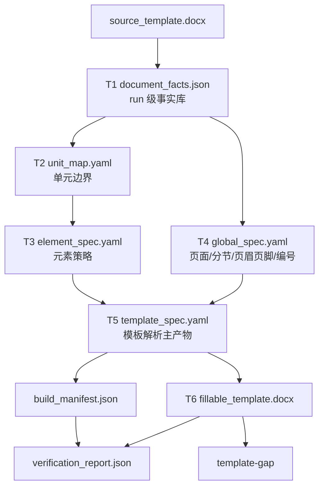

# 模板解析与可填模板生成当前主线

Last updated: 2026-06-25

一句话结论：`template-generate` 现在是模板解析支撑流水线：它只接受学校原始模板 Word，产出 `document_facts.json`、`template_spec.yaml`、`fillable_template.docx` 和 `build_manifest.json`；学校格式是否合格仍由后续 `template-gap` 使用已签收标准检查。

## 支撑流程边界

```text
学校原始模板 Word
  -> document_facts.json
  -> unit_map.yaml
  -> element_spec.yaml
  -> global_spec.yaml
  -> template_spec.yaml
  -> fillable_template.docx + build_manifest.json
  -> verification_report.json
```

`template-generate` 只接受 `--template` 和 `--out`，不接受 `--school`，也不读取学校签收标准。普通产品生成流程只要求用户提供学校原始模板 Word；`standards/targets/**`、gold 和 school config 只用于开发评测、已签收学校验收和可选增强。

学校标准检查仍在生成后运行：

```text
fillable_template.docx + final_template.expected.yaml -> template_gap_report.*
```

`template-gap` 里的 `generated_template` 仍是历史检查术语，含义是“被测业务生成模板”。新生成器传入的是 `fillable_template.docx`。

模板解析阶段的学校标准文件使用专用命名，不再沿用旧数字阶段标准入口：

```text
standards/targets/<target_id>/v1/template_generation/t1_document_facts.standard.yaml
standards/targets/<target_id>/v1/template_generation/t2_unit_pagination.standard.yaml
standards/targets/<target_id>/v1/template_generation/t3_element_policy.standard.yaml
standards/targets/<target_id>/v1/template_generation/t4_global_layout.standard.yaml
standards/targets/<target_id>/v1/template_generation/t5_template_spec.standard.yaml
```

这些文件只覆盖各自阶段：T1 是源 DOCX 事实；T2 是单元识别、单元顺序、边界范围和分页归属；T3 是元素策略；T4 是全局版式；T5 是 `template_spec` 合并契约。它们不做旧路径兼容。

## 当前数据流



旧 `source_template_tree.json`、`template_structure_candidates.json`、`template_generation_model.json`、`template_generation_plan.json` 仍会作为兼容调试视图落盘，方便现有定位和测试过渡；它们不再拥有独立模板语义。`template_artifact.json` 如果出现在 template-generate 输出里，也只是 `template_spec.yaml` 的 legacy downstream 包装视图。

## 核心产物

| 顺序 | 产物 | 生产者 | 消费者 | 能证明什么 |
| --- | --- | --- | --- | --- |
| 1 | `document_facts.json` | Word/OOXML inspector | T2/T3/T4/T6/verifier | 源模板里可见事实、run id、样式、字段、分节、未知对象 |
| 2 | `unit_map.yaml` | deterministic unit mapper | T3/T5/verifier | 单元边界、顺序、source range、page_start |
| 3 | `element_spec.yaml` | deterministic element classifier | T5/T6/verifier | 元素策略、fill_source、manual/generated 语义和证据 |
| 4 | `global_spec.yaml` | global rule builder | T5/T6/verifier | 页面、分节、页眉页脚、页码、编号和默认样式规则 |
| 5 | `template_spec.yaml` | spec merger | T6、后续 placement/render 包装、verifier | 模板解析阶段主产物 |
| 6 | `fillable_template.docx` | builder | template-gap、后续渲染 | 可填写 Word 模板，fill/manual_only 使用 SDT tag |
| 7 | `build_manifest.json` | builder | verifier、审计、人工排查 | 每个构建 action、source refs、output ref、状态 |
| 8 | `verification_report.json` | deterministic verifier | summary、gate、人工排查 | T1-T6 的 `PASS/FAIL/UNKNOWN` 和 `first_bad_stage` |

## 字段规则

新增或修改字段前必须说明：字段含义、生产者、消费者、是否参与判定、缺失后果、默认值、AI 是否可改、证据要求和测试要求。

这些字段不能靠猜默认：

```text
unit_id
element_id
policy
role
fill_source
source_ref
source_seq
raw_run_id
logical_run_id
source_seq_refs
affected_source_seq_refs
output_ref
sdt_tag
field_type
page_start
section_profile
section_profile_refs
section_profiles[].boundary
page_numbering.display.status
check status
evidence_refs
```

## 可填模板规则

`fillable_template.docx` 从源模板整包复制后做局部减法构建：

- `fixed/template_default` 原样保留。
- `instruction_remove` 删除说明文字，保留必要 OOXML 结构。
- `fill/manual_only` 写入 Word SDT 内容控件，`w:tag` 为稳定 `element_id` 或 `unit_id.element_id`。
- `generated` 目前写入可定位的 generated SDT/字段占位证据，后续可升级为低层 OOXML Word field。
- 输出 Word 不能包含 `[[DOCFIT_*]]` 内部文本 marker。
- `build_manifest.json` 必须记录每个 action 的 source refs、source_seq、output_ref 和执行状态。

## 三态 verifier

T1-T6 verifier 使用 `PASS/FAIL/UNKNOWN`：

| 阶段 | 主要检查 | 阻断例子 |
| --- | --- | --- |
| T1 | artifact/schema/hash、id、run 追踪、unknown visible objects | 未建模可见对象为 `UNKNOWN` |
| T2 | required unit、顺序、source range、page_start、confidence flags | required unit 缺失为 `FAIL`；低/中置信未审为 `UNKNOWN` |
| T3 | policy/role/fill_source、manual/generated 语义、AI trace、confidence flags | fill 缺 `fill_source` 为 `FAIL`；低/中置信未审为 `UNKNOWN` |
| T4 | section profile、boundary、页码证据、页眉页脚 part、编号规则 | section boundary 或页码证据缺失为 `UNKNOWN`；检测到页码但缺 PAGE 字段证据为 `FAIL` |
| T5 | schema、id 唯一、unit-section 引用存在、range 相交、review flags | unit 无法绑定 section 为 `UNKNOWN`；引用不存在或 range 不相交为 `FAIL` |
| T6 | DOCX 有效、无 marker、SDT tag、manifest hash/action | marker 残留或 SDT 缺失为 `FAIL` |

聚合报告字段：

```json
{
  "status": "UNKNOWN",
  "first_bad_stage": "T2",
  "stages": [{"stage": "T1", "status": "PASS"}, {"stage": "T2", "status": "UNKNOWN"}]
}
```

任一阶段 `FAIL/UNKNOWN`，不能宣称模板解析成功。

## first_bad_stage 判断

| 现象 | 先看什么 | first_bad_stage | 应该改哪里 |
| --- | --- | --- | --- |
| 输入文件拿错 | `template_generation_request.json` | `T0/input` | CLI/profile 绑定 |
| 源 Word 内容没解析出来 | `document_facts.json` | `T1` | inspector / OOXML 解析 |
| unit 没识别或识别错 | `unit_map.yaml`，兼容视图 `template_structure_candidates.json` | `T2` | 单元发现规则 |
| 元素策略错 | `element_spec.yaml`，兼容视图 `template_generation_model.json` | `T3` | 元素分类和策略 materialize |
| 页面/分节规则缺失 | `global_spec.yaml`、`unit_map.yaml` | `T2/T4` | 页面规则抽取 |
| template_spec 引用断裂 | `template_spec.yaml` | `T5` | spec 合并 |
| Word 构建动作错 | `build_manifest.json`、`fillable_template.docx` | `T6` | builder/executor |
| gap 报告仍失败 | `generated_template_tree.json` 和 `template_gap_report.*` | `template-gap` 或更早 | 先回查 T1-T6 first_bad_stage |

不要看到最终 Word 不对就直接改 gap 报告或最终渲染；先定位问题第一次出现在哪一步。

## 当前命令

模板解析/可填模板生成：

```bash
RUN_ROOT=test_outputs/debug/template_generation/manual_hunannongye
uv run docfit eval template-generate \
  --template inputs/targets/hunannongye/raw/source_template.docx \
  --out "$RUN_ROOT/eval_runs/template_generate"
```

模板差距检查：

```bash
RUN_ROOT=test_outputs/debug/template_generation/manual_hunannongye
uv run docfit eval template-gap \
  --school hunannongye \
  --generated-template "$RUN_ROOT/eval_runs/template_generate/fillable_template.docx" \
  --out "$RUN_ROOT/eval_runs/template_gap"
```

聚焦测试：

```bash
uv run pytest tests/contract/test_template_generate.py -q
uv run pytest tests/contract/test_real_core_generated_template_gap.py -q
uv run pytest tests/contract -q
```

## 最近一次验证记录

| 日期 | 目的 | 命令 | 状态 | 结论 |
| --- | --- | --- | --- | --- |
| 2026-06-25 | 验证新模板解析 artifact 链路 | `uv run pytest tests/contract/test_template_generate.py -q` | `PASS` | `11 passed`；覆盖 `document_facts`、YAML specs、SDT tag、无内部 marker、低/中置信进入 `UNKNOWN` 报告 |
| 2026-06-25 | 验证 gap 合同 | `uv run pytest tests/contract/test_real_core_generated_template_gap.py -q` | `PASS` | `33 passed`；gap 继续接受被测 Word，并能识别旧 marker 与新 SDT 证据 |
| 2026-06-25 | 验证合同矩阵 | `uv run pytest tests/contract -q` | `PASS` | `75 passed` |
| 2026-06-25 | 验证三校真实模板生成 | 三校 `uv run docfit eval template-generate --template ... --out test_outputs/debug/template_generation/template_parse_refactor_20260625T110707+0800/<school>` | `UNKNOWN` | 湖南农大、南农、北大均产出 `fillable_template.docx`、`template_spec.yaml`、`build_manifest.json`、`verification_report.json`；T6 为 `PASS`，解析门禁因 T2/T3/T4/T5 未审核不确定项为 `UNKNOWN` |
| 2026-06-25 | 验证 T4/T5 section binding 优化 | `uv run pytest`；三校 `uv run docfit eval template-generate --template ... --out /tmp/docfit_t4_opt_<school>` | `PASS` / `UNKNOWN` | `130 passed`；三校均为 `UNKNOWN` 且无新增 `FAIL`。湖南农大 1/1、南农 11/11、北大 17/17 section profiles 均有 boundary；三校 units 均有 `section_profile_refs[]`，南农/北大 primary profiles 不再全部落到 `section_001` |

这说明模板解析支撑流程能独立产出可验证的可填模板；不说明生成模板已经满足每所学校的全部签收标准，学校质量仍需 `template-gap` 判定。
