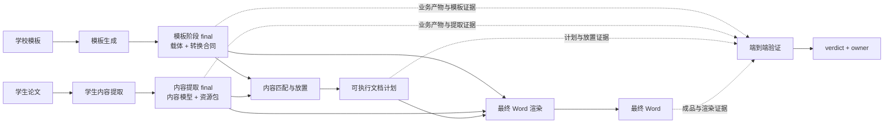
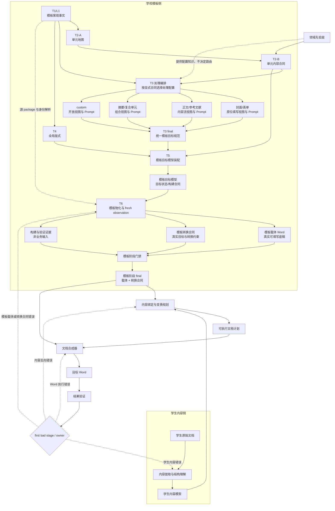
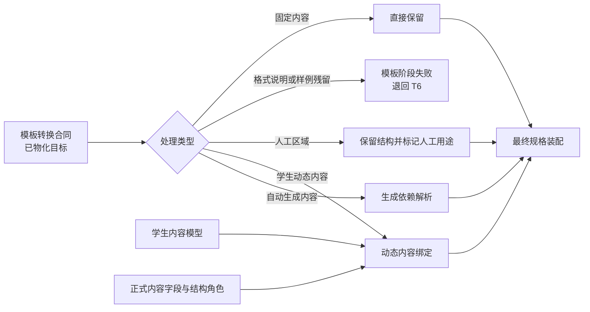

# DocFit 端到端系统架构（讨论稿）

> Status: discussion draft  
> Created: 2026-07-26  
> Updated: 2026-07-26  
> Positioning: DocFit 从学校模板和学生论文到目标 Word 的端到端、跨业务阶段系统架构讨论  
> Scope: 讨论模板生成、学生内容提取、内容匹配与放置、最终 Word 渲染和端到端验证之间的关系、共同模型与权威边界  
> Primary canonical target: 未来的 `docs/current/system-architecture.md`  
> Stage canonical targets: 定稿后的阶段内部内容分别迁入 `docs/current/template-generation-architecture.md`、未来的 `docs/current/student-content-extraction-architecture.md`、`docs/current/content-placement-architecture.md` 和 `docs/current/document-rendering-architecture.md`  
> Non-goal: 本文不代替任何单一业务阶段的 canonical 架构文档，也不规定 artifact 字段、类名、函数名、prompt 文案、具体文件名、实施步骤或测试命令

> 本文只记录当前端到端架构讨论结论，不代表相关能力已经实现。它负责解释各业务阶段如何衔接，不负责承载某一阶段的全部内部设计。现有生产链、阶段启用状态和正式契约仍以 `docs/current/`、`docs/status/` 和已批准 plan 为准。

> 2026-07-26 讨论决定：T3 可以针对封面、正文、摘要、目录、表单和 custom 单元使用不同的事实视图、处理配置和 Prompt，但具体采用哪类处理方式必须由 T2-B 发布的单元内容合同显式驱动。程序不得根据 `unit_id` 自行推导处理策略。不同 T3 路线最终必须归一并发布同一份稳定、可版本化的 T3 模板目标规范。

> 2026-07-26 讨论决定：模板生成阶段最终必须输出两个相互绑定的一等业务产物：一份经过验证的模板载体 Word，和一份描述该 Word 中真实可转换目标的机器可读模板转换合同。T5 模板目标模型、T6 构建 manifest、T7/POST_T6 验证报告和调试 trace 各有独立职责，不能代替这两个业务产物。当前每个学校只有一个模板版本，两个业务产物只需作为同一次模板阶段运行的完整 final 一起通过门禁；本文不为当前流程引入模板版本注册、兼容协商或“latest”选择机制。

> 2026-07-26 对齐顺序：先定义每个业务阶段对外发布什么，再定义正式消费者和阶段间数据交互，然后从消费者需求反推上游必须提供哪些内容，最后才讨论阶段内部怎样产生这些内容。阶段内部实现可以演进，但不能让消费者依赖私有 trace、临时字段或未发布判断。

## 1. 这份系统架构讨论稿要解决什么

DocFit 的目标不是简单地把学生论文中的文字复制到学校模板，而是：

1. 理解学校模板提供的固定结构、内容目标、样式规范和生成规则；
2. 理解学生论文中的真实语义内容和递归结构；
3. 把学生内容准确绑定到模板目标；
4. 在模板副本中重新合成符合学校要求的目标 Word；
5. 证明内容没有丢失、错位或重复，结构和样式也符合目标模板。

当前讨论的核心问题是：

> 模板识别完成后，系统如何同时产出真正可填写的模板载体和可指导后续转换的机器合同，并让学生内容提取、内容放置、最终渲染和验证都只消费职责明确、版本绑定的正式产物。

本文按以下顺序组织，避免先设计内部流程再反推产品接口：

```text
第一层：各业务阶段交付什么
→ 第二层：正式产物怎样跨阶段交互
→ 第三层：消费者需要上游提供什么
→ 第四层：各阶段内部怎样产生并证明这些内容
```

只有前三层稳定后，才进入字段 schema、内部子阶段、Prompt、执行动作和测试命令。

## 2. 第一层：先定义各业务阶段交付什么

业务阶段首先是一个正式产物的生产者。判断一个阶段是否完成，不能只看它“做过哪些处理”，而要看它是否产出了经过本阶段门禁、可直接交给下游的 final。

每个正式产出必须先回答：

- 它解决什么业务问题；
- 谁是唯一生产者；
- 哪些下游是正式消费者；
- 消费者依赖哪些稳定语义；
- 产物怎样被本阶段验收并标成正式 final；
- 缺失、不完整或质量不通过时怎样停止整条路线；
- 用什么证据证明它真的可用。

### 2.1 业务阶段正式产出总表

| 业务阶段 | 一等业务产出 | 控制/证据产出 | 直接消费者 | 阶段完成的最低含义 |
| --- | --- | --- | --- | --- |
| 模板生成 | **模板阶段 final**：模板载体 Word + 模板转换合同 | 构建 manifest、fresh template observation、T7/POST_T6 报告 | 内容匹配与放置、最终 Word 渲染、模板阶段门禁 | 两个业务产物都完成且质量通过；真实目标和合同逐项一致；required 能力没有未知缺口 |
| 学生内容提取 | **内容提取 final**：学生内容模型 + 资源包 | visible-content ledger、coverage、unsupported/unmapped 报告 | 内容匹配与放置；renderer 按计划读取资源 | 所有可见内容和对象都有稳定身份与状态；没有 silent drop |
| 内容匹配与放置 | **可执行文档计划** | 冲突、缺失、unmapped 和人工复核证据 | 最终 Word 渲染、placement verifier | 学生内容去向和 required 模板目标来源双向闭合；输入在本次运行中保持一致 |
| 最终 Word 渲染 | **最终 Word** | render manifest、fresh final observation、feature snapshot | 用户、端到端 verifier | 只执行已发布计划；从绑定模板载体开始；每项动作都有真实结果 |
| 端到端验证 | 不产生新的内容业务产物 | verdict、findings、first bad stage、root cause、owner 和修复建议 | 发布门禁、人工排查、后续 status/plan | 标准、检查器和证据充分；报告不修改业务产物 |

这张表先确定业务阶段的发布边界，不等同于列出所有落盘文件。一个阶段可以有多个内部 final、trace 和报告，但它们只有在被正式声明为跨阶段业务接口时，才能驱动后续阶段。

### 2.2 产物层级不能混用

| 产物层级 | 作用 | 允许消费者 | 典型例子 |
| --- | --- | --- | --- |
| 一等业务产物 | 让下一业务阶段实际工作 | 已声明的正式下游 | 模板载体、模板转换合同、学生内容模型、资源包、文档计划、最终 Word |
| 阶段内部 final | 在同一业务阶段内连接子阶段 | 本阶段内部下游 | T2/T3/T4 final、T5 模板目标模型 |
| 控制与执行证据 | 证明业务产物如何产生、是否满足门禁 | verifier、judge、审计和排障 | build/render manifest、fresh observation、coverage |
| 质量结论 | 决定发布、归因和后续修复 | gate、人工审查、status/plan | verification report、gap report、verdict |
| 调试产物 | 帮助开发和复现 | 命名明确的调试入口 | Prompt trace、AI observation、candidate、route-eval |

共同约束是：

1. evidence 可以证明业务产物，不能补写业务语义；
2. 阶段内部 final 不会因为“信息很多”自动升级为跨阶段接口；
3. 没有正式消费者的字段不代表能力完成；
4. 下游不得读取私有 trace、manifest 或历史报告来补正式输入缺失。

### 2.3 各阶段最终交付的业务含义

```text
模板生成
→ 交付“可从哪里开始写”以及“这个载体实际怎样被转换”

学生内容提取
→ 交付“学生论文中有哪些内容、结构和资源”

内容匹配与放置
→ 交付“每项学生内容和每个模板目标最终怎样处置”

最终 Word 渲染
→ 交付“忠实执行计划后的用户文档”

端到端验证
→ 交付“是否可发布、哪里首先出错、由谁修”
```

## 3. 第二层：再定义阶段间数据怎样交互

跨阶段交互只通过正式发布产物，不通过内部实现细节：



### 3.1 正式数据边

| 生产阶段 | 正式输出 | 消费阶段 | 消费者允许做什么 | 缺失或不一致时 |
| --- | --- | --- | --- | --- |
| 模板生成 | 模板转换合同 | 内容匹配与放置 | 读取真实目标、接受内容语义、基数、格式、生成依赖、保护和 availability | 阻断放置；不能读取 T3/T5 或 build manifest 猜目标 |
| 模板生成 | 本次运行的模板载体 | 最终 Word 渲染 | 创建干净工作副本并按计划修改 | 模板阶段未通过时不启动渲染；不能换用其他模板 |
| 学生内容提取 | 学生内容模型 | 内容匹配与放置 | 读取内容语义、层级、顺序、对象关系和正式来源 | 内容提取阶段未通过时不启动放置 |
| 学生内容提取 | 资源包 | 最终 Word 渲染 | 只读取计划明确引用的图片、公式或其他资源 | 资源缺失时本阶段输入不完整，停止渲染 |
| 内容匹配与放置 | 可执行文档计划 | 最终 Word 渲染 | 确定性编译并执行计划 | 放置阶段未通过或目标不可解析时不启动渲染 |
| 各业务阶段 | manifest、fresh observation、coverage、findings | 本阶段 verifier / 总体诊断 | 本阶段 expected-vs-observed、诊断和 owner 归因 | 本阶段不通过即停止；不把失败 final 交给下游 |
| 端到端验证 | verdict、first bad stage、owner | 发布门禁和修复流程 | 决定发布或回到对应 owner | 不得反向修改业务产物使其通过 |

### 3.2 当前单路线中的阶段交接

当前每个学校只有一个模板版本，一次任务也是一条独立路线：

```text
学校模板 + 学生论文
→ 阶段 A 生成结果并完成本阶段验证
→ 通过后才把 final 交给阶段 B
→ 不通过就停止整条路线
```

因此，阶段交接只需要回答三个问题：

1. 上一阶段是否已经通过自己的门禁；
2. 交给下一阶段的是不是约定的正式输出，而不是 observation、manifest 或调试产物；
3. 本次运行需要的输出文件或数据是否齐全、可读取。

下游不重新评估上游的业务质量。例如，内容放置不重新判断模板识别是否准确；模板生成如果没有通过，就根本不应启动内容放置。

实现上可以传文件路径、类型明确的对象或 final handle。关键不是包装得多复杂，而是编排器只在上游成功时调用下游，并且下游只接受约定的 final 类型。

下游保留的输入检查只是防止编排或代码接线错误，例如文件缺失、拿成了 manifest、字段形状完全不对；这些检查不为上游质量兜底，也不把失败结果降级后继续执行。

hash、input refs、生产器版本和 lineage 仍可以记录在 manifest 或报告中，用于复现、审计和定位问题；当前不要求每个消费者读取这些信息，也不需要运行时做多版本兼容协商。

### 3.3 阶段间只传稳定语义

允许跨阶段传递的是：

- 已发布内容语义；
- 稳定身份和真实目标引用；
- 明确的依赖、约束和处置状态；
- 支撑验证所需的最小 trace。

不允许跨阶段泄漏的是：

- 私有 Prompt 结构；
- 模型思维过程或自由文本解释；
- 候选 route 和未发布 observation；
- 执行器内部类名或低层函数动作；
- 只有当前实现知道怎样解释的临时字段。

这样内部实现可以演进，而不会迫使所有下游跟着 T2/T3 Prompt、模型 provider 或 renderer 细节一起变化。

## 4. 第三层：从消费者需求反推上游必须提供什么

产物不能从“上游现在方便输出什么”来设计，而应从正式消费者完成职责所需的信息反推。

### 4.1 内容匹配与放置需要什么

内容放置只回答“什么内容去哪里”，因此它需要：

| 来源 | 必需内容 | 用途 |
| --- | --- | --- |
| 模板转换合同 | 与本次模板阶段 final 对应的载体引用 | 使用本次运行生成的唯一模板 |
| 模板转换合同 | 单值、内容流、生成、固定、人工和保护目标 | 区分不同处置路线 |
| 模板转换合同 | 接受的 `field_key`/节点类型、基数、required/optional | 判断内容与目标兼容性 |
| 模板转换合同 | 真实目标身份、格式/样式引用、生成依赖和 availability | 形成可执行目标引用并阻断不可用目标 |
| 学生内容模型 | 内容身份、正式语义、递归层级、顺序和 source trace | 确定内容是什么以及组合关系 |
| 学生内容模型 | 资源引用、custom/unmapped 和 coverage 状态 | 防止对象丢失并触发人工或阻断 |

如果这些内容缺失，内容放置不能回读源模板、T3 observation 或学生原 Word 自己补一套解析。

### 4.2 最终 Word 渲染需要什么

renderer 只回答“怎样忠实执行已决定的计划”，因此它需要：

| 来源 | 必需内容 | 用途 |
| --- | --- | --- |
| 模板阶段 final | 本次运行的模板载体 | 创建唯一合法的干净工作副本 |
| 可执行文档计划 | 模板/学生输入引用、动作、顺序、依赖和 precondition | 确定唯一动作源 |
| 可执行文档计划 | 目标身份、内容身份、格式引用、生成时机和人工保护范围 | 编译安全的 Word 操作 |
| 内容提取 final | 计划引用的文本树和资源 | 提供实际写入内容 |
| 渲染合同 | 明确的输入形状和失败策略 | 决定能否执行而不是猜默认值 |

renderer 不需要重新读取 T1-T5 来判断“这是正文还是摘要”，也不允许在缺槽位时搜索相似文字、创建隐式目标或改变内容去向。

### 4.3 端到端验证需要什么

验证层要回答 expected vs observed 和 first bad stage，因此它需要：

- 所有正式业务产物及其本次运行引用；
- 各阶段 manifest、coverage 和 fresh observation；
- 放置计划与实际执行结果的一一对应；
- 最终 Word 的重新解析和可见渲染证据；
- 已签收标准、gold 或 expected snapshot；
- 每项检查的 owner、缺失后果和 `PASS/FAIL/UNKNOWN` 规则。

验证报告不能弥补业务产物缺字段。缺少正式输入、标准、检查器或证据时应保持 `UNKNOWN`，并回到真正缺内容的阶段。

### 4.4 由消费者需求形成的生产者义务

| 生产阶段 | 必须向下游提供 | 不能把责任留给下游 |
| --- | --- | --- |
| 模板生成 | 真实可用载体、完整转换目标、保护/生成/格式约束和本阶段通过状态 | 让 placement 从 build manifest 猜槽位；让 renderer 删除模板说明 |
| 学生内容提取 | 完整语义树、对象/资源、稳定身份、coverage 和 unmapped 状态 | 让 placement 重读原 Word；静默丢弃未知可见内容 |
| 内容匹配与放置 | 双向闭合的唯一计划、输入引用、动作依赖和所有未决状态 | 让 renderer 临时决定去向或复用目标 |
| 最终 Word 渲染 | 最终 Word、逐项执行记录和 fresh observation | 用 `executed` 声明代替真实结果；让 verifier 猜实际动作 |
| 验证 | mismatch、first bad stage、owner 和修复方向 | 只给总状态；修改报告或标准制造通过 |

## 5. 第四层：最后才进入各阶段内部怎么做

内部设计的任务是可靠地产生上一节已经定义的正式产物，而不是反过来让外部接口迁就当前代码。

### 5.1 所有阶段共同的内部结构

每个业务阶段内部都应能区分：

```text
事实输入
→ 领域判断或规划
→ 确定性物化/执行
→ Final Publisher
→ fresh verification
```

- 事实层只记录事实；
- 判断层形成本阶段拥有的语义；
- 执行层只执行明确合同；
- Final Publisher 统一身份、版本、availability 和完整性；
- verifier 检查真实结果，不代替业务阶段修数据。

并非每个阶段都必须使用相同数量的子阶段、模型调用或文件。共同要求是：所有内部路径最终汇合为唯一正式输出，消费者不按 route、Prompt 或 provider 分支。

### 5.2 各业务阶段内部至少要完成什么

| 业务阶段 | 内部职责链 | 最终必须汇合到 |
| --- | --- | --- |
| 模板生成 | T1/L1 事实 → T2 单元合同 → T3 内部目标 → T4 全局版式 → T5 目标装配 → T6 物化 → T7/POST_T6 验证 | 模板载体 + 模板转换合同 |
| 学生内容提取 | 源 Word 事实与可见对象 → 语义/递归结构 → 资源提取 → coverage/unsupported 对账 → 发布 | 学生内容模型 + 资源包 |
| 内容匹配与放置 | 接收两个已通过的上游 final → 内容/目标候选 → 冲突裁决 → 双向闭合 → 计划 final | 可执行文档计划 |
| 最终 Word 渲染 | 接收已通过的计划 final → 编译计划 → 在干净载体上事务执行 → 派生内容更新 → fresh observation | 最终 Word + 执行证据 |
| 端到端验证 | 读取正式产物和证据 → 分层检查 → first-bad-stage 归因 → verdict | 可发布结论和 owner |

学生内容提取、内容放置和最终渲染的 canonical 阶段架构仍未全部建立。上表是端到端责任边界，不表示这些内部流程已经实现或已验收。

### 5.3 后续设计每个阶段时的进入顺序

后续为任一阶段制定 canonical 架构或实施 plan 时，按同一顺序回答：

1. 该阶段正式发布什么；
2. 哪个消费者真正需要它；
3. 消费者需要哪些稳定内容；
4. 本阶段哪些内部 owner 分别生产这些内容；
5. 哪个 Final Publisher 负责完整发布；
6. 哪些 verifier、真实样本和反例证明它可消费；
7. 哪些未完成内容必须保持 blocked/unknown。

下面的章节先给出整个系统图，再展开当前事实最充分的模板生成内部设计，之后说明学生内容、放置、渲染、验证、生命周期和开放世界边界。

## 6. 总体结论

完整系统应被理解为“两侧理解、模板双产物 final、一次绑定、一次合成、按 owner 闭环验证”。模板侧内部允许根据单元合同采用不同的 T3 理解方式，但这些内部路线必须先在模板目标模型处汇合，再由 T6 物化并输出一个完整的模板阶段 final：



各层的核心关系是：

```text
学校模板
→ 模板目标模型
→ 模板载体 Word + 模板转换合同
→ 作为同一次模板阶段 final

学生论文
→ 学生内容模型

模板阶段 final 中的转换合同 + 学生内容模型
→ 内容绑定与变换计划
→ 在本次运行的模板载体 Word 中合成目标 Word
→ 验证
```

其中：

- 模板提供结构和格式权威；
- 学生文档提供内容和语义结构权威；
- T2-B 明确决定每个模板单元应采用什么处理合同；
- T3 可以按合同使用不同处理方式，但必须发布统一目标规范；
- T5 发布“最终目标应该是什么”，但它还不是下游可直接使用的已物化模板能力；
- T6 同时产出模板载体和与该载体逐项对账的转换合同；
- 内容绑定层只读取已经通过模板阶段门禁的转换合同，不读取 T1-T5 私有产物、构建 manifest 或诊断 trace；
- 模板阶段只有在载体和转换合同都通过本阶段门禁后才输出 final，否则整条路线停止；
- 文档合成器只使用本次模板阶段 final 中的载体；
- 文档合成器只执行已经明确的计划；
- 验证层负责证明结果正确，并把问题归还 first bad stage 的 owner，而不是一律退回内容绑定。

## 7. 模板理解不是一次扁平识别

模板侧需要区分事实、单元理解、单元内部目标、全局版式和最终装配。这里最重要的不是阶段数量，而是每层只拥有自己的判断权威。

### 7.1 T1：模板客观事实

T1 负责忠实记录源模板中的事实，例如：

- 文字和对象；
- 段落、表格和结构关系；
- 样式和编号；
- 页面、分节和页眉页脚；
- Word 字段和其他可见对象；
- 可追踪的源位置。

T1 不判断正文、摘要、目录、固定内容或填写槽，也不决定后续动作。

进入 T2、T3 和 T4 之前，T1 事实可以被整理成统一、只读的 L1 事实契约。L1 只统一身份、索引、页面、对象和视觉绑定，不增加单元、内容合同或目标判断。

### 7.2 T2-A：单元地图

T2-A 从整份模板的页面和结构中识别：

- 模板由哪些完整单元组成；
- 每个单元的页面和内容边界；
- 单元之间的顺序；
- 每个单元在本模板中的实例身份。

T2-A 回答的是：

> 这份模板有哪些单元，每个单元在哪里。

### 7.3 T2-B：单元内容合同

T2-B 对每个完整单元形成整体内容处理合同，回答：

- 单元内容主要来自学生、模板、系统生成还是人工填写；
- 模板结构应该整体保留、原位填写、作为内容流样式，还是作为生成目标；
- T3 应采用哪类处理配置和事实视图；
- T3 在当前单元中需要发现哪些目标能力，又必须保守保护哪些结构；
- 单元采用哪些已有领域先验；
- 单元是标准模式、模式变体、能力组合还是开放 custom。

典型的整体判断包括：

- 正文：学生内容流，模板提供结构和样式；
- 封面：保留模板版式，在原有结构中填写；
- 摘要：固定标题、学生内容流和关键词填写的组合；
- 目录：根据其他单元标题和正文标题自动生成；
- 声明或审批表：固定结构、人工区域和部分电子内容的组合。

因此，T2 的完整业务产物应被理解为：

> **Unit Model = 单元身份与边界 + 单元内容合同**

`unit_id` 和单元内容合同不能互相代替：

```text
unit_id
→ 说明“这个单元是谁”

unit content contract
→ 说明“这个单元应怎样被理解和处理”
```

即使两个单元具有相同或相近的 `unit_id`，也可能因为学校结构不同而采用不同的能力组合。程序不得维护 `unit_id → 处理策略` 的隐藏推导表。

### 7.4 T3：合同驱动的单元内部结构映射

T3 在 T2 单元合同的约束下，识别单元内部的真实模板结构：

- 固定内容在哪里；
- 学生动态内容应该进入哪里；
- 哪些范围接收递归内容流；
- 哪些区域由系统生成；
- 哪些区域保留供人工填写；
- 哪些模板节点体现标题、正文、图题、表题等目标样式角色；
- 哪些局部结构属于单元默认合同的例外。

T3 不应重新决定整个单元采用什么内容合同。如果 T3 发现真实结构无法满足 T2 合同，应显式报告合同与结构不一致，而不是静默修改单元级结论。

#### 7.4.1 T2-B 必须显式驱动 T3

T3 的一次单元处理至少同时受三类输入约束：

```text
当前单元的 T1/L1 客观事实
+ T2-A 单元身份与边界
+ T2-B 单元内容合同
→ T3 单元处理
```

T2-B 发布的是业务处理合同，不是具体 Prompt 文件名。合同应表达当前单元采用的处理模式、能力组合、保护边界和预期目标类别。T3 编排器只允许根据这份显式合同，机械地解析对应的事实视图、处理配置和已版本化 Prompt。

以下路线不允许存在：

```text
程序看到 unit_id = body_main
→ 私下认定这是结构化内容流
→ 自动选择正文策略
```

正确关系是：

```text
T2-B 基于当前模板事实发布 structured_content_flow 合同
→ T3 编排器按合同选择正文处理配置
→ 路由选择和 Prompt 版本进入 lineage
```

因此，业务语义选择发生在 T2-B；T3 编排器只执行显式选择，不拥有第二套单元策略判断。

#### 7.4.2 T3 可以有不同的处理配置

不同单元的结构目标不同，不应强迫所有单元共享一套事实视图和 Prompt：

| 单元处理模式 | 事实视图和 Prompt 的重点 | T3 需要识别的主要目标 |
| --- | --- | --- |
| 固定版式原位填写 | 表格、文本框、固定标签、空白和人工区域 | 单值填写目标、固定内容、人工区域和精确删除目标 |
| 结构化内容流 | 内容流边界、样式样本、标题层级、图表与题注 | 内容流目标、结构角色与目标样式映射 |
| 复合单元 | 固定标题、单值区域、内容流区域及相互边界 | 多类目标的组合及局部例外 |
| 派生生成 | 字段位置、依赖来源、层级和更新时机 | 自动生成目标及其依赖 |
| 固定或人工表单 | 固定结构、签章、评语、勾选和可选电子区域 | 必须保留的人工区域及明确电子填写目标 |
| custom | 当前单元完整事实、开放能力描述和保守保护边界 | 可审计的 custom 目标或合同不匹配 |

这些处理配置可以拥有不同的：

- 单元事实投影；
- 视觉证据组织方式；
- Prompt 和示例；
- 递归展开策略；
- 模型调用次数和上下文预算。

但它们不能拥有彼此不兼容的业务输出，也不能绕过 T3 的共同完整性、身份、证据和发布门禁。

#### 7.4.3 T3 输出采用稳定外壳和有限类型分支

本文把用户所说的“相对稳定的输出内容规范”统一称为：

> **T3 模板目标规范**

它描述模板中有哪些真实目标以及这些目标承担什么职责，不是学生内容模型，也不是具体 Word 执行动作。

所有 T3 处理配置最终都发布同一类 T3 final。稳定性不等于把所有目标压成一张扁平表，而是采用“稳定公共外壳 + 有限、可版本化的目标类型分支”：

```text
T3 模板目标规范
├── 固定内容目标
├── 单值填写目标
├── 结构化内容流目标
├── 自动生成目标
├── 人工区域目标
├── 精确删除目标
└── custom / contract_mismatch
```

公共外壳至少保证以下语义长期稳定：

- 目标属于哪个 T2 单元和单元合同；
- 目标引用哪些真实模板节点和可回查身份；
- 目标属于哪类稳定处理能力；
- 目标与样式、结构角色、生成依赖或人工用途的关系；
- 证据、完整性、冲突和未决状态；
- 由哪个处理配置和 Prompt 版本产生。

不同目标类型只增加自身必需的语义。例如，单值目标需要接受的内容语义，内容流目标需要结构角色和样式映射，生成目标需要依赖来源，人工区域需要保护边界。某个 Prompt 不得通过私有字段或私有 artifact 绕开共同 T3 final。

如果现有 T3 目标规范无法表达一种真实的新能力，应先评审并版本化共同契约，再让对应处理配置输出新分支；不能只给某个 Prompt 增加下游不认识的临时字段。

### 7.5 T4：全局版式

T4 负责不属于某个局部模板目标的全局版式，例如分节、页眉页脚、页码、页面设置和跨单元编号规则。

T4 可以和部分 T3 单元处理并行，但不能被某个 T3 Prompt 私自覆盖。单元内部目标与全局版式发生冲突时，应在装配或验证阶段显式报告。

### 7.6 T5：模板目标模型装配

T5 把以下已发布结果装配为统一模板目标模型：

```text
T2 final：单元身份、边界和内容合同
+ T3 final：统一模板目标规范
+ T4 final：全局版式
→ 模板目标模型
```

T5 只负责引用解析、完整性检查、冲突检查和无损装配，不重新选择 T3 处理配置，也不补猜 T2/T3/T4 缺失的语义。

## 8. 为什么不新增顶层 TN 阶段

本讨论暂不建议在 T2 和 T3 之间新增顶层 TN 阶段。

原因是单元身份和单元整体用途高度相关。识别出正文、封面或目录，不只是给单元命名，也是在理解它在最终文档中的整体职责。

如果单独增加 TN，容易形成重复判断：

```text
T2 判断这是正文
→ TN 再判断它是否是学生内容流
→ T3 再处理正文内部结构
```

这会增加新的冲突层、失败点和阶段协调。

更合适的方式是：

```text
T2-A 先识别完整单元
→ T2-B 再对每个完整单元形成内容合同
→ 发布唯一 T2 final
→ T3 编排器按合同选择处理配置
→ 各处理配置发布共同 T3 final
```

T2-A 和 T2-B 可以采用不同的提示、证据视图、模型调用和评测，但在业务架构中仍属于同一个分层单元理解阶段。

T3 处理编排也不是一个新的语义判断阶段。它只把 T2-B 已发布的处理模式解析为对应的事实视图和 Prompt，并记录路由 lineage。只要它不根据 `unit_id` 或局部文本补做策略判断，就不需要升级为新的顶层阶段。

只有当单元内容合同未来被多个独立产品共同生产、拥有独立生命周期或由独立团队维护时，才需要考虑把 T2-B 提升为独立阶段。

这里描述的是目标架构。当前 canonical T2 仍只发布单元地图，当前实现也仍以一套通用 T3 分层 Prompt 处理所有单元。把 T2-B、处理配置路由和统一 T3 模板目标规范迁入生产链，必须另行登记 status、形成 plan、更新阶段契约并完成真实样本验证；不能因为本文定稿就视为已经实现。

## 9. 领域先验层

AI-only 不等于无先验，也不等于让模型每次从零理解论文模板。

领域先验层沉淀跨学校可复用的论文结构经验，例如：

- 正文通常包含章节标题、各级标题、正文、图表和题注等结构角色；
- 摘要通常包含摘要标题、摘要正文和关键词；
- 目录依赖单元标题和正文标题，并具有目录层级；
- 图目录和表目录分别依赖图题和表题；
- 封面通常由固定版式、电子填写位置和人工填写区域共同组成。

领域先验不是学校单元的封闭枚举，也不是隐藏的 Code 判断路线。

它的职责是：

- 向 T2-B 提供常见单元的整体内容模式；
- 提供可复用的处理能力和允许组合方式；
- 向不同 T3 处理配置提供相应的结构角色、风险边界和判断原则；
- 让 AI 选择、组合、调整或拒绝先验；
- 允许未知单元进入开放的 custom 模式。

程序不得根据 `unit_id` 独立推导最终内容策略。先验只有在 T2-B 基于当前模板事实明确选择并写入单元内容合同之后，才能被 T3 编排器确定性解析、展开和校验。

处理配置库与领域先验相关，但二者不是同一概念：

- 领域先验说明某类论文结构通常具有哪些能力和约束；
- T2-B 合同说明当前模板实例实际选择了哪些能力；
- T3 处理配置说明如何针对这类显式合同组织事实和 Prompt；
- T3 final 说明在当前真实模板节点上最终识别出了哪些目标。

## 10. 模板目标模型

T1/L1、T2、T3、T4 和 T5 的最终价值不是给所有模板文字贴标签，而是形成一份供模板生成内部下游 T6 消费的模板目标模型。

模板目标模型从整体上表达：

- 哪些内容和结构必须保留；
- 哪些目标接收单值内容；
- 哪些目标接收结构化内容流；
- 哪些目标由系统自动生成；
- 哪些区域保留供人工填写；
- 学生内容的结构角色应该应用哪些模板样式；
- 各目标之间的所有权、顺序和依赖关系。

模板目标模型是模板生成内部从“理解”进入“物化”的正式语义接口。其中：

- T2 提供单元身份、边界和处理合同；
- T3 提供统一、类型化的模板目标；
- T4 提供全局版式；
- T5 负责无损装配和冲突检查。

它必须基于真实模板节点和可执行位置，不允许 AI 凭空创建 Word 结构身份。

模板目标模型表达“目标应该是什么”，但它本身不能证明这些目标已经在实际可填写 Word 中成功建立。因此：

- T5 模板目标模型可以作为 T6 的唯一语义输入；
- 它不能作为内容匹配阶段的正式输入；
- 下游正式消费的必须是 T6 在真实模板载体上物化、重新观察并验证后的转换合同；
- T5 目标、T6 实际目标和最终 Word 观察结果必须能逐项对账，但三者不能混成一个字段或一个状态。

## 11. 模板生成必须输出两个一等业务产物

模板生成不是“生成一个 Word，再把日志放在旁边”。它在同一次模板阶段运行中必须同时产出职责不同但不可拆分的两个一等业务产物：

```text
模板阶段 final
├── 模板载体 Word
└── 模板转换合同
```

构建 manifest、验证报告和调试 trace 是证明这两个业务产物可信的证据，不是第三个业务语义来源。

### 11.1 产物一：模板载体 Word

模板载体 Word 是经过模板生成和质量门禁后的真实 DOCX 底稿。它承担：

- 供人工查看、下载或在允许的区域填写；
- 作为自动转换时唯一合法的 Word 起始底稿；
- 承载已经物化的槽位、内容流目标、固定结构、派生字段占位、人工区域和版式；
- 为最终渲染提供真实 OOXML package、样式、编号、分节、页眉页脚、对象和位置。

模板载体不是普通源模板的路径别名。模板阶段通过后，这份载体在本次运行中保持只读；最终渲染从它创建工作副本，不在模板阶段 final 上原地修改，也不以上一次失败或成功生成的最终 Word 作为下一次输入。

如果产品允许用户手工填写，手工填写发生在模板载体的派生副本上。被人工修改的副本不再自动满足原转换合同；若要重新进入自动转换，必须重新校验真实目标，不能直接沿用原合同。

### 11.2 产物二：模板转换合同

模板转换合同是后续“学生内容 → 目标 Word”转换的机器可读指导文件。它描述的不是 T5 期望存在什么，而是：

> **在本次模板阶段输出的载体中，哪些目标已经真实存在、接受什么、怎样使用、哪些范围必须保护。**

它至少要覆盖以下能力语义：

- 单值填写目标及其可接受的正式内容语义、节点类型、基数和真实位置；
- 结构化内容流目标及其可接受的递归内容角色、顺序和目标样式/格式引用；
- 自动生成目标及其依赖来源、纳入范围、层级和更新时机；
- 固定内容、人工区域和不可修改范围的保护边界；
- 允许替换的占位范围，以及禁止扩大修改的边界；
- 页面、分节、页眉页脚、编号和局部格式的目标引用；
- 真实 Word 中已经物化的稳定目标身份、位置引用和可执行前置条件；
- optional、required、blocked、needs-review 和 unsupported 等可用性；
- 来源 T5 目标、T6 物化结果和验证证据的 trace。

因此，专项讨论中的 `template_slot_catalog` 可以作为这一产物的首批实现方向，但“只列普通槽位”不足以承担完整职责。正文内容流、目录等派生目标、人工保护区、固定内容和版式引用也必须进入同一稳定合同，或由该合同显式引用的有限、版本化分支表达。

模板转换合同不应包含：

- T1 原始事实全集；
- T2/T3/T4 的私有 observation、Prompt 输入或候选 route；
- T6 的低层 action 日志；
- verifier 或 judge 为了通过而写入的结论；
- 需要下游再次推断才知道含义的自由文本说明。

### 11.3 两个业务产物与内部/证据产物的区别

| 产物类别 | 典型内容 | 直接消费者 | 能否驱动业务 |
| --- | --- | --- | --- |
| 模板内部构建合同 | T5 模板目标模型、required effects、logical targets | T6 | 只驱动模板物化，不直接驱动学生内容放置 |
| 一等业务产物 A | 模板载体 Word | 最终渲染、人工填写路径、模板验证 | 是 |
| 一等业务产物 B | 模板转换合同 | 内容匹配与放置；渲染只用于目标身份和前置条件校验 | 是 |
| 执行证据 | 构建 manifest、动作结果、fresh observation | verifier、排障、审计 | 否，不能成为隐藏语义输入 |
| 质量结论 | T7/POST_T6 报告、学校 gap、发布 verdict | 发布门禁、人工审查 | 否，不能反写业务产物 |
| 调试产物 | AI observation、Prompt trace、candidate、route-eval | 开发和诊断 | 否 |

“文件存在”不能决定它属于哪一类。分类由生产者、消费者、权威语义和缺失后果决定。

### 11.4 同次运行完整发布与阶段门禁

当前每个学校只有一个模板版本，不需要模板版本注册、兼容协商或历史版本选择。这里真正需要保证的是：

```text
模板载体完成
+ 模板转换合同完成
+ 模板阶段验证通过
→ 模板阶段 final
→ 才允许启动内容放置和最终渲染
```

必须满足：

1. 两个业务产物由同一次模板阶段运行产生；
2. 载体中的真实目标与转换合同逐项一致；
3. 两个产物任一缺失、required target 未物化或验证为 `FAIL/UNKNOWN` 时，模板阶段失败并停止整条路线；
4. 失败时可以保留 Word、manifest 和报告用于排障，但不能把它们作为 final 交给下游；
5. 模板阶段完成后如果载体被修改，必须重新执行模板阶段验证，不能继续沿用旧转换合同。

hash、输入引用和生产器 lineage 可以记录在 manifest 与验证报告中，用于证明两个产物来自同次运行和定位问题；它们不要求由内容放置或 renderer 再次解释上游质量。

### 11.5 下游怎样消费模板阶段 final

不同下游读取模板阶段 final 中的不同内容：

| 下游 | 读取什么 | 不允许做什么 |
| --- | --- | --- |
| 内容匹配与放置 | 模板转换合同 + 学生内容模型 | 读取 T1-T5 trace 后重新识别模板；从构建 manifest 猜槽位 |
| 最终 Word 渲染 | 本次运行的模板载体 + 已通过的放置计划 + 必需学生资源 | 重新决定内容去向；换用其他模板载体；按文本搜索扩大目标 |
| 端到端 verifier | 两个业务产物、放置计划、执行证据和最终 Word | 修改业务产物或用报告替代真实 Word 观察 |
| 人工填写路径 | 模板载体的派生副本 | 把人工修改后的副本继续当成本次模板阶段 final |

内容匹配阶段通常不需要直接解析模板载体来重新发现目标；最终渲染也不需要读取 T3/T5 才能补语义。若下游必须回读真实 Word，只能用于校验合同中的目标身份和执行前置条件，不能形成第二套模板理解。

### 11.6 当前实现与目标架构的 gap

当前 canonical 模板链明确发布 `06.1_fillable_template.docx` 和 `06.2_build_manifest.json`；仓库中的 T5/T6 专项讨论已经建议增加面向内容放置的 realized slot catalog，但代码和 canonical 契约还没有建立完整的模板转换合同。

因此当前状态应理解为：

- 模板载体和构建证据已经有正式身份；
- build manifest 中已有部分 slot/action 信息，但它是诊断产物，不能长期兼任转换合同；
- T5 当前模型也不能直接代替转换合同，因为它记录的是目标状态，不是载体中的 fresh realized targets；
- 内容流、派生生成、固定/人工保护区、格式版式引用、真实位置和合同版本还没有作为一个完整的下游业务产物闭环；
- 这项变化会同时影响模板生成、共享字段/目标契约、内容放置、最终渲染和端到端测试，必须另行登记跨阶段 status，并通过唯一 plan 实施和验证。

本文确定的是目标产品边界，不把上述 gap 误写成已经完成。

## 12. 学生内容模型

学生内容不能直接以原 Word 段落和原格式进入模板匹配。

学生论文需要先被提取为中立的语义内容模型，例如：

```text
论文
├── 标题与作者信息
├── 中文摘要
│   ├── 摘要正文
│   └── 关键词
├── 英文摘要
├── 正文
│   ├── 章节标题
│   ├── 一级标题
│   ├── 二级标题
│   ├── 三级标题
│   ├── 正文段落
│   ├── 图与图题
│   ├── 表格、表题与表注
│   └── 其他结构内容
├── 参考文献
├── 附录
└── 其他学校或论文特有内容
```

学生内容模型应保留：

- 内容语义；
- 父子层级和顺序；
- 图、表、公式等对象关系；
- 原始内容的追踪身份；
- 每个可见内容和可见对象的覆盖状态；
- 无法映射到正式字段的 custom/unmapped 内容。

学生源文档中的字体、字号和缩进是源事实，但不是最终格式权威。最终表现由目标模板决定。

学生内容侧也不能只考虑一个 JSON。图片、嵌入对象、公式、附件或其他二进制资源应与内容模型一起构成内容提取 final；提取 coverage、unsupported ledger 和验证报告属于证据面。内容模型与必需资源缺一时，内容提取阶段不能通过，也就不会进入内容放置。正式输出至少需要包含：

- 学生源文档身份；
- 内容模型及其正式语义；
- 资源包及每项资源引用；
- 可见内容 coverage 与 unsupported/unmapped 状态；
- 本阶段验证状态。

模板生成阶段不得包含任何学生数据；学生内容只存在于当前论文转换路线的内容提取及其下游阶段。

## 13. 内容绑定与处理分流

内容绑定层同时读取已经通过的模板阶段 final 中的转换合同和内容提取 final，建立：

```text
学生内容语义
→
真实、已物化的模板目标
```

但不是所有模板内容都进入同一个映射过程。



### 13.1 固定内容

固定内容直接保留，不需要内容字段，也不进入动态内容映射。

典型内容包括：

- 学校名称和固定标题；
- “摘要”等固定标题；
- “关键词：”等固定标签；
- 表单中的固定栏目名称；
- 声明中的固定正文。

领域先验仍可以描述固定角色，用于帮助 AI 划分动态内容边界并防止误识别，但不会为固定角色创建字段映射。

格式说明、示例值和应该在模板生成阶段清理的占位文本不属于内容放置的正常处理类型。模板阶段输出 final 前，T6 必须按 T5 明确目标完成清理、槽位物化和 fresh observation；若模板载体中仍有未授权残留，模板阶段不能通过，也不得启动内容放置或让 renderer 再次搜索全文猜测删除范围。

### 13.2 人工区域

签名、盖章、评语、勾选和其他打印后人工填写区域，默认保留模板结构并标记人工用途。

如果某个人工区域不需要电子预填，它不进入学生内容字段匹配。

### 13.3 学生动态内容

只有需要接收学生内容的目标才进入动态内容绑定。

动态内容分为两类：

- 单值内容，例如标题、姓名、学号和关键词；
- 结构化内容流，例如正文、摘要正文、参考文献和附录。

单值内容适合绑定到边界明确的模板位置。结构化内容流必须整体绑定到内容流区域，并按照学生内容树的结构角色应用模板样式，不能退化成大量互不相关的文本槽。

### 13.4 自动生成内容

目录、图目录、表目录、页码和其他派生内容，不属于普通学生字段匹配。

它们需要表达：

- 生成目标；
- 依赖的内容来源；
- 纳入范围和结构层级；
- 生成和更新时机。

生成内容通常必须在学生内容已经写入、目标样式已经应用之后再生成或更新。

## 14. 动态内容绑定

动态内容绑定层只处理需要建立以下关系的内容：

```text
正式内容语义或内容结构角色
↔
真实模板目标
```

它不重新判断模板语义，也不修改 Word。

其主要职责是：

- 为每项学生内容确定唯一或明确的目标去向；
- 区分单值替换和内容流写入；
- 应用模板目标定义的结构和样式角色；
- 检查内容遗漏、重复使用和目标冲突；
- 检查 required 模板目标是否都有来源、生成责任或明确的人工/空值处置；
- 对无法正式映射的内容保留 custom/unmapped 状态；
- 形成完整、可审计的绑定与变换结果。

正式字段注册表只描述系统支持的稳定语义内容。AI 发现新语义时，可以提出候选字段和依据，但不能直接修改正式注册表。未经确认的新语义应保持 custom/unmapped，并进入受控复核。

内容绑定必须做双向闭合，而不是只检查“学生内容有没有去处”：

```text
学生内容侧：
每个 required 可见内容
→ 唯一目标 / 明确复用 / 明确不适用 / 人工复核 / 阻断

模板目标侧：
每个 required 动态或生成目标
→ 学生内容来源 / 系统生成责任 / 明确允许空值 / 人工责任 / 阻断
```

固定内容和人工区域不需要伪造学生字段来满足闭合；optional 目标可以明确为空。任何未显式登记的 silent drop、重复消费、悬空 required target 或隐式多目标复用都必须阻断。

## 15. 可执行文档计划

内容绑定结果不能直接触发零散的 Word 修改。

系统应先形成一份完整的可执行文档计划，从整体上描述：

- 哪些模板内容和结构保留；
- 哪些学生单值写入哪些目标；
- 哪些学生内容树写入哪些内容流区域；
- 各结构角色使用哪些模板样式；
- 哪些人工区域保持不动；
- 哪些已物化 placeholder 只允许在所属目标内被替换；
- 哪些目录和字段在什么时机生成；
- 操作之间的依赖关系和执行顺序；
- 每项输入内容和模板目标的追踪来源。

可执行文档计划必须绑定：

- 本次运行的模板载体和转换合同引用；
- 本次运行的学生内容模型和资源引用；
- 本次使用的放置规则/注册表；
- 每项内容、目标、生成依赖和人工责任的最终处置；
- 本阶段验证状态。

计划成为本阶段 final 后不可在渲染过程中被静默补写。需要修改内容去向时，应回到内容放置阶段重新生成并验证计划，不能让 renderer 把运行时猜测写回原计划。

只有计划通过完整性和冲突校验后，执行层才能修改 Word。

## 16. 文档合成器

文档合成器不是语义判断器，也不是简单的字符串替换器。

它只忠实执行已经发布的可执行文档计划，并至少支持三类根本不同的操作：

| 执行模式 | 主要用途 |
| --- | --- |
| 原位填写 | 封面字段、摘要关键词、表单电子字段等 |
| 内容流重建 | 正文、摘要正文、参考文献、附录等递归内容 |
| 派生内容生成 | 目录、图目录、表目录、页码和其他 Word 字段 |

推荐的文档生成方式是：

> 提取学生内容，在本次模板阶段 final 的载体副本中重新合成目标文档，而不是直接把学生原 Word 当作最终文档进行不受控修改。

这样可以让学校模板成为结构和格式权威，同时保持学生内容的语义和顺序。

执行顺序从整体上应满足：

```text
复制并保护学校模板
→ 保留固定结构和人工区域
→ 在转换合同声明的目标内替换 placeholder 并填写单值内容
→ 写入并重建结构化内容流
→ 应用模板样式、编号和对象规则
→ 生成或更新目录及其他派生字段
→ 处理全局分页、页眉页脚和版面规则
→ 生成目标 Word 与执行证据
```

执行层不得在过程中重新推断 T2/T3 或内容绑定语义。

每次渲染都使用本次路线已经通过的模板载体、放置计划和学生资源。失败重试重新从干净载体开始，不能继续修改半成品。相同输入应产生语义等价结果；DOCX zip 字节是否完全一致可以由实现决定，但内容、结构、样式、目标身份和可见版面必须可重复验证。

文档合成阶段至少发布：

- 最终 Word：面向用户的业务产物；
- render manifest：逐项记录计划是否执行、实际目标、状态和失败 owner；
- fresh observation / feature snapshot：重新打开最终 Word 后观察到的内容、结构、样式、字段和版面事实。

后两者是执行和验证证据，不能成为绕过放置计划的第二语义输入。

## 17. 结果验证

“成功生成 Word 文件”不代表结果正确。

每个阶段先完成自己的验证，只有通过才把 final 交给下游。下面的检查由对应阶段 verifier 或独立端到端 verifier 执行，不由下一个业务阶段重新判断上一个阶段的质量。

### 17.1 模板阶段 final 完整性

- 模板载体和转换合同是否由同一次模板阶段运行产生；
- 两个业务产物是否都存在并可读取；
- 合同中的每个 AVAILABLE 目标是否在真实载体中可解析并满足后置条件；
- required 目标是否存在 blocked、unknown 或未对账状态；
- 构建 manifest 或报告是否被误当成业务输入。

任一检查失败时，模板阶段停止，不把 final 交给内容放置或 renderer。

### 17.2 内容完整性

- 学生内容是否全部有明确去向；
- 是否出现遗漏、重复或错位；
- 固定模板内容是否被误删或误替换；
- custom/unmapped 内容是否得到保留或显式处置。

### 17.3 结构正确性

- 单元顺序和边界是否正确；
- 标题层级和正文结构是否正确；
- 图、图题、表格、表题和表注关系是否正确；
- 参考文献、附录和其他递归结构是否保持完整。

### 17.4 样式正确性

- 学生内容角色是否使用目标模板样式；
- 标题、正文、图表题注和表格规则是否符合模板；
- 编号、段落间距、缩进和分页是否符合目标规范。

### 17.5 版面和生成内容正确性

- 封面和表单结构是否正常；
- 目录来源、层级和页码是否正确；
- 图目录和表目录是否与最终题注一致；
- 页眉页脚、分节和页面编号是否正确；
- 最终 Word 渲染后是否存在明显溢出、遮挡或残留说明。

### 17.6 合同、路由和发布正确性

- 每个 T2 单元是否都有明确的 T2-B 内容合同；
- T3 实际使用的处理配置是否与 T2-B 合同一致；
- 路由是否由显式合同驱动，而不是由 `unit_id` 或局部文本隐藏推导；
- 不同 T3 处理配置是否全部归一到共同 T3 final；
- 是否存在只有某个 Prompt 私下输出、但共同契约和下游无法理解的字段；
- T2-B 合同、T3 路由 lineage、T3 目标、T5 目标、T6 物化结果和模板转换合同是否能够逐项追踪；
- 内容绑定是否只消费模板转换合同，不旁路读取内部 artifact 或诊断证据；
- renderer 是否从计划绑定的模板载体开始，并且只执行计划中的动作。

### 17.7 执行、fresh observation 与端到端 lineage

- 放置计划中的每项动作是否在 render manifest 中有唯一执行结果；
- 每个 `executed` 或 `already_satisfied` 是否能在 fresh final Word observation 中得到证明；
- 最终 Word 是否来自本次运行已经通过的模板、学生内容和放置计划；
- 重试是否从干净模板载体开始，失败运行是否没有污染正式发布产物；
- verifier 是否能定位 first bad stage、root cause、owner 和建议修复，而不是只输出总状态；
- `PASS/FAIL/UNKNOWN` 是否来自标准、检查器和证据，而不是来自 artifact 存在、AI 结论或历史报告。

学校签收标准、gold 和 expected snapshot 属于校准与验证权威，不是内容放置或 renderer 的隐藏运行时语义输入。若某条学校规则会改变实际转换行为，它必须先进入模板合同或放置规则，再由标准检查；不能只存在于 judge/expected 文件中却要求执行层“知道”。

验证失败时，应根据失败类型回到相应 owner：

- 模板单元或合同问题回到 T2；
- T2-B 合同选择正确、但 T3 编排器没有按合同选择或执行处理配置的问题回到 T3 编排；
- 模板内部目标或样式角色问题回到 T3；
- 页面、分节、页眉页脚、页码、编号和全局版式目标问题回到 T4；
- 模板目标装配、required effect 或 logical target 丢失回到 T5；
- 模板载体与转换合同不一致、真实目标未物化或模板构建动作失败回到 T6；
- 学生内容语义问题回到内容提取；
- 内容去向问题回到绑定规划；
- Word 操作问题回到文档合成器；
- 标准缺失、检查器覆盖不足或证据不足保持 `UNKNOWN` 并回到相应标准/验证 owner；
- 不能由执行层通过重新猜测上游语义来掩盖。

## 18. 权威边界

完整架构的权威关系如下：

| 层次 | 权威内容 | 明确不负责 |
| --- | --- | --- |
| T1 | 模板客观事实 | 单元、策略、内容目标 |
| T2-A | 单元身份、边界和顺序 | 单元内部位置 |
| T2-B | 单元整体内容合同、处理模式和能力组合 | 具体槽位、结构节点和 Prompt 文件名 |
| 领域先验层 | 可复用的论文结构经验 | 当前模板的最终判断 |
| T3 处理编排 | 按 T2-B 显式合同解析事实视图、处理配置和 Prompt 版本 | 根据 `unit_id` 或局部文本补做策略判断 |
| T3 | 单元内部结构、统一类型化目标和样式角色 | 静默改写单元整体合同，或发布处理配置私有输出 |
| T4 | 分节、页眉页脚、页码和全局版式 | 单元内容合同和局部目标 |
| T5 | 无损装配 T2/T3/T4 为模板目标模型 | 重新推断上游语义或选择 T3 路线 |
| T6 模板物化 | 按 T5 目标构建模板载体，并根据 fresh observation 发布真实转换目标 | 创造 T5 未声明的业务目标或让下游从 manifest 猜语义 |
| 模板阶段门禁 | 同时检查模板载体、转换合同和真实物化结果，并决定是否产生 final | 修改内部阶段判断或把失败结果交给下游 |
| 学生内容提取 | 学生内容语义、层级、资源、来源和可见内容 coverage | 决定目标模板位置 |
| 内容绑定 | 学生内容到真实模板目标的唯一去向，以及每个 required 目标的来源或责任 | 修改最终 Word |
| 文档计划 final | 冻结本次运行的模板/学生输入、全部动作与依赖 | 在渲染时被静默补写 |
| 文档合成 | 从本次运行的模板载体开始，忠实执行文档计划 | 补充语义判断、改用当前路线之外的模板或继续修改半成品 |
| 结果验证 | 差异诊断、owner 归因和闭环证据 | 代替上游修正数据 |

## 19. 当前单路线运行边界与未来扩展

### 19.1 当前运行模型

当前每个学校只有一个配置中的学校模板，一次任务是一条独立运行路线：

```text
学校模板 → 模板生成与本阶段验证 ───────┐
                                           ├→ 内容放置与本阶段验证
学生论文 → 内容提取与本阶段验证 ───────┘
                                           → 最终渲染与本阶段验证
                                           → 最终 Word
```

当前规则是：

- 模板阶段和内容提取阶段可以在依赖允许时并行，但两者都通过后才能启动内容放置；
- 任一阶段失败或为 `UNKNOWN`，整条路线停止；
- 下游只接收已经通过的上游 final，不重新判断上游质量；
- 每次运行使用自己的中间产物和工作副本，不继续修改其他运行的半成品；
- manifest、hash、lineage 和报告用于阶段验证、复现与排障，不是下游的第二套业务判断输入。

### 19.2 当前不需要的多版本机制

当前流程不需要：

- 为同一学校维护多个可选择模板版本；
- 运行时协商模板合同兼容范围；
- 通过 `latest`、版本注册表或发布渠道选择模板；
- 让下游根据 hash 判断上游业务质量；
- 为旧模板版本设计迁移、退役和兼容窗口。

如果未来真的出现同一学校多模板并存、模板预生成复用、跨部署消费者或长期缓存，再单独设计版本身份、兼容策略和生命周期；这些不是当前单路线的前置要求。

### 19.3 失败产物、预览和人工复核

阶段失败后仍可以保留 Word、manifest、observation 和报告用于排障，但它们不是 final，也不会进入下一阶段。

- required 模板目标未物化时，模板阶段失败；
- required 学生内容未提取时，内容提取阶段失败；
- required 目标没有去向或放置计划存在冲突时，内容放置阶段失败；
- 人工复核可以补充学校事实、custom 语义或例外处置，但处理完成后必须重新运行并通过对应阶段；
- 人工区域是模板合同的一部分，电子转换默认保护它；人工填写后的副本不自动回流为机器输入。

### 19.4 数据和隐私边界

模板阶段产物不包含学生数据。学生论文、内容模型、资源包、放置计划、最终 Word 和含原文的诊断证据属于学生运行域，应按相同访问边界保护。

跨阶段日志和索引优先记录状态、必要 trace 和最小必要摘要，不默认复制完整论文内容。调试 trace、模型输入输出和截图如果含学生内容，也必须继承学生数据的保留、脱敏和访问策略。

## 20. 开放世界原则

系统不能依赖穷举所有学校单元。

目标架构采用：

> **核心先验 + 能力组合 + 开放 custom**

这意味着：

- 多个封面可以是同类合同的不同单元实例；
- 中英文摘要可以共享摘要先验并采用不同参数；
- 正式目录、图目录和表目录可以共享生成型能力；
- 学校特有任务书、审批表和答辩记录可以组合固定、动态、生成和人工能力；
- 未见过的单元不会被强行塞进封闭枚举；
- 未注册的新内容语义不会被 AI 静默提升为正式字段。

固定的类型词表只应覆盖稳定的处理能力和目标类别，不应试图枚举所有学校业务名称。

## 21. 核心架构原则

当前讨论形成的核心原则是：

1. 架构对齐顺序固定为：业务产出 → 正式消费者和数据边 → 消费者所需内容 → 阶段内部实现。
2. 每个业务阶段先定义唯一 final 和本阶段门禁；内部 final、证据、报告和调试产物不能互相冒充。
3. 上游只有在本阶段通过后才把 final 交给下游；下游不重新判断上游质量，也不得读取私有 trace 或临时字段补输入。
4. 产物内容从消费者职责反推，不从上游当前方便输出什么来设计。
5. 模板理解与学生内容理解是两条独立输入链，只通过已通过门禁的 final 在内容绑定阶段汇合。
6. 模板生成最终输出两个一等业务产物：模板载体 Word 和机器可读模板转换合同。
7. T5 模板目标模型描述期望，T6 转换合同描述真实物化结果；内容放置只消费后者。
8. 两个模板业务产物必须在同次运行中全部完成并通过模板阶段门禁；任一失败就停止整条路线。
9. 学生内容模型和资源包必须一起完成内容提取门禁，可见内容和对象不得 silent drop。
10. 内容绑定必须同时闭合学生内容去向和 required 模板目标来源，再输出不可静默补写的计划 final。
11. 文档合成器必须从本次运行的模板载体创建干净副本，失败重试不能继续修改半成品。
12. 每个阶段负责自己的质量验证；端到端验证汇总内容、结构、样式、版面、执行和 lineage，并把失败归到 first bad stage。
13. T2 是分层单元理解阶段，同时负责单元地图和单元整体内容合同。
14. `unit_id` 只表达单元身份，T2-B 内容合同才表达单元应怎样被理解和处理。
15. T3 的事实视图、处理配置和 Prompt 必须由 T2-B 显式合同驱动，程序不得维护隐藏的 `unit_id → 处理策略` 路线。
16. 封面、正文、摘要、目录、表单和 custom 可以采用不同的 T3 处理配置。
17. 所有 T3 处理配置必须归一并发布同一种稳定、可版本化的 T3 模板目标规范。
18. T3 目标规范采用稳定公共外壳和有限类型分支，不能把结构化内容流退化为大量普通文本槽。
19. T3 只负责在 T2 合同约束下识别单元内部结构、目标和样式角色；合同不匹配必须显式上报。
20. T4 独立负责全局版式，T5 无损装配 T2、T3 和 T4，形成模板内部的目标状态和构建合同。
21. 领域先验是共享知识层，不是独立判断阶段，也不是隐藏 Code route。
22. 固定内容、人工区域、单值目标、内容流和派生生成必须使用各自明确的绑定与执行方式。
23. 执行层不得重新解释模板或学生内容语义，也不得读取诊断产物补业务判断。
24. 已知结构通过先验复用，未知结构通过能力组合和 custom 保持开放。
25. 模板阶段不得包含学生数据；含学生内容的 artifact、日志和模型 trace 继承学生数据边界。

## 22. 后续需要形式化或产品确认的问题

双业务产物、职责分离、阶段门禁和消费者边界已在本文确定，不再作为开放问题。以下事项仍需在对应 canonical 阶段文档、status 和 plan 中形式化：

| 类型 | 待形式化事项 | 当前建议默认 | 决策影响 |
| --- | --- | --- | --- |
| 跨阶段合同 | 模板转换合同的正式名称、schema 和消费者接口 | 覆盖单值、内容流、生成、固定、人工、保护和版式引用；只输出真实已物化目标 | 影响内容放置和 renderer |
| 跨阶段合同 | 学生内容模型、资源包、visible-content ledger 和正式字段注册表的完整边界 | 内容与资源一起形成 content final，unmapped/unsupported 显式保留 | 影响提取和放置 |
| 放置合同 | custom/unmapped、冲突、缺失目标、多目标复用和 optional 空值的裁决规则 | required 不确定即阻断；optional 必须显式为空；不允许 silent drop | 影响 automation-ready gate |
| 渲染合同 | 内容流写入的样式、编号、对象继承和派生字段更新顺序 | 由模板合同/放置计划明确，renderer 只选实现方式 | 影响最终 Word 一致性 |
| 阶段合同 | 单元内容合同、T3 处理配置和模板目标类型的正式有限集合与版本关系 | 稳定公共外壳 + 有限类型分支 + custom/contract_mismatch | 影响 T2/T3 canonical 契约 |
| 阶段合同 | T5 目标模型怎样完整表达 logical target、required effect、保护范围和 partial availability | 采用声明式目标与后置条件，不发布低层 OOXML action | 影响 T5/T6 边界 |
| 实施默认 | T2-A 与 T2-B 使用一次还是两次模型调用 | 以质量、成本和可观测性选择，不改变唯一 T2 final | 不改变公共合同 |
| 文档治理 | 内容匹配与放置、最终 Word 渲染的 canonical 文档和正式阶段编号 | 沿 `docs/current/README.md` 预留目标建立，不在讨论稿长期承载实现细节 | 影响长期事实源 |

这些问题定稿后，应分别迁入对应的 `docs/current/*-architecture.md`，并通过 status 和 plan 跟踪实现，不应长期只保留在本文。
