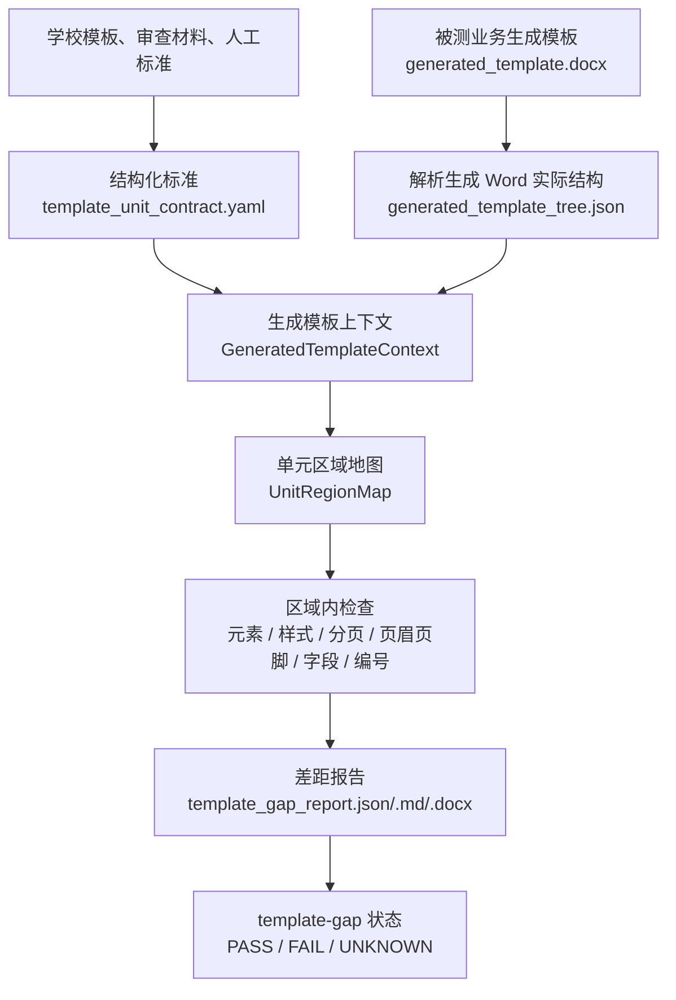

# 模板差距检查主线流程（最高指导文档）

日期：2026-06-20

## 这个文件是干嘛的

这个文件是“生成模板差距检查”方向的最高优先级主线文档。

后续凡是修改 `template-gap`、排查生成模板报告、解释 FAIL/UNKNOWN、重构检查器、
或调整相关测试，都必须先回到这份文档，确认当前问题属于哪个阶段、
这个阶段的职责是什么、输入输出是什么，再决定怎么改。

本文档只覆盖“生成模板 gap”这一条检查链路：用 `template_unit_contract.yaml`
检查被测 `generated_template.docx`，并输出 `generated_template_tree.json` 和
`template_gap_report.*`。完整流水线、coverage、内容放置、最终渲染和产品质量审计
不是本文档的主范围；只有它们消费 gap 输出时，本文档才说明交接边界。

它回答四件事：

1. 每个阶段应该做什么；
2. 每个阶段吃什么输入、产出什么文件或结果；
3. 当前代码大致是怎么实现的；
4. 当前问题主要卡在哪个环节，我们现在修复的是哪一层。

一句话概括当前判断：

```text
当前最该修的不是继续加搜索规则，而是先把 generated_template.docx 解析成稳定的文档上下文，
再基于这个上下文框定每个单元区域，最后在区域内做元素、样式、分页、页眉页脚、字段和编号检查。
```

## 文档地位和使用规则

这份文档的优先级：

- 在“生成模板差距检查”和 `template-gap` 相关工作中，它是最高优先级的流程主线。
- `SPEC.md` 仍然定义产品总语义、阶段边界和 gate 规则；签收的学校标准仍然定义学校事实。
- 如果具体实现、测试、报告、旧计划和本文档冲突，先以本文档的阶段职责和输入输出为准，
再决定是改实现、改测试、改报告，还是把冲突提交出来讨论。
- 如果发现本文档本身不准确，应该先修订本文档，再按修订后的主线改代码。

后续做任何相关修改前，必须先回答：

1. 这个问题属于哪个阶段？
2. 这个阶段的输入是什么？
3. 这个阶段应该产出什么？
4. 现在的问题是输入错、结构解析错、区域圈错、元素检查错、维度检查错，还是报告解释错？
5. 这次修改会改变哪个阶段的输入、输出或职责？

不允许的处理方式：

- 不先定位阶段，就直接在搜索函数里加规则；
- 不区分模板真差距、检查器证据不足、标准项归属问题，就直接改 PASS/FAIL/UNKNOWN；
- 不说明输入输出变化，就调整报告或测试；
- 让 `template_artifact.json` 或其他完整流水线产物替代独立 gap 的 `generated_template_tree.json`；
- 自动更新 signed standard、golden 或 expected snapshot 来消除失败。

## 总体主线



最重要的边界：

- `template_unit_contract.yaml` 是“应该长什么样”的标准。
- `generated_template.docx` 是“业务实际生成出来的 Word”，是唯一被测对象。
- `generated_template_tree.json` 是从被测 Word 解析出来的实际证据。
- `template_gap_report.*` 是本链路的检查结果，供人和下游 gate 使用，但不是标准。

## 相关目录树

```text
standards/  # 存放已签收标准、评测配置和期望产物，是“应该怎么检查”的来源。
  eval_profiles/real-core-v0/cases.yaml  # real-core-v0 配置文件；本范围只关心学校到 generated_template.docx 的绑定关系。
  schools/<school_id>/v1/  # 某个学校某个模板版本的签收标准目录。
    signed_standard.yaml  # 学校标准包入口，声明模板版本、合同文件、覆盖要求和防漂移规则。
    template_unit_contract.yaml  # 生成模板差距检查使用的结构化标准，说明各单元和元素应该长什么样。
test_inputs/  # 存放原始输入和当前阶段的生成模板 fixture，不存放检查结果。
  template_generation/school-*.docx  # 学校原始模板或格式要求来源，用来理解学校要求，不是 gap 的被测业务生成模板。
  template_gap/real-core-v0-<school_id>-generated-template.docx  # 当前阶段充当被测对象的虚拟业务生成模板。
src/docfit/  # DocFit 运行代码主目录；这里的 template-gap 是产品评测能力，不是测试辅助代码。
  cli/  # 命令入口；`docfit eval template-gap ...` 会调用下面的 gap 检查能力。
  convert/orchestrator.py  # template-gap 运行入口所在文件；本文件只关心 run_template_gap_eval 这条路径。
  harness/  # 产品评测能力代码；本范围只看生成模板 gap 直接使用的检查器和报告器。
    generated_template_inspector.py  # 产品解析能力；读取被测 generated_template.docx，解析出 generated_template_tree.json。
    generated_template_gap.py  # 产品检查能力；用 template_unit_contract.yaml 对照 generated_template_tree.json，生成差距报告和阻断状态。
tests/contract/  # 契约测试目录；这里不是产品运行入口，只验证 src/docfit/ 里的产品能力是否稳定。
  test_real_core_generated_template_gap.py  # template-gap 的主要回归测试；调用产品检查能力，覆盖 PASS、FAIL、UNKNOWN、字段、编号、页眉页脚等场景。
test_outputs/eval_runs/ 或显式 eval 输出目录/  # 每次评测运行写出的证据和报告目录。
  artifacts/  # 单次运行的机器证据目录，后续 gate 和人工排查都应优先看这里。
    generated_template.docx  # 本次评测实际检查的 Word 副本，用于固定被测对象和 hash。
    generated_template_tree.json  # 从被测 Word 解析出的实际结构证据，是 gap 检查的事实输入。
    template_gap_report.json  # 机器可读差距报告，包含每个检查项的 PASS、FAIL、UNKNOWN。
    template_gap_report.md  # 面向人阅读的 Markdown 差距报告。
    template_gap_report.docx  # 面向 Word 审阅场景的人读差距报告。
```

读这棵树时先记住文件身份：

- `test_inputs/template_generation/school-*.docx` 是学校原始模板，用来理解学校要求，不是 gap 的被测业务生成模板。
- `test_inputs/template_gap/*-generated-template.docx` 是当前阶段的虚拟业务生成模板输入；以后真正模板生成器跑通后，被测身份仍然叫 `generated_template.docx`。
- `generated_template_tree.json` 是从被测 Word 解析出来的实际证据，不是标准，也不是人工审查文本。
- `template_gap_report.*` 是检查结果，用来说明哪里通过、哪里失败、哪里还不能证明；它不能反过来当标准。
- `src/docfit/harness/generated_template_*` 里的代码是本范围直接使用的产品评测能力；`tests/contract/**` 只是调用这些能力，验证它们不会把 FAIL/UNKNOWN 误放成 PASS。
- `template_artifact.json`、`placement_plan.json`、`student_content_artifact.json`、`render_manifest.json` 属于完整流水线产物，不进入本文件的生成模板 gap 主线，也不能替代 `generated_template_tree.json`。

## 阶段一：整理学校标准

这个阶段做什么：

把学校模板和人工审查结论整理成机器能执行的结构化标准。

输入：

- 学校原始模板；
- 学校格式要求；
- 人工审查文本；
- 已签收的学校来源事实。

输出：

- `standards/schools/<school_id>/v1/template_unit_contract.yaml`

输出里应该包含：

- 有哪些单元，例如封面、声明、目录、中文摘要、英文摘要、正文、参考文献、致谢、附录、手工表单；
- 每个单元的顺序、是否必需、页面规则、页眉页脚规则；
- 每个单元里的元素；
- 每个元素是固定保留、学生填写、自动生成，还是手工处理；
- 样式、位置、来源说明。

当前实现：

- 标准文件已经有 `expected.units`；
- 每个 unit 下有 `elements`、`page`、`header_footer`、`element_order` 等字段；
- gap 检查会读取这些 expected units 作为验收标准。

当前问题：

- 有些标准项的归属不干净。比如南农 `acknowledgement` 下面混入了纸张、页边距、页眉、section、页码规则，这些是全局页面规则，不应该当成“致谢单元里的可见元素”去搜索。
- 标准里还没有明确区分“用于定位区域的锚点”和“用于验证内容的元素”。现在检查器只能从 fixed/manual 元素里临时挑搜索词。

现在修复的是哪一层：

这是标准解释层的问题。修复方向不是加搜索词，而是把标准项分流成：

- 单元可见内容；
- 全局页面和样式规则；
- 页眉页脚和页码规则；
- 审查备注或证据冲突说明。

## 阶段二：确定被测生成模板

这个阶段做什么：

明确 gap 检查到底在测哪个 Word 文件。

输入：

- eval profile 里的学校 case；
- CLI 显式传入的 `--generated-template`；
- 当前三校模拟业务生成模板。

输出：

- `artifacts/generated_template.docx`
- 报告里的被测文件路径和 sha256。

当前实现：

- `docfit eval template-gap` 会接收 `generated_template.docx`；
- real-core case 可以从 `standards/eval_profiles/real-core-v0/cases.yaml` 绑定三校模拟业务生成模板；
- gap 报告会把被测 Word 复制到 artifacts 目录并记录 hash。

当前问题：

- 这个边界之前容易混淆：学校原始模板、标准来源文件、业务生成模板看起来都是 Word，但产品身份不同。
- 如果误把 `school-*.docx` 当成 `generated_template.docx`，报告会看似能跑，但测的对象错了。

现在修复的是哪一层：

这是输入绑定层。这个方向已经基本明确：gap 只测 `generated_template.docx`，不测学校原始模板。

## 阶段三：解析被测 generated_template.docx

这个阶段做什么：

把业务生成出来的 Word 拆成可检查的实际结构。

输入：

- `generated_template.docx`

输出：

- `generated_template_tree.json`

输出里应该包含：

- 正文段落；
- 表格和表格单元格；
- 页眉页脚；
- Word 字段，例如 TOC、PAGE、PAGEREF、SEQ；
- 分节信息；
- 编号定义和编号引用；
- 当前解析器还不认识但可能可见的对象。

当前实现：

- `generated_template_inspector.py` 使用 `python-docx` 和 OOXML zip 解析 Word；
- 当前已经能抽出段落、表格、页眉页脚、字段、分节、编号等。

当前问题：

- 普通段落和表格段落使用的序号来源不一致。普通段落来自 `python-docx` 顶层段落序号，表格段落来自 OOXML 全文段落序号。两套坐标混用后，“单元范围”会不稳定。
- 页眉页脚被放进了和正文相同的可搜索列表，导致正文单元可能定位到 header/footer。
- 表格虽然被解析出来了，但后续没有优先作为“区域块”使用，而是被拆成普通文本参与搜索。

现在修复的是哪一层：

这是 Word 实际结构解析层。核心修复是统一文档坐标，并把正文、表格、页眉页脚、字段、section 分通道保存。

## 阶段四：建立生成模板上下文

这个阶段做什么：

把解析树整理成后续检查更容易使用的上下文。它不是报告最终结果，而是检查器内部需要的一张“地图”。

输入：

- `generated_template_tree.json`
- `template_unit_contract.yaml`

输出：

- `GeneratedTemplateContext`，也就是内部上下文对象。

它应该包含：

- 稳定的文档坐标；
- 正文节点索引；
- 表格块索引；
- 页眉页脚索引；
- section 范围；
- field 和 numbering 索引；
- 可用于定位单元的候选标题、样式、表格块和字段。

当前实现：

- 目前没有独立的上下文阶段；
- 当前代码更接近于：先调用 `iter_visible_text_entries()` 把可见文本压平，然后直接给 `_locate_units()` 搜索。

当前问题：

- 结构化信息已经存在，但使用得太晚；
- 在还没有形成文档区域地图之前，就开始全文搜索；
- 一旦搜索命中错了，后面元素、样式、分页、页眉页脚都会跟着错。

现在修复的是哪一层：

这是当前最关键的新层。应该先建 `GeneratedTemplateContext`，再进入单元定位。

## 阶段五：建立单元区域地图

这个阶段做什么：

判断标准里的每个单元，在被测 Word 里对应哪一段实际区域。

输入：

- `GeneratedTemplateContext`
- `expected.units`

输出：

- `UnitRegionMap`

每个单元至少应该记录：

- 是否定位到；
- 采用的区域；
- 候选区域；
- 为什么采用这个区域；
- 为什么拒绝其他候选；
- 区域来源是正文、表格、页眉页脚还是字段；
- 定位不明时，原因是什么。

当前实现：

- `_locate_units()` 会按标准顺序处理单元；
- 每个单元取前几个 fixed/manual 元素生成搜索词；
- 从当前游标之后找第一个命中；
- 本单元范围从命中位置到下一个单元命中位置之前。

当前问题：

- 这是当前 UNKNOWN 和误报高的主要来源。
- “第一个命中”不等于“正确区域”。
- 前面单元一旦定位错，后面的游标会连续带偏。
- 北大 `cover` 曾定位到后文；图目录、致谢曾定位到 header；湖南农业手工表单会被表格内部单元格串台。

现在修复的是哪一层：

这是 gap 检查器的区域建模层。我们现在最应该修的是这里，而不是在元素搜索里继续加小规则。

## 阶段六：在区域内检查元素

这个阶段做什么：

确认某个单元里应该有的元素，在该单元对应区域内是否存在。

输入：

- 某个单元的区域；
- 该单元的 expected elements；
- 该区域内的实际 Word 节点。

输出：

- 每个元素的存在性检查结果。

结果应该是：

- `PASS`：有证据存在；
- `FAIL`：有证据能判断确实缺失或不符合；
- `UNKNOWN`：当前证据不足，不能判断。

当前实现：

- 如果单元定位到了，就在单元范围内搜索元素；
- 如果单元没定位，下级元素会变成 UNKNOWN；
- fixed/manual 元素找不到时，容易报 missing。

当前问题：

- 如果单元区域本身错了，元素检查结果就不可信；
- 有些元素没有可靠可搜索文本，应该 UNKNOWN，而不是 FAIL；
- 有些元素是表格结构或填写槽位，不应该靠全文字符串判断。

现在修复的是哪一层：

这是元素检查层，但它应该排在区域地图之后。先把区域圈对，再判断元素是否存在。

## 阶段七：检查样式、分页、页眉页脚、字段和编号

这个阶段做什么：

在已确认的单元区域里检查非纯文本要求。

输入：

- 单元区域；
- 元素命中的实际节点；
- Word 的样式、section、field、numbering、header/footer 信息；
- 标准里的页面和格式要求。

输出：

- 样式检查结果；
- 分页检查结果；
- 页眉页脚检查结果；
- 字段检查结果；
- 编号检查结果。

当前实现：

- 样式检查会读取 OOXML 字体、字号、加粗、对齐、行距和样式继承；
- 字段检查会找 TOC、PAGE、PAGEREF、SEQ 等；
- 页眉页脚和分页检查会结合 section 和单元位置。

当前问题：

- 这些检查都依赖单元位置。单元区域错了，维度检查会看似有证据，实际是在错区域上报错。
- 页眉页脚既需要独立检查，又不能污染正文单元定位。
- 分页和 section 规则需要区分“明确不符合”和“当前证据不足”。

现在修复的是哪一层：

这是维度检查层。它需要等区域建模层稳定后再细化，否则会继续制造难解释的 FAIL 和 UNKNOWN。

## 阶段八：生成差距报告

这个阶段做什么：

把所有检查结果整理成人和机器都能读的报告。

输入：

- 输入文件检查结果；
- 单元定位结果；
- 元素检查结果；
- 样式、分页、页眉页脚、字段、编号检查结果；
- 未建模可见对象。

输出：

- `template_gap_report.json`
- `template_gap_report.md`
- `template_gap_report.docx`

当前实现：

- 报告已经有 `summary`、`units`、`global_checks`、`unmodeled_objects`；
- 每个单元有 `located`、`presence`、`elements`、`dimensions`。

当前问题：

- 报告还没有把 `region_map` 作为一等内容展示；
- 人看到元素 FAIL/UNKNOWN 时，不容易先判断“区域是否圈对”；
- 报告没有充分区分三类问题：
  - 生成模板确实不符合；
  - 检查器证据不足；
  - 标准项归属或建模方式不对。

现在修复的是哪一层：

这是报告解释层。下一步应该让报告先展示区域地图，再展示区域内检查。

## 现在修复工作的分层

当前讨论的修复不应该混在一起看。可以按下面几层分：

| 层 | 修什么 | 是否当前重点 |
| --- | --- | --- |
| 输入绑定层 | 确认 gap 测的是 `generated_template.docx`，不是学校原始模板 | 已基本明确 |
| Word 结构解析层 | 统一文档坐标，正文、表格、页眉页脚、字段、section 分通道建索引 | 当前重点 |
| 区域建模层 | 建 `GeneratedTemplateContext` 和 `UnitRegionMap`，先框定单元区域 | 当前最重点 |
| 元素检查层 | 只在单元区域内检查元素；无可靠证据时 UNKNOWN | 区域稳定后做 |
| 维度检查层 | 样式、分页、页眉页脚、字段、编号按区域检查 | 区域稳定后做 |
| 标准解释层 | 把单元内容和全局页面规则分流 | 需要同步做 |
| 报告解释层 | 报告先展示区域地图，再展示元素和维度检查 | 当前重点 |

## 当前推荐的修复顺序

1. 统一 Word 文档坐标，避免普通段落、表格段落、section、field 用不同序号互相比较。
2. 把正文、表格、页眉页脚、字段、编号分成不同通道，不再用一个扁平文本列表承载全部含义。
3. 建 `GeneratedTemplateContext`，让检查器先拥有完整地图。
4. 建 `UnitRegionMap`，每个单元先输出候选区域、采用区域和拒绝原因。
5. 元素检查改成只在确认区域内运行；区域不明时下级 UNKNOWN。
6. 南农这类全局规则从单元元素里分流出去，进入全局页面/样式/页眉页脚检查。
7. 报告新增区域地图，让人先判断“圈得对不对”，再看元素和样式是否真错。

## 哪些事情暂时不应该作为主修复

- 不应该为了减少 UNKNOWN，把 UNKNOWN 改成 PASS 或 FAIL。
- 不应该继续在搜索函数里堆学校专用词表。
- 不应该把页眉页脚从搜索里删掉就算完成；它们仍要独立检查。
- 不应该让 `template_artifact.json` 替代 `generated_template_tree.json`。
- 不应该自动修改 signed standard、golden 或 expected snapshot。
- 不应该把这次修复理解成“实现真正模板生成器”；当前修的是检查器和报告解释。

## 讨论时可以按这几个问题推进

1. 每个学校的标准里，哪些内容是单元可见内容，哪些是全局页面/样式规则？
2. `generated_template_tree.json` 需要补哪些坐标字段，才能稳定框定区域？
3. 表格块应该如何作为区域参与单元定位？
4. 页眉页脚应该如何既独立检查，又不污染正文单元定位？
5. `region_map` 在报告里应该展示到什么细度，才能让人判断检查器是否圈对？
