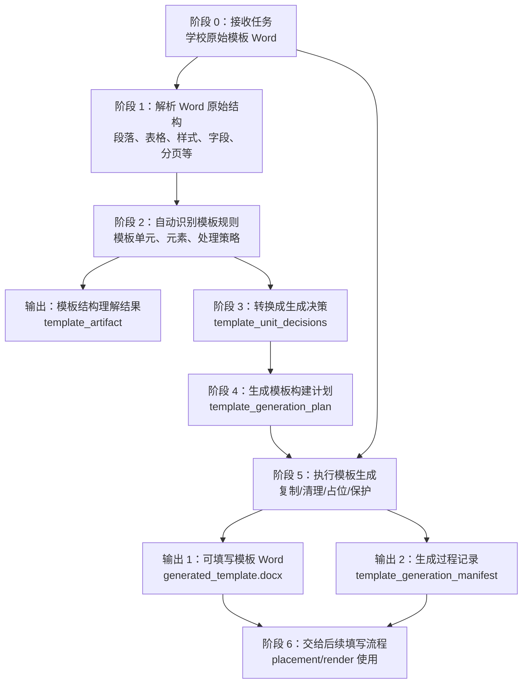
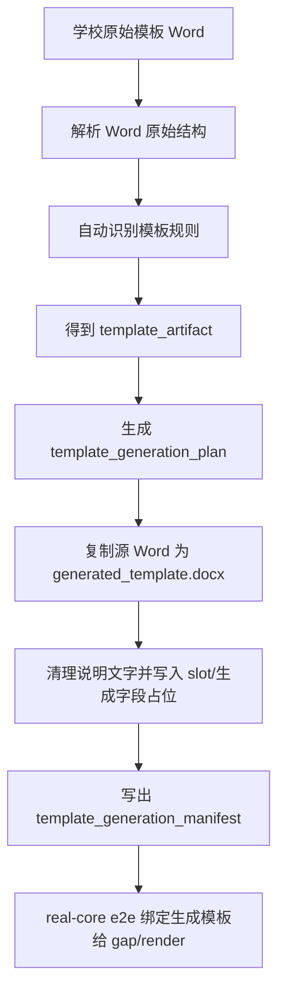

# 模板生成主线流程定义

日期：2026-06-20

这份文档是后续讨论“模板生成器”业务流程的基准。它只讨论这一条主线：

```text
输入学校原始模板 Word -> 生成可供后续填写的学校模板 Word
```

这里的“可供填写模板”不是最终学生论文成品。它是一份中间 Word 文件：学校固定内容、固定表单、标题结构、可写位置和占位标记已经准备好，后续内容放置阶段可以把学生论文内容填进去。

本文档先不讨论生成得准不准，也不把重点放在测试。重点是把大框架讲清楚：

- 整个流程分成哪些阶段；
- 每个阶段要做什么；
- 每个阶段输入什么；
- 每个阶段输出什么；
- 中间关键对象是什么意思；
- 当前代码能复用什么，还缺什么。

## 当前仓库证据快照

读这份文档时，先按当前仓库事实把“已经有的检查能力”和“还没实现的生成能力”分开：

| 事项 | 当前状态 | 证据位置 |
| --- | --- | --- |
| 生成模板 CLI | 已有完整阶段入口 | `src/docfit/cli/main.py` 现在有 `docfit eval template-generate --template ... --out ...`；开发期可加 `--school <school_id>`，用签名标准里的 `expected.units` 对齐生成 |
| 模板生成阶段 | 已有完整证据链 | `src/docfit/stages/template_generate/runner.py` 会写出 `source_template_tree.json`、`discovered_template_rules.json`、`template_artifact.json`、`template_unit_decisions.json`、`template_generation_plan.json`、`generated_template.docx` 和 `template_generation_manifest.json` |
| 学校原始模板解析 | 已有一部分 | `src/docfit/stages/template_parse/runner.py` 能读取段落、样式，并为真实学校结合人工整理样本生成 `template_artifact` |
| 生成模板差距检查 | 已有一部分 | `src/docfit/harness/generated_template_inspector.py` 解析传入的 Word；`src/docfit/harness/generated_template_gap.py` 写出 `generated_template_tree.json` 和 `template_gap_report.*` |
| 当前三校被测生成模板 | template/e2e run 已测本次生成物 | `src/docfit/convert/orchestrator.py` 会先写出 `template_generation/generated_template.docx`，再把这份 Word 交给 `template-gap`；`inputs/simulated-generated-templates/**` 仍保留为显式 `template-gap` fixture，不是已验收的生成器输出 |
| 后续 placement/render 使用生成模板 | 已接通真实学校 e2e | real-core e2e 会把 `template_artifact.provenance.template_docx` 绑定到本次生成的 `generated_template.docx`，后续 render 不再直接复制学校原始模板 |

所以，本文档里的“目标流程”已经在独立 `template-generate` 命令里形成完整阶段产物链：

```text
学校原始模板 Word
-> source_template_tree
-> discovered_template_rules
-> template_artifact
-> template_unit_decisions
-> template_generation_plan
-> generated_template.docx + template_generation_manifest
```

它证明系统已经有真实生成入口、核心 Word 产物和阶段证据链，但还不能说明生成模板符合学校标准。
正式质量判断仍要把输出交给 `template-gap` 和后续四阶段 gate。

当前开发期还有一条带学校标准的路径：

```text
学校原始模板 Word + --school <school_id>
-> 读取该学校签名标准里的 expected.units
-> 把标准里的 fixed / fill / generated / manual_only 元素对齐到源 Word
-> 生成带 DocFit 槽位和生成标记的 generated_template.docx
-> 交给 template-gap 检查真实 Word 是否符合签名标准
```

这条路径不是最终产品要求用户提供额外文件；它使用仓库里已签收的开发期标准，
目的是让生成器按真实学校验收口径暴露差距。最新三校 probe 仍是 `FAIL`：
湖南农业大学 `PASS/FAIL/UNKNOWN = 145/21/128`，南农 `79/26/100`，
北大 `86/32/34`。这说明当前生成器已经能产出可检查 Word 和明确证据，
但还没有达到学校模板质量。

当前生成器已经会合成一小类缺失可见文本：当签名标准要求单元标题，但源 Word
只提供短标题时，会把标准标题插回该单元锚点附近。例如湖南成绩评定表会补出
“湖南农业大学全日制普通本科生毕业论文（设计）；成绩评定表”。这只用于可见标题，
不会把页眉、页码、样式、section 或验收说明写进 Word。

## 读文档前先分清四类东西

文档里会出现很多名字。**先别把它们都当成“用户要上传/下载的文件”。** 按下面四类理解最不容易混：

| 类型 | 是什么 | 举例 |
| --- | --- | --- |
| `[用户文件]` | 用户上传，或系统明确从磁盘读入的真实文件 | 学校原始模板 Word |
| `[系统运行参数]` | 开发者或运行环境指定的配置；不是学校模板内容，也不是学校规则 | `out_dir`、`generation_options` |
| `[内存对象]` | 各阶段在程序里传递的数据结构；默认只在内存里流转 | `template_generation_request`、`source_template_tree`、`template_artifact` |
| `[磁盘产物]` | 写到 `out_dir` 的文件；分“核心业务产物”和“排查/检查产物” | `generated_template.docx`、`template_generation_manifest` |

从**用户视角**，生产环境里通常只上传 **1 份学校原始模板 Word**。

从**系统视角**，Word 模板生成要拆成多步，所以中间名字会很多。这些名字主要是 **流水线工序和工序记录**，不是要求用户再准备很多输入文件。

后面字段注释里会用 `[用户文件]`、`[系统运行参数]`、`[内存对象]`、`[磁盘产物·核心]`、`[磁盘产物·可选]` 标记，方便快速判断“这是文件还是对象”。

### 用户真正关心的最终交付

模板生成主线跑完后，业务上最重要的磁盘产物通常只有两个：

```text
generated_template.docx          # [磁盘产物·核心] 可填写模板 Word
template_generation_manifest     # [磁盘产物·核心] 这次怎么生成出来的记录
```

其余如 `source_template_tree`、`template_artifact`、`template_unit_decisions`、`template_generation_plan` 等，业务上是阶段间传递对象；当前 CLI 会把它们落成 JSON，方便调试、回归和解释失败。

阶段 7 的检查报告（如 `template_gap_report.json`）属于 `[磁盘产物·可选]`，用于验证和排查，不是模板生成主线的必需输入。

## 一句话目标

模板生成器要把“学校给的原始模板或格式说明 Word”加工成“DocFit 后续流程可以稳定填写的目标模板 Word”。

它不是简单复制文件。它要完成四件事：

1. 解析学校原始 Word 的真实结构。
2. 从原始 Word 自动识别出模板规则。
3. 决定每个模板单元在目标模板里怎么处理。
4. 根据这些处理决定，生成一份新的 `generated_template.docx`。

## 总流程图



图里带 `template_` 前缀的名字，多数是 `[内存对象]`（阶段间传递）；只有 `generated_template.docx` 和 `template_generation_manifest` 是阶段 5 写出的 `[磁盘产物·核心]`。

## 关键定义

### 学校原始模板 Word

`[用户文件]` 学校原始模板 Word 是学校给的输入文件，也是生产环境里唯一的业务输入。

它可能是真正的空白模板，也可能是格式说明、示例、固定表单和说明文字混在一起的 Word。它不是系统最终要拿来直接填学生内容的目标模板。

在代码和标准包里，它通常对应：

```text
source.template_docx
```

例如湖南农业大学当前绑定的是：

```text
inputs/school-hunannongye-requirement.docx
```

### 学校模板规则

这里需要分清两个概念：

```text
生产目标里的学校模板规则
当前开发阶段的人工整理规则
```

生产目标里，学校模板规则不是用户预先提供的文件。用户只上传一份学校原始模板 Word，系统要从这份 Word 里自动识别、整理并生成模板规则。

所以生产目标链路应该是：

```text
学校原始模板 Word
-> 自动解析 Word 结构
-> 自动识别模板单元和模板元素
-> 自动判断固定内容、可填写内容、生成内容、手填内容
-> 形成系统内部的模板规则
-> 根据模板规则生成可填写模板
```

这份“模板规则”在生产里应该是 `[内存对象]`（必要时 `[磁盘产物·可选]` 写成 JSON/YAML 方便排查），而不是用户输入。它的来源必须是上传的学校原始模板 Word。

建议把生产里的中间产物叫：

```text
template_rules
```

或者更具体一点：

```text
discovered_template_rules
```

它应该描述：

- 学校模板有哪些单元；
- 每个单元的顺序是什么；
- 每个单元包含哪些元素；
- 哪些元素是固定内容；
- 哪些元素需要后续填写；
- 哪些元素由系统生成；
- 哪些页面、表格或固定表单应该整体保留；
- 哪些说明文字不应该进入最终目标模板；
- 哪些地方系统没有把握，需要人工确认或后续改进。

#### 当前三校人工文件是什么

`[磁盘产物·可选·开发期]` 当前仓库里的：

```text
standards/schools/<school_id>/v1/template_unit_contract.yaml
```

不是生产输入。

它是开发阶段为了先跑通三所学校而准备的“人工整理样本”。可以把它理解成：

```text
我们希望系统未来能自动识别出来的模板规则答案样本
```

它的价值是：

- 帮我们定义模板规则应该长什么样；
- 帮我们理解学校模板里有哪些单元和元素；
- 帮我们验证自动识别结果是否接近人工整理结果；
- 在自动识别器还没做出来之前，临时代替自动识别结果，让后续流程先跑起来。

但生产上线后，用户不会提供这个文件，也不能要求用户提供这个文件。

#### 当前开发输入和生产输入的区别

当前开发阶段，为了三所学校先跑通，实际读入的是：

```text
学校原始模板 Word                              # [用户文件]
+ 人工整理的 template_unit_contract.yaml       # [磁盘产物·可选·开发期] 参照样本，不是生产输入
```

在 CLI 上，这对应：

```bash
uv run docfit eval template-generate --school hunannongye --template inputs/school-hunannongye-requirement.docx --out /tmp/docfit_template_generate_hunannongye
```

生产目标必须收敛成：

```text
学校原始模板 Word                              # [用户文件] 仅此一份
```

因此文档后面如果提到 `template_unit_contract.yaml`，都应该理解成当前开发阶段的参照物，不是最终产品输入。

#### 后续代码应该怎么变

为了符合生产目标，需要在现有流程前半段补一个“模板规则识别”能力：

```text
source_template_docx
-> inspect_source_template_docx
-> infer_template_rules
-> discovered_template_rules
```

它要做的事情包括：

- 读取 Word 段落、表格、图片、字段、分页符、分节符、页眉页脚；
- 根据标题、位置、样式、表格结构、关键词识别模板单元；
- 判断封面、目录、摘要、正文、参考文献、附录、固定表单等单元；
- 判断每个元素是固定、可填写、生成、手填还是说明文字；
- 生成 `slots`、`protected_zones`、`fixed_blocks`、`instruction_text_policy`；
- 对不确定的内容打上 `UNKNOWN` 或 `needs_review`，不能静默跳过。

当前代码还没有这个自动识别阶段。

当前代码已有的是：

```text
读取人工整理的 template_unit_contract.yaml
-> 把里面的审查文本解析成 units/elements
-> 放进 template_artifact
```

这条临时链路可以帮助我们开发，但不能作为生产链路的终点。

### 模板单元

模板单元是模板生成器的核心业务处理单位。

典型模板单元包括：

```text
封面
诚信声明
目录
中文摘要
英文摘要
正文
参考文献
致谢
附录
后置固定表单
```

后续讨论“复制封面”时，准确说法应该是：

```text
复制 cover 这个模板单元
```

而不是：

```text
复制第 1 页
```

原因是 Word 文件里没有稳定的“第 1 页对象”。页面是 Word 打开文档后根据字体、纸张、边距、段落、表格、图片、分页符等动态排出来的结果。代码真正能稳定复制的是段落、表格、图片、字段、分页符、分节符和底层 OOXML 节点范围。

### 模板元素

模板元素是模板单元里面更小的内容项。

以封面为例，模板元素可能是：

```text
学校名称
论文类型标题
中文题名
英文题名
学生基本信息
地点
提交日期
```

每个元素要有处理策略。常见策略包括：

- `fixed`：固定内容，目标模板里保留；
- `fillable`：后续需要填写；
- `generated`：后续由系统生成，例如目录、页码、编号；
- `manual_only`：只保留人工填写位置，系统不自动填；
- `remove_instruction`：只是格式说明，目标模板里不应该出现。

### 可写位置

可写位置是后续阶段可以写入学生内容或学生信息的位置。

在代码里常叫：

```text
slot
```

例如：

```text
slot_body_start
```

表示学生正文内容应该从这个位置开始写入。

### 固定区域

固定区域是后续学生内容不能覆盖的区域。

例如：

- 封面上的学校固定标题；
- 诚信声明正文；
- 后置审批表；
- 成绩评定表；
- 学校要求保留的签字栏。

在结构化结果里可以表达为：

```text
protected_zones
```

### 可填写模板 Word

`[磁盘产物·核心]` 可填写模板 Word 是模板生成器的核心输出。

它应该叫：

```text
generated_template.docx
```

它不是手工准备好的假输入，而应该由模板生成器根据学校原始模板和规则生成出来。

当前启发式实现仍可粗糙，但必须满足：

- 是真实可打开的 Word；
- 来源能追溯到学校原始模板；
- 包含后续能定位的可写位置；
- 包含生成过程记录；
- 后续流程不需要再直接依赖学校原始模板。

### 生成过程记录

`[磁盘产物·核心]` 生成过程记录用来说明 `generated_template.docx` 是怎么来的。

建议叫：

```text
template_generation_manifest
```

它不判断对错，只记录事实：

- 输入是哪份学校原始模板；
- 使用了哪个学校规则；
- 使用了哪个 `template_artifact`；
- 采用了什么生成策略；
- 输出 Word 在哪里；
- 执行了哪些动作；
- 哪些动作暂时没有真正实现；
- 生成模板里有哪些可写位置。

## 阶段 0：接收模板生成任务

### 全流程对象一览

读各阶段细节前，可以先看这张总表：

| 名字 | 类型 | 出现在哪 | 是否用户需要提供 | 当前 CLI 是否落盘 |
| --- | --- | --- | --- | --- |
| 学校原始模板 Word | `[用户文件]` | 阶段 0 输入 | 是 | 否（用户自己保存） |
| `out_dir` | `[系统运行参数]` | 阶段 0 输入 | 否 | 否 |
| `generation_options` | `[系统运行参数]` | 阶段 0/2/3 输入 | 否 | 否 |
| `template_generation_request` | `[内存对象]` | 阶段 0 输出 → 阶段 1 输入 | 否 | 是 |
| `source_template_tree` | `[内存对象]` | 阶段 1 输出 → 阶段 2 输入 | 否 | 是 |
| `template_artifact` | `[内存对象]` | 阶段 2 输出 → 阶段 3~6 输入 | 否 | 是 |
| `discovered_template_rules` | `[内存对象]` | 阶段 2 输出 | 否 | 是 |
| `template_unit_decisions` | `[内存对象]` | 阶段 3 输出 → 阶段 4 输入 | 否 | 是 |
| `template_generation_plan` | `[内存对象]` | 阶段 4 输出 → 阶段 5 输入 | 否 | 是 |
| `generated_template.docx` | `[磁盘产物·核心]` | 阶段 5 输出 → 阶段 6/7 输入 | 否（系统生成） | 是 |
| `template_generation_manifest` | `[磁盘产物·核心]` | 阶段 5 输出 → 阶段 6 输入 | 否（系统生成） | 是 |
| `template_gap_report.*` 等 | `[磁盘产物·可选]` | 阶段 7 输出 | 否 | 否 |

### 这一阶段做什么

接收用户上传的学校原始模板 Word，并创建一次模板生成任务。

生产目标里，这一阶段的业务输入只有一个：

```text
学校原始模板 Word
```

系统可以有运行参数，例如输出目录、生成策略、任务 ID。这些都属于 `[系统运行参数]`，不是学校模板规则，也不是用户额外上传的文件。

### 输入

下面三项里，只有第一项是用户提供的 `[用户文件]`；后两项是 `[系统运行参数]`。

```text
source_template_docx    # [用户文件] 学校原始模板 Word 路径；生产环境里唯一的业务输入
out_dir                 # [系统运行参数] 本次任务产物目录；告诉系统“写到哪里”
generation_options      # [系统运行参数] 生成策略配置；告诉系统“怎么跑”，不是学校模板里有什么
```

示例：

```text
source_template_docx = /uploads/school-template.docx      # [用户文件] 用户上传的学校模板 Word
out_dir = /tmp/docfit_template_generate                   # [系统运行参数] 本次运行所有产物的基础目录
generation_options.strategy = source_copy_scaffold        # [系统运行参数] 当前策略：先整份复制源 Word，再做确定性改造
```

### 输出

```text
template_generation_request    # [内存对象] 不是用户上传的新文件，也不是默认落盘的 JSON
```

它表示一次明确的模板生成任务，可以理解成一张 **任务单**：把阶段 0 收到的路径、目录、策略等参数打包，传给阶段 1~5，避免每个阶段各传各的参数。

建议结构：

```text
template_generation_request           # [内存对象] 系统内部任务单；默认只在内存里传递
  source_template_docx                 # [用户文件·路径引用] 指向学校原始 Word；阶段 1 会按此路径打开文件
  source_template_hash                 # [内存对象] 源 Word 的 hash；确认后续阶段处理的是同一份文件
  out_dir                              # [系统运行参数] 本次任务输出目录
  strategy                             # [系统运行参数] 本次生成策略，例如 source_copy_scaffold
  created_at                           # [系统运行参数] 任务创建时间；方便追踪“这次运行的产物来自哪次执行”
  optional_labels                      # [系统运行参数] 可选标签，如学校名、任务名；只做标记，不是模板规则
```

### 中间怎么实现

当前可以从 CLI 入口接收参数：

```text
docfit eval template-generate --template /path/to/school-template.docx --out /tmp/docfit_template_generate
```

这个 CLI 现在会跑完整模板生成阶段。当前自动识别和清理仍是确定性启发式，
不是人工签收标准；生成质量要继续交给 `template-gap` 检查。

## 阶段 1：解析 Word 原始结构

### 这一阶段做什么

系统打开学校原始模板 Word，把 Word 里的原始结构读出来。

这一步还不判断“封面是什么”“正文在哪里”。它只是把 Word 变成后续可以分析的结构树。

### 输入

```text
template_generation_request    # [内存对象] 阶段 0 产出的任务单；不是学校提供的第二个文件
```

`template_generation_request` 不是学校提供的另一个 Word 或 YAML。它是系统在阶段 0 创建的任务单，记录了这次要处理哪份 Word、输出到哪里、使用什么生成策略。

其中至少包含：

```text
source_template_docx    # [用户文件·路径引用] 真正的学校原始模板 Word 路径
```

`source_template_docx` 才是磁盘上的学校原始模板 Word。阶段 1 会根据这个路径打开 Word。

两者关系是：

```text
template_generation_request              # [内存对象] 任务单
  source_template_docx = /uploads/school-template.docx    # [用户文件·路径引用]
```

也就是说，阶段 1 **不是**接收两个学校文件，而是接收一张 `[内存对象]` 任务单；任务单里指向一份 `[用户文件]`。

### 处理内容

这一阶段要读取 Word 里的：

```text
段落
表格
图片
样式
字段
编号
分页符
分节符
页眉页脚
可见文本
复杂对象
```

这一步要尽量保留源位置信息，例如：

```text
word/document.xml:p[12]
word/document.xml:tbl[3]
word/header1.xml:p[2]
```

这些位置后面会用于复制、删除、占位和生成记录。

### 全局内容和页面元素怎么区分

阶段 1 读取 Word 时，不能只读“看得见的文字”。它要先按 DOCX 包结构把信息分层。

建议分成四类：

```text
包级/全局规则
section 级页面规则
页眉页脚内容
正文流里的可见元素
```

#### 包级/全局规则

这类内容不是某一页里的正文元素，而是整份 Word 的公共定义。

典型包括：

```text
word/styles.xml          样式定义
word/numbering.xml       编号定义
word/_rels/*.rels        图片、页眉页脚、外部关系
word/settings.xml        文档设置
word/theme/*             主题字体和主题颜色
word/media/*             图片资源
```

它们通常不直接作为模板单元复制，而是给正文段落、表格、标题、目录、页码等元素提供格式依据。

例如：

```text
某个段落引用了 style_id = Heading1
-> Heading1 的详细字体/段前段后/大纲级别来自 styles.xml
```

再例如：

```text
某个段落引用了 numId = 3
-> numId = 3 的编号格式来自 numbering.xml
```

#### section 级页面规则

Word 的页边距、页码格式、页眉页脚引用，很多时候不是整份文档唯一一套，而是挂在 section 上。

section 可以理解成 Word 的“页面规则分段”，它可能控制：

```text
纸张大小
页边距
页眉页脚距离
页码格式
页码起始值
是否换节
本节使用哪个 header/footer
```

这些信息不是正文元素，但会影响某个范围内正文如何显示。

所以阶段 1 要记录：

```text
section 从哪里开始
section 使用哪些 header/footer
section 的页边距和页码规则是什么
```

#### 页眉页脚内容

页眉页脚不是正文段落，也不是全局配置。它们是单独的 Word part，例如：

```text
word/header1.xml
word/footer1.xml
```

阶段 1 应该把它们单独读出来，并通过 section 关系知道哪个 section 使用它们。

也就是说：

```text
header1.xml 里的文字
```

不能简单当成正文第 N 段；它应该归到：

```text
headers_footers
```

#### 正文流里的可见元素

正文流主要来自：

```text
word/document.xml
```

这里面包含：

```text
段落
表格
图片引用
目录字段
页码字段
分页符
分节符
正文中的说明文字
```

这些才是后续切分模板单元时最主要的候选内容。

例如封面、诚信声明、目录标题、摘要标签、固定表单，大多都从正文流或表格流里识别。

#### 当前代码能区分到什么程度

当前有两套能力：

- `template_parse/runner.py`：比较粗，主要读取段落和样式，真实学校还依赖人工整理样本补出 units；
- `generated_template_inspector.py`：更细，能把正文段落/表格、页眉页脚、字段、分页/分节、section、编号定义分开读。

所以答案是：

```text
当前已有代码能按 OOXML 位置区分“正文流”和“全局/section/页眉页脚信息”；
但还没有生产级地把这些信息自动归纳成“哪些是模板单元，哪些是全局模板规则”。
```

生产目标里，阶段 1 只负责分层读取；阶段 2 才负责根据这些分层信息判断“这是全局规则”还是“这是页面里的模板元素”。

### 输出

```text
source_template_tree    # [内存对象] Word 结构树；当前 CLI 也会落盘为 source_template_tree.json
```

这是阶段 1 的加工结果，不是用户上传的文件。当前命令会写成 JSON，供后续排查“源 Word 里到底有哪些段落、表格、页眉页脚、字段和编号证据”。

建议结构：

```text
source_template_tree
  metadata
  layers
    package_global
    section_rules
    header_footer
    body_flow
    embedded_resources
    unknown_objects
  indexes
  warnings
```

#### metadata

`metadata` 记录这次解析的是哪份 Word，以及这份 Word 的基本状态。

```text
metadata
  source_template_docx
  source_template_hash
  input_exists
  input_valid_docx
  created_at
```

#### layers.package_global

`package_global` 放整份 Word 的全局定义。它们不是某一页上的正文内容。

```text
layers.package_global
  styles
    structure_layer = package_global
    kind = style_definition
    source_ref = word/styles.xml:style[Heading1]
    style_id
    name
    type
    font
    paragraph

  numbering_definitions
    structure_layer = package_global
    kind = numbering_definition
    source_ref = word/numbering.xml:num[3]
    num_id
    abstract_num_id
    levels

  document_settings
    structure_layer = package_global
    kind = document_settings
    source_ref = word/settings.xml
```

这层给后续解释格式用。例如正文段落只说自己用了 `Heading1`，真正的字体、字号、段前段后要到 `package_global.styles` 里查。

#### layers.section_rules

`section_rules` 放分节级页面规则。它们决定某一段范围内的页面设置。

```text
layers.section_rules
  - structure_layer = section_rule
    kind = section
    section_id
    source_ref = word/document.xml:p[30]/sectPr
    paragraph_index = 30
    page_margins
    page_numbering
    header_footer_refs
    effective_references
```

这层用于回答：

- 哪一段开始换节；
- 页边距是什么；
- 页码格式是什么；
- 本节使用哪个页眉页脚。

#### layers.header_footer

`header_footer` 放页眉页脚里的可见内容。

```text
layers.header_footer
  - structure_layer = header_footer
    kind = header
    part_name = word/header1.xml
    source_ref = word/header1.xml
    text
    fields
```

页眉页脚不能混进 `body_flow`。后续阶段要通过 `section_rules.header_footer_refs` 判断它作用在哪些 section 上。

#### layers.body_flow

`body_flow` 放正文主文档流里的有序对象。后续识别封面、目录、摘要、正文、固定表单，主要看这一层。

这里要注意：`body_flow` 不应该只放“有文字的段落和表格”。分页符、分节符、字段、图片引用也应该作为一等流节点出现。原因是它们虽然不一定有可见文字，但对阶段 2 切分模板单元非常重要。

例如分页符可能意味着：

```text
封面结束
诚信声明另起页
目录结束后正文从下一页开始
后置固定表单另起页
```

所以分页符不应该只藏在 `paragraph.breaks` 里。它应该同时有自己的流节点，并且记录它嵌在哪个段落里。

```text
layers.body_flow
  - structure_layer = body_flow
    flow_item_type = paragraph
    kind = paragraph
    source_ref = word/document.xml:p[12]
    order = 12
    text
    style_id
    style_details

  - structure_layer = body_flow
    flow_item_type = page_break
    kind = break
    source_ref = word/document.xml:p[12]/br[1]
    order = 12.1
    parent_ref = word/document.xml:p[12]
    break_type = page
    boundary_signal = true

  - structure_layer = body_flow
    flow_item_type = section_break
    kind = section_properties
    source_ref = word/document.xml:p[30]/sectPr
    order = 30.1
    parent_ref = word/document.xml:p[30]
    section_id
    boundary_signal = true

  - structure_layer = body_flow
    flow_item_type = field
    kind = complexField
    source_ref = word/document.xml:p[40]/field[1]
    order = 40.1
    parent_ref = word/document.xml:p[40]
    field_type = TOC
    instruction

  - structure_layer = body_flow
    flow_item_type = table
    kind = table
    source_ref = word/document.xml:tbl[3]
    order
    first_paragraph_index
    last_paragraph_index
    cells

  - structure_layer = body_flow
    flow_item_type = drawing
    kind = drawing
    source_ref = word/document.xml:p[20]/drawing[1]
    order = 20.1
    parent_ref = word/document.xml:p[20]
    relationship_id
    target
```

这层里仍然只是“原始结构”。例如一个段落文本是“目  录”，阶段 1 只记录它是正文流里的段落；阶段 2 才判断它是目录单元标题。

对阶段 2 来说，`boundary_signal = true` 的节点要重点使用。它们是模板单元切分的强信号，但不是绝对规则。例如：

- 段落里的普通换行符不一定代表新单元；
- page break 通常是强边界，但也可能只是表单内部换页；
- section break 通常是页面规则变化，也可能是模板单元边界；
- TOC 字段通常提示目录单元；
- header/footer 引用变化要结合 `section_rules` 判断影响范围。

#### layers.embedded_resources

`embedded_resources` 放图片等嵌入资源本身。

```text
layers.embedded_resources
  - structure_layer = embedded_resource
    kind = image
    part_name = word/media/image1.png
    content_type
    sha256
```

正文流里的图片引用和这里的图片资源要能通过 relationship 对上。

#### layers.unknown_objects

`unknown_objects` 放当前还不能稳定解释的可见对象。

```text
layers.unknown_objects
  - structure_layer = unknown_object
    kind
    source_ref
    reason
    visible
```

这层很重要。不能因为解析不了就静默丢掉，后续要决定保留、人工确认，或者作为不支持能力记录。

#### indexes

`indexes` 是为了让后续阶段快速查找，不是新的业务内容。

```text
indexes
  by_source_ref
  body_order
  section_by_paragraph
  style_by_id
  numbering_by_id
  relationship_targets
```

#### warnings

`warnings` 记录阶段 1 解析时发现但还没处理的问题。

```text
warnings
  - code
    message
    source_ref
    severity
```

例如：

```text
无法解析某个 embedded object
某个 relationship 指向的图片缺失
某个 section 引用了不存在的 header
```

### 阶段 1 最优传递形式

阶段 1 给阶段 2 的输出，不应该只是很多分散数组，例如 `paragraphs`、`tables`、`breaks` 各放一份。这样阶段 2 很难恢复原始顺序，也很难判断单元边界。

更好的形式是：

```text
一份分层结构
+ 一条正文有序流
+ 一组全局字典
+ 一组关系索引
+ 一组结构信号
```

#### 1. 保留原始事实，不提前下业务结论

阶段 1 可以说：

```text
这是正文流第 12 个段落
它居中
它使用某个标题样式
它后面有分页符
```

但阶段 1 不应该直接说：

```text
这是封面标题
这是目录单元
这是摘要正文
```

这些业务判断留给阶段 2。

#### 2. 每个节点都要有统一基础字段

无论是段落、表格、分页符、字段还是图片引用，都应该带这些基础字段：

```text
node_id
structure_layer
flow_item_type
kind
source_ref
part_name
order
parent_ref
container_ref
visible
text
```

字段含义：

- `node_id`：系统内部稳定 ID，方便后续动作引用；
- `structure_layer`：属于哪个结构层，例如 `body_flow`、`section_rule`；
- `flow_item_type`：在正文流里的对象类型，例如 `paragraph`、`table`、`page_break`；
- `source_ref`：真实 OOXML 来源位置；
- `part_name`：来自哪个 Word part，例如 `word/document.xml`；
- `order`：在所在流里的顺序；
- `parent_ref`：如果它嵌在段落、表格单元格里，记录父节点；
- `container_ref`：如果它属于表格、页眉、页脚或文本框，记录容器；
- `visible`：是否有可见内容或可见影响；
- `text`：有文字时保留原文。

带注释的段落节点示例：

```jsonc
{
  "node_id": "body_0012",                 // 系统给这个节点分配的稳定 ID，后续复制、删除、占位都用它引用
  "structure_layer": "body_flow",         // 说明它属于正文主文档流，不是页眉页脚，也不是全局样式定义
  "flow_item_type": "paragraph",          // 说明这是正文流里的一个段落节点
  "kind": "paragraph",                    // 更贴近 Word/OOXML 原始类型，这里也是段落
  "source_ref": "word/document.xml:p[12]", // 它在 DOCX 原始 XML 里的位置，第 12 个段落
  "part_name": "word/document.xml",        // 它来自主文档正文 part，不是 header/footer/styles
  "order": 12,                             // 它在正文流里的顺序，阶段 2 会按这个顺序切分模板单元
  "parent_ref": null,                      // 段落本身是顶层正文流节点，所以没有父段落
  "container_ref": null,                   // 不在表格单元格、文本框、页眉页脚等容器里
  "visible": true,                         // 这个节点有可见文字，会影响最终模板内容
  "text": "目  录",                        // Word 里实际读出来的文字
  "style_id": "Title",                     // 这个段落直接引用的 Word 样式 ID
  "style_name": "标题",                    // 样式的人类可读名称，如果能解析出来就记录
  "resolved_style": {                      // 合并样式继承后得到的实际格式线索
    "alignment": "center",                 // 段落居中
    "font_size_pt": 22,                    // 主要字号约 22pt
    "bold": true                           // 主要文字加粗
  },
  "structural_signals": {                  // 给阶段 2 使用的结构线索，不是最终业务结论
    "centered": true,                      // 居中，可能是标题类内容
    "short_text": true,                    // 文本很短，可能是单元标题
    "large_font": true,                    // 字号较大，可能是标题或封面元素
    "likely_unit_heading": true            // 只是“像单元标题”的信号，不等于已经判定为目录
  }
}
```

带注释的分页符节点示例：

```jsonc
{
  "node_id": "body_0012_break_001",        // 系统给这个分页符分配的稳定 ID
  "structure_layer": "body_flow",          // 分页符出现在正文主文档流里
  "flow_item_type": "page_break",          // 说明这是一个分页符节点
  "kind": "break",                         // Word/OOXML 里的原始类型是 break
  "source_ref": "word/document.xml:p[12]/br[1]", // 它在第 12 个段落里的第 1 个 br 节点
  "part_name": "word/document.xml",        // 它来自主文档正文 part
  "order": 12.1,                            // 排在第 12 段之后、下一个正文节点之前
  "parent_ref": "word/document.xml:p[12]",  // 它嵌在第 12 个段落内部
  "container_ref": null,                    // 不在表格、文本框、页眉页脚等额外容器里
  "visible": false,                         // 它没有文字，但会改变版面
  "text": "",                               // 分页符本身没有文本
  "break_type": "page",                     // 明确这是分页符，不是普通换行
  "boundary_signal": true,                  // 对阶段 2 来说，它是模板单元边界的重要信号
  "boundary_signal_type": "explicit_page_break", // 边界信号来自明确的 Word 分页符
  "boundary_strength": "strong"             // 强信号，但仍要结合上下文判断是不是单元边界
}
```

#### 3. 每个正文流节点要带解析后的格式信息

正文流里的 paragraph/table/cell 节点建议带：

```text
style_id
style_name
resolved_style
runs
numbering_ref
field_refs
resource_refs
structural_signals
```

其中：

- `style_id/style_name`：这个节点直接引用的样式；
- `resolved_style`：把样式继承合并后的结果，例如字体、字号、对齐、缩进、行距；
- `runs`：段落内部文字 run，保留加粗、字体、字号等局部差异；
- `numbering_ref`：编号定义引用；
- `field_refs`：字段引用，例如 TOC、PAGE、SEQ；
- `resource_refs`：图片等资源引用；
- `structural_signals`：给阶段 2 用的结构信号。

`structural_signals` 不直接下业务结论，只提供线索，例如：

```text
structural_signals
  centered = true
  short_text = true
  large_font = true
  bold = true
  has_colon_label = true
  looks_like_instruction_text = true
  has_page_break_after = true
  has_section_break_after = false
  table_like_form = true
  keep_together_hint = true
```

阶段 2 再组合这些信号判断：

```text
大字号 + 居中 + 文档开头 + 后面有学生信息标签
-> 可能是封面单元
```

#### 4. 正文有序流要能直接切片

阶段 2 经常要做这种判断：

```text
从文档开头到第一个分页符之前，是否是封面？
从“目录”标题到下一个分页/正文标题之前，是否是目录？
某个固定表单从哪个表格开始，到哪里结束？
```

所以 `body_flow` 的最优形式应该支持直接切片：

```text
body_flow_order
  [node_001, node_002, node_003, node_004, ...]

indexes.by_node_id
indexes.by_source_ref
indexes.body_index_by_node_id
```

这样阶段 2 不用再自己从 paragraphs/tables/breaks 拼顺序。

#### 5. 全局定义用字典传，不重复塞进每个节点

样式、编号、图片资源、关系表不应该完整复制到每个段落里。更好的方式是：

```text
layers.package_global.styles_by_id
layers.package_global.numbering_by_id
layers.embedded_resources.by_part_name
indexes.relationship_targets
```

正文节点只带引用：

```text
style_id = Heading1
numbering_ref = numId:3/ilvl:0
resource_refs = [image:rId8]
```

阶段 2 需要细节时再通过索引查。

#### 6. 边界信号要显式传

分页符、分节符、目录字段、页眉页脚变化、表格开始/结束都可能影响模板单元切分。

所以建议所有相关节点都带：

```text
boundary_signal
boundary_signal_type
boundary_strength
```

示例：

```text
flow_item_type = page_break
boundary_signal = true
boundary_signal_type = explicit_page_break
boundary_strength = strong
```

```text
flow_item_type = section_break
boundary_signal = true
boundary_signal_type = section_rule_change
boundary_strength = strong
```

```text
flow_item_type = paragraph
text = 目  录
boundary_signal = true
boundary_signal_type = likely_unit_heading
boundary_strength = medium
```

#### 7. 不确定对象要原样传给阶段 2

如果阶段 1 遇到文本框、脚注、批注、嵌入对象、复杂图片、无法解析的关系，不能直接丢掉。

最优形式是：

```text
layers.unknown_objects
  node_id
  structure_layer = unknown_object
  object_type
  source_ref
  parent_ref
  visible
  text_preview
  reason
  recommended_disposition = preserve_or_review
```

阶段 2 可以决定：

- 作为固定模板块保留；
- 标记为需要人工确认；
- 作为暂不支持能力进入 manifest；
- 如果完全不可见，再降级为非阻塞信息。

#### 8. 哪些内容当前代码已经能提取

当前代码已经有一部分基础：

- 段落文本、段落样式、run 样式；
- 表格、单元格文本、表格所在段落范围；
- `keepNext`、`keepLines`、表格行 `cantSplit`；
- 页眉页脚 part 和可见文字；
- Word 字段，例如 TOC、PAGE、PAGEREF、SEQ；
- 分页符、分节符；
- section 的页边距、页码格式、页眉页脚引用；
- 编号定义和段落编号引用；
- 图片引用、图片资源 hash；
- 文本框、脚注、图片等不支持对象的提示。

还需要补强或统一的地方：

- 把 paragraphs/tables/fields/breaks 合成同一条 `body_flow`；
- 给每个节点补 `node_id`、`structure_layer`、`flow_item_type`；
- 把全局样式、编号、关系表整理成字典和索引；
- 把分页符、分节符、字段、图片引用作为一等流节点；
- 增加 `structural_signals`，但不提前做模板单元判定；
- 对 unknown object 做统一保留和传递策略。

### 中间怎么实现

当前已有部分可复用代码：

```text
src/docfit/harness/generated_template_inspector.py
inspect_generated_template_docx(...)
```

虽然这个函数现在叫 `inspect_generated_template_docx`，但它做的事情是解析 `.docx` 的段落、表格、字段、分页、分节、页眉页脚等结构。生产目标里可以把这类能力抽成更通用的：

```text
inspect_template_docx(...)
```

当前 `src/docfit/stages/template_parse/runner.py` 也能读取段落和样式，但能力比 inspector 粗。

## 阶段 2：自动识别模板规则

### 这一阶段做什么

系统根据 `source_template_tree` 自动判断这份学校模板由哪些模板单元组成。

这一步是生产链路里最关键的新增能力。

这一步不生成新 Word。

它要回答：

- 哪些内容是封面；
- 哪些内容是目录；
- 哪些内容是摘要；
- 哪些内容是正文开始位置；
- 哪些内容是参考文献、致谢、附录；
- 哪些内容是学校固定表单；
- 哪些文本只是格式说明；
- 哪些地方后续可填写；
- 哪些地方必须保留但不能自动填写；
- 哪些地方需要系统生成，例如目录、页码、编号；
- 哪些地方无法确定，需要记录为 `UNKNOWN` 或 `needs_review`。

### 输入

```text
source_template_tree     # [内存对象] 阶段 1 产出的 Word 结构树
generation_options       # [系统运行参数] 影响识别策略的配置；不是学校规则文件
```

### 处理内容

目标实现可以分几层做：

```text
结构线索识别
-> 语义线索识别
-> 模板单元切分
-> 模板元素识别
-> 元素处理策略判断
-> 输出模板结构理解结果
```

结构线索包括：

- 分页符、分节符；
- 表格边界；
- 页眉页脚变化；
- 段落样式；
- 字体、字号、加粗、对齐；
- Word 字段；
- 编号和目录字段。

语义线索包括：

- “封面”“目录”“摘要”“关键词”“Abstract”“参考文献”“致谢”“附录”等关键词；
- “诚信声明”“原创性声明”“授权书”等固定页标题；
- “学生姓名”“指导教师”“学院”“学号”等元数据标签；
- “任务书”“开题报告”“答辩记录”“成绩评定”等固定表单名称；
- “小四”“黑体”“空一行”“以下格式”等说明文字特征。

处理策略判断包括：

- 固定内容：保留；
- 可填写内容：创建 slot；
- 生成内容：创建生成字段占位；
- 手填内容：保留空位，不自动填写；
- 说明文字：删除或标记为不进入成品；
- 不确定内容：记录为待确认，不能默默丢弃。

### 输出

```text
template_artifact              # [内存对象] “我们怎么看懂这份学校模板”的结构化结果
discovered_template_rules        # [内存对象] 从 Word 自动识别出的模板规则；可单独写成 JSON 方便排查（[磁盘产物·可选]）
```

`template_artifact` 是阶段 2 的核心输出，默认在内存里传给阶段 3~5。

`discovered_template_rules` 是从原始 Word 自动识别出来的模板规则。它可以作为 `template_artifact` 的一部分，也可以单独写出 JSON/YAML 方便排查；但无论是否落盘，**来源都是上传的 Word**，不是用户额外提供的规则文件。

核心内容：

```text
template_artifact
  artifact_type = template_artifact
  input_hashes.template_docx
  provenance.template_docx
  data.source_template_tree
  data.page_setup
  data.styles
  data.paragraphs
  data.units
  data.instruction_paragraphs
  data.regions
  data.slots
  data.protected_zones
  data.required_fields
  data.unsupported
```

### 中间怎么实现

当前代码状态：

```text
src/docfit/stages/template_parse/runner.py
parse_template(template_docx, bundle)
```

这个函数已经会输出 `template_artifact`，但对真实学校来说，它主要依赖当前开发阶段的 `template_unit_contract.yaml`，不是从 Word 全自动识别模板规则。

生产目标需要新增或改造为：

```text
infer_template_rules(source_template_tree, options)
```

当前三校人工文件可以用作开发期参照：

```text
自动识别结果 discovered_template_rules
vs
人工整理样本 template_unit_contract.yaml
```

它们可以帮助我们调试自动识别器，但不应该成为生产输入。

## 阶段 3：把模板结构转换成生成决策

### 这一阶段做什么

系统读取 `template_artifact` 里的模板单元和元素，决定每个单元应该怎么进入目标模板。

这一步仍然不写 Word。

它要把“模板里有什么”转换成“目标模板里怎么处理”。

### 输入

```text
template_artifact              # [内存对象] 阶段 2 的结构理解结果
discovered_template_rules        # [内存对象] 阶段 2 识别出的模板规则（通常已包含在 artifact 里）
generation_options               # [系统运行参数] 影响决策策略的配置
```

### 处理内容

每个模板单元都要得到一个生成决策。

示例：

```text
cover
  处理：复制固定模板块
  后续填写：中文题名、英文题名、学生信息
  手填：提交日期
  删除：附件标题、括号格式说明、条件说明文字

integrity_statement
  处理：复制固定模板块
  后续填写：不自动填
  手填：签名、日期
  保护：整页固定声明区域

toc
  处理：保留目录位置或创建目录占位
  后续生成：目录字段

body_main
  处理：创建正文写入位置
  后续填写：学生正文段落、标题、表格、图片

post_forms
  处理：复制固定表单
  后续填写：不自动写学生正文
  保护：整块固定表单
```

### 输出

```text
template_unit_decisions    # [内存对象] 每个模板单元“目标模板里怎么处理”的决策；默认只在内存里传递
```

建议结构：

```text
template_unit_decisions
  unit_id
  unit_name
  source_policy
  generation_policy
  copy_policy
  slot_policy
  cleanup_policy
  protection_policy
  unresolved_questions
```

### 中间怎么实现

当前实现先用确定性规则映射，不需要复杂 AI 判断。

大致规则：

```text
unit.policy = fixed 或 handling 包含固定模板块
  -> generation_policy = copy_fixed_block

element.policy = fillable
  -> slot_policy = create_fillable_slot

element.policy = generated
  -> slot_policy = create_generated_field_placeholder

element.policy = manual_only
  -> slot_policy = preserve_manual_blank

instruction_paragraphs
  -> cleanup_policy = remove_or_defer_instruction_text

protected_zones
  -> protection_policy = protect_block
```

这一阶段是目标代码里需要新增的逻辑。当前还没有独立函数产出 `template_unit_decisions`。

## 阶段 4：生成模板构建计划

### 这一阶段做什么

把阶段 3 的生成决策变成可执行动作清单。

这一步仍然可以先只生成 JSON 或内存对象，不必马上写 Word。

### 输入

```text
template_artifact              # [内存对象] 阶段 2 的结构理解结果
template_unit_decisions          # [内存对象] 阶段 3 的生成决策
template_generation_context      # [内存对象] 本次生成的上下文（策略、路径、标签等运行信息）
```

### 处理内容

生成器把每个模板单元的处理方式展开成具体动作。

动作类型建议先定义这些：

```text
copy_fixed_block
remove_instruction_text
create_fillable_slot
create_manual_placeholder
create_generated_field_placeholder
protect_block
record_review_action
```

动作含义：

- `copy_fixed_block`：复制某个固定模板单元，例如封面、诚信声明、后置表单；
- `remove_instruction_text`：删除只用于说明格式的文字；
- `create_fillable_slot`：创建后续程序可以写入的位置；
- `create_manual_placeholder`：保留人工填写位置；
- `create_generated_field_placeholder`：放置后续由系统生成的字段位置；
- `protect_block`：标记固定区域，后续学生正文不能写进去；
- `record_review_action`：当前不能安全自动执行时，要记录为需要人工复核，不能假装已经完成。

### 输出

```text
template_generation_plan    # [内存对象] 可执行动作清单；传给阶段 5 真正改 Word
```

建议结构：

```text
template_generation_plan
  artifact_type = template_generation_plan
  optional_labels
  source_template_docx
  strategy
  input_hashes
    template_artifact
    source_template_docx
  actions
    action_id
    action_type
    unit_id
    element_id
    source_ref
    target_ref
    status
    reason
```

示例动作：

```text
actions
  - action_type: copy_fixed_block
    unit_id: cover
    source_ref: template_unit:cover

  - action_type: create_fillable_slot
    unit_id: cover
    element_id: title_cn
    slot_id: cover.title_cn

  - action_type: remove_instruction_text
    unit_id: cover
    source_ref: word/document.xml:p[12]

  - action_type: create_fillable_slot
    unit_id: body_main
    slot_id: slot_body_start

  - action_type: protect_block
    unit_id: post_defense_form
```

### 中间怎么实现

目标代码建议新增：

```text
src/docfit/stages/template_generate/runner.py
build_template_generation_plan(...)
```

当前实现不声称边界已经完全准确，但必须能把业务意图表达出来。做不到或找不到源节点的动作要进入 `actions_requiring_review`，不要静默跳过。

## 关键环节：复制到底以什么为单位

### 清晰定义

模板生成器里的复制单位应该是：

```text
模板单元
```

不是：

```text
页面
```

例如封面复制应该定义成：

```text
copy_fixed_block(unit_id = cover)
```

而不是：

```text
copy_page(page_number = 1)
```

### 为什么不是复制页面

`.docx` 内部主要保存的是：

```text
段落
表格
图片引用
字段
样式
分页符
分节符
页眉页脚引用
```

它不会稳定保存成：

```text
第 1 页 = 哪些内容
第 2 页 = 哪些内容
```

“第几页”是 Word 打开文件后临时排版计算出来的结果。因此代码里更可靠的方式是：

```text
业务上复制模板单元
技术上复制这个单元对应的 Word 节点范围
```

### 复制模板单元的实现步骤

以封面为例，真正实现时可以拆成：

1. 根据 `unit_id = cover` 找到封面单元规则。
2. 根据源 Word 结构找到封面起点。
3. 根据下一个单元锚点、分页符、分节符或人工确认的 `source_ref` 找到封面终点。
4. 取出起点到终点之间的段落、表格、图片引用和相关 OOXML 节点。
5. 把这些节点复制到目标 Word。
6. 修复图片、页眉页脚、编号、样式等关系引用。
7. 删除规则要求删除的说明文字。
8. 把可填写位置改成 slot 或占位符。
9. 把执行结果写进 `template_generation_manifest`。

当前实现采用：

```text
复制整份源 Word 作为起点
再对已识别的单元做最小修改
```

manifest 里必须明确记录：

```text
strategy = source_copy_scaffold
```

而不要声称已经完成了生产级按单元重建。

## 阶段 5：执行模板生成

### 这一阶段做什么

真正写出 `generated_template.docx`。

### 输入

```text
source_template_docx           # [用户文件] 学校原始模板 Word；阶段 5 会复制它作为生成起点
template_generation_plan       # [内存对象] 阶段 4 产出的动作清单
template_artifact              # [内存对象] 阶段 2 的结构理解结果；提供 slot、保护区等上下文
```

### 处理内容

当前采用“源模板复制并改造”策略：

```text
source_copy_scaffold
```

意思是：

1. 先把学校原始 Word 复制成 `generated_template.docx`。
2. 根据计划清理说明文字、创建 slot、创建 generated marker、保留人工位置并保护固定块。
3. 确保有稳定的正文写入位置 `[[DOCFIT_SLOT:body]]`。
4. 对不能安全处理的动作，记录到 `actions_requiring_review`。
5. 写出生成过程记录。

当前实现先不试图完美重建复杂 Word。

当前可以执行的动作：

- 整份复制学校源 Word 作为生成起点；
- 写入或保留 `slot_body_start`；
- 对确定的 fillable element 写入 slot 标记；
- 对确定的 generated element 写入生成字段标记；
- 对正文段落和表格单元格中的说明文字做确定性清理；
- 对固定块和人工填写位置记录保护信息；
- 产出 manifest。

当前仍不代表已经做到：

- 精确按页面复制；
- 精确按模板单元裁剪 Word；
- 重建所有页眉页脚；
- 刷新真实目录字段；
- 完整清理所有说明文字；
- 保证学校格式完全正确。

### 输出

阶段 5 是整条主线里**第一次写出核心业务磁盘文件**的地方：

```text
generated_template.docx          # [磁盘产物·核心] 可填写模板 Word；交给后续 placement/render
template_generation_manifest     # [磁盘产物·核心] 生成过程记录；说明做了什么、哪些动作还没做
```

### generated_template.docx 的定义

`[磁盘产物·核心]` `generated_template.docx` 是模板生成阶段的主产物。

它应该具备：

- 可打开；
- 是这次运行生成出来的；
- 能追溯到源 Word；
- 包含后续要填写的 slot；
- 不包含学生论文正文；
- 后续阶段应该使用它，而不是继续使用学校原始模板。

### template_generation_manifest 的定义

`[磁盘产物·核心]` 建议结构：

```text
template_generation_manifest
  artifact_type = template_generation_manifest
  optional_labels
  strategy
  created_at
  input_hashes
    source_template_docx
    template_artifact
    template_generation_plan
  output
    generated_template_docx
    generated_template_docx_hash
  slots
    slot_id
    unit_id
    element_id
    marker
    output_ref
  actions_executed
    action_id
    action_type
    unit_id
    element_id
    source_ref
    output_ref
    status
  actions_requiring_review
    action_id
    action_type
    unit_id
    reason
```

### 中间怎么实现

目标代码建议新增：

```text
src/docfit/stages/template_generate/
  __init__.py
  runner.py
```

核心函数建议：

```text
generate_template(
  template_artifact,
  out_dir,
  options=None,
)
```

内部主线：

```text
读取 template_artifact
-> build_template_generation_plan(...)
-> copy source_template_docx to generated_template.docx
-> apply minimal actions
-> write template_generation_manifest
-> return StageResult
```

## 阶段 6：把可填写模板交给后续流程

### 这一阶段做什么

模板生成完成后，后续内容放置和最终渲染应该基于 `generated_template.docx` 工作。

目标链路应该是：

```text
generated_template.docx
-> placement 根据 slots 决定学生内容写到哪里
-> render 输出最终学生论文 Word
```

而不是：

```text
学校原始模板 Word
-> placement/render 直接继续使用源模板
```

### 输入

```text
generated_template.docx          # [磁盘产物·核心] 阶段 5 生成的可填写模板
template_generation_manifest     # [磁盘产物·核心] 阶段 5 的生成过程记录
template_artifact                # [内存对象] 或已落盘的结构理解结果；提供 slots、protected_zones 等
```

### 输出

给后续阶段的内容（多数是 `[内存对象]` 字段，或从上述磁盘产物中读取）：

```text
generated_template_docx          # [磁盘产物·核心] 路径引用，指向 generated_template.docx
slots                            # [内存对象] 可写位置列表
protected_zones                  # [内存对象] 固定保护区域
source_hashes                    # [内存对象] 输入文件 hash，用于追溯
generation_manifest              # [磁盘产物·核心] 路径引用，指向 template_generation_manifest
```

### 中间怎么实现

当前真实学校 e2e 已经把模板生成阶段接入 template parse 和 placement/render 之间。

当前编排接近：

```text
inspect_template_docx
-> infer_template_rules
-> build_template_artifact
-> generate_template
-> extract_student_content
-> build_placement_plan
-> render_docx
```

独立 CLI 会在指定 `out_dir` 直接写出 `generated_template.docx`。real-core template/e2e run 会在 run 目录下写出 `template_generation/generated_template.docx`，再把这份 Word 复制到主 `artifacts/generated_template.docx` 供 `template-gap` 检查，并让 render 以这份生成模板作为底稿。

## 阶段 7：检查生成模板是否可用

### 这一阶段做什么

这一阶段不是模板生成主线本身，但它可以检查 `generated_template.docx` 是否真的像目标模板。

### 输入

```text
generated_template.docx          # [磁盘产物·核心] 待检查的生成模板
discovered_template_rules        # [内存对象] 或参照规则；开发期可能是 template_unit_contract.yaml
```

### 输出

```text
generated_template_tree.json     # [磁盘产物·可选] 生成模板的结构树；用于排查
template_gap_report.json         # [磁盘产物·可选] 差距检查报告（JSON）
template_gap_report.md           # [磁盘产物·可选] 差距检查报告（Markdown）
template_gap_report.docx         # [磁盘产物·可选] 差距检查报告（Word）
```

这些都属于 **检查/报告产物**，不是模板生成主线的必需输入。用户正常使用 DocFit 时，不一定需要看到或下载它们。

### 中间怎么实现

当前已有代码：

```text
src/docfit/harness/generated_template_inspector.py
inspect_generated_template_docx(...)

src/docfit/harness/generated_template_gap.py
evaluate_generated_template_gap(...)
```

它们会读取 `generated_template.docx`，拆出段落、表格、字段、分页、分节、页眉页脚等结构。

当前开发阶段，它们会和 `template_unit_contract.yaml` 里的人工整理样本做对比。

后续生产链路里可以有两种检查用途，不能混在一起：

1. **开发排查检查**：可以把自动识别出的 `discovered_template_rules` 当作排查参照，
   看生成器有没有按自己识别出的规则生成模板。这个检查可以帮助定位问题，但不能单独宣布模板通过。
2. **正式门禁检查**：仍然需要已签收、可追溯、不可自动更新的标准或项目内规则。
   如果规则来自自动识别结果，必须经过产品流程确认并写成可审计标准后，才能作为 PASS/FAIL 的依据。

原因是：不能让系统“自己识别规则、自己按这套规则生成、再自己按同一套未签收规则判定通过”。
那会变成自证成功，违反 eval-harness-first 的基本边界。

注意：这部分代码是“检查生成模板”，不是“生成模板”。

## 当前代码和目标流程的对应关系

| 目标阶段 | 当前代码状态 | 说明 |
| --- | --- | --- |
| 阶段 0：接收任务 | 已有入口 | `docfit eval template-generate --template ... --out ...` 能只接收源 Word 和输出目录 |
| 阶段 1：解析 Word 原始结构 | 已有源结构树 | `template-generate` 写出 `source_template_tree.json`，复用 OOXML 解析能力，包含正文流、表格、页眉页脚、字段、section、编号和未知对象 |
| 阶段 2：自动识别模板规则 | 已有确定性启发式 | `discovered_template_rules.json` 从源 Word 识别单元、元素和处理策略；质量还需要继续用 real-core 事实改进 |
| 阶段 3：生成决策 | 已有 | `template_unit_decisions.json` 把 fixed/fill/generated/manual/instruction 转成生成决策 |
| 阶段 4：生成构建计划 | 已有 | `template_generation_plan.json` 记录复制源 Word、清理说明文字、创建 slot、创建 generated marker、保留人工位置和保护固定块 |
| 阶段 5：执行模板生成 | 已有 | `template-generate` 写出顶层 `generated_template.docx` 和 `artifacts/template_generation_manifest.json`，manifest 记录实际执行动作和需要人工复核的动作 |
| 阶段 6：交给后续流程 | 已接通真实学校 e2e | real-core run 先生成 `template_generation/generated_template.docx`，再把 `template_artifact.provenance.template_docx` 绑定到这份生成物，后续 render 以它作为底稿 |
| 阶段 7：检查生成模板 | 已有一部分 | gap 检查能检查传入的 `generated_template.docx`，但它不生成 Word |

当前最容易混淆的点：

- 文档里名字多，不等于用户要上传很多文件；大多数是 `[内存对象]` 或 `[磁盘产物·可选]`；
- `template_generation_request` 是 `[内存对象]` 任务单，不是用户提供的第二个 Word/YAML；
- `generation_options` 是 `[系统运行参数]`，不是学校规则文件；
- `generated_template_gap` 会复制一份传入的 `generated_template.docx` 到报告目录，但这是检查输入复制，不是业务生成；
- `render_docx` 当前会把生成模板整份复制成 `final.docx`，再追加学生内容；这说明阶段 6 已接通，但渲染仍没有按具体 slot 写入；
- `inputs/simulated-generated-templates/**/generated_template.docx` 当前仍是显式 `template-gap` fixture，不是已验收的 `template-generate` 输出；
- `template-generate` 当前证明生成阶段证据链存在，不证明学校格式质量；
- `template_unit_contract.yaml` 是 `[磁盘产物·可选·开发期]` 三校人工整理样本，不是生产目标里的用户输入。

## 已跑通的阶段闭环

当前独立命令已经按这个闭环运行：



当前阶段验收口径：

- 能从 `[用户文件]` 学校原始模板启动；
- 能真实生成 `[磁盘产物·核心]` `generated_template.docx`；
- 能写出 `[磁盘产物·核心]` `template_generation_manifest`；
- manifest 能说明执行了哪些动作、哪些动作还需要人工复核；
- 后续阶段能拿到生成模板路径、slot 信息、生成字段占位和执行记录。

当前仍不代表：

- 每个学校格式完全正确；
- 每个模板单元都精确复制；
- 每个说明文字都清理干净；
- 目录、页码、编号全部刷新；
- 封面字段全部准确填好。

## 已新增的代码入口

已新增目录：

```text
src/docfit/stages/template_generate/
  __init__.py
  runner.py
```

已新增函数：

```text
build_template_generation_plan(...)
generate_template(...)
write_template_generation_outputs(...)
```

已新增编排入口：

```text
run_template_generate_eval(root, template_docx, out_dir)
```

已新增 CLI：

```text
docfit eval template-generate --template /path/to/school-template.docx --out /tmp/docfit_template_generate
```

这个阶段补上以后，模板生成主线已经从：

```text
解析模板 + 检查显式 fixture
```

前进到：

```text
生成模板 -> 检查本次生成模板 -> 交给后续 render 底稿
```

完整目标仍然是：

```text
解析源 Word -> 自动识别模板规则 -> 按规则生成模板 -> 检查生成模板 -> 交给后续填写
```
