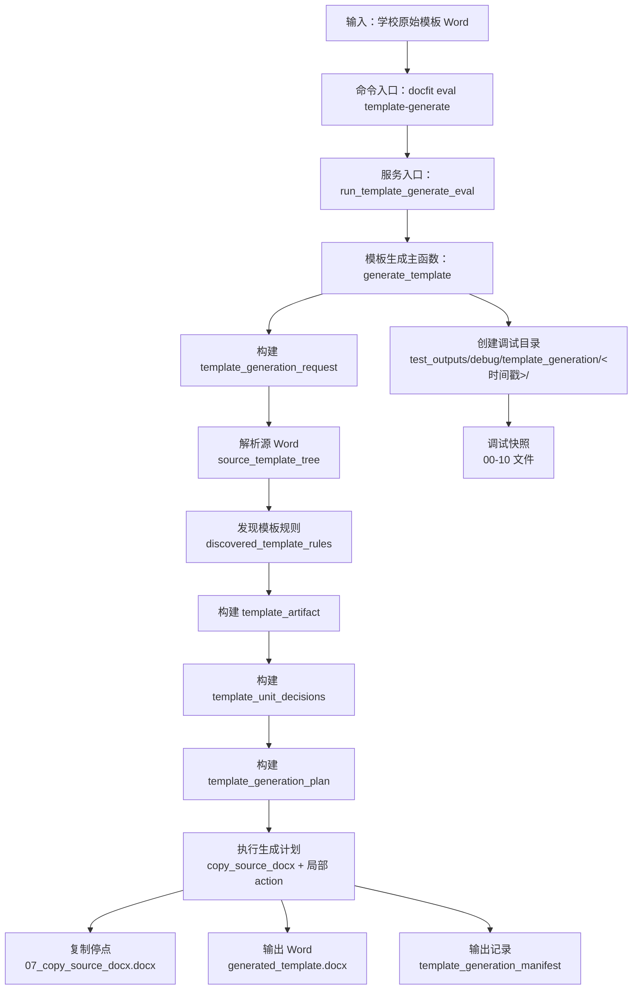

# Template Generation Current-State Audit Report

本文是模板生成当前实现状态的只读审计记录。

范围只覆盖：

```text
学校原始模板 Word
-> source_template_tree
-> discovered_template_rules
-> template_artifact
-> template_unit_decisions
-> template_generation_plan
-> 07_copy_source_docx.docx
-> generated_template.docx
-> template_generation_manifest
```

本文只讨论模板生成阶段。生成以外的流程不放进本文。

## 1. 结论摘要

| 问题 | 当前结论 | 证据 |
| --- | --- | --- |
| 当前模板生成是否有清晰流程 | PARTIAL。有真实可运行链路，也有 `generation_mode`；但还缺 unit range 保护和结构等价 trace | `src/docfit/stages/template_generate/runner.py::generate_template` |
| 当前是否有 generation_plan | YES | `src/docfit/stages/template_generate/runner.py::build_template_generation_plan` |
| 当前是否有 template_generation_manifest | YES | `src/docfit/stages/template_generate/runner.py::build_template_generation_manifest` |
| 当前是否会生成 copy-only 停点 | YES，写入 `07_copy_source_docx.docx` | `execute_template_generation_plan(copy_source_snapshot_docx=...)` |
| 当前 cover 是否直接复制 | 取决于 `generation_mode`。`whole_unit_copy` 表示由整包复制直接保留；`copy_then_patch` 表示复制后局部修改 | `build_template_unit_decisions` |
| 当前 declaration 是否直接复制 | 取决于 `integrity_statement` 的 `generation_mode` | `build_template_unit_decisions` |
| 当前 authorization / statement 是否直接复制 | UNKNOWN。代码里没有独立 authorization unit；`授权书` 关键词并入 `integrity_statement` | `UNIT_DEFINITIONS` |
| 当前是否存在后续动作会改坏复制结果 | YES。复制后还会插 slot、删说明、加分页/分节、补合成文字 | `execute_template_generation_plan` |
| 当前最可能导致“封面/声明看起来不对”的阶段 | 1. unit/element 识别；2. mode 选择；3. action 执行 | 见后文 |

## 2. 当前目录树

这棵目录树只说明模板生成相关文件放在哪里。

```text
docfit_v3/
├── test_inputs/template_generation/
│   └── school-*.docx
│       学校原始模板 Word。模板生成阶段唯一业务输入。
├── src/docfit/
│   ├── cli/main.py
│   │   docfit eval template-generate 的命令入口。
│   ├── convert/orchestrator.py
│   │   把 CLI 命令接到 template_generate 阶段，并写正式输出。
│   └── stages/template_generate/
│       ├── __init__.py
│       └── runner.py
│           模板生成主实现。
├── tests/contract/
│   └── test_template_generate.py
│       生成阶段合同测试。
├── test_outputs/debug/template_generation/<时间戳>/
│   ├── 00_input_source_template.docx
│   ├── 01_template_generation_request.json
│   ├── 02_source_template_tree.json
│   ├── 03_discovered_template_rules.json
│   ├── 04_template_artifact.json
│   ├── 05_template_unit_decisions.json
│   ├── 06_template_generation_plan.json
│   ├── 07_copy_source_docx.docx
│   ├── 08_generated_template.docx
│   ├── 09_template_generation_manifest.json
│   └── 10_template_generation_debug_index.json
│       每次模板生成的调试快照，按流程顺序保存每一步产物。
└── --out 指定目录/
    ├── generated_template.docx
    ├── artifacts/*.json
    └── summary.json
        正式命令输出。
```

目录树读法：

- `test_inputs/template_generation/` 是“从哪里来”。
- `src/docfit/stages/template_generate/` 是“怎么生成”。
- `tests/contract/` 是“怎么防回退”。
- `test_outputs/debug/template_generation/<时间戳>/` 是“逐步排查看什么”。
- `--out` 指定目录是“命令正式交付什么”。

## 3. 当前真实流程图



流程图读法：

- 从“输入：学校原始模板 Word”到“输出记录”是模板生成主流程。
- “复制停点”表示只执行整包复制、尚未执行局部动作时的 Word。
- “输出 Word”是模板生成阶段的正式 Word 结果。
- “调试快照”是每一步产物的人工查看目录。

## 4. 入口命令和调用链

| 层级 | 入口/函数/命令 | 文件路径 | 作用 | 是否真实调用 | 证据 |
| --- | --- | --- | --- | --- | --- |
| CLI | `docfit eval template-generate` | `src/docfit/cli/main.py` | 接收 `--template` 和 `--out` | YES | `eval_template_generate` |
| Service | `run_template_generate_eval` | `src/docfit/convert/orchestrator.py` | 调用生成阶段，写正式输出 | YES | `run_template_generate_eval` |
| Parser | `inspect_source_template_docx` | `src/docfit/stages/template_generate/runner.py` | 解析学校原始 Word 为 `source_template_tree` | YES | `generate_template` |
| Rule discovery | `infer_template_rules` | `src/docfit/stages/template_generate/runner.py` | 从源 Word 事实树发现候选模板规则 | YES | `generate_template` |
| Artifact | `build_template_artifact` | `src/docfit/stages/template_generate/runner.py` | 整理生成阶段使用的数据 | YES | `generate_template` |
| Decisions | `build_template_unit_decisions` | `src/docfit/stages/template_generate/runner.py` | 判断 unit 是整体复制还是复制后修改 | YES | `generate_template` |
| Plan | `build_template_generation_plan` | `src/docfit/stages/template_generate/runner.py` | 把 decisions 转成 action 列表 | YES | `generate_template` |
| Execution | `execute_template_generation_plan` | `src/docfit/stages/template_generate/runner.py` | 写 `generated_template.docx` 和 copy-only 停点 | YES | `generate_template` |
| Manifest | `build_template_generation_manifest` | `src/docfit/stages/template_generate/runner.py` | 记录生成过程和输出 hash | YES | `generate_template` |

重点结论：

- 运行 `uv run docfit eval template-generate --template ... --out ...` 会生成 `generated_template.docx`。
- 这个命令也会生成 `template_generation_manifest`。
- 这个命令也会在 `test_outputs/debug/template_generation/<时间戳>/` 写 00-10 调试快照。
- `template-generate` 不接受 `--school`。

## 5. 当前产物链

| 产物 | 是否真实生成 | 生成者 | 消费者 | 路径/字段 | 证据 |
| --- | --- | --- | --- | --- | --- |
| `template_generation_request` | YES | `build_template_generation_request` | source parse | `artifacts/template_generation_request.json` | `write_template_generation_outputs` |
| `source_template_tree` | YES | `inspect_source_template_docx` | rules/artifact | `artifacts/source_template_tree.json` | `write_template_generation_outputs` |
| `discovered_template_rules` | YES | `infer_template_rules` | artifact | `artifacts/discovered_template_rules.json` | `write_template_generation_outputs` |
| `template_artifact` | YES | `build_template_artifact` | decisions/plan | `artifacts/template_artifact.json` | `build_template_artifact` |
| `template_unit_decisions` | YES | `build_template_unit_decisions` | plan | `artifacts/template_unit_decisions.json` | `build_template_unit_decisions` |
| `template_generation_plan` | YES | `build_template_generation_plan` | execution | `artifacts/template_generation_plan.json` | `build_template_generation_plan` |
| `07_copy_source_docx.docx` | YES | `execute_template_generation_plan` | 人工排查 | `test_outputs/debug/template_generation/<时间戳>/07_copy_source_docx.docx` | `copy_source_snapshot_docx` |
| `generated_template.docx` | YES | `execute_template_generation_plan` | 后续流程 | `generated_template.docx` | `artifact_paths.generated_template_docx` |
| `template_generation_manifest` | YES | `build_template_generation_manifest` | 人工审计/trace | `artifacts/template_generation_manifest.json` | `build_template_generation_manifest` |
| `10_template_generation_debug_index.json` | YES | `write_template_generation_debug_snapshot` | 人工排查 | `test_outputs/debug/template_generation/<时间戳>/10_template_generation_debug_index.json` | `write_template_generation_debug_snapshot` |

## 6. Unit 是如何识别的

| unit 类型 | 当前是否能识别 | 识别依据 | anchor / keyword / structure | 识别代码位置 | 风险 |
| --- | --- | --- | --- | --- | --- |
| cover | YES | 第一段兜底；关键词 | 文档开头、封面、题名、学校、学号、指导教师 | `_unit_anchors` / `_unit_for_text` | 容易把说明文字识别为封面内容 |
| declaration | YES，通常作为 `integrity_statement` | 关键词 | 诚信声明、原创性声明、授权书 | `UNIT_DEFINITIONS` | declaration 和 authorization 被合并 |
| authorization | UNKNOWN | 没有独立 unit | 授权书并入 `integrity_statement` | `UNIT_DEFINITIONS` | 无法单独判断是否直接复制 |
| statement | UNKNOWN | 没有通用 `statement` unit | statement-like 内容通常归入 integrity 类 | `UNIT_DEFINITIONS` | 名称不稳定 |
| abstract | YES | 摘要关键词 | 中文摘要、英文摘要、关键词 | `UNIT_DEFINITIONS` | 标题和正文可能错配 |
| toc | YES | 目录关键词 | 目录、目 录 | `UNIT_DEFINITIONS` | TOC 字段可能无法等价识别 |
| body | YES | 正文兜底和 body_main 规则 | 正文、绪论、第一章、1 | `_find_body_main_source_entry` | 可能锚点后移 |

重点回答：

- 封面现在由源 Word 自动识别。
- 声明页现在通常被识别成 `integrity_statement`。
- 这些 unit 有 `unit_id`，例如 `cover`、`integrity_statement`、`toc`、`abstract_cn`、`body_main`。
- 当前没有明确的 `anchor_role` 字段。
- 这些 unit 有可能被误识别成普通正文或普通表格。

## 7. 每个 unit 的生成方式

当前代码有正式的 `generation_mode` 字段。

| unit | 当前生成方式 | 是否直接复制 | 是否局部替换 | 是否重新生成 | 判断依据 |
| --- | --- | --- | --- | --- | --- |
| cover | `whole_unit_copy` 或 `copy_then_patch` | 视 mode 而定 | 视 mode 而定 | NO | `template_unit_decisions.units[].generation_mode` |
| declaration / integrity_statement | `whole_unit_copy` 或 `copy_then_patch` | 视 mode 而定 | 视 mode 而定 | NO | `template_unit_decisions.units[].generation_mode` |
| authorization | UNKNOWN | UNKNOWN | UNKNOWN | UNKNOWN | 没有独立 authorization unit |
| statement | UNKNOWN | UNKNOWN | UNKNOWN | UNKNOWN | 没有独立 statement unit |
| abstract | 通常 `copy_then_patch` | NO | YES | NO | 摘要正文通常是 fill |
| toc | 通常 `copy_then_patch` | NO | YES | PARTIAL | 目录通常是 generated |
| body | 通常 `copy_then_patch` | NO | YES | NO | 正文需要 body slot |

封面是不是直接复制？

答案：看 `generation_mode`。如果是 `whole_unit_copy`，当前按整包复制保留；如果是 `copy_then_patch`，不是整体复制。

声明页是不是直接复制？

答案：看 `integrity_statement` 的 `generation_mode`。如果是 `whole_unit_copy`，当前按整包复制保留；如果是 `copy_then_patch`，不是整体复制。

## 8. “直接复制”到底复制了什么

| 对象 | 是否复制 | 复制方式 | 是否验证 | 风险 |
| --- | --- | --- | --- | --- |
| paragraphs | YES | 初始整包复制 docx | PARTIAL | 后续 action 可能删段落/插段落 |
| runs | YES | 初始整包复制 docx | PARTIAL | python-docx 保存后可能重写局部结构 |
| tables | YES | 初始整包复制 docx | PARTIAL | 表格宽度/网格缺少 unit-level 等价 trace |
| paragraph styles | YES | 初始整包复制 styles.xml | PARTIAL | 插入段落可能使用新样式 |
| numbering | YES | 初始整包复制 numbering.xml | PARTIAL | 缺少 unit-level 依赖 trace |
| images / media rels | YES，初始复制 | 初始整包复制 docx package | UNKNOWN | 后续保存是否完全保留还缺 trace |
| hyperlinks | YES，初始复制 | 初始整包复制 docx package | UNKNOWN | 缺少 hyperlink 等价 trace |
| fields | YES，初始复制 | 初始整包复制 docx package | PARTIAL | 字段结构可能被保存改写 |
| content controls | YES，初始复制 | 初始整包复制 docx package | UNKNOWN | 保存后保留情况未明确验证 |
| text boxes / shapes | YES，初始复制 | 初始整包复制 docx package | UNKNOWN | 复杂对象缺少 unit-level trace |
| section properties | YES，但会被 action 改 | 初始复制 + section action | PARTIAL | 分节边界可能影响视觉 |
| headers / footers | YES，初始复制 | 初始整包复制 docx package | PARTIAL | 缺少 unit attribution |
| page breaks | YES，但会新增 | 初始复制 + page break action | PARTIAL | 新增分页可能改变布局 |
| styles.xml dependencies | YES | 初始整包复制 docx package | PARTIAL | 无 unit-level 依赖 trace |
| numbering.xml dependencies | YES | 初始整包复制 docx package | PARTIAL | 无 unit-level 依赖 trace |

特别指出：

- 有可能“看起来是复制”，但实际是整包复制后又局部 patch。
- 有可能初始复制了 body XML 和 relationship，但后续 action 或保存过程改变局部结构。
- 有可能复制后又被分页、分节、删说明、插 slot 等动作改变视觉效果。

## 9. 后续动作是否可能破坏复制结果

| 后续动作 | 文件/函数 | 会影响哪些 unit | 是否可能影响 cover/declaration | 风险 |
| --- | --- | --- | --- | --- |
| 插入分页 | `execute_template_generation_plan` / `_insert_page_break_before` | 有分页规则的单元 | YES | 页面边界变化 |
| 插入分节 | `execute_template_generation_plan` / `_insert_section_break_before` | 有分节规则的单元 | YES | 页眉页脚/页码/版式可能变化 |
| 删除说明文字 | `execute_template_generation_plan` / `_remove_paragraph` | 被识别为 instruction 的段落/表格单元格 | YES | 可能删掉原本应该保留的固定内容 |
| 插入 fill slot | `execute_template_generation_plan` / `_insert_marker` | cover、abstract、body 等 fill 元素 | YES | 视觉上多出 marker |
| 插入 generated marker | `execute_template_generation_plan` / `_insert_marker` | toc 等 generated 元素 | 间接 | 字段可能变成占位 |
| 插入合成标题 | `_synthetic_unit_title_actions` | 缺标题的单元 | 间接 | 新增内容改变原模板 |
| 确保 body slot | `execute_template_generation_plan` | 正文入口 | 间接 | 末尾或正文附近多出 slot |
| 保存 docx | `Document.save` | 整个输出 docx | YES | python-docx 可能重写部分 OOXML |

重点回答：

- 封面/声明如果本来复制正确，后续动作有可能把它改坏。
- 当前 `whole_unit_copy` 单元不会生成 element 级修改动作，只记录 `preserve_whole_unit_copy`。
- 仍需继续补 unit range 级保护，确保其他动作不会误伤整体复制区域。

## 10. 首次出错阶段判断框架

| 现象 | 如何确认 | first_bad_stage | 应该看哪里 | 不应该先看哪里 |
| --- | --- | --- | --- | --- |
| 原始模板里有封面，但系统没识别 | 看 `02_source_template_tree.json` 和 `03_discovered_template_rules.json` | `source_parse / unit_detection` | 解析和 unit 识别 | 不应先改 action |
| 封面被识别了，但生成方式不是复制 | 看 `05_template_unit_decisions.json` | `mode_selection` | `_unit_generation_mode` | 不应先改 Word 保存 |
| 封面标记为复制，但 plan 仍要修改它 | 看 `06_template_generation_plan.json` | `plan_build` | `build_template_generation_plan` | 不应先改输入 |
| `07` 就已经不对 | 打开 `07_copy_source_docx.docx` | `copy_execution` | `copy_source_docx` | 不应先改 element policy |
| `07` 对但 `08` 不对 | 对比 `07` 和 `08` | `action_execution` | `execute_template_generation_plan` | 不应先改源解析 |
| manifest 看不出问题在哪 | 看 `09_template_generation_manifest.json` | `trace_missing` | manifest/unit-level trace | 不应只改视觉效果 |

## 11. 当前最大不透明点

| 不透明点 | 影响 | 当前证据 | 建议补的最小 trace |
| --- | --- | --- | --- |
| `generation_mode` 还没有 unit range 保护 | 知道 unit 该整体复制，但还不能证明后续动作绝不会误伤 | `generation_mode=whole_unit_copy` 只减少本 unit element actions | protected range + skipped action |
| 整体复制还没有结构等价 trace | 不知道 whole_unit_copy 输出是否与源 unit 等价 | manifest 只有 action 记录 | source/generated unit structural hash |
| manifest 缺少 unit-level before/after | 不知道每个 unit 执行前后变成什么样 | manifest 只有 action 列表和 output_ref | unit before/after hash |
| source_ref 可错配 | 封面/声明元素可能指到说明段 | 只记录 source_ref，不记录候选和置信度 | match text + confidence |
| authorization 没有独立 unit | 授权页是否复制不可判断 | `授权书` 被并入 `integrity_statement` | separate authorization unit |
| 表格和图片缺少 unit 归属 | 复制范围看不清 | 资源初始复制，但没有 unit attribution | table/media relationship attribution |

## 12. PM 可读总结

### 一句话结论

当前模板生成更像是“把学校原始 Word 整包复制一份，然后按识别出的 unit/element 往里面插 slot、删说明、加分页/分节”。它已经有阶段产物链，但还不是严格的 unit-level generation pipeline。

### Q1: 封面是不是直接复制？

答案：看 `generation_mode`。

证据：

- `whole_unit_copy` 表示封面由整包复制保留；
- `copy_then_patch` 表示封面复制后还会被局部修改；
- 当前缺少封面 source/generated 结构等价 trace。

### Q2: 声明页是不是直接复制？

答案：看 `integrity_statement` 的 `generation_mode`。

风险：

- 声明页和授权书当前没有完全拆开；
- 如果被识别为 `copy_then_patch`，后续动作可能改变它。

### Q3: 如果它说“已改成直接复制”，怎么验证？

需要看：

- `05_template_unit_decisions.json` 里的 `generation_mode`；
- `06_template_generation_plan.json` 里是否只有 `preserve_whole_unit_copy`；
- `07_copy_source_docx.docx` 和 `08_generated_template.docx` 的对应 unit 是否一致；
- `09_template_generation_manifest.json` 里是否记录 unit-level action。

### Q4: 当前流程最容易错在哪里？

1. 源 Word unit / element 识别错。
2. `generation_mode` 把该整体复制的单元判成了 `copy_then_patch`。
3. 后续 action 误伤了本来应该保留的区域。

### Q5: 下一步最小任务是什么？

先补 `unit-level generation trace`：

- 每个 unit 明确 source range；
- 每个 unit 明确 `whole_unit_copy` / `copy_then_patch`；
- 每个 action 明确属于哪个 unit；
- manifest 记录每个 unit 的 before/after hash。
