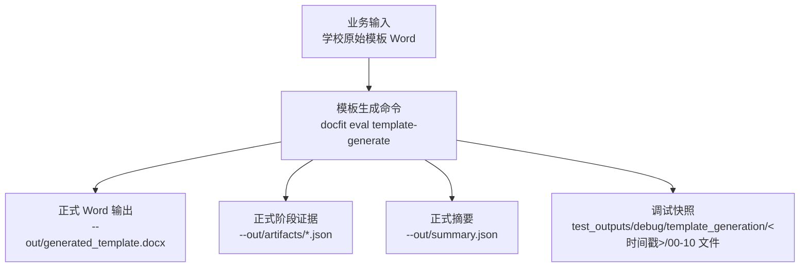
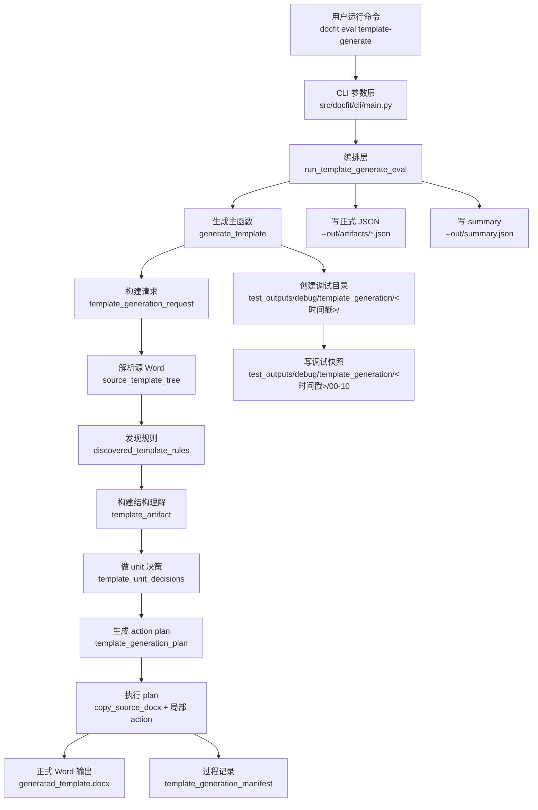

# 模板生成输入和调试产物说明

本文只说明模板生成阶段自己的输入、输出和调试产物。

一句话边界：

```text
学校原始模板 Word -> generated_template.docx + 生成过程证据
```

本文只讨论模板生成阶段；生成以外的流程不放进本文。

## 1. 一句话结论

模板生成主流程只要求一份业务输入：

```text
学校原始模板 Word
```

`template-generate` 只接受 `--template` 和 `--out`。它负责把源 Word 转成一份可继续填写的 `generated_template.docx`，并把每个生成阶段的中间产物保存下来，方便后续讨论“哪一步变了”。

## 2. 文件身份目录树

这棵目录树只覆盖模板生成阶段。读它时按“输入、正式输出、调试快照”三类看。

```text
docfit_v3/
├── test_inputs/template_generation/
│   └── school-*.docx
│       业务输入：学校原始模板 Word，template-generate 唯一读取的业务文件。
├── test_outputs/debug/template_generation/<验证名>/eval_runs/<run_id>/ 或 --out 指定目录/
│   ├── generated_template.docx
│   │   正式输出：生成后的可填写模板 Word。
│   ├── artifacts/
│   │   ├── template_generation_request.json
│   │   ├── source_template_tree.json
│   │   ├── discovered_template_rules.json
│   │   ├── template_artifact.json
│   │   ├── template_unit_decisions.json
│   │   ├── template_generation_plan.json
│   │   └── template_generation_manifest.json
│   │       正式阶段证据：机器流程和人工排查都可以读取。
│   └── summary.json
│       本次 template-generate 命令摘要。
└── test_outputs/debug/template_generation/<时间戳>/
    ├── 00_input_source_template.docx
    ├── 01_template_generation_request.json
    ├── 02_source_template_tree.json
    ├── 03_discovered_template_rules.json
    ├── 04_template_artifact.json
    ├── 05_template_unit_decisions.json
    ├── 06_template_generation_plan.json
    ├── 07_copy_source_docx.docx
    ├── 08_generated_template.docx
    ├── 09_template_generation_manifest.json
    └── 10_template_generation_debug_index.json
        调试快照：每次生成过程的逐步证据，供人工讨论。
```

目录树说明：

- `test_inputs/template_generation/school-*.docx` 是生成主流程输入。
- `--out/generated_template.docx` 是生成主流程正式 Word 输出。
- `--out/artifacts/*.json` 是同一次生成的正式结构化证据。
- `test_outputs/debug/template_generation/<时间戳>/` 是调试快照，不是基准文件，也不是测试 expected。
- 本目录树不包含生成以外的流程。

## 3. 文件流向流程图



流程图说明：

- “业务输入”只有学校原始模板 Word。
- “模板生成命令”只负责生成模板，不加载其他业务输入。
- “正式 Word 输出”是后续流程可以使用的 `generated_template.docx`。
- “正式阶段证据”记录每个阶段的结构化结果。
- “调试快照”是人工看效果、定位 first bad stage 的首选目录。

## 4. 代码和脚本目录树

这棵目录树回答“后续开发要改哪里”。它只列模板生成相关代码。

```text
docfit_v3/
├── src/docfit/cli/main.py
│   CLI 命令入口。定义 docfit eval template-generate：
│   只接受 --template 和 --out，不接受 --school。
├── src/docfit/convert/orchestrator.py
│   流程编排入口。run_template_generate_eval 调用生成阶段，
│   写正式输出，并把调试根目录固定到 test_outputs/debug/template_generation/。
├── src/docfit/stages/template_generate/
│   ├── __init__.py
│   └── runner.py
│       模板生成主实现。解析源 Word、发现规则、构建 artifact、
│       做 unit 决策、生成 action plan、执行整包复制和局部修改、
│       写 manifest 和 00-10 调试快照。
├── tests/contract/
│   └── test_template_generate.py
│       模板生成合同测试：CLI 边界、00-10 调试快照、whole_unit_copy、
│       copy_source_docx 停点等行为。
└── scripts/
    辅助脚本目录。当前不是模板生成主流程入口。
```

目录树说明：

- 要改模板生成算法，优先看 `src/docfit/stages/template_generate/runner.py`。
- 要改命令参数，先看 `src/docfit/cli/main.py`。
- 要改调试快照写法，看 `write_template_generation_debug_snapshot`。
- 要改正式 `--out/artifacts/*.json`，看 `write_template_generation_outputs`。
- 不要把模板生成主流程能力写进 `scripts/`，否则 CLI 和合同测试不会覆盖。

## 5. 代码调用流程图



流程图说明：

- “CLI 参数层”只负责接收 `--template` 和 `--out`。
- “编排层”负责把命令接到生成阶段，并指定调试快照目录。
- 从“生成主函数”到“过程记录”是模板生成主链路。
- “写正式 JSON”和“写 summary”是正式命令输出。
- “写调试快照”是同一批阶段产物的人工可读副本。

## 6. 生成阶段正式输出

模板生成命令的正式输出写在 `--out` 指定目录：

```text
generated_template.docx
artifacts/template_generation_request.json
artifacts/source_template_tree.json
artifacts/discovered_template_rules.json
artifacts/template_artifact.json
artifacts/template_unit_decisions.json
artifacts/template_generation_plan.json
artifacts/template_generation_manifest.json
summary.json
```

这些文件是模板生成阶段自己的输出。

## 7. 统一调试输出目录

后续模板生成流程的测试、调试和人工查看内容统一写到：

```text
test_outputs/debug/template_generation/<时间戳>/
```

每次运行会创建一个新的时间戳目录。目录里的文件按流程顺序命名：

| 顺序 | 文件 | 用途 |
| --- | --- | --- |
| 00 | `00_input_source_template.docx` | 本次读取的学校原始模板 Word 副本 |
| 01 | `01_template_generation_request.json` | 本次生成请求 |
| 02 | `02_source_template_tree.json` | 从学校原始 Word 解析出的结构树 |
| 03 | `03_discovered_template_rules.json` | 系统发现的候选模板规则 |
| 04 | `04_template_artifact.json` | 生成阶段使用的模板结构理解结果 |
| 05 | `05_template_unit_decisions.json` | 每个 unit/element 的处理决定 |
| 06 | `06_template_generation_plan.json` | 真正会执行的动作列表 |
| 07 | `07_copy_source_docx.docx` | 只执行整包复制后的 Word，尚未插 slot、删说明或加分节 |
| 08 | `08_generated_template.docx` | 执行全部动作后的生成模板 Word |
| 09 | `09_template_generation_manifest.json` | 生成过程记录 |
| 10 | `10_template_generation_debug_index.json` | 调试目录文件索引和中文说明 |

这个目录是讨论模板生成效果时优先看的地方。

## 8. 不要混淆的边界

- 不要把学校原始模板 Word 当成 `generated_template.docx`。
- 不要把 `template_artifact.json` 当成真实生成 Word 的证据；真实 Word 要看 `08_generated_template.docx`。
- 不要把 `template_generation_manifest.json` 当成 Word 里真的存在某内容的证据；manifest 只记录生成过程。
- 不要把 `test_outputs/debug/template_generation/<时间戳>/` 里的调试快照当成 golden 或 expected snapshot。
- 不要把生成以外的流程写进模板生成流程图。
