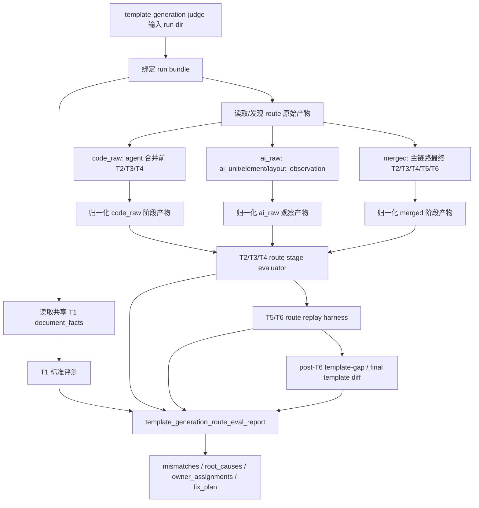
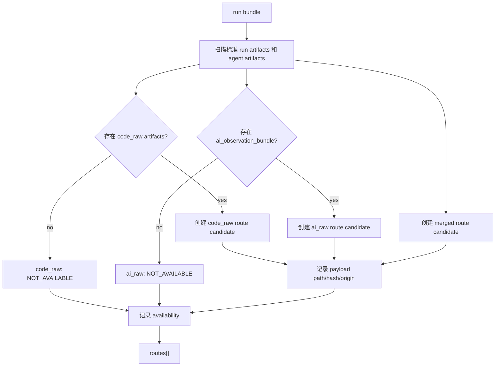
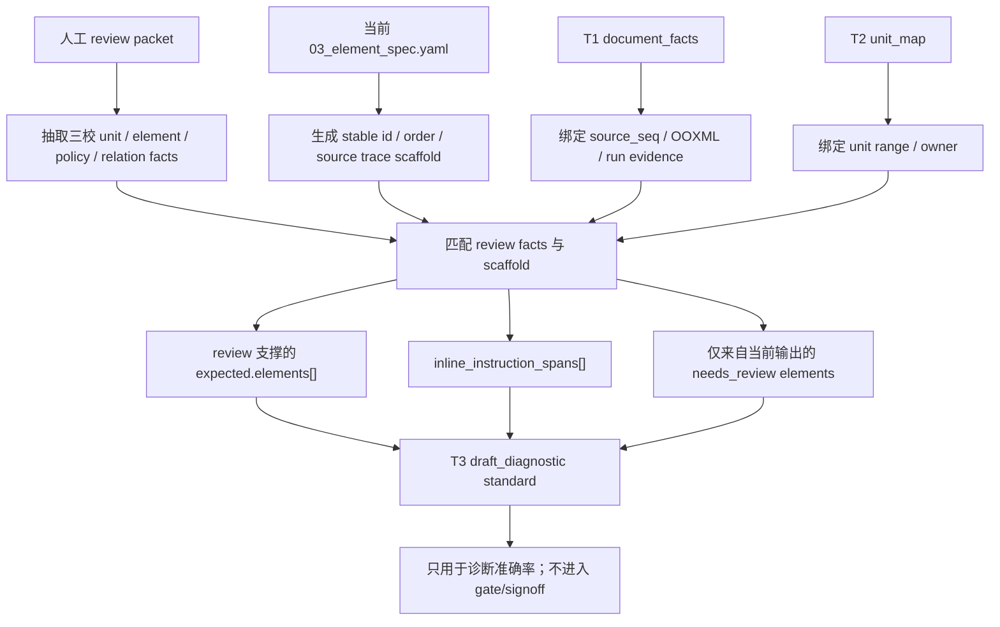
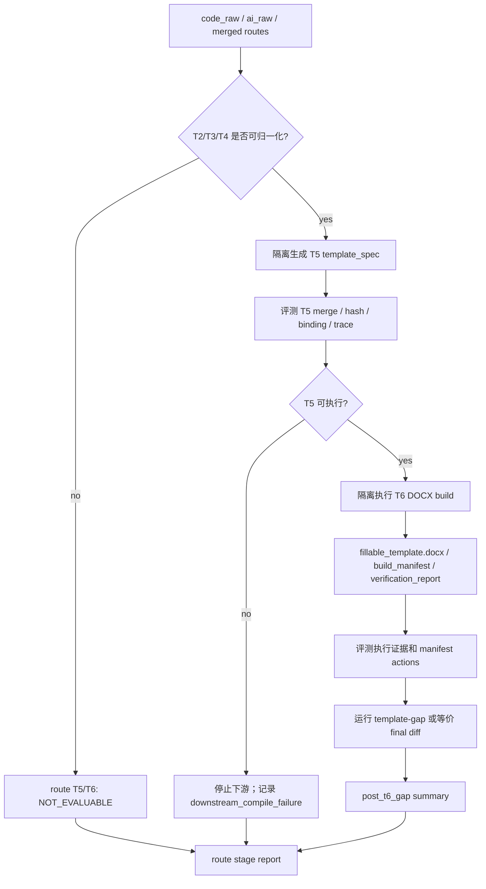
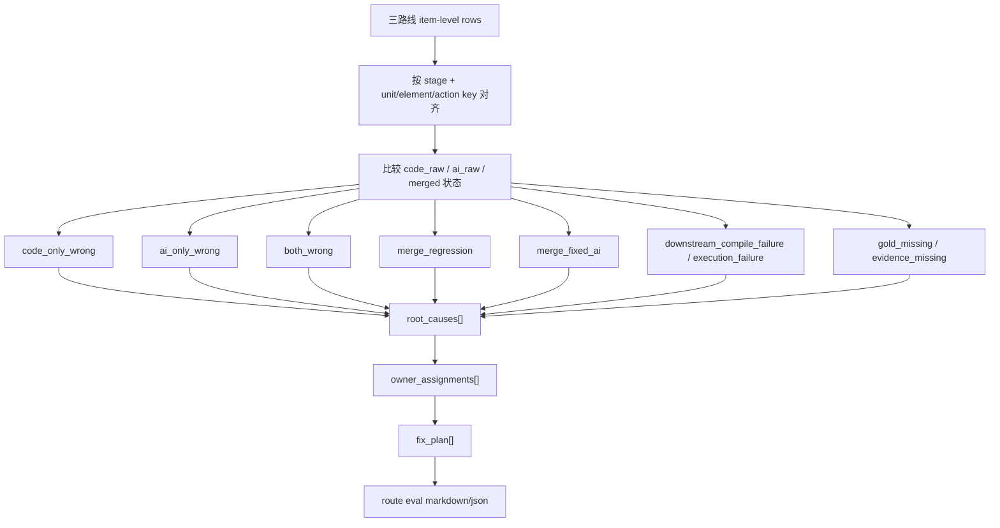

# Standard Judge Plan 03：模板生成全链路三路线评测闭环

## Summary

本轮把模板生成评测从“最终阶段产物 vs 阶段标准”扩展为“全链路三路线评测”：`code_raw`、`ai_raw`、`merged` 共用同一套标准、同一套报告 schema 和同一套四层诊断。评测范围覆盖 T1-T6，并把 `verification_report` 和 `template-gap` 作为 T6 后的执行证据层。

第一版报告面向工程定位：准确率是摘要指标，核心问题是稳定回答“哪个阶段、哪条路线、哪个 owner 出错，以及下一步怎么验”。

## Public Interfaces

```text
template-generation-judge
  -> template_generation_route_eval_report.json
  -> template_generation_route_eval_report.md
```

新增 report schema：

```text
route_evaluation_report:
  profile_id
  school_id
  run_id
  routes[]
  shared_inputs
  stage_metrics
  cross_route_summary
  mismatches[]
  root_causes[]
  owner_assignments[]
  fix_plan[]
```

每个 route candidate 至少包含：

```text
route_id: code_raw | ai_raw | merged
stage_key: T1 | T2 | T3 | T4 | T5 | T6 | post_t6_gap
artifact_type
payload_path
payload_hash
availability: AVAILABLE | NOT_AVAILABLE | NOT_EVALUABLE | UNKNOWN
origin
```

T3 draft standard 扩展字段：

```text
expected.elements[]
expected.inline_instruction_spans[]
standard_status: draft_diagnostic
review_provenance
```

`draft_diagnostic` 只能用于诊断和准确率报告，不参与 gate 放行。

## Detailed Flow Diagrams

### 1. 全链路评测总流程



### 2. Route candidate 构建流程



### 3. T3 draft expected 反推流程



### 4. T5/T6 三路线隔离重放流程



### 5. Cross-route 归因流程



## Implementation Plan

1. 文档和状态约束先行。

   - 保留本 issue/plan 分离结构，并在 issue index 登记。
   - 不改变现有 T1-T5 signed standard 的 gate 语义。
   - 不让 T3 draft expected 参与 `standard_acceptance_status` 或 signoff。

2. 扩展 run bundle 和 artifact 捕获。

   - T1 `document_facts` 作为三条路线共享事实，只评一次。
   - 在 agent 合并前持久化 deterministic `code_raw_unit_map`、`code_raw_element_spec`、`code_raw_global_spec`。
   - 使用 `--agent-observation-bundle` 时持久化原始 AI observation bundle。
   - 当前主链路最终输出继续作为 `merged`。
   - 缺失 route artifact 时记录 availability，不中断整个 judge。

3. 建立 T3 三校 draft expected 反推流程。

   - 输入为 `docs/human/real-core-v0-review-packet.md`、当前 run 的 `03_element_spec.yaml`、T1 facts 和 T2 unit map。
   - 人工 review packet 是事实权威；当前输出只作为 stable id、顺序、source trace scaffold。
   - 三校一起产出 draft `expected.elements[]`，每个元素保留 unit、order、policy、fill/manual/generated、source evidence 和 review provenance。
   - 行内格式说明用 `inline_instruction_spans[]` 或等价结构记录，避免把真内容和括号说明整段混判。
   - 只来自当前输出、没有 review 支撑的元素标为 `needs_review`。

4. 新增统一 route evaluator。

   - 对 T2/T3/T4 分别把 code_raw、ai_raw、merged 归一化到阶段评测 shape。
   - 复用现有 stage standard diff diagnosis 的四层结构。
   - `observation_eval` 和 `template_agent_bridge_standard_acceptance` 保留兼容输出，但数据来源逐步收敛到 route evaluator。

5. 新增 T5/T6 route replay harness。

   - 对 `code_raw`、`ai_raw`、`merged` 三条路线分别隔离生成 T5 `template_spec`。
   - 对可评路线继续隔离执行 T6，产出 `fillable_template.docx`、`build_manifest`、`verification_report`。
   - replay 输出写到 judge 输出目录下的 route 子目录，不覆盖原始 run。
   - AI route 无法归一化为完整 T2/T3/T4 时，T5/T6 标为 `NOT_EVALUABLE`。

6. 接入 T6 后差距证据。

   - 对每条成功执行的 T6 输出运行 `template-gap` 或等价最终模板差距检查。
   - 对照 `final_template.expected.yaml` 输出最终模板差距摘要。
   - 第一版不要求 Word image evidence；图片证据后续可作为更深 visual gate。

7. 输出工程诊断报告。

   - 每条 route/stage 输出 metrics、item rows、mismatches。
   - cross-route summary 对同一 mismatch 分类为 `code_only_wrong`、`ai_only_wrong`、`both_wrong`、`merge_regression`、`merge_fixed_ai`、`downstream_compile_failure`、`execution_failure`、`gold_missing`、`evidence_missing`。
   - 每个分类继续落到 root cause、owner assignment 和 fix plan。

## Stage Metrics

```text
T1:
  fact completeness
  OOXML/source locator coverage
  header/footer/table/visible object trace
  forbidden semantic fields

T2:
  unit precision/recall/F1
  unit order
  per-unit presence
  source_seq interval
  boundary/page policy/anchor owner

T3:
  element presence
  policy accuracy
  required-field compliance
  element order
  source evidence overlap
  inline instruction span hit rate

T4:
  section profile coverage
  section boundary source trace
  page setup
  page numbering
  header/footer refs
  numbering rules
  unit page policy binding

T5:
  template_spec merge integrity
  input hash binding
  unit-element binding
  unit-section binding
  source trace preservation
  review flag preservation
  no Word action execution

T6:
  DOCX generated
  build_manifest action coverage
  action success/failure
  instruction removal evidence
  fill slot / generated field execution evidence
  output hash binding
  verification_report status

post_t6_gap:
  final template gap mismatches
  unit/element/style/layout gap summary
  evidence completeness
```

## Completion Signals

```text
1. template-generation-judge 默认写出 template_generation_route_eval_report.json/md。
2. T1-T6 和 post_t6_gap 都能在 report 中看到明确状态。
3. code_raw、ai_raw、merged 的 artifact path/hash/availability 可追溯。
4. T3 draft expected 覆盖三校，并明确 draft_diagnostic / needs_review 边界。
5. T5/T6 replay 产物与原始 run 隔离。
6. 没有 route 输入或缺标准时输出 NOT_AVAILABLE / NOT_EVALUABLE / UNKNOWN，不伪造 PASS。
7. 现有 standard quality、stage diff、root cause、bridge acceptance 报告继续生成。
```

## Progress

```text
2026-07-01:
  已先落地 template-generate run bundle 的 T3 三路线产物：
    - 03.0_t3_code_element_spec.yaml：agent 合并前 deterministic code_raw T3
    - 03.1_t3_ai_element_observation.yaml：Module 1 ai_raw T3；未传 AI bundle 时明确 NOT_AVAILABLE
    - 03.2_t3_merged_element_spec.yaml：bridge/reconciler 后最终 merged T3
  兼容文件 03_element_spec.yaml 保持为最终 merged T3，供现有 T5/T6/verifier 继续消费。
  这一步只解决 route artifact 捕获；完整 route evaluator / T5-T6 replay / post_t6_gap 仍按本 plan 后续执行。
```

## Test Plan

```text
uv run pytest tests/unit/test_template_generation_route_eval.py -q
uv run pytest tests/unit/test_template_generation_stage_verifiers.py -q
uv run pytest tests/unit/test_template_generation_standard_diff_diagnosis.py -q
uv run pytest tests/contract/test_template_generation_standard_judge.py -q
uv run pytest tests/contract/test_template_generate_agent_replay.py -q
```

新增测试场景：

```text
1. T3 review packet 支撑的元素进入 draft expected；只来自当前输出的元素标为 needs_review。
2. T2 缺单元、错顺序、错区间分别产生 item-level mismatch。
3. T3 缺元素、policy 错、required field 错、inline instruction span 未删分别影响对应指标。
4. T4 缺 section boundary/header-footer/page numbering evidence 能归因到 T4。
5. T5 input hash 缺失、section ref 不解析、review flag 丢失能归因到 T5。
6. T6 manifest action fail、DOCX 缺失、verification fail、template-gap mismatch 能归因到 T6 或 post_t6_gap。
7. AI 错但 merge 修复、code 对但 merge 回退、三路都错、AI route 不可评都有稳定 cross-route 分类。
```

## Assumptions

```text
1. T6 第一版采用执行证据 + template-gap；Word image evidence 不作为默认要求。
2. T3 draft standard 不改变现有 gate；signed standard 升级必须另有人审确认。
3. 第一版 ai_raw 只支持 Module 1 observation bundle；历史 layered proposal 通过 merged/bridge 兼容视图观察。
4. T1 边界不变；T1 仍只输出事实，不输出语义判断。
5. route replay 只在 judge/eval 输出目录写派生产物，不反写 template-generate 原始 run。
```
