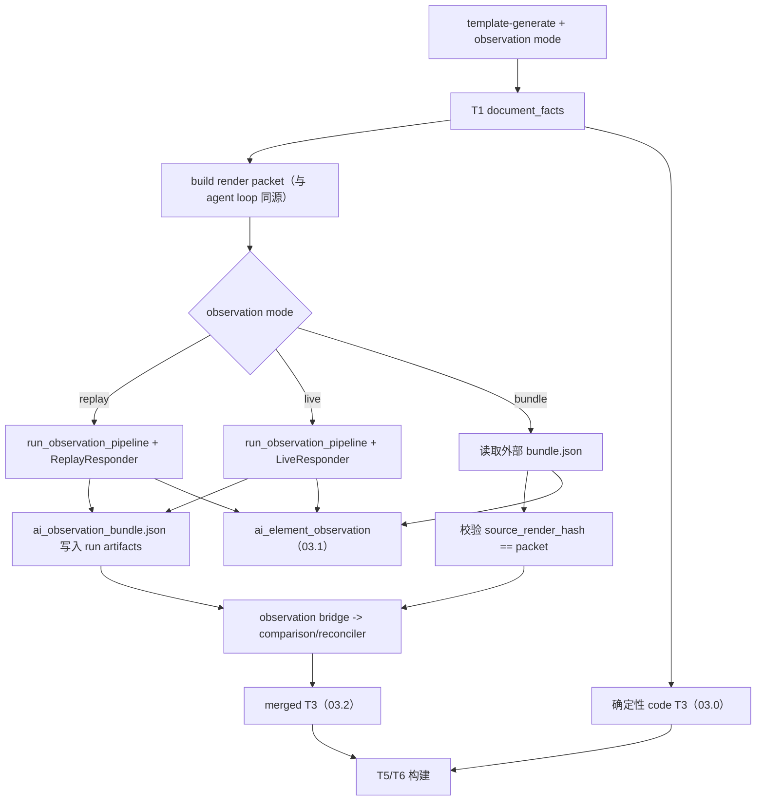

# T2/T3/T4 Agent Plan 07：端到端三路线主链路集成

## Summary

本轮把 **Module 1 观察 → Module 2 桥接 → run bundle 三路线产物** 收成**同一次 template-generate run** 可复现的编排，同时修正 `03.1` NOT_AVAILABLE 占位的语义污染。

**不改变 default-off**：默认 `template-generate` 仍只跑确定性 code 路线；但仓库必须提供**一条文档化、可 CI 回归、可在 hunannongye 上手动复现**的「完整三路线」运行口径。

与 Plan 06 的分工：

```text
Plan 06：给定 observation bundle，如何 bridge 进代码生成。
Plan 07：同一次 run 内，谁生产/持久化 bundle，如何与 render packet 对齐，如何让 03.0/03.1/03.2 可被读懂和评测。
```

与 Standard Judge Plan 03 的分工：

```text
Plan 07：先保证 run bundle 里三条路线 artifact 真实、可追溯、availability 语义正确。
Plan 03：在此基础上做 T1-T6 全链路 route evaluator（本 plan 只交付 T3 route summary 最小接口，不替代 Plan 03）。
```

## 2026-07-02 Implementation Progress

已完成：

```text
1. NOT_AVAILABLE 占位语义修正：默认 code-only run 的 02.2/03.1/04.1 不再写 abstain=true，也不再枚举全量 unknown_source_seq。
2. 新增同 run Module 1 replay 编排：CLI `--agent-observation-replay <json>` 在当前 render packet 上运行 run_observation_pipeline，并将 bundle 交给 observation bridge。
3. 同 run artifact 落盘：`artifacts/ai_observation_bundle.json` 与 ordered/debug `09.1_ai_observation_bundle.json` 可追溯到同一 packet hash。
4. 合同测试覆盖：默认 NOT_AVAILABLE 语义、observation replay 同 run hash 对齐、03.1 AVAILABLE、无 OBSERVATION-HASH-MISMATCH。
5. hunannongye 临时 replay 验证通过：`/private/tmp/docfit_template_generate_observation_replay_probe` 中 bundle hash 与 packet hash 均为 `sha256:6d7b677b9d42d560fd48b94a1ee68169c801361fcb1e51f742fa2bb8d9b90fcb`，03.1 为 AVAILABLE，hash mismatch=0。
```

仍未完成：

```text
1. 尚未提交正式 hunannongye replay fixture；本轮真实验证使用 `/private/tmp/hunannongye_observation_replay.json` 临时派生文件。
2. `--agent-observe-live` 入口已预留，但未用真实 API 验证，不作为本轮完成信号。
3. template-generation-judge 的 `template_generation_t3_route_summary.json` 仍未实现，继续归本 plan Phase 4 / STANDARD-JUDGE-PLAN-03。
4. bridge 对 hunannongye 仍会产生大量 manual_review，这是 AI 观察与确定性代码对账后的质量门禁，不再是链路未接通或 hash 降级。
```

## Scope

### In scope

```text
1. NOT_AVAILABLE 占位语义修正（runner._route_t3_ai_observation）。
2. 同 run 内 Module 1 观察编排（replay 为 CI 主路径；live 为可选人工路径）。
3. observation bundle 持久化到 run artifacts，并与 render packet hash 绑定。
4. CLI / AgentConfig 扩展：显式开启「观察 + 桥接 + 生成」一体化 run。
5. hunannongye 端到端 contract（replay，无 live API 依赖）。
6. 运行口径文档（AGENTS.md 或 plans 索引旁注）。
7. judge 侧 T3 route availability 最小摘要（读 03.0/03.1/03.2，不伪造准确率）。
```

### Out of scope

```text
1. 修改 default-off：未传任何 agent flag 时仍不跑 Module 1。
2. Module 1 阶段输入质量（T4 分节事实、真实页图接线）——仍归 MODULE1-ISSUE-05 / dataflow alignment。
3. 完整 T1-T6 route evaluator、T5/T6 隔离重放、template-gap 横向比较——仍归 STANDARD-JUDGE-PLAN-03。
4. 把 live Kimi 调用放进默认 CI（成本与密钥隔离）。
5. 元素级 gold 建设。
```

## Target Run Topology

### 默认路径（保持不变）

```text
docfit eval template-generate --template <docx> --out <dir>
  -> code_raw AVAILABLE
  -> ai_raw NOT_AVAILABLE（语义纯净占位）
  -> merged ≈ code
```

### 完整三路线路径（本 plan 交付）



## Phase 1：修正 NOT_AVAILABLE 占位（先行，可独立合并）

### 改动

```text
src/docfit/template_generation/runner.py
  _route_t3_ai_observation() fallback：
    - 保留 route.availability=NOT_AVAILABLE 与 reason
    - 删除 abstain: true
    - coverage 改为 { total: N } 或 owned/unknown 均为空且 total=N；禁止枚举 1..N
    - 增加 created_at；model: null；不写 quality_report
```

### 完成信号

```text
1. tests/contract/test_template_generate.py 更新断言：NOT_AVAILABLE 时无 abstain、无 unknown_source_seq 长列表。
2. hunannongye 新 run 的 03.1 文件行数 < 30 行量级。
3. debug index 描述不变，但读包不再误判为「AI 弃权」。
```

## Phase 2：同 run 观察编排核心

### 2.1 配置与模式枚举

扩展 `AgentConfig`（`agent/config.py`）：

```text
observation_mode: off | bundle | replay | live
observation_transcript_path: Path | None   # replay 用
observation_cache_dir: Path | None          # live 可选；复用 observe_live 缓存语义
```

CLI（`cli/main.py`）互斥选项：

```text
--agent-observation-bundle <path>     # 已有；mode=bundle
--agent-observation-replay <path>     # 新增；mode=replay，CI 主路径
--agent-observe-live                  # 新增；mode=live，需 API key
```

启用规则：

```text
传任一 observation mode 或已有 --agent-observation-bundle / --agent-live / --agent-replay
  -> enabled=True（与现 CLI 行为一致）
observation_mode=off 且仅传 render_packet
  -> 不跑 Module 1（保持 Plan 06 replay/live proposal 行为）
```

### 2.2 编排函数（建议新模块）

新增 `src/docfit/template_generation/agent/observation_orchestrate.py`：

```text
run_module1_observation_for_template_generate(
  *,
  packet,
  agent_config,
  out_artifacts_dir,
) -> dict[str, Any]:
  - mode=replay: read transcript -> run_observation_pipeline
  - mode=live: LiveResponder + ObservationConfig（复用 observation_live 工厂）
  - mode=bundle: read_json(path)，校验 hash
  - 写出 out_artifacts_dir/ai_observation_bundle.json
  - 返回 bundle
```

**Hash 契约**（硬约束）：

```text
bundle.source_render_hash MUST == packet.source_render_hash
否则：
  - bridge 仍生成 manual_review（OBSERVATION-HASH-MISMATCH，已有）
  - run 级 findings 增加 blocking 或 advisory（不 silent）
  - 03.1 route.availability = NOT_EVALUABLE 或 AVAILABLE+degraded（plan 实现时二选一，issue 门禁要求「有记录」）
```

### 2.3 接入 generate_template

调整 `runner.generate_template` / `loop.run_template_agent` 顺序：

```text
1. 构建 document_facts、round-0 structure_candidates（现有）
2. 若 agent enabled 且 observation_mode != off：
     a. 构建 render packet（与 loop 内同源）
     b. run_module1_observation_for_template_generate
     c. 将 bundle 路径注入 agent_config.observation_bundle_path（内存或落盘路径）
3. run_template_agent（现有 bridge 路径）
4. _route_t3_ai_observation(agent_run.ai_element_observation, ...)（现有）
```

**关键**：`generate_template` 在 agent disabled 时**仍不**调用 `run_observation_pipeline`。

### 2.4 Run artifacts 契约

同一次 run 的 `artifacts/` 至少包含：

```text
ai_observation_bundle.json          # mode=replay/live 时必写；mode=bundle 时可 copy 或 symlink 记录
template_agent_render_packet.json   # 已有条件写出；observation run 时应稳定写出
template_agent_observation_bridge.json
t3_code_element_spec.yaml
t3_ai_element_observation.yaml
t3_merged_element_spec.yaml
```

debug 镜像目录同步写出 `03.0` / `03.1` / `03.2`（现有 outputs 路径）。

### 完成信号

```text
1. 单次命令可产出 ai_observation_bundle + bridge + 三份 T3 route yaml。
2. 03.1 route.availability=AVAILABLE 且含 schema_version/source_render_hash/model/items。
3. hash 不一致时有 artifact 级记录（bridge manual_review 或 run findings）。
```

## Phase 3：hunannongye 回归资产与 contract

### 3.1 Replay fixture

新增确定性 transcript（建议路径）：

```text
tests/fixtures/template_generation/hunannongye/observation_replay_transcript.json
```

要求：

```text
- 基于 hunannongye document_facts 的 source_render_hash 可复现
- 覆盖至少 2 个 unit 的 T3 items（不必全量 366 元素，但 coverage 不变量成立）
- 体积可控（< 50KB），供 CI 使用
```

生成方式（文档化，不放进 CI）：

```text
一次 observe_live 跑 hunannongye -> 从 _raw_model_responses 或 bundle 提炼精简 replay transcript
```

### 3.2 Contract test

新增 `tests/contract/test_template_generate_observation_e2e.py`：

```text
1. template-generate + --agent-observation-replay <fixture>
2. 断言 03.1 availability=AVAILABLE
3. 断言 artifacts/ai_observation_bundle.json 存在且 hash 与 render packet 一致
4. 断言 observation_bridge present
5. 断言 03.0 与 03.2 不必然 byte-equal（允许相同，但 merged route.origin 正确）
6. 断言 NOT_AVAILABLE 默认 run 仍通过（与 Phase 1 并存）
```

### 完成信号

```text
uv run pytest tests/contract/test_template_generate_observation_e2e.py -q 绿
```

## Phase 4：运行口径文档与 judge 最小摘要

### 4.1 文档

在 `AGENTS.md` 增加短节「模板生成三路线运行口径」：

```text
- 默认：仅 code
- 完整三路线（CI）：docfit eval template-generate ... --agent-observation-replay <fixture>
- 完整三路线（人工 live）：... --agent-observe-live（需 KIMI_API_KEY）
- 外置 bundle：... --agent-observation-bundle <bundle.json>（hash 须对齐）
- 03.1 NOT_AVAILABLE 在默认 run 下是预期，不是 bug
```

### 4.2 Judge 最小摘要（不替代 Plan 03）

在 `template-generation-judge` 增加轻量输出：

```text
template_generation_t3_route_summary.json
  routes:
    code_raw: { availability, path, hash, element_count }
    ai_raw:   { availability, path, hash, item_count, abstain? }
    merged:   { availability, path, hash, element_count, changed_from_code: bool }
```

实现约束：

```text
- 只读 run bundle 已有 03.0/03.1/03.2 或 artifacts 镜像
- 不伪造 F1/accuracy；availability=NOT_AVAILABLE 时 metrics 为空
- 完整 cross-route mismatch 分类留给 STANDARD-JUDGE-PLAN-03
```

### 完成信号

```text
1. AGENTS.md 有可复制命令。
2. judge 在 hunannongye observation e2e run 上写出 t3_route_summary，三条 route 可追溯。
```

## Implementation Order

```text
P1  NOT_AVAILABLE 占位修正 + 单测                    （0.5d，可先发）
P2  observation_orchestrate + AgentConfig/CLI         （1-2d）
P2  runner/loop 接线 + artifacts 落盘                 （与上并行）
P3  hunannongye replay fixture + contract e2e         （1d，依赖 P2）
P4  AGENTS.md + t3_route_summary judge 摘要          （0.5d，依赖 P3）
```

不建议并行改动 Standard Judge Plan 03 的主 evaluator；P4 摘要仅为 Plan 03 预留接口。

## Acceptance（对应 Issue 07 门禁）

```text
1. default-off 不变；未传 agent flag 时不跑 Module 1、不写 bridge。
2. hunannongye 可通过 --agent-observation-replay 一次命令产出：
   - 03.0 AVAILABLE
   - 03.1 AVAILABLE（真实 observation）
   - 03.2 merged（route 元数据正确）
3. 默认 run 的 03.1 为纯净 NOT_AVAILABLE（无 abstain、无全量 unknown 列表）。
4. hash 不一致不 silent：bridge manual_review 或 run findings 可查。
5. template-generation-judge 输出 t3_route_summary.json，三路线 availability 可追溯。
6. CI 新增 contract 不依赖 live API。
```

## Test Plan

```text
# Phase 1
uv run pytest tests/contract/test_template_generate.py -q -k t3_ai

# Phase 2-3
uv run pytest tests/unit/template_generation_agent/test_agent_observation_pipeline.py -q
uv run pytest tests/unit/template_generation_agent/test_agent_observation_bridge.py -q
uv run pytest tests/contract/test_template_generate_agent_replay.py -q
uv run pytest tests/contract/test_template_generate_observation_e2e.py -q

# Phase 4
uv run pytest tests/contract/test_template_generation_standard_judge.py -q -k route_summary
```

人工验收（非 CI 阻断）：

```text
uv run docfit eval template-generate \
  --template inputs/targets/hunannongye/raw/source_template.docx \
  --out test_outputs/debug/template_generation/<run-id>/hunannongye \
  --agent-observe-live

检查 03.1 items>0、bridge summary、03.2 与 03.0 diff（若有 proposal 生效）
```

## Risks & Mitigations

| 风险 | 缓解 |
| --- | --- |
| live 与 replay 产物不一致导致「CI 绿、人工红」 | CI 只承诺 replay；live 作人工门禁；文档写明差异 |
| hunannongye replay fixture 过大 | 只录代表性 unit 窗口，coverage 用不变量校验而非全量元素 |
| 同 run 内 packet 构建两次导致 hash 漂移 | 编排层单次构建 packet，传给 observation 与 agent loop |
| 与 Plan 03 范围膨胀 | P4 只做 summary JSON；evaluator 不在本 plan 展开 |

## Completion Signals

```text
1. Issue 07 验收门禁 1-6 在 hunannongye replay run 上全部满足。
2. template-parse-refactor-issue-index 将 issue-07 标为 resolved、plan-07 标为 implemented。
3. 20260701_real_template_generate_after_t3_three_docs 类 run 在文档中标注为「code-only 预期」或使用新命令重跑得到真实 03.1。
4. STANDARD-JUDGE-PLAN-03 可引用 t3_route_summary 作为 route candidate 发现的前置输入（不要求本 plan 实现完整 evaluator）。
```

## Deferred Follow-ups（显式移交）

```text
→ STANDARD-JUDGE-PLAN-03：T1-T6 route evaluator、T5/T6 replay、cross-route 分类
→ MODULE1-ISSUE-05 / dataflow alignment：T4 事实接线、observe_live 真实渲染
→ 可选：school eval profile 把 --agent-observation-replay 设为 profile 级默认（另开 issue，避免隐式改 default-off）
```
