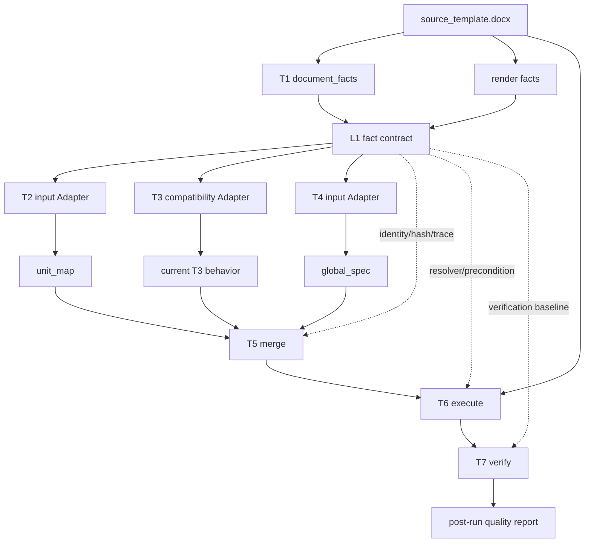

# T1/L1 输入契约 Plan 08：统一事实输入与旧投影退出

## Summary

本计划继续解决 issue-08 的输入契约缺口。2026-07-10 已落地可审计的 L1 artifact，但真实运行证明它仍是事后诊断视图：T2/T3/T4 继续各读 `document_facts`、render packet 或私有 evidence，且 L1 混入了 AI observation/bridge gate。

本轮不再以“文件存在”为完成，而是把 L1 前置为 T2/T3/T4 code 与 AI route 的唯一事实输入，并把同一 sealed L1 作为 T5/T6/T7 受限使用的身份、执行和验证底座，删除旧输入身份和重复投影。

规范性目标以 `docs/current/template-generation-stage-contracts.md` 为准。本 plan 只记录迁移顺序、删除台账和完成证据。

## Plan Ledger

- Plan status: `VERIFIED`
- Session scope: `l1-input-migration`
- Parent plan: `docs/plans/2026-07-11-template-parse-refactor-full-chain-capability-plan-01-end-to-end-closure.md`
- Child plans: `docs/plans/2026-07-03-template-parse-refactor-t3-element-policy-plan-06-run-span-subelement-policy-ai-primary.md`（本 session 不执行）
- Last updated: 2026-07-11
- Current slice: Plan 08 已完成；T3 compatibility Adapter 按约移交 T3 Plan 06。
- Next action: 可恢复 T3 Plan 06，但本 session 未执行其 span/policy/prompt/AI-primary 范围。
- Blocked on: none；真实 API 可用性尚待本轮运行证明。
- Unknown-unknown scout: 跳过；当前缺口已由代码调用图、Legacy Deletion Ledger 和三校 completion gates 明确界定。
- Do not touch from this session: T3 Plan 06 的 span/policy/prompt/AI-primary 实现及无关 dirty worktree。

## Execution Contract

### Target Capability

```text
T1 document_facts + render facts
  -> seal L1
  -> T2/T3/T4 code + AI read only L1/stage input
  -> T5 validates identity/hash/trace against L1
  -> T6 resolves physical targets and preconditions through L1
  -> T7 verifies expected vs observed against L1
```

完成后必须具备：

1. L1 在 T2/T3/T4 前封存。
2. L1 只包含客观事实、绑定状态、coverage 和输入 hash。
3. L1 提供可回查文字与样式的 `run_index`。
4. T2/T3/T4 不再直接读取 `document_facts`、render packet、私有 `page_text_index/global_layout_facts`。
5. T2/T4 仅迁移输入，业务判断和输出语义不变。
6. T3 先通过单一 L1 兼容 Adapter 保持当前行为；该 Adapter 由 T3 Plan 06 删除。
7. AI observation/bridge/schema gate 移到后置运行质量报告。
8. 旧输入函数、artifact 身份和消费者实际清零并删除。
9. T5 只用 L1 校验 input hash、身份和 source trace，不根据 L1 补猜上游语义。
10. T6 接收源 DOCX package、T5 和 sealed L1 identity resolver/hash；不再重建独立 run/span/source 映射。
11. T6 无法精确绑定身份或执行前置条件不满足时结构化失败，不扩大删除、替换或生成动作范围。
12. T7 使用 L1、T5/T6 和最终 DOCX 做 expected-vs-observed 对账；POST_T6 仅可用 L1 辅助归因。

### Non-Goals

1. 不在本计划中优化 T2 单元识别质量。
2. 不在本计划中优化 T4 版式识别质量。
3. 不在本计划中实现 T3 run/span/视觉质量升级；归 T3 Plan 06。
4. 不在 T1/L1 输出 `unit_id/policy/confidence/is_toc_entry` 等下游判断。
5. 不修改学校签收标准或用 gold 作为生成输入。
6. 不默认开启 LLM 或 AI-primary。
7. 不在输入迁移中改变 T5 合并语义、T6 动作语义或 T7 质量标准；发现行为差异时按 gate 停止并单独归因。

### Completion Signals

以下信号必须同时满足：

1. runner 顺序是 T1 -> render -> L1 -> T2/T3/T4。
2. L1 不再接受或保存 AI observation bundle、bridge 或 stage gate。
3. `run_index` 中 raw/logical run 可回查 text、effective style、父 `source_seq` 和源位置。
4. T2/T3/T4 code 和 AI 产物记录同一个 L1 artifact hash。
5. T2/T4 在三校真实模板上迁移前后语义等价。
6. T3 当前输出在兼容迁移阶段不因输入换源产生额外差异。
7. 旧输入读取残留扫描为零，允许项只存在于 L1 构建实现内部。
8. 兼容 artifact 只有从 L1 派生的单向 alias，没有第二套事实源。
9. run bundle、standard judge 和 route-eval 仍能绑定 L1 coverage。
10. 真实 render 失败时，L1 仍可封存并记录环境/依赖原因，不伪造视觉可用。
11. T5 拒绝 L1 hash 不一致或悬空的 source/run/span/object 引用，且不自行修补语义。
12. T6 每个既有动作均通过 L1 resolver 完成精确绑定和 precondition 校验；manifest 记录 L1 hash、绑定结果和执行前后证据。
13. T6 源 package hash 不匹配、span 越界或 identity unbound 的反例均结构化失败，且没有扩大到 source_seq/整段的 fallback。
14. L1 之外不存在第二套权威 run/span/source mapper；调试 alias 也只能从 sealed L1 单向派生。
15. T7 的 schema/hash/reference/action/coverage 报告绑定同一 L1；POST_T6 的 gold/标准没有进入或反写 L1。

### Migration Complete Definition

只有以下五类标准同时满足，才允许把本 plan 标为 `verified` 并解除 T3 Plan 06 的阻断：

1. **输入统一**：真实 runner 顺序为 `T1 -> render -> seal L1 -> T2/T3/T4 -> T5 -> T6 -> T7`；code、live AI、replay 和 debug 单阶段入口均遵守相同事实入口。
2. **身份贯通**：T2/T3/T4 route、T5、T6 manifest 和 T7 报告绑定同一 L1 hash；source/run/span/object 身份可从决策回查到源 DOCX 和最终动作。
3. **旧链清零**：除 T1/render/L1 构建内部允许项外，T2-T7 不再把 `document_facts`、render packet、私有 text/layout index 或独立 mapper 当作权威事实源；caller 和 artifact consumer 扫描为零。
4. **迁移等价与反例**：三校 T2/T4、T3 兼容输出、T5 template spec 和既有 T6 动作在迁移前后语义等价；错误 hash、悬空身份、越界 span 和缺视觉反例按契约失败或 unknown，不静默 fallback。
5. **真实闭环**：三校真实 run 的 L1、route artifacts、T5、T6 manifest、T7、standard judge 和 route-eval 能共同证明上述四项；artifact 存在、单测通过或单次 replay 不足以代替。

### Live API Baseline and No-Regression Standard

迁移前真实基线固定为：

```text
test_outputs/debug/template_generation/20260711_l1_migration_live_api_baseline_v1/
  hunannongye/
  nannong-undergraduate/
  pku-graduate/
```

三校均使用同一入口和当前默认模型/prompt 契约：

```text
uv run docfit eval template-generation-full \
  --school <school> \
  --template inputs/targets/<school>/raw/source_template.docx \
  --out <baseline-root>/<school> \
  --llm
```

基线摘要：

| School | Overall / first bad | Route mismatches | Final gap F/P/U | L1 text / object unbound | T2 items/unknown | T3 items/unknown | T4 items/unknown |
| --- | --- | ---: | ---: | ---: | ---: | ---: | ---: |
| hunannongye | FAIL / T3 | 3 | 29 / 123 / 133 | 320 / 0 | 16 / 0 | 176 / 144 | 1 / 0 |
| nannong-undergraduate | FAIL / T2 | 4 | 14 / 94 / 92 | 125 / 2 | 14 / 0 | 72 / 53 | 0 / 125 |
| pku-graduate | FAIL / T3 | 4 | 28 / 62 / 52 | 367 / 17 | 15 / 0 | 164 / 203 | 0 / 367 |

已观察到的外部 API 波动必须保留在比较口径中：hunannongye 有 T3 截断/连接失败和部分 T4 DNS 失败；nannong/pku 各有正文窗口推理预算耗尽。迁移后不得用 replay、缓存命中、换模型、换 prompt 或手工补 artifact 代替同配置真实运行。

迁移后“无明显质量回退”必须同时满足：

1. **确定性等价（零容忍）**：三校 T2/T4 code_raw、T3 compatibility code_raw、T5 语义规格和既有 T6 action 在忽略新增 L1 hash/trace、时间戳和路径后 semantic diff 为零。
2. **事实与身份（零容忍）**：L1 source/run/object/page 数量不减少；text/object unbound 不增加；三条 route、T5、T6 manifest 和 T7 全部绑定同一 sealed L1 hash；无新增悬空或越界身份。
3. **输入契约（零容忍）**：模型、prompt/schema version 和学校输入不变；T2/T3/T4 Stage Input 的权威文字、样式、page/object availability 与迁移前 evidence 语义等价；不得出现新的 L1/schema/identity/prompt 构造错误。
4. **下游执行（零容忍）**：T5/T6/T7 状态不降低；T6 action 数、类型、目标和执行结果无非预期差异；最终 DOCX 不出现新的结构、marker、instruction 或 placeholder residual。
5. **裁判质量**：route mismatch 不新增类型且数量不增加；final gap 不新增 failure id，failed count 不增加；unknown count 增幅不得超过 `max(3, baseline * 5%)`，且必须逐项证明来自外部模型波动而非迁移丢事实。
6. **真实 API 可用性**：T2 三校必须继续可用；T3/T4 按 window/page 统计成功率。迁移后成功率不得比基线下降超过 10 个百分点；纯 transport/DNS/服务端超时允许同配置重跑一次，重跑仍失败则不得标记 `verified`。
7. **T3 冻结**：本 plan 不以改善 T3 8/66 residual 为目标，但不得增加 T3 mismatch、residual 或最终 Word 污染；任何 T3 语义变化都视为输入迁移行为差异并停止在 Gate B/C。

### Migration Verification Result

迁移后真实 API 根目录：

```text
test_outputs/debug/template_generation/20260711_l1_migration_live_api_candidate_v1/
```

最终机器可读报告：

```text
test_outputs/debug/template_generation/20260711_l1_migration_live_api_candidate_v1/
  migration_quality_comparison.json
```

报告总状态为 `PASS`，同时包含 live API 无明显回退门和最终代码固定 replay 等价门：

| School | Route mismatch | Final gap F/P/U | T3 API success | T4 API success | Fixed replay T1-T6 | T6 identity failures |
| --- | ---: | ---: | ---: | ---: | --- | ---: |
| hunannongye | 3 → 3 | 29/123/133 → 28/124/134 | 75.0% → 68.8% | 27.3% → 100% | 全部等价 | 0 |
| nannong-undergraduate | 4 → 3 | 14/94/92 → 13/95/92 | 92.9% → 85.7% | 100% → 100% | 全部等价 | 0 |
| pku-graduate | 4 → 4 | 28/62/52 → 25/63/53 | 93.3% → 92.3% | 100% → 100% | 全部等价 | 0 |

补充结论：

1. 三校 live 的 T1、T2/T3/T4 code_raw semantic hash 均与迁移前一致。
2. live T5/T6 会随本次真实 AI observation 改变，因此用各校迁移前 observation bundle 做固定 replay；T1、T2/T3/T4 code_raw、T5、T6 全部语义等价。
3. 三校最终代码 replay 的落盘 L1 canonical hash 可重算，T2-T7 全部绑定同一 hash。
4. `08_agent_render_packet.json` 已不再写出；run-backed stage 缺少 sealed L1 时直接失败，不再回退旧 packet。
5. 真实运行仍为整体 `FAIL`，原因是既有 T2/T3/T4/最终模板质量 gap，而不是 L1 输入迁移回退；本 plan 只据迁移完成标准标记 `verified`。

### Anti-Degradation Rules

1. 只新增 L1 字段但下游不消费，不算完成。
2. 只保留旧 packet 并在外层增加 Adapter，不算唯一输入。
3. 不能长期维护 L1 和 render packet 两套同义索引。
4. 不能为保持测试通过而让 T2/T3/T4 fallback 到 `document_facts`。
5. T2/T4 输出变化必须证明属于原有 bug 修复；否则本计划停止并请求范围决定。
6. 单测、artifact 存在或 route `AVAILABLE` 不替代三校真实等价验证。
7. 不允许 T5 通过重新读取 L1 补猜 unit/policy/role/layout decision。
8. 不允许 T6 复制 L1 身份后维护独立 mapper，或在精确绑定失败时扩大到 source_seq/整段动作。
9. 不以 T7 报告存在或 POST_T6 可归因替代 manifest trace、最终 DOCX 和真实残留验收。

## Target Data Flow



## Implementation Checklist

### Phase 1：纯化 L1

- [x] 从 L1 builder Interface 移除 `ai_observation_bundle` 和 `observation_bridge`。
- [x] 从 L1 artifact 移除 `bundle_gate_view`、AI hash、bridge summary 和 AI stage coverage。
- [x] 由后置 observation bundle、judge、route-eval 和迁移质量报告承接运行质量诊断。
- [x] 保留 `source_text_index/source_object_index/layout_fact_index/visual_page_index/coverage/input_hashes`。
- [x] 更新 L1 forbidden-semantic scan，确认没有下游判断。

### Phase 2：补齐 run 与视觉事实

- [x] 新增 `run_index`，覆盖 raw/logical run 的文字、有效样式、父 source、源位置和合并关系。
- [x] 建立 `source_text_index.run ids -> run_index` 回查不变量。
- [x] 将页面图片、page layout、bbox 和对象绑定统一到 L1 visual/object index。
- [x] render 不可用时记录结构化 availability/reason。
- [x] 为 text/run/object/page 绑定增加 coverage gate。

### Phase 3：前移 L1

- [x] runner 在任何 T2/T3/T4 code/AI 调用前构建并封存 L1。
- [x] 后续阶段只接收 L1 hash 和阶段必要的前置语义产物。
- [x] L1 封存后不得被 observation、bridge 或 reconciler 修改。
- [x] debug/run bundle 使用同一 L1 artifact，不重复构建。

### Phase 4：T2/T4 等价迁移

- [x] T2 code 与 AI 输入改由 L1 Adapter 生成。
- [x] T4 code 与 AI 输入改由 L1 Adapter 生成。
- [x] 保持 T2/T4 既有 prompt、规则和输出契约，避免把输入迁移和质量优化混在一起。
- [x] 对三校运行迁移前后语义 diff；created_at/hash/新增 trace 可忽略。

### Phase 5：T3 兼容迁移

- [x] 使用 L1 + 当前 T2 输出生成与现有 T3 evidence 等价的兼容视图。
- [x] T3 不再把 render packet 或私有 `page_text_index` 当作权威事实源。
- [x] 兼容 Adapter 标明唯一消费者、退出条件和所属 T3 Plan 06。
- [x] 本阶段不改变 T3 source_seq overlap 或 policy-only merge 行为。

### Phase 6：T5/T6/T7 受限 L1 迁移

- [x] T5 接收 sealed L1 hash/identity lookup，校验三类上游产物 hash 和引用完整性。
- [x] T5 缺语义或悬空引用时退回上游错误，不读取 L1 补猜 decision。
- [x] T6 接收源 DOCX package、T5 和 sealed L1 resolver/hash，移除独立 run/span/source mapper。
- [x] T6 为每个动作执行 source hash、identity 和 char range precondition 校验；源 hash 相同保证 expected text/style 对应同一 package。
- [x] T6 绑定失败时结构化拒绝，不扩大到整段或相邻 run；manifest 记录失败原因和 owner。
- [x] T7 改由 L1 + T5/T6 + 最终 DOCX 对账 schema/hash/reference/action/coverage。
- [x] POST_T6 仅把 L1 用于 trace/owner 归因，增加 gold/标准不得进入 L1 的回归检查。

### Phase 7：删除旧输入链路

- [x] 所有生产阶段消费者迁移到 L1 或 L1 Stage Input；render packet 只保留为 L1 构建内部事实采集实现。
- [x] 删除 `08_agent_render_packet.json` debug alias 和 run-backed legacy fallback。
- [x] 增加静态残留扫描，禁止 T2-T7 直接读取旧事实源或维护独立权威 mapper。
- [x] 更新当前主线文档和 route-eval 证据路径。

## Legacy Deletion Ledger

| 旧逻辑 | 迁移动作 | 删除条件 | 最终状态 |
| --- | --- | --- | --- |
| agent render packet 的阶段输入身份 | render 实现内收为 L1 构建 Adapter | T2/T3/T4 无 packet consumer | 已删除输入身份；仅保留 L1 前置 render facts 构建实现 |
| 私有 `page_text_index` | 由 L1 text/run index 替代 | 文本与 run 回查测试通过 | 已删除权威输入；prompt 兼容字段只由 L1 单向派生 |
| 私有 `global_layout_facts` | 由 L1 layout index 替代 | T4 等价验证通过 | 已删除权威输入；prompt 兼容字段只由 L1 单向派生 |
| packet source/page/target 查询函数 | 改为 L1 查询 | caller 为零 | 删除 |
| T2 evidence 读取 packet | 改由 L1 Adapter 生成 | T2 三校等价 | 旧实现删除 |
| T3 evidence 读取 packet | 临时 L1 兼容 Adapter | Plan 06 新 T3 Stage Input 可用 | 兼容 Adapter 删除 |
| T4 evidence 读取 packet | 改由 L1 Adapter 生成 | T4 三校等价 | 旧实现删除 |
| prompt packet view / query_text(packet) | 改读阶段输入/L1 | live/replay 合同测试通过 | 删除 packet 依赖 |
| T5 私有 source trace 修补或重新查事实 | L1 identity/hash validation | 悬空引用和 hash 反例通过 | 删除隐式修补 |
| T6 独立 run/span/source mapper 或整段 fallback | sealed L1 identity resolver + precondition | 精确动作与绑定失败反例通过 | 删除 |
| T7 从散落 artifact 重建事实基线 | L1 + T5/T6/final DOCX verification input | 对账与 owner 归因测试通过 | 删除重复投影 |
| L1 `bundle_gate_view` | 移到后置质量报告 | judge/route-eval 改读新报告 | 从 L1 删除 |
| `08_agent_render_packet.json` 输入身份 | 迁移期 debug alias | 已知消费者和引用清零 | 已删除 alias 与 legacy fallback |

## Stop Gates

### Gate A：L1 Seal

只有 L1 在 T2/T3/T4 前生成、无下游语义、run/object/page coverage 可验证时，才能进入阶段迁移。

### Gate B：T2/T4 Equivalence

只有三校 T2/T4 语义等价且无新 FAIL/UNKNOWN，才能删除旧输入。

### Gate C：Downstream Identity and Execution

只有 T5/T6/T7 已按受限规则消费 sealed L1，且 source hash、悬空引用、unbound/越界 span 反例不会被静默修补或扩大执行时，才能删除下游重复 mapper 和事实投影。

### Gate D：Legacy Reads Zero

只有残留扫描证明阶段消费者不再读取旧事实源，才能把本 plan 标为 `verified`，并允许 T3 Plan 06 开始实现。

## Verification Matrix

| Gate | Command / Evidence | Required Result |
| --- | --- | --- |
| unit | `uv run pytest tests/unit/test_template_generation_input_contract.py tests/unit/template_generation_agent -q` 及最终聚焦集合 | 180 passed |
| contract | `uv run pytest tests/contract/test_template_generate.py tests/contract/test_template_generate_agent_default_off.py tests/contract/test_template_generation_standard_judge.py -q` | 默认、AI 配置和 judge 合同不回归 |
| focused T5/T6/T7 | template spec、executor、manifest、verifier 聚焦单测/合同测试 | 同一 canonical L1 hash、精确 resolver、precondition 和对账契约通过 |
| negative binding | `tests/unit/test_template_generation_identity_resolver.py` | 错误 source hash、悬空 source/run、越界 char range 结构化失败；table multi-parent 精确绑定通过 |
| static residual | `rg` + caller 扫描 T2-T7 对 `document_facts/render_packet/page_text_index/global_layout_facts` 和独立 mapper 的权威读取 | 除 T1/render/L1 构建内部允许项外为零 |
| real sample | 三校迁移前后 `template-generation-full --llm` + 固定 replay | `migration_quality_comparison.json` = PASS |
| L1 evidence | 三校最终 replay 的 `01.5_l1_input_contract.json`、coverage 和 canonical hash | 同 run T2-T7 全部绑定同一可重算 L1 hash |
| route-eval | 三校 standard judge/full summary/T7 manifest trace | mismatch 3→3、4→3、4→4；无新增类型，旧 packet 不再是权威输入 |

## Residual Policy

1. 只完成纯化/前移但仍有旧消费者：`implemented_in_part`，列出剩余 caller。
2. T2/T4 迁移产生业务差异：停止在 Gate B，记录 `blocked_by=input_migration_behavior_change`。
3. T5/T6 迁移产生动作差异、身份无法精确绑定或需要扩大 fallback：停止在 Gate C，记录 owner 和独立后续问题，不把输入迁移伪装成行为修复。
4. real render 因环境不可用：必须保留 `BLOCKED_NEEDS_LOCAL_VALIDATION`，不能写完成。
5. T3 兼容 Adapter 的删除由 T3 Plan 06 追踪；本 plan 必须明确 handoff，不得遗忘。

## Progress

```text
2026-07-10:
  已落地：
    - L1 artifact 与 ordered debug 输出。
    - source text/object/layout/visual 投影和 coverage。
    - run bundle、standard judge、route-eval 对 L1 artifact 的可见性。
  已验证：
    - uv run pytest tests/unit/test_template_generation_input_contract.py tests/contract/test_template_generation_standard_judge.py -q
    - uv run pytest -q

2026-07-11 重新审计：
  已确认原计划只完成“artifact/诊断可见性”，没有完成“唯一输入能力”。
  已纠正：
    - bundle/bridge gate 属于后置运行质量报告，不属于 L1 前置事实。
    - L1 必须在 T2/T3/T4 前封存。
    - T2/T3/T4 旧输入消费者和重复投影必须实际删除。
    - T5/T6/T7 必须分别通过 L1 做受限的身份校验、精确执行和验证对账，且不得形成第二事实源。
    - 迁移完成必须同时满足输入统一、身份贯通、旧链清零、迁移等价与反例、三校真实闭环。
  最终完成：
    - T1/render 后立即 seal 纯事实 L1；新增 raw/logical run index 和 canonical persisted hash。
    - T2/T4 code+AI 与 T3 compatibility 统一由 L1 Stage Input 驱动。
    - T5/T6/T7 绑定同一 L1；T6 source/identity/char-range precondition 失败不扩大 fallback。
    - 删除 08_agent_render_packet artifact 和 run-backed legacy fallback。
    - 180 个模板生成聚焦测试通过；三校 live + fixed replay 迁移报告 PASS。
  当前状态：verified；T3 compatibility Adapter 的后续替换移交 T3 Plan 06。
```
