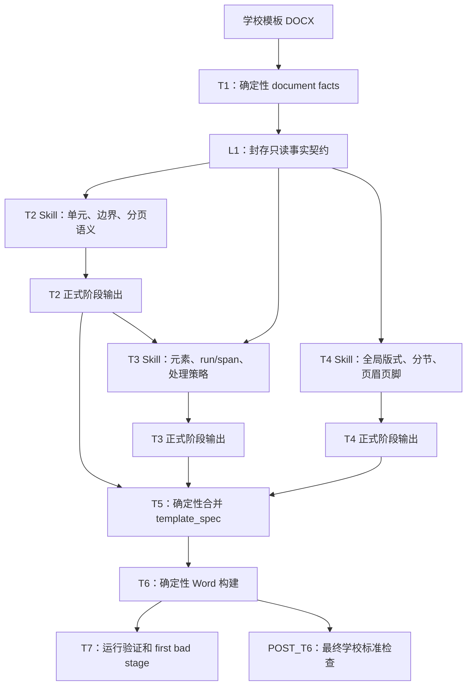

# Claude Agent SDK 模板生成验证方案

## 1. 文档定位

本文整理 Claude Agent SDK 用于 DocFit 模板生成的架构设想、独立开发方式、快速验证路径和 Agent Loop 可验证性设计。

本文是尚未实施的架构提案，不是当前能力说明，也不是某个既有 issue 的第二份 execution plan。若验证后决定正式迁移，必须基于届时的真实运行结果创建或更新对应 issue/plan，并按 `docs/plans/README.md` 补齐执行契约、验收矩阵和残留处理。

本文要回答四个问题：

1. Claude Agent SDK 是否适合替代当前 T2/T3/T4 的 Workflow 编排？
2. 如何在不阻塞现有分支开发的情况下独立验证？
3. 如何复用正在迭代的 T1/L1、T5、T6 代码能力作为 Agent 工具？
4. 如何让多轮 Agent Loop 的过程和最终输出都可回放、可评测、可归因？

## 2. 核心结论

可以快速搭建 Claude Agent SDK 验证版，但不应一开始重写整条模板生成链路。推荐边界是：

> Claude Agent SDK 作为 T2/T3/T4 的受控语义引擎和编排运行时；T1/L1 继续提供客观事实，T5/T6 继续执行确定性合并和 Word 操作，T7/POST_T6 继续独立裁判。

Claude Agent SDK 改变的是 AI 的运行方式，不改变产品阶段责任、共享身份、正式产物和验收标准。

第一轮验证只需要回答：

> 在相同 sealed L1、相同阶段输出合同、相同 T5/T6 和相同 gold/学校标准下，Claude Agent SDK 是否能改善 T2/T3/T4 判断与最终 Word 质量，并且成本、耗时和可诊断性是否可接受？

## 3. 目标架构



长期责任边界：

| 阶段 | 责任 | 是否适合做 Skill | 是否适合做工具 |
| --- | --- | --- | --- |
| T1/L1 | 提取并封存客观事实 | 否 | 是，只读事实查询工具 |
| T2 | 单元、边界、顺序、page ownership 和分页语义判断 | 是 | 阶段校验和提交工具 |
| T3 | 元素、run/span、policy、role、fill source 判断 | 是 | 阶段校验和提交工具 |
| T4 | section、页眉页脚、页码、编号和全局版式判断 | 是 | 视觉查询、阶段校验和提交工具 |
| T5 | 无损合并 T2/T3/T4 契约 | 否 | 是，确定性合并/预览工具 |
| T6 | 执行已明确动作并生成 Word | 否 | 是，构建和 fresh observation 工具 |
| T7/POST_T6 | 独立验证、标准裁判和 owner 归因 | 否 | 是，但不能被生成 Agent 改写 |

## 4. Skill 与 Tool 的边界

Skill 负责“如何基于事实做语义判断”，Tool 负责“读取事实、验证结构、提交产物或执行确定性代码”。

### 4.1 T2 Skill

目标：识别模板单元、边界、顺序、page ownership 和分页策略。

允许使用：

- `load_stage_context("T2")`
- `inspect_sources(source_seq_refs)`
- `inspect_pages(page_numbers)`
- `inspect_layout_facts(refs)`
- `validate_stage_draft("T2", draft)`
- `submit_stage_observation("T2", observation)`

禁止：

- 直接修改 DOCX；
- 自造 `source_seq`、run、span 或 `unit_id`；
- 读取学校 gold/标准；
- 写入 T3/T4/T5 正式产物。

### 4.2 T3 Skill

输入必须是 sealed L1 和已固定 route/hash 的 T2 产物。

主要工具：

- 查询 unit context；
- 查询 raw/logical run 和 span；
- 查询有效样式、对象和视觉证据；
- 校验 policy、role、fill source 和 evidence binding；
- 提交 T3 observation。

### 4.3 T4 Skill

输入必须是 sealed L1 和可用的页面渲染事实，或明确的 render unavailable reason。

主要工具：

- 查询 section、header/footer、field、numbering 客观事实；
- 获取页面图片和 page binding；
- 校验 global layout draft；
- 提交 T4 observation。

### 4.4 第一版工具集合

快速验证版优先使用少量粗粒度工具，而不是把所有内部 Python 函数逐一暴露：

```text
load_stage_context(stage)
inspect_sources(source_seq_refs)
inspect_pages(page_numbers)
inspect_layout_facts(refs)
validate_stage_draft(stage, draft)
submit_stage_observation(stage, observation)
build_preview(t2, t3, t4)
verify_preview(preview)
```

Agent 不应获得通用 Bash、任意文件写入或直接操作 `python-docx` 的能力。工具内部可以继续调用当前正在迭代的代码，但对 Agent 暴露稳定、窄且带 schema 的接口。

## 5. 与当前 Workflow 的关系

### 5.1 两个独立维度

必须区分：

- `code_raw / ai_raw / merged`：业务判断 route；
- `workflow / claude_agent_sdk`：AI runtime。

不要把 Claude Agent SDK 直接新增成第四条业务 route。推荐使用两个独立 run 做对照：

```text
ai_raw + workflow
ai_raw + claude_agent_sdk
```

两种 runtime 继续输出同一正式 observation schema，并进入同一 bridge、materialize、merged、T5、T6 和 judge。

CLI 目标形态可以是：

```bash
# 当前实现
uv run docfit template verify --ai live --ai-runtime workflow ...

# Claude Agent SDK
uv run docfit template verify --ai live --ai-runtime claude-agent-sdk ...
```

第一轮试验不必立即改正式 CLI，可以先提供隔离入口：

```bash
uv run docfit experiment claude-agent \
  --run <existing-template-run> \
  --school hunannongye \
  --stages t2,t3,t4 \
  --out <experiment-output>
```

### 5.2 Runtime 元数据

阶段产物继续使用 `route_id: ai_raw`，另行记录 runtime：

```yaml
route:
  route_id: ai_raw
runtime:
  runtime_id: claude_agent_sdk
  sdk_version: "..."
  model: "..."
  skill_versions:
    t2: "sha256:..."
  tool_schema_hash: "sha256:..."
  session_id: "..."
  tool_call_count: 12
  total_cost_usd: 0.42
```

## 6. 独立分支与 Worktree 开发

当前主工作区存在大量未提交的模板生成改动，SDK 试验不应直接在该目录切分支或覆盖热点文件。

待当前开发形成可引用的共同基线提交后，建立独立 worktree：

```bash
git worktree add \
  /Users/fl/WXP/docfit_v3-claude-agent \
  -b codex/claude-agent-sdk-spike \
  <shared-baseline-commit>
```

目录隔离：

```text
/Users/fl/WXP/docfit_v3
  当前 Workflow 和 T1-T7 迭代

/Users/fl/WXP/docfit_v3-claude-agent
  Claude Agent SDK 验证
```

若 SDK 验证不依赖当前未提交改动，可以从已提交 HEAD 开始；若依赖新的 L1、T2/T3/T4 或验证合同，应等待对应改动形成基线提交后再开始，避免对过期契约开发。

### 6.1 新增优先的目录建议

```text
src/docfit/template_generation/agent_runtime/
  protocol.py
  factory.py
  current_workflow.py
  claude_agent_sdk.py
  trace.py

src/docfit/template_generation/claude_skills/
  t2-unit-analysis/SKILL.md
  t3-element-policy/SKILL.md
  t4-global-layout/SKILL.md

src/docfit/template_generation/claude_tools/
  l1_queries.py
  visual_queries.py
  proposal_submission.py
  validation.py
```

第一阶段应避免大改正在频繁变化的 `runner.py`、`observation_orchestrate.py`、`observation_bridge.py`、`overlay.py` 和 `executor.py`。先通过 adapter 调用它们已有的公开能力，验证成功后再做最小主链接入。

### 6.2 可选依赖

Claude Agent SDK 初期应作为 optional dependency，并固定准确版本，避免普通离线模板生成被 SDK/CLI 版本绑定：

```toml
[project.optional-dependencies]
claude-agent = [
  "claude-agent-sdk==<pinned-version>"
]
```

## 7. 快速验证版

### 7.1 目标

第一版不追求最佳 Prompt、Skill 或工具设计，只验证：

- Claude 能否理解现有阶段边界；
- 是否会按需补查 L1、run/span 和页面事实；
- 多轮 validation feedback 是否减少无证据判断和结构错误；
- 输出能否进入现有 bridge/T5/T6；
- 最终 Word 是否优于当前 Workflow；
- 调用成本、耗时和诊断信息是否可接受。

### 7.2 Skill 初始内容

可以直接把当前的 system、rubric、output contract、exemplar 和 safety 规则重组为三个初版 Skill，不要求第一轮重写到最佳。

### 7.3 Agent Loop

第一版允许的典型循环：

```text
读取 sealed L1 / 固定上游
→ 运行阶段 Skill
→ 按需查询 source/run/span/page/layout facts
→ 提交阶段草稿
→ deterministic validation
→ 根据结构化反馈修正
→ 提交正式 observation
→ 可选 T5/T6 preview
→ T7 诊断
→ 结束并固化证据
```

Agent 可以按模板差异选择不同工具路径，但必须满足阶段合同和安全不变量，不能要求每个模板走完全相同的固定调用顺序。

### 7.4 A/B/C 对照

| 实验组 | 模型/运行方式 | 回答的问题 |
| --- | --- | --- |
| A | 当前 Workflow + 当前模型 | 当前产品基线 |
| B | Claude 单次结构化调用 + 当前 Prompt | 仅更换 Claude 模型带来多少变化 |
| C | Claude Agent SDK + Skills + Tools | Agent Loop 和按需工具调用额外带来多少变化 |

时间紧时可以先跑 A/C，若 C 明显改善，再补 B 区分“模型提升”和“Agent Loop 提升”。

所有组必须固定：

- source template hash；
- sealed L1 hash；
- T3 使用的 T2 route/hash；
- 阶段 schema；
- T5/T6 代码版本；
- gold/学校标准版本；
- 裁判和指标版本。

### 7.5 第一轮样本

先选一所覆盖面较好的真实学校，至少检查：

- 单元边界和顺序；
- 新页、独占页、跨页和 keep 判断；
- 格式说明文字该删还是保留；
- 同段不同 run/span 的不同策略；
- 页眉页脚、页码和分节；
- 最终 Word 的误删、漏填、分页和结构异常。

## 8. Agent Loop 证据链

只保存最终答案不足以验证 Agent SDK。每次运行必须保存 Skill、工具、阶段草稿、校验反馈、正式提交和下游消费。

不记录或评测模型隐藏思维链；只记录可观察的外部行为。

建议输出结构：

```text
agent_run/
  00_request.json
  01_runtime_manifest.json
  02_agent_events.jsonl
  03_tool_calls.jsonl

  stages/
    t2/
      input.json
      attempts/
        attempt_001.json
        attempt_002.json
      final_observation.yaml
      validation_report.json
    t3/
      ...
    t4/
      ...

  outputs/
    02_unit_map.yaml
    03_element_spec.yaml
    04_global_spec.yaml
    05_template_spec.yaml
    06_fillable_template.docx
    06_build_manifest.json
    07_verification_report.json

  evaluation/
    agent_loop_report.json
    stage_quality_report.json
    root_cause_report.json
    full_summary.json
```

### 8.1 Agent Event 最小契约

```json
{
  "event_id": "evt_0012",
  "parent_event_id": "evt_0009",
  "session_id": "session_x",
  "stage_id": "T3",
  "skill_id": "docfit-t3-element-policy",
  "skill_version": "sha256:...",
  "attempt": 2,
  "event_type": "tool_call",
  "tool_name": "inspect_sources",
  "tool_version": "sha256:...",
  "input_hash": "sha256:...",
  "output_hash": "sha256:...",
  "started_at": "...",
  "duration_ms": 384,
  "status": "PASS"
}
```

必须能够回答：

- Skill 读取了哪些事实；
- 调用了哪些工具；
- 工具返回了什么；
- 提交过哪些草稿；
- 哪个 validator 返回了什么问题；
- Agent 是否根据反馈修正；
- 最终正式提交是什么；
- 正式提交是否被下游消费。

## 9. 五层评测体系

### 9.1 输入事实层

验证：

- L1/source template hash 是否一致；
- source/run/span/page 身份是否完整；
- T3 上游 route 是否固定；
- 页面图片和 binding 是否真实可用；
- 工具投影是否截断或漏掉事实。

此层失败的 owner 应是 `tool/t1_l1_projection`、`tool/render_binding` 或 `agent/input_packaging`，而不是 Skill。

### 9.2 Agent Loop 行为层

验证：

- 是否调用未授权工具；
- 是否跨阶段写产物；
- 是否自造身份；
- 是否在证据不足时输出高置信判断；
- validation 失败后是否冒充完成；
- 是否超过 turn、时间或成本预算；
- 是否出现无界往返；
- required tool/check ledger 是否完成；
- 是否违规读取 gold/学校标准。

Loop 合规不等于阶段判断正确；结果偶然正确但违规读取 gold 也必须判失败。

### 9.3 Skill 阶段质量层

复用现有 gold/goal 和阶段标准分别裁判：

| Skill | 主要指标 |
| --- | --- |
| T2 | unit precision/recall、顺序、边界、page ownership、分页字段、证据引用 |
| T3 | run/span 覆盖、policy、role、fill source、误删、漏删、无证据判断 |
| T4 | section、header/footer、page number、numbering、global style、视觉证据 |

每个 Skill 必须产生独立报告，例如：

```json
{
  "skill_id": "docfit-t3-element-policy",
  "status": "FAIL",
  "accuracy": {
    "policy_f1": 0.87,
    "span_coverage": 0.94,
    "unsupported_decision_count": 2
  },
  "first_bad_event_id": "evt_0048",
  "mismatches": [],
  "recommended_owner": "skill/t3"
}
```

### 9.4 阶段消费层

逐字段、逐 identity、逐 hash 对账：

```text
T2 final observation → T2 materialize → unit_map → T5
T3 final observation → T3 materialize → element_spec → T5
T4 final observation → T4 materialize → global_spec → T5
```

如果 T3 Skill 判断正确，但 T5 合并后字段变化，first bad stage 是 T5，owner 是 `code/t5_merge`，不能继续修改 T3 Skill。

### 9.5 最终执行层

检查：

```text
T5 template_spec
→ T6 plan
→ T6 action
→ build_manifest
→ 最终 DOCX fresh observation
```

若上游分页策略和 T5 都正确，但最终 OOXML/渲染未生效，owner 应是 `code/t6_word_execution`。

## 10. Gold 注入矩阵

为了精确隔离 T2/T3/T4 Skill 与 T5/T6 代码问题，使用同一模板运行不同上游组合：

| 运行 | T2 | T3 | T4 | 隔离目标 |
| --- | --- | --- | --- | --- |
| A | Agent | Agent | Agent | 真实端到端表现 |
| B | Gold | Agent | Agent | 排除 T2 错误，观察 T3/T4 |
| C | Gold | Gold | Agent | 单独验证 T4 |
| D | Gold | Gold | Gold | 单独验证 T5/T6 代码链 |
| E | Agent | Gold | Gold | 单独验证 T2 |
| F | Gold | Agent | Gold | 单独验证 T3 |

典型归因：

- A 失败、B 通过：优先修 T2 Skill；
- A/B 失败、C 通过：优先修 T3 Skill；
- A/B/C 失败、D 通过：问题集中在 Agent Skill 路线；
- D 仍失败：即使上游是 Gold，T5/T6 代码仍有问题；
- E 失败：可直接分析 T2 Skill；
- F 失败：可直接分析 T3 Skill。

生成 Agent 永远不能读取 gold。Gold 注入只能由外部评测 harness 执行，并显式标记：

```yaml
evaluation_mode: gold_injection
production_eligible: false
injected_stages:
  T2: gold
  T3: live_agent
  T4: gold
```

## 11. First Bad Node 与 Owner

保留当前 `first_bad_stage`，同时新增更精细的 `first_bad_node`：

```json
{
  "first_bad_stage": "T3",
  "first_bad_node": "T3.skill.final_submission",
  "owner": "skill/t3",
  "skill_id": "docfit-t3-element-policy",
  "skill_version": "sha256:...",
  "event_id": "evt_0048",
  "affected_ids": [
    "unit:abstract_cn",
    "span:source_120.run_3:0-12"
  ],
  "expected": "instruction_remove",
  "observed": "fixed",
  "evidence_refs": ["..."],
  "fix_target": "T3 Skill policy rubric"
}
```

建议 owner 分类：

```text
agent/orchestrator
skill/t2
skill/t3
skill/t4
tool/l1-query
tool/render-query
tool/stage-validation
code/t2-materialize
code/t3-materialize
code/t4-materialize
code/t5-merge
code/t6-plan
code/t6-word-execution
verifier/t7
standard/oracle
```

## 12. 可回放与版本化

每次运行必须绑定：

- Skill 文件 hash；
- prompt/exemplar hash；
- tool schema hash；
- tool implementation version；
- Claude Agent SDK 版本；
- Claude 模型版本；
- L1 hash；
- 上游正式产物 hash；
- T5/T6/verifier 代码版本；
- turn、时间和预算配置；
- session/transcript 标识；
- gold/standard/comparator 版本。

评测回放至少分两种：

1. 固定阶段输入和工具结果，重跑 Agent，观察 Skill/模型稳定性；
2. 固定 Agent 阶段正式输出，重跑 materialize/T5/T6/T7，观察代码稳定性。

修改 Skill 时应尽量只改变一个主要变量，并对固定 gold 集运行回归，避免把模型、工具、Skill 和底层代码同时变化后无法归因。

## 13. 两本账

每次 SDK run 同时维护：

### 13.1 Agent Loop Ledger

记录 Agent、Skill、工具、阶段尝试、validation feedback、预算、终止原因和可回放 trace。

### 13.2 Product Proof Ledger

记录 T1-T7 每个 required standard path 是否被检查、阶段正式输出是否正确、是否被下游消费、最终 Word 是否生效、first bad stage/root cause/owner 是什么。

两本账通过以下身份连接：

```text
event_id
artifact hash
source_seq/source_ref/raw_run_id/logical_run_id/span_id
unit_id/element_id
output_ref/final DOCX hash
```

目标诊断应能达到：

> T3 Skill 在第二次正式提交中把某个 span 错判为 fixed；T5 无损保留，T6 正确执行。因此 first bad node 是 T3 Skill，T5/T6 无需修改。

或者：

> T2/T3/T4 Gold 全部正确，但 T5 丢失分页字段，因此问题属于 T5 合并代码，不属于任何 Skill。

## 14. 评测指标

第一轮至少记录：

### 14.1 产品质量

- T2 unit precision/recall/order/boundary；
- T2 page ownership 和分页字段 coverage/accuracy；
- T3 policy、run/span coverage、误删和漏删；
- T4 section/header/footer/page number/global style；
- `UNKNOWN` 数量及是否合理；
- bridge 拒绝和 manual review 数量；
- T5/T6 silent drop 数量；
- 最终 Word mismatch 数量和严重度。

### 14.2 Agent Loop

- tool call 数量和分布；
- validation retry 次数；
- 无证据结论数；
- 越权调用数；
- 无界循环/预算终止数；
- stage completion 和 terminal reason；
- session 可回放率。

### 14.3 运行成本

- 总 tokens；
- 总费用；
- 各阶段费用；
- 总耗时和各阶段耗时；
- cache 命中；
- 每个正确 item 的平均成本。

## 15. 迁移判定

Claude Agent SDK 不因“能运行”或某个样本改善就替代当前 Workflow。至少需要证明：

1. 同一 sealed L1 下，SDK `ai_raw` 在代表性真实模板上可评；
2. T2/T3/T4 至少主要质量指标不劣于当前 Workflow；
3. SDK merged 不劣于 SDK ai_raw 和 code_raw；
4. 正确阶段判断确实进入 T5/T6 并改善或保持最终 Word；
5. Agent Loop 没有越权、gold 泄漏、无界循环或无法解释的 silent drop；
6. 成本和耗时满足产品可接受范围；
7. 失败可以稳定定位到 Skill、tool、materialize、T5、T6、verifier 或 standard；
8. 固定样本 replay/回归可以在 Skill 迭代后给出可比较结果。

只有满足这些条件，才进入正式替代计划。否则 SDK 保持实验 runtime，当前 Workflow 继续作为基线或 fallback。

## 16. 推荐实施顺序

```text
共同基线提交
→ 独立 worktree
→ StageObservationBackend 窄接口
→ Claude Agent SDK adapter
→ T2 Skill + L1 只读工具
→ 固定 L1 的 A/C 对照
→ T2 gold 注入与 first bad node
→ 接现有 bridge/merged/T5/T6
→ T3 Skill
→ T4 Skill
→ A/B/C 和 Gold 注入矩阵
→ 一校真实 Word 验证
→ 三校 route-eval
→ 决定是否创建正式替代计划
```

第一轮的成功信号不是 SDK route `PASS`，而是已经形成一条真实可运行、可对照、可回放、可归因的最小证据链，并能明确说明效果变化来自 Skill、Agent Loop、工具事实还是 T5/T6 代码。
