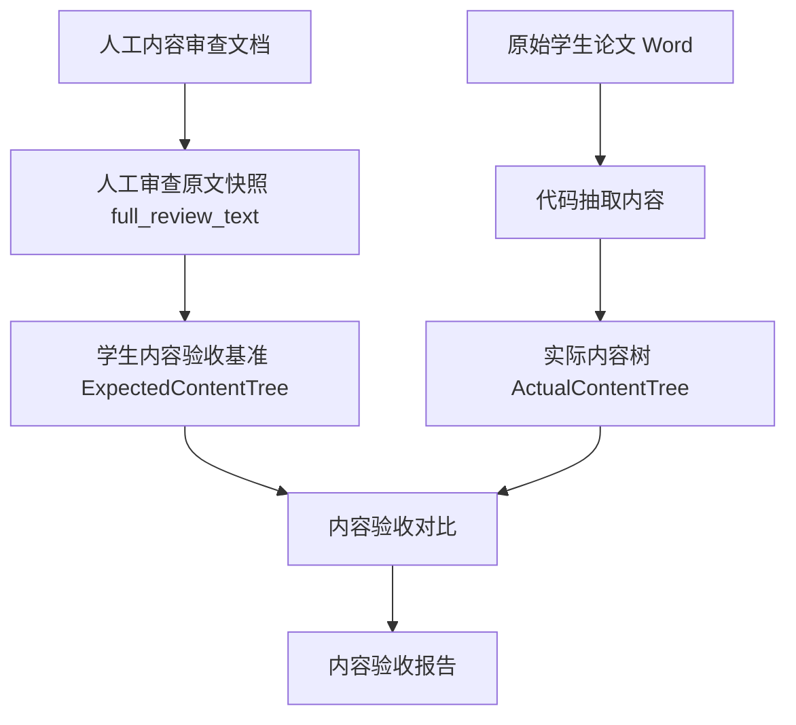
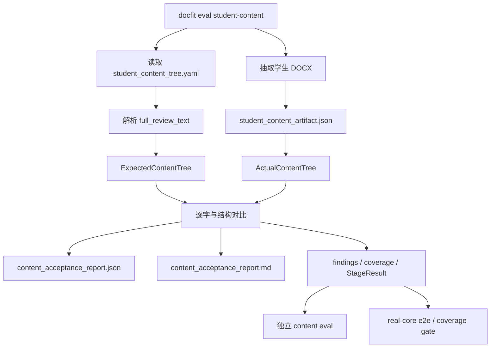

# 学生论文内容独立 Eval Harness 开发计划

Status: Draft
Last reviewed: 2026-06-17

## 执行前约定

```text
Preflight status: DRAFT
Task source: plan path
Canonical source: docs/plans/student-content-eval-harness.md
Route: durable $intuitive-flow
Goal: 建成学生论文内容抽取的独立 eval harness，让系统能确定性报告代码抽取内容和人工内容验收基准之间的一致、不一致、无法证明之处。

Scope:
- 将 3 份人工内容审查文档转成机器可执行的学生内容验收基准 ExpectedContentTree，而不是只保存 full_review_text 原文快照
- 将 student_content_artifact.data.visible_content_ledger 转成实际内容树 ActualContentTree
- 对 ExpectedContentTree 和 ActualContentTree 做逐字、逐节点、逐顺序对比
- 输出树形 content_acceptance_report.json 和 content_acceptance_report.md；每个检查项必须有 path、evidence_refs、next_step
- 新增独立 CLI 入口 docfit eval student-content，并让 real-core-v0 e2e content 阶段复用同一 runner
- 保持 PASS / FAIL / UNKNOWN 阻断语义，UNKNOWN 仍阻断
- 在解析三份真实学生论文之前，先建立最小 PASS 夹具和隔离变异测试，证明检查器会通过正确样本，也会定点拦截错误样本

Non-goals: 不修正学生内容抽取算法；不自动更新人工审查文档、student_content_trees、signed standard、golden 或 expected snapshot；不处理学校模板放置；不处理最终 Word 渲染质量；不用 AI 或人工临场判断替代确定性检查；不把 full_review_text 直接当作可执行验收标准。

Context: must-read=docs/plans/student-content-eval-harness.md, README.md, SPEC.md, src/docfit/cli/main.py, src/docfit/convert/orchestrator.py, src/docfit/stages/content_extract/runner.py, src/docfit/harness/real_core.py, src/docfit/harness/baselines.py, src/docfit/harness/coverage.py, src/docfit/harness/product_quality.py, src/docfit/harness/reports.py, eval_profiles/real-core-v0/expected/student_content_trees/*.yaml, test_test_inputs/content_extraction/real-student-*-content-review.md, tests/contract/test_contract_gates.py, tests/contract/test_real_core_baseline_harness.py, tests/contract/test_real_core_four_stage_problem_checks.py; useful=docs/human/real-core-v0-review-packet.md, docs/human/real-core-v0-four-stage-problem-checks.md, runs/eval/real-core-v0/**/artifacts/student_content_artifact.json; avoid-unless-needed=runs/eval/** 页面图片大文件和完整 final.docx 人工视觉审查材料。

Acceptance:
- SUCCESS: 三份真实学生论文都能独立运行 student-content eval，生成 student_content_artifact、ExpectedContentTree、ActualContentTree、content_acceptance_report.json、content_acceptance_report.md；报告含 known_status、display_status、passed_count、failed_count、unknown_count、blocking_status；当前坏抽取不会 PASS；real-core-v0 e2e / coverage 不再把 full_review_text 绑定当作学生内容抽取正确性的充分证明。
- BLOCKED_NEEDS_DECISION: none
- BLOCKED_NEEDS_LOCAL_VALIDATION: none
- INTERMEDIATE_ONLY: none
- No regressions: bootstrap-core 的 content eval 行为不变；auto_update_allowed 仍为 false；FAIL/UNKNOWN 不被降级；visible content ledger 完整性和 unsupported 可见对象规则不被绕过。

Verification: deterministic=uv run pytest tests/contract/test_student_content_eval_harness.py tests/contract/test_contract_gates.py tests/contract/test_real_core_baseline_harness.py tests/contract/test_real_core_four_stage_problem_checks.py -q; integration=uv run docfit eval student-content --profile real-core-v0 --student test_inputs/students/real-student-001/raw/source_document.docx --out /tmp/docfit_student_001_content; product-run=uv run docfit eval e2e --school hunannongye --student test_inputs/students/real-student-001/raw/source_document.docx --out /tmp/docfit_real_case_student001 and uv run docfit eval coverage --profile real-core-v0 --out /tmp/docfit_real_core_coverage; local-live-manual=none; optional=uv run pytest -q.
Execution: main=监督 $intuitive-flow 按计划分阶段实现、检查报告语义、运行验证并判断 complete/blocked；worker=none；worker-goal=none
To execute: /goal execute docs/plans/student-content-eval-harness.md with intuitive-flow
Approval: LGTM/approve/go ahead approves; edits request revision.
```

## 目标

本阶段的目标不是让学生论文内容抽取立刻正确，也不是修正最终 Word 成品。本阶段的目标是建设一个可以独立运行的 eval harness 模块，用人工审查得到的学生内容验收基准，发现“代码抽取内容”和“人工验收基准”之间的差距。

本阶段也不是让代码重新判断人工审查文档是否正确。人工审查文档是标准来源；它已经被保存到 `student_content_trees/*.yaml` 中，但其中的 `full_review_text` 只是人工审查原文快照，不是最终机器可执行标准。

本阶段真正要做到的是：

1. 把 `student_content_artifact.json` 当成被测对象，而不是当成默认正确的产物。
2. 从人工审查原文快照中解析出机器可执行的 `ExpectedContentTree`。
3. 从代码抽取结果中解析出 `ActualContentTree`。
4. 把两棵树逐字、逐节点、逐顺序对比。
5. 报告每个差距：缺了什么、多了什么、顺序哪里不对、文本哪里不一致、哪些内容仍无法证明。
6. 当前抽取即使是错的，也可以作为输入；eval harness 必须能在具体检查项上返回 `FAIL` 或 `UNKNOWN`，而不是为了让 content 阶段通过而放宽标准。

一句话说明：

```text
人工审查文档负责说明“学生论文内容应该是什么”；
本阶段负责发现“代码实际抽取出来的内容”和“人工内容验收基准”之间还有哪些差距。
```

## 背景输入

真实学生论文输入：

```text
test_inputs/students/real-student-001/raw/source_document.docx
test_inputs/students/real-student-002/raw/source_document.docx
test_inputs/students/real-student-003/raw/source_document.docx
```

人工内容审查文档：

```text
test_inputs/students/real-student-001/raw/content_review.md
test_inputs/students/real-student-002/raw/content_review.md
test_inputs/students/real-student-003/raw/content_review.md
```

当前已签入的学生内容基准文件：

```text
eval_profiles/real-core-v0/expected/student_content_trees/
  real-student-001.yaml
  real-student-002.yaml
  real-student-003.yaml
```

## 名词边界

| 名词 | 含义 | 是否是本阶段被验收对象 |
| --- | --- | --- |
| 原始学生论文 Word | 学生输入或测试输入的论文源文件，例如 `test_inputs/students/real-student-001/raw/source_document.docx` | 否。它是输入来源 |
| 人工内容审查文档 | 人工把学生论文拆成标题、摘要、关键词、正文流、图表、参考文献、附录、致谢后的说明，例如 `test_inputs/students/real-student-001/raw/content_review.md` | 否。它是标准来源 |
| 人工审查原文快照 | 人工内容审查文档的完整原文记录，即 YAML 里的 `full_review_text` | 否。它是可追溯来源，不是最终可执行标准 |
| 学生内容验收基准 | 从人工审查原文快照转译出的机器可执行标准，即 `ExpectedContentTree` | 否。它是裁判标准 |
| 代码抽取内容 | 代码从学生 Word 中抽取出的结果，例如 `student_content_artifact.json` / `visible_content_ledger` | 是。本阶段核心被测对象 |
| 实际内容树 | 从代码抽取内容确定性整理出的实际结构，即 `ActualContentTree` | 是。它要和验收基准对比 |
| 内容验收报告 | 标准和实际内容逐项对比后的报告，例如 `content_acceptance_report.md/json` | 是。它是给人看的问题清单和 gate 证据 |

关键边界：

```text
full_review_text != 验收标准
full_review_text = 人工审查原文快照

验收标准 = 从 full_review_text 转译出的 ExpectedContentTree
```

## 当前目录和职责

```text
docfit_v3/
├── test_inputs/
│   ├── real-student-001-source.docx
│   ├── real-student-001-content-review.md
│   ├── real-student-002-source.docx
│   ├── real-student-002-content-review.md
│   ├── real-student-003-source.docx
│   └── real-student-003-content-review.md
│
├── eval_profiles/real-core-v0/expected/student_content_trees/
│   ├── real-student-001.yaml
│   ├── real-student-002.yaml
│   └── real-student-003.yaml
│
├── src/docfit/stages/content_extract/
│   └── runner.py
│
├── src/docfit/harness/
│   ├── real_core.py
│   ├── baselines.py
│   ├── coverage.py
│   ├── product_quality.py
│   └── reports.py
│
└── tests/contract/
    ├── test_contract_gates.py
    ├── test_real_core_baseline_harness.py
    └── test_real_core_four_stage_problem_checks.py
```

现有文件的实际含义：

| 文件 | 当前作用 |
| --- | --- |
| `test_test_inputs/content_extraction/real-student-*-content-review.md` | 人工审查源。说明学生论文应该保留哪些内容、忽略哪些源格式内容 |
| `student_content_trees/*.yaml` | 当前已签收基准容器。包含 review metadata、source hash、`full_review_text` 和少量 dimensions |
| `src/docfit/stages/content_extract/runner.py` | 当前内容抽取入口。会生成 `student_content_artifact.json` 和 `visible_content_ledger` |
| `src/docfit/harness/real_core.py` | 加载 real-core 学生内容基准 |
| `src/docfit/harness/baselines.py` | 校验 baseline metadata，并按 dimensions 做泛用比较 |
| `src/docfit/harness/product_quality.py` | e2e 后的产品质量检查，会发现标题未分类、旧前置页未处理等问题 |

## 当前真实流程

```text
人工内容审查文档
      ↓
student_content_trees/<student_id>.yaml
      ↓
load_student_content_baseline
      ↓
accepted_expected_artifact
      ↓
compare_to_accepted_expected
      ↓
PASS / FAIL / UNKNOWN
```

这条链路目前可以证明：

- 3 份人工内容审查文档已经作为 `full_review_text` 保存到 YAML。
- YAML 有 `review_metadata`、source hash、`auto_update_allowed: false` 等签收信息。
- baseline 文件可以被加载、校验 metadata、校验 dimensions。
- 缺 baseline、缺签收字段、缺 comparator policy 时会返回 `UNKNOWN`。

这条链路目前不能充分证明：

- 代码实际抽取出的 `visible_content_ledger` 是否覆盖了人工审查中要求保留的内容。
- 旧封面、旧声明、旧目录等应忽略内容是否真的被剔除或标成源格式内容。
- 中文摘要、英文摘要、关键词、正文流、图、表、参考文献、附录、致谢是否逐项匹配人工基准。
- 文本是否逐字一致。
- 正文流顺序是否逐项一致。
- 当前 `content.visible_content_tree = true` 是否来自真实抽取结果和人工基准的对比。

## 和模板差距检测修复计划的对照

`docs/plans/template-gap-engine-layering-refactor.md` 暴露的问题，在学生内容 eval
harness 里有同构风险，但对象不同。模板 gap 检查的是 `generated_template.docx`
是否符合 `template_unit_contract.yaml`；学生内容检查的是
`student_content_artifact.json` 是否符合人工审查转译出的 `ExpectedContentTree`。

| 模板计划里的问题 | 学生内容这里的同构风险 | 本计划必须加入的防线 |
| --- | --- | --- |
| 被测对象口径混乱 | 把原始学生 Word、`full_review_text`、`student_content_artifact.json` 混成一个对象 | 明确 `student_content_artifact.json` / `ActualContentTree` 才是被测结果；原始学生 Word 是输入来源，`full_review_text` 是标准来源快照 |
| 报告平铺，不能按单元排期 | 只输出缺失/多余长清单，无法定位到摘要、正文、图表、参考文献等内容节点 | `content_acceptance_report.json` 必须是树形结果，以 section / node / check 分层，并给每个检查项写 `path` |
| 检查器没看懂却判 `FAIL` | 人工审查段落无法解析、缺 source_ref、遇到 unsupported 可见对象时，被误写成内容抽取失败 | 只有标准明确且实际对比不一致才 `FAIL`；解析能力不足、证据缺失、未建模对象一律 `UNKNOWN` |
| 没有“全对样本必须 PASS”的测试 | 只能证明真实坏样本会失败，不能证明 eval harness 自己会判对 | 最小 PASS 夹具必须先做：完全匹配时 `blocking_status == PASS`，`failed_count == 0`，`unknown_count == 0` |
| 没有“只改一处只失败一处”的隔离测试 | 严格逐字比较可能把一个文本差异扩散成多个无关失败 | 增加单点变异测试：一个空格、一个缺失节点、一个多余旧封面、一个缺 source_ref 都必须定点落在对应 node/check |
| 全文搜索导致跨单元串台 | 同样的标题、图表名、参考文献片段可能被错误匹配到别的段落 | 对齐必须先按 role 和 order，再比较 raw_text；不能把全文子串命中当作节点通过 |

结论：学生内容计划已经覆盖了“`full_review_text` 不是验收标准”和“必须生成
Expected / Actual 两棵树”这两个核心边界，但还需要像模板计划一样把**最小 PASS 夹具、
隔离变异测试、树形报告结构**写成前置要求。本节后面的开发阶段按这个结论调整。

## 目标目录树

```text
src/docfit/harness/student_content_eval/
  __init__.py
  baseline_loader.py
  review_parser.py
  actual_tree.py
  comparator.py
  report.py
  runner.py

eval_profiles/real-core-v0/expected/student_content_trees/
  real-student-001.yaml
  real-student-002.yaml
  real-student-003.yaml

tests/contract/
  test_student_content_eval_harness.py

docs/plans/
  student-content-eval-harness.md
```

## 概念流程图



## 运行流程图



## 独立 eval harness 模块边界

这个模块必须可以独立开发、独立运行、独立失败，不要求模板解析、内容放置、最终渲染同时修好。

模块输入：

```text
student_content_trees/<student_id>.yaml
student_content_artifact.json
student source docx path/hash
```

模块输出：

```text
expected_content_tree.json
actual_content_tree.json
content_acceptance_report.json
content_acceptance_report.md
```

模块只负责：

- 读取学生内容验收基准。
- 把人工审查原文快照解析成 `ExpectedContentTree`。
- 把代码抽取内容解析成 `ActualContentTree`。
- 找出实际抽取内容和验收基准之间的差距。
- 以确定性规则输出逐检查项状态，并汇总成内容验收报告。

模块不负责：

- 修正内容抽取算法。
- 自动改学生输入 Word。
- 自动更新 `student_content_trees/*.yaml`。
- 判断人工审查文档是否正确。
- 判断目标学校模板放置是否正确。
- 判断最终 `final.docx` 是否格式正确。

## 模块职责

| 模块 | 职责 |
| --- | --- |
| `baseline_loader.py` | 读取 `student_content_trees/<student_id>.yaml`，校验签收信息、source hash、禁止自动更新等基础要求 |
| `review_parser.py` | 把 `full_review_text` 解析成 `ExpectedContentTree` |
| `actual_tree.py` | 把 `student_content_artifact.data.visible_content_ledger` 转成 `ActualContentTree` |
| `comparator.py` | 比较 `ExpectedContentTree` 和 `ActualContentTree`，生成结构化 findings |
| `report.py` | 生成 `content_acceptance_report.json` 和 `content_acceptance_report.md` |
| `runner.py` | 提供独立 harness 入口，供 CLI 和 real-core e2e 复用 |

## 内容节点模型

第一版使用统一节点模型：

```text
ContentNode
  node_id
  role
  raw_text
  order
  source_ref
  content_id
  disposition
```

典型 `role`：

```text
title.zh
title.en
abstract.zh.heading
abstract.zh.paragraph
keywords.zh
abstract.en.heading
abstract.en.paragraph
keywords.en
body.heading
body.paragraph
body.image
body.table
reference.heading
reference.item
appendix.heading
appendix.body
acknowledgement.heading
acknowledgement.paragraph
ignored_source_format
```

示例节点 ID：

```text
title.zh
abstract.zh.001
keyword.zh.003
body.014
figure.002
table.001
reference.001
acknowledgement.001
```

## 对比口径

本阶段采用严格逐字对比：

- 不规整空白。
- 不规整换行。
- 不规整标点。
- 不忽略大小写。
- 不做同义词或模糊匹配。
- Word 抽取文本和人工基准文本必须完全一致。

失败规则：

| 情况 | 状态 |
| --- | --- |
| 期望节点缺失 | `FAIL` |
| 实际内容多出不该进入学生内容的旧封面、旧声明、旧目录 | `FAIL` |
| 文本不一致 | `FAIL` |
| 顺序不一致 | `FAIL` |
| 节点类型不一致 | `FAIL` |
| 基准缺失 | `UNKNOWN` |
| 基准无法解析 | `UNKNOWN` |
| 基准缺签收字段 | `UNKNOWN` |
| 遇到 unsupported 可见对象 | `UNKNOWN` |

## 状态语义

状态必须分成两层：**检查项状态**和**汇总状态**。`UNKNOWN` 不能直接代表“整个内容抽取都是 UNKNOWN”，它只能说明某个检查项、某个内容节点、某个解析能力点无法证明。

检查项状态：

| 状态 | 在本模块里的含义 |
| --- | --- |
| `PASS` | 这个具体检查项已经证明实际抽取内容和人工验收基准一致 |
| `FAIL` | 这个具体检查项的标准明确、检查能运行，并发现实际抽取内容和人工基准不一致 |
| `UNKNOWN` | 这个具体检查项无法证明一致，例如基准无法解析、缺来源证据、遇到未建模 Word 对象 |

汇总状态使用同一个组合规则：

```text
先根据已知检查项得到 known_status：
- 只要 failed_count > 0，known_status = FAIL
- 如果 failed_count = 0 且 passed_count > 0，known_status = PASS
- 如果没有任何 PASS/FAIL 检查项，known_status = UNKNOWN

再根据 unknown_count 叠加未知标记：
- unknown_count = 0：展示 known_status
- unknown_count > 0 且 known_status = PASS：展示 PASS + UNKNOWN
- unknown_count > 0 且 known_status = FAIL：展示 FAIL + UNKNOWN
- known_status = UNKNOWN：展示 UNKNOWN
```

报告必须同时保留：

- `known_status`：只根据已知检查项得到的 `PASS`、`FAIL` 或 `UNKNOWN`。
- `display_status`：给人看的组合状态，例如 `PASS + UNKNOWN` 或 `FAIL + UNKNOWN`。
- `unknown_count`：未证明检查项数量。
- `failed_count`：已确认不一致的检查项数量。
- `passed_count`：已证明一致的检查项数量。
- `blocking_status`：是否允许这个模块作为完整证据进入后续 gate。

`blocking_status` 仍然使用现有 gate 枚举：

| 汇总计数 | `display_status` | `blocking_status` |
| --- | --- | --- |
| `failed_count = 0` 且 `unknown_count = 0` | `PASS` | `PASS` |
| `failed_count = 0` 且 `unknown_count > 0` | `PASS + UNKNOWN` | `UNKNOWN` |
| `failed_count > 0` 且 `unknown_count = 0` | `FAIL` | `FAIL` |
| `failed_count > 0` 且 `unknown_count > 0` | `FAIL + UNKNOWN` | `FAIL` |
| 核心输入缺失，无法启动检查 | `UNKNOWN` | `UNKNOWN` |

对 eval harness 开发来说，当前阶段的通过标准不是“学生内容抽取已经 `PASS`”。当前阶段的开发通过标准是：**模块能按同一套组合规则稳定输出 `PASS`、`PASS + UNKNOWN`、`FAIL`、`FAIL + UNKNOWN` 或输入层 `UNKNOWN`，并报告具体差距。**

## CLI 入口

新增独立命令：

```bash
uv run docfit eval student-content \
  --profile real-core-v0 \
  --student test_inputs/students/real-student-001/raw/source_document.docx \
  --out /tmp/docfit_student_001_content
```

可选参数：

```bash
--student-id real-student-001
```

如果不传 `--student-id`，系统按输入路径从 `REAL_CORE_STUDENTS` 推断。

## 需要新增或调整的产物

```text
<out>/
  summary.json
  findings.json
  pm_report.md
  artifacts/
    student_content_artifact.json
    expected_content_tree.json
    actual_content_tree.json
    content_acceptance_report.json
    content_acceptance_report.md
```

每个产物的开发通过标准：

| 产物 | 通过标准 |
| --- | --- |
| `student_content_artifact.json` | 是 eval harness 的被测输入；来自实际内容抽取；包含 source hash、visible content ledger、unsupported 列表 |
| `expected_content_tree.json` | 从人工审查原文快照解析得到；包含标题、摘要、关键词、正文流、图表、参考文献、附录、致谢、忽略项 |
| `actual_content_tree.json` | 从 `visible_content_ledger` 整理得到；节点保留 content_id、source_ref、reading_order、raw_text |
| `content_acceptance_report.json` | 机器可读；每个检查项都有 `PASS`、`FAIL` 或 `UNKNOWN`，汇总层保留 passed/failed/unknown 计数 |
| `content_acceptance_report.md` | 人可读；能看到实际抽取内容和人工基准哪里一致、哪里不一致、哪里无法判断 |

`content_acceptance_report.json` 使用树形主结构，不把平铺 findings 当作唯一报告：

```python
{
    "artifact_type": "student_content_acceptance_report",
    "artifact_version": "1.0",
    "student": {
        "student_id": "real-student-001",
        "source_docx": "test_inputs/students/real-student-001/raw/source_document.docx",
        "source_sha256": "..."
    },
    "baseline": {
        "path": "standards/students/real-student-001/v1/content_extract/student_content_artifact.expected.yaml",
        "source_review": "test_inputs/students/real-student-001/raw/content_review.md",
        "full_review_text_role": "source_snapshot",
        "effective_standard": "ExpectedContentTree"
    },
    "input": ContentCheckResult,
    "sections": [
        {
            "section_id": "abstract.zh",
            "role": "abstract.zh",
            "expected_nodes": 3,
            "actual_nodes": 3,
            "nodes": [
                {
                    "node_id": "abstract.zh.001",
                    "role": "abstract.zh.paragraph",
                    "expected": {"raw_text": "...", "order": 20},
                    "actual": {
                        "content_id": "c_020",
                        "raw_text": "...",
                        "reading_order": 20,
                        "source_ref": "word/document.xml:p[20]"
                    },
                    "checks": [ContentCheckResult],
                    "verdict": "PASS"
                }
            ],
            "counts": {"passed": 0, "failed": 0, "unknown": 0},
            "verdict": "PASS"
        }
    ],
    "extra_actual_nodes": [ContentCheckResult],
    "unsupported_visible_objects": [ContentCheckResult],
    "summary": {
        "known_status": "FAIL",
        "display_status": "FAIL + UNKNOWN",
        "blocking_status": "FAIL",
        "passed_count": 0,
        "failed_count": 0,
        "unknown_count": 0,
        "per_section": [
            {"section_id": "abstract.zh", "verdict": "PASS", "counts": {...}}
        ]
    }
}
```

`ContentCheckResult`：

```python
{
    "check_id": "student_content.raw_text_exact_match",
    "status": "PASS|FAIL|UNKNOWN",
    "type": "missing_expected_node|extra_actual_node|text_mismatch|order_mismatch|source_ref_missing|baseline_unparseable",
    "message": "...",
    "expected": "...",
    "actual": "...",
    "path": ["sections", "abstract.zh", "nodes", "abstract.zh.001", "checks", "raw_text"],
    "evidence_refs": ["c_020", "word/document.xml:p[20]"],
    "next_step": "..."
}
```

`findings.json` 可以从这棵树递归派生；不能只生成平铺 findings 后再反推报告。

`content_acceptance_report.md` 面向人工 review，至少包含：

```text
# 学生内容验收报告

- 总状态
- 学生文档
- 使用的人工基准
- 期望节点数量
- 实际节点数量
- 通过节点数量
- 失败节点数量
- 未知节点数量

## 缺失内容

## 多余内容

## 文本不一致

## 顺序不一致

## 类型不一致

## 无法证明的内容

## 仍需修复的 extractor 问题
```

## Gate 接入

`docfit eval student-content` 可以独立运行。

`real-core-v0` 的 e2e content 阶段必须复用同一个 runner：

```text
extract_student_content
  -> run_student_content_eval
  -> content_acceptance_report
  -> findings / coverage
```

coverage 规则：

```text
content.visible_content_tree = 对比通过
content.body_flow = 正文流顺序通过
content.source_hashes = 基准和源文件 hash 绑定通过
content.unsupported_disposition = 没有 blocking unsupported
content.comparator_policy = 对比器和基准维度可执行
```

只要学生内容验收失败，`real-core-v0` 的 content 阶段不能 `PASS`。

## 开发阶段

### Phase 1：固定 eval harness 边界和输出命名

目标：

- 明确本模块是“学生论文内容抽取的差距发现 eval harness”。
- 明确 `student_content_artifact.json` 是本模块的被测输入，不是本模块要修正的产物。
- 明确 `ExpectedContentTree` 来自人工审查原文快照。
- 明确 `ActualContentTree` 来自代码抽取结果。
- 明确 `content_acceptance_report.json` 的主结构是 section / node / check 树。

建议修改：

- 新增 `src/docfit/harness/student_content_eval/`。
- 新增 runner，能读取 baseline 和 existing `student_content_artifact`。
- 先输出空报告结构和基础 metadata。
- 不改变现有 e2e gate。

通过标准：

- 跑单个学生内容 eval 时，命令必须明确使用哪个学生 DOCX 和哪个 baseline。
- 报告不能再让人误以为 `full_review_text` 本身就是可执行验收标准。
- 报告中的每个检查项都有 `path`、`evidence_refs`、`next_step`。
- 如果缺少 baseline 或无法推断 student_id，输入层状态必须是 `UNKNOWN`，并说明缺少验收基准。

### Phase 1B：先建立最小 PASS 夹具和隔离变异测试

必须先做。否则后续只能证明真实学生样本会失败，不能证明 eval harness 在正确输入上会通过。

目标：

- 构造最小 `ExpectedContentTree` 和完全匹配的 `ActualContentTree`。
- 跑真实 `student_content_eval.runner`，不绕过 summary、report、findings 生成。
- 证明正确样本 `blocking_status == PASS`。
- 证明单点错误只失败对应节点。

建议新增测试 helper：

```python
def write_minimal_expected_tree(root, student_id, nodes): ...
def write_minimal_student_content_artifact(path, nodes): ...
def section_by_id(report, section_id): ...
def node_by_id(section, node_id): ...
def collect_content_checks(report, *, type=None, status=None): ...
```

必须新增的底线测试：

- `test_student_content_eval_minimal_fixture_can_pass_cleanly`
- `test_student_content_eval_single_text_delta_fails_only_that_node`
- `test_student_content_eval_missing_expected_node_is_fail`
- `test_student_content_eval_extra_old_front_matter_is_fail`
- `test_student_content_eval_unparseable_review_section_is_unknown`
- `test_student_content_eval_missing_source_ref_is_unknown`
- `test_student_content_eval_repeated_text_aligns_by_role_and_order`
- `test_student_content_eval_report_uses_tree_paths`

通过标准：

- 最小完全匹配夹具得到 `display_status = PASS`、`blocking_status = PASS`。
- 只差一个空格，只产生一个 `text_mismatch`。
- 删除一个 expected node，只产生对应节点的 `missing_expected_node`。
- 多出旧封面、旧声明、旧目录，进入 `extra_actual_nodes` 并 `FAIL`。
- 缺 `source_ref` 但文本一致时，文本检查可 `PASS`，证据检查必须 `UNKNOWN`，汇总为 `PASS + UNKNOWN`。
- 重复文本只按 role/order 对齐，不做全文任意命中。

### Phase 2：解析人工基准

目标：

- 从 `full_review_text` 中解析出 `ExpectedContentTree`。
- 覆盖 001、002、003 三份学生审查文档。
- 无法解析时返回 `UNKNOWN`，不允许静默跳过。

解析范围：

- 中文标题、英文标题。
- 中文摘要、中文关键词。
- 英文摘要、英文关键词。
- 正文标题结构。
- 正文段落顺序。
- 图片、表格。
- 参考文献。
- 附录、致谢。
- 应忽略的 donor-school 或模板自带前置页。

通过标准：

- `expected_content_tree.json` 中每个节点都有 `node_id`、`role`、`raw_text`、`order`。
- 人工审查中明确“应忽略”的内容必须进入 expected 的 ignored/source-format 区域，而不是正文流。
- 如果某个 section 无法解析，报告中必须明确是哪一段无法转译为验收标准。

### Phase 3：生成实际内容树

目标：

- 从 `visible_content_ledger` 生成 `ActualContentTree`。
- 保留原始文本。
- 保留 `content_id`、`source_ref`、`reading_order`。
- 标记旧封面、旧目录、源格式内容的 disposition。

通过标准：

- `actual_content_tree.json` 中每个节点都能回指到 `content_id` 和 Word 来源位置。
- 文本节点保留原始抽取字符串，不做空白、换行、标点归一。
- 图片和表格节点保留可比对的标题、位置、行列、单元格文本或媒体引用。

### Phase 4：逐字对比和报告

目标：

- 实现缺失、多余、文本不一致、顺序不一致、类型不一致检查。
- 生成 JSON 和 Markdown 报告。
- 报告中必须能定位到具体 `node_id`、`content_id`、`source_ref`。

检查逻辑：

```text
ExpectedContentTree
      +
ActualContentTree
      ↓
按节点 role 和 order 对齐
      ↓
检查 raw_text 是否完全一致
      ↓
检查 expected ignored 内容是否未进入正文流
      ↓
检查实际多余内容是否有明确 disposition
      ↓
输出逐检查项 PASS / FAIL / UNKNOWN
      ↓
汇总 known_status、display_status、failed_count、unknown_count、passed_count
```

模块开发通过标准：

- 构造一个完全匹配基准的最小夹具时，报告 `display_status = PASS`，`unknown_count = 0`，`failed_count = 0`。
- 构造一个只差空格的夹具时，报告 `display_status = FAIL`，并指出具体 node。
- 构造一个缺来源证据夹具且没有不一致时，报告 `display_status = PASS + UNKNOWN`。
- 构造一个既有文本不一致又有缺来源证据的夹具时，报告 `display_status = FAIL + UNKNOWN`。
- 当前真实学生抽取如果仍有问题，应该输出 `FAIL`、`FAIL + UNKNOWN` 或 `PASS + UNKNOWN`，这不算模块失败；这正是模块应该暴露的问题。

### Phase 5：接入 real-core gate

目标：

- 在独立 eval harness 可运行之后，把内容验收结果接入 e2e 和 coverage。
- 接入后，后续 placement、render 不能绕过内容验收报告。

建议修改：

- e2e content 阶段调用 `student_content_eval.runner`。
- coverage 中使用 content acceptance 的结果更新 real-core content 能力点。
- `docfit eval content` 可保持 bootstrap 行为，新命令 `docfit eval student-content` 专门服务 real-core 内容验收。

通过标准：

- 当前错误抽取不能因为有 full_review_text binding 就通过。
- 缺任一关键能力点时，对应能力点是 `UNKNOWN`。
- 如果内容验收返回 `FAIL` 或 `FAIL + UNKNOWN`，e2e 可以继续生成诊断用产物，但 summary 必须保持阻断状态。

## 测试计划

### 单元测试

新增测试重点：

- 解析 001、002、003 的 `full_review_text`。
- 把人工审查文本转成 `ExpectedContentTree`。
- 把 `visible_content_ledger` 转成 `ActualContentTree`。
- 缺 baseline 返回 `UNKNOWN`。
- 基准无法解析返回 `UNKNOWN`。

### 合同测试

新增：

```text
tests/contract/test_student_content_eval_harness.py
```

检查：

- 3 份真实学生论文都能独立运行 student-content eval。
- 3 份人工审查文本都能生成 `expected_content_tree.json`。
- 3 份实际抽取结果都能生成 `actual_content_tree.json`。
- 报告中包含具体失败节点，且每个检查项都有树形 `path`。
- 坏抽取不会 PASS。
- 最小 PASS 夹具先于真实样本测试建立。
- 单点变异测试不会把一个错误扩散成多个无关失败。

### 逐字比较测试

必须覆盖：

- 完全一致时 `PASS`。
- 只差一个空格时 `FAIL`。
- 只差一个换行时 `FAIL`。
- 只差一个标点时 `FAIL`。
- 缺失节点 `FAIL`。
- 多余节点 `FAIL`。
- 顺序错误 `FAIL`。
- 类型错误 `FAIL`。
- 基准无法解析 `UNKNOWN`。
- 缺 source_ref `UNKNOWN`。
- 重复文本按 role/order 对齐，不靠全文子串命中。

### e2e 集成测试

更新：

```text
tests/contract/test_real_core_baseline_harness.py
tests/contract/test_real_core_four_stage_problem_checks.py
tests/contract/test_contract_gates.py
```

检查：

- bootstrap 行为不被破坏。
- real-core 内容验收未通过时，后续阶段不能假装通过。
- `UNKNOWN` 仍然阻断。
- `auto_update_allowed` 仍然必须是 false。

## 验证命令

```bash
uv run pytest tests/contract/test_student_content_eval_harness.py -q

uv run pytest \
  tests/contract/test_contract_gates.py \
  tests/contract/test_real_core_baseline_harness.py \
  tests/contract/test_real_core_four_stage_problem_checks.py \
  -q

uv run docfit eval student-content \
  --profile real-core-v0 \
  --student test_inputs/students/real-student-001/raw/source_document.docx \
  --out /tmp/docfit_student_001_content

uv run docfit eval e2e \
  --school hunannongye \
  --student test_inputs/students/real-student-001/raw/source_document.docx \
  --out /tmp/docfit_real_case_student001

uv run docfit eval coverage \
  --profile real-core-v0 \
  --out /tmp/docfit_real_core_coverage
```

## 每个阶段怎么算通过

| 阶段 | 通过标准 |
| --- | --- |
| 标准准备 | 人工审查文档已经进入 `student_content_trees/*.yaml`，且 review metadata 完整、`auto_update_allowed: false` |
| 底线夹具 | 最小 PASS 夹具先跑通，且单点变异测试能定点失败 |
| 基准转译 | `full_review_text` 被解析成 `ExpectedContentTree`，而不是直接作为可执行标准 |
| 实际树生成 | 从 `visible_content_ledger` 得到 `ActualContentTree`，节点都有 content_id 和 source_ref |
| 标准比对 | 每个 expected node 都有明确 PASS/FAIL/UNKNOWN |
| 报告输出 | 生成树形 JSON 和 Markdown 内容验收报告，人能直接看出失败位置和原因，机器能按 path 定位 |
| gate 接入 | e2e 和 coverage 不再把 full_review_text 绑定当作内容抽取正确 |

## 当前最高风险

1. `full_review_text` 是人工审查原文快照，不是结构化标准；如果直接拿它比对，会让标准和原文来源混在一起。
2. 当前真实抽取的 `visible_content_ledger` 包含旧封面、旧声明、旧目录等源格式内容；这些必须被明确 disposition，不能静默进入正文流。
3. 严格逐字比较会产生大量失败；这不是模块失败，而是 extractor 和人工基准之间的真实差距。
4. 人工审查文本是 Markdown 说明，不是天然机器 schema；第一版 parser 必须对无法解析的 section 返回 `UNKNOWN`。
5. 图片、表格、参考文献和致谢的节点对齐规则如果过度宽松，会把真实丢失内容误判为通过。
6. 如果先做真实样本而不先做最小 PASS 夹具，测试只会证明“会失败”，不能证明“会判对”。
7. 如果报告只保留平铺 findings，后续排期会重新变成不可定位的长清单。

## 非目标

- 不要求本阶段修正内容抽取算法。
- 不自动更新人工审查文档、`student_content_trees/*.yaml`、signed standard、golden 或 expected baseline。
- 不用 AI 或人工临场判断替代确定性验收。
- 不处理学校模板放置。
- 不处理最终 `final.docx` 的格式或视觉验收。
- 不把 `full_review_text` 当作最终可执行验收标准。

## Review Checklist

人工 review 这份计划时重点看：

- 名词边界是否清楚：`full_review_text` 是否只作为原文快照。
- 是否同意 `ExpectedContentTree` 才是真正机器可执行验收标准。
- 是否同意严格逐字对比，不做空白和标点归一。
- 是否同意学生内容验收失败要阻塞 `real-core-v0`。
- 是否同意第一版只做学生内容抽取验收，不混入模板放置和最终 Word 渲染验收。
- 是否同意最小 PASS 夹具和隔离变异测试必须先于三份真实学生样本接入。
- 是否同意报告主结构必须是 section / node / check 树，而不是只有平铺 findings。

## Assumptions

- 3 份人工审查文档和 `student_content_trees/*.yaml` 是当前唯一学生内容验收基准。
- 实现不得自动更新人工基准、golden 或 signed standards。
- 第一版只做学生内容抽取验收。
- 严格逐字比较预计会产生大量失败，这是正常结果。
- 报告目标是明确告诉工程下一步要修哪些内容抽取问题。

## 建议的下一步

把这份文档作为 preflight 输入，下一步只选一个清晰执行目标：

```text
实现学生内容 eval harness 的 baseline loader、ExpectedContentTree parser、
ActualContentTree builder，以及 content_acceptance_report.json/md。
```
