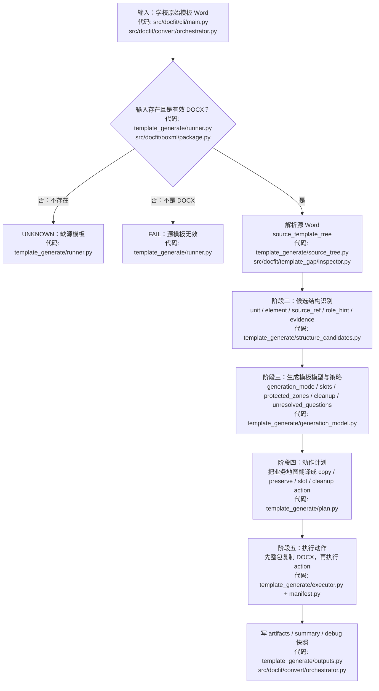
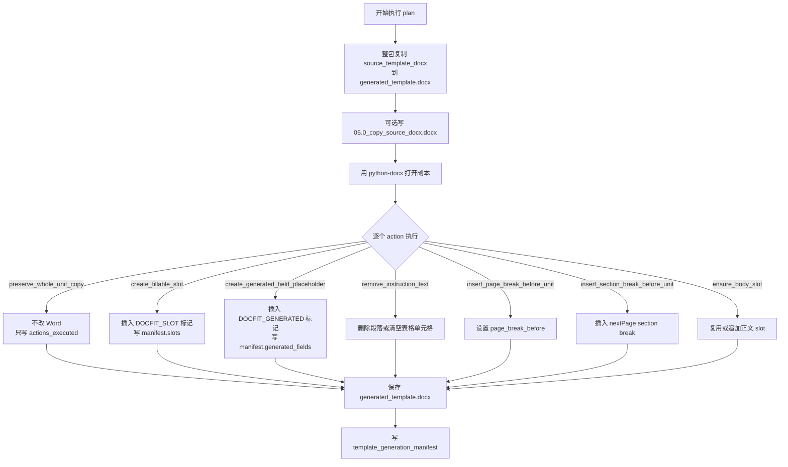

# 模板生成流程优化计划

Last updated: 2026-06-22

当前口径提示：本文是历史方案和执行记录，其中关于“学校标准、学生内容台账作为模板生成策略输入”的设想已经废弃。当前正常生成输入只有学校原始模板 Word；`standards/schools/**` 和学生内容台账不作为 `template-generate` 的输入。当前主线见 `docs/current/template-generation.md`，待核实差距见 `docs/current/template-generation-open-gaps.md`。

一句话结论：模板生成支撑流程应该收敛成五个逻辑步骤：源 Word 事实、候选结构识别、生成模板模型与策略、动作计划、执行与 manifest；其中阶段三产出系统后续要消费的模板业务地图，阶段四才把业务地图翻译成可执行 action。

拆分现状文档：`docs/plans/template-generate-runner-split.md` 记录
`src/docfit/template_generation/runner.py` 已完成拆分后的当前模块地图、仍在使用的旧产物名，以及下一轮需要同步切换的目标契约。

## 文档定位（先读）

这份文件是模板生成支撑流程的目标方案和执行记录。它先定义模板生成最终收敛到什么逻辑边界，再用“当前真实实现”“当前代码”“历史旧产物承载”等段落说明现在代码如何承载这些职责。

读这份文档时按下面口径区分：

| 写法 | 含义 |
| --- | --- |
| 目标方案、目标产物、应该 | 新方案的逻辑边界和未来稳定口径 |
| 当前真实实现、当前代码 | 仓库现在已经实现的方式 |
| 历史旧产物承载 | 本轮切换前的实现方式，用来解释为什么要改 |
| 仍需补齐、目标需要 | 当前还没有完全闭合，不能当成已实现能力 |

所以，“阶段二：候选结构识别”和“阶段三：生成模板模型与策略”在本文里首先是职责拆分。当前代码已经切到 `template_structure_candidates.json -> template_generation_model.json`：阶段二由 `structure_candidates.py` 写候选结构、logical element、`source_seq_refs` 和 `source_context`；阶段三由 `generation_model.py` 写单一生成模型、`unit_strategies`、slots、protected zones 和 cleanup。历史旧产物 `discovered_template_rules.json`、template-generate 内部的 `template_artifact.json` 和 `template_unit_decisions.json` 不再作为本支撑流程的 public artifacts 写出。

如果只想看当前真实流程，以 `docs/current/template-generation.md` 为准；如果要讨论下一步怎么核实当前差距，以 `docs/current/template-generation-open-gaps.md` 为准。本文只保留历史背景和已经发生的执行记录，不再作为当前下一步目标的唯一来源。

## 评测层追责原则（先读）

这部分先定义评测层要解决的问题，不定义业务代码应该怎么实现。

当前最终 `template-gap` 能告诉我们“生成模板不符合标准”，但不能稳定说明问题最早出在哪个生成阶段。后续评测层要解决的是：

```text
每个阶段拿到的输入是否可信？
如果输入可信，本阶段输出错了，才能追责到本阶段。
如果输入不可信，本阶段及后续失败只能标成下游症状，不能直接追责本阶段。
```

### 评测层只负责什么

| 评测层负责 | 不负责 |
| --- | --- |
| 定义阶段评测对象：看哪些输入产物、输出产物和报告 | 不决定业务阶段内部怎么拆函数或模块 |
| 定义通用检查结构：输入检查、输出检查、状态、证据和归因 | 不修改业务阶段产物 |
| 定义每个阶段将来如何挂标准和 verifier | 不在标准未确定时硬写语义结论 |
| 聚合 `first_bad_phase` 和下游症状 | 不把最终 gap 的所有问题都归到最后阶段 |
| 记录未配置 verifier 的阶段 | 不把未配置阶段伪装成 PASS |

### 通用评测结构

每个阶段评测结果都应该分成两部分：

| 检查 | 作用 |
| --- | --- |
| `input_check` | 判断本阶段拿到的输入产物是否可信，是否满足本阶段可以工作的前提 |
| `output_check` | 在输入可信的前提下，判断本阶段输出是否满足本阶段自己的职责 |

追责规则：

| 情况 | 归因 |
| --- | --- |
| `input_check != PASS` | 不追责当前阶段；当前阶段标为 `downstream_blocked` 或 `upstream` |
| `input_check == PASS` 且 `output_check != PASS` | 追责当前阶段，`root_cause_phase = 当前阶段` |
| `input_check == PASS` 且 `output_check == PASS` | 当前阶段可信，允许下游继续追责 |
| verifier 或标准不足以判断 | `UNKNOWN`，并标明 `unknown_due_to_missing_standard` 或 `not_configured` |

状态仍然只使用 `PASS / FAIL / UNKNOWN`。不要新增最终状态。追责信息放在额外字段里：

```json
{
  "phase_id": "structure_discovery",
  "input_check": {"status": "PASS"},
  "output_check": {"status": "FAIL"},
  "status": "FAIL",
  "attribution": {
    "root_cause_phase": "structure_discovery",
    "kind": "current_phase",
    "confidence": "high",
    "reason": "input passed, output violated this phase contract"
  }
}
```

### 当前可以先做什么

这些事项只依赖评测层设计，不依赖业务阶段最终产物细节，可以先做：

| 可做事项 | 说明 |
| --- | --- |
| 定义 `phase_check` 结果结构 | 包含 `phase_id`、`input_check`、`output_check`、`status`、`gate_enabled`、`verification_state`、`attribution` |
| 定义 `first_bad_phase` 聚合规则 | 按阶段顺序找第一个输入可信但输出失败/未知的阶段；后续失败标为下游症状 |
| 定义通用 finding 字段 | 复用现有 `Finding` 思路：`type`、`message`、`expected`、`actual`、`evidence_refs`、`affected_ids` |
| 定义标准文件模板 | 先规定每个阶段标准将来必须写哪些栏目，不填具体业务条件 |
| 定义未配置 verifier 的表达方式 | `gate_enabled=false`、`verification_state=not_configured`、`status=null`，不参与 gate |
| 把最终 `template-gap` 作为示例阶段 | 它已经有真实 verifier，可以作为 `final_template_gap` 的示例，不代表其他阶段都已可验收 |
| 明确报告展示规则 | 报告必须区分 `root_cause_phase`、`downstream_symptom`、`not_configured` 和 `unknown_due_to_missing_standard` |

### 现在先不做什么

这些事项依赖业务阶段职责、输出产物或代码边界，先停下来：

| 暂缓事项 | 为什么暂缓 |
| --- | --- |
| 给每个业务阶段写完整语义 verifier | 阶段职责和标准还未最终确定，提前写会把临时实现固化成标准 |
| 规定每个阶段的完整 artifact schema | 当前产物名和 JSON 形状仍由旧产物层承载，具体形状要等业务阶段边界稳定 |
| 判断某个 unit 应该 copy-only 还是 copy-then-patch | 这是业务策略，不是评测层底座 |
| 判断阶段二应该如何合并 logical element | 这是业务识别逻辑，评测层只先定义“将来要能检查输入可信和输出可信” |
| 用评测层底座直接改 `template_generate` 业务代码 | 评测层只定义归因和检查结构；业务代码怎么改见上面的“代码改造执行计划” |
| 把中间阶段纳入最终 gate | 没有标准和 verifier 前不能 gate，也不能伪装成 PASS |

### 阶段标准将来必须包含什么

每个阶段标准确定时，至少要写清楚这些栏目：

| 栏目 | 说明 |
| --- | --- |
| `phase_id` | 阶段稳定 ID |
| `owned_boundary` | 本阶段负责验收什么，不负责什么 |
| `input_artifacts` | verifier 读取哪些输入产物 |
| `output_artifacts` | verifier 检查哪些输出产物 |
| `input_assumptions` | 输入必须满足什么，当前阶段才可以被追责 |
| `output_guarantees` | 本阶段输出必须保证什么 |
| `pass_conditions` | 什么证据足以判定 PASS |
| `fail_conditions` | 什么证据足以判定 FAIL |
| `unknown_conditions` | 什么情况不能证明正确，必须 UNKNOWN |
| `evidence_requirements` | 必须保留哪些 source_ref、hash、路径或 action id |
| `gate_policy` | 是否参与最终 gate，何时启用 |

标准未确定前，只允许做接口级检查和归因框架，不做阶段语义结论。

## 这个文件做什么

这个文件是模板生成流程优化计划，主口径是新方案。它不是只讨论“默认仅复制单元”，而是把模板生成阶段里几个关键决策放到同一个流程里对齐：

- 哪些区域只保留学校原始模板；
- 哪些区域要生成字段或占位；
- 哪些区域要承载学生内容；
- 哪些区域需要线下人工填写；
- 当前无法判断时应该进入 `UNKNOWN`、`needs_review` 还是继续生成。

复制单元是这个流程里的一个决策结果，不是唯一目标。

它回答这些问题：

| 问题 | 本文件回答 |
| --- | --- |
| 这是新方案还是现状 | 主体写目标方案和执行结果；凡是现状都用“当前真实实现 / 当前代码”单独标出，历史实现用“历史旧产物承载”标出 |
| 模板生成要优化什么 | 从“按 unit_id 排除列表”升级为“硬编码基线 + 源模板内容责任 + 证据不足时待复核”的策略选择 |
| 哪些区域可以仅复制 | 学校固定正文、签名日期、教师意见、成绩评定等不由机器填写的区域 |
| 哪些区域不能默认仅复制 | 中文摘要、英文摘要、目录族、正文、参考文献，以及有学生内容的致谢/附录 |
| 判定发生在哪一步 | 阶段三“生成模板模型与策略”里确认 `generation_mode = whole_unit_copy` / `copy_then_patch` / `needs_review` |
| 判定前上游给什么 | 阶段一提供源 Word 事实；阶段二提供 unit、element、source_ref、role_hint 和证据 |
| 判定后元素怎么处理 | 阶段三把 copy-only、slot、protected zone、cleanup 和 unresolved question 统一写进模板业务地图 |
| 执行时 Word 怎么变 | 阶段四把业务地图翻译成 action plan；`preserve_whole_unit_copy` 保留整体结构，copy-only 内部说明文字仍可产生 `remove_instruction_text` |
| 和其他单元有什么不同 | copy-only 单元的元素处理只做清理和保护；非 copy-only 单元会按元素生成 slot、生成字段占位、删除说明文字或插入固定文本 |

## 目标逻辑关系

一句话结论：目标方案里，阶段二只给识别证据，阶段三生成模板业务地图和处理策略，阶段四只生成动作计划。

| 逻辑步骤 | 输出 | 回答的问题 | 不做什么 |
| --- | --- | --- | --- |
| 阶段一：源 Word 事实 | `source_template_tree.json` | 学校原始 Word 里实际有什么段落、表格、样式、页眉页脚、source_ref | 不判断业务单元，不决定生成策略 |
| 阶段二：候选结构识别 | `template_structure_candidates.json` | 这些事实看起来属于哪些 unit / element，有哪些 role_hint 和 evidence | 不输出 `whole_unit_copy` / `copy_then_patch`，不生成 slot 或 action |
| 阶段三：生成模板模型与策略 | `template_generation_model.json` | 这个模板在系统里是什么业务地图；每个 unit 怎么处理；哪些是 slots、protected_zones、cleanup、unresolved_questions | 不直接改 Word，不生成 python-docx 执行动作 |
| 阶段四：动作计划 | `template_generation_plan.json` | 为了实现阶段三的业务地图，需要执行哪些 copy / preserve / slot / cleanup action | 不重新判断 unit 语义，不反推业务模型 |
| 阶段五：执行与记录 | `generated_template.docx` + `template_generation_manifest.json` | 实际执行了哪些 action，输出 Word 和 hash 是什么，哪些 action 需要 review | 不重新决定内容应该放哪里，不决定 PASS / FAIL |

阶段三是这条目标链路的核心分界：它把阶段二的“看起来像什么”变成系统后续稳定消费的业务地图。
阶段四只是把这个业务地图翻译成执行器能跑的动作清单。

例如封面里有 `论文题目：____` 和 `格式说明：小四宋体`：

| 步骤 | 应该输出什么 |
| --- | --- |
| 阶段二 | `cover` 单元；`论文题目：____` 是填写信号；`格式说明` 是说明文字候选；都带 source_ref 和 evidence |
| 阶段三 | `cover = whole_unit_copy`；不生成 cover slot；`格式说明` 进入 cleanup；固定/人工区域进入 protected_zones |
| 阶段四 | 生成 `preserve_whole_unit_copy cover` 和 `remove_instruction_text <source_ref>` 等 action |
| 阶段五 | 复制 Word，执行 action，写 manifest |

下方各阶段按“目标职责”说明；涉及当前代码时会单独标注“当前实现承载”。不要把目标产物名直接理解成当前已经稳定写出的文件名。

## 当前真实实现

当前代码的 copy-only 默认规则仍按 `unit_id` 判断。这是实现现状，不是长期定义。

当前阶段二/阶段三已经切到目标产物链：

| 目标职责 | 当前实现承载 |
| --- | --- |
| 阶段二候选结构识别 | `structure_candidates.py` 写 `template_structure_candidates.json`，已有第一版 logical element、`role_hint`、`source_seq_refs`、`source_context` 和 copy-only 受限内部候选 |
| 阶段三生成模板模型与策略 | `generation_model.py` 写 `template_generation_model.json`，把候选 `candidate_policy` materialize 成最终 `policy`，并集中输出 `unit_strategies`、slots、protected zones、cleanup 和 unresolved questions |
| 历史 `discovered_template_rules.json` | 已从 template-generate public artifacts 移除，不再双写兼容输出 |
| 历史 `template_artifact.json` + `template_unit_decisions.json` | 已在 template-generate 支撑流程中收敛为 `template_generation_model.json`；业务四阶段里的 template_parse `template_artifact.json` 不属于这次改名范围 |

已修正的偏差：copy-only 单元不再完全跳过内部元素分析。阶段二会为 copy-only 单元写出单元级 `whole_unit_copy` 候选和内部受限候选元素；阶段三会把内部说明文字 materialize 成 cleanup，把内部填写/生成候选 materialize 成固定保留证据，不会自动生成学生内容 slot。`whole_unit_copy` 只表示“主体结构和固定内容通过整包复制保留”，不表示“内部说明文字免处理”。

这些单元不走默认仅复制：

| unit_id | 中文含义 | 为什么排除 |
| --- | --- | --- |
| `abstract_cn` | 中文摘要 | 通常需要承载学生摘要、关键词等可填写内容 |
| `abstract_en` | 英文摘要 | 通常需要承载英文摘要、关键词等可填写内容 |
| `toc` | 目录族 | 通常需要系统生成或保留字段机制；图目录、表目录当前可能作为 `toc` 内元素或字段要求出现 |
| `body_main` | 正文 | 学生正文内容的主要写入区域 |
| `references` | 参考文献 | 通常来自学生文档，不能默认把源模板里的参考文献区域当成最终内容 |

## 代码改造执行记录（按阶段）

一句话结论：本轮代码优化没有继续拆模块，而是在现有模块里把阶段产物切到目标形态。最核心的改动是阶段二把原始 entry 汇总成带 `source_seq_refs` 的 logical element，阶段三把旧的 `template_artifact + template_unit_decisions` 合并成单一 `template_generation_model`。

### 总调用链怎么改

切换前 `runner.py` 调用链是：

```python
request = build_template_generation_request(...)
source_tree = inspect_source_template_docx(source_template_docx)
discovered_rules = infer_template_rules(source_tree)
template_artifact = build_template_artifact(request, source_tree, discovered_rules)
decisions = build_template_unit_decisions(template_artifact)
plan = build_template_generation_plan(
    request,
    template_artifact=template_artifact,
    decisions=decisions,
)
manifest = build_template_generation_manifest(
    request=request,
    source_tree=source_tree,
    discovered_rules=discovered_rules,
    template_artifact=template_artifact,
    decisions=decisions,
    plan=plan,
    ...
)
```

当前 `runner.py` 调用链已改成：

```python
request = build_template_generation_request(...)
source_tree = inspect_source_template_docx(source_template_docx)
structure_candidates = build_template_structure_candidates(source_tree)
generation_model = build_template_generation_model(
    request,
    structure_candidates=structure_candidates,
)
plan = build_template_generation_plan(
    request,
    generation_model=generation_model,
)
manifest = build_template_generation_manifest(
    request=request,
    source_tree=source_tree,
    structure_candidates=structure_candidates,
    generation_model=generation_model,
    plan=plan,
    ...
)
```

这次切换只针对 `template_generate` 支撑流程。业务四阶段里的模板解析产物 `template_artifact.json` 仍是 `template_parse`、placement、render 当前使用的业务产物，不在这次重命名范围里。

### 阶段一代码怎么改

| 文件 / 函数 | 具体改动 | 验收断言 |
| --- | --- | --- |
| `source_tree.py::_body_flow_from_inspection` | 先收集并按 `order/source_ref` 排好所有可见 entry，再统一分配 `source_seq = 1..n` 和 `source_seq_label = 源模板元素 001`；不要在排序前编号 | `layers.body_flow[].source_seq` 连续、唯一，顺序和 debug 里看到的可见流一致 |
| `source_tree.py::inspect_source_template_docx` | 在 `indexes` 里新增 `by_source_seq`，每个序号可回查 `node_id`、`source_ref`、`text_preview`、`structure_layer` | 人工说“源模板元素 12”时，可以直接定位到原始节点 |
| `tests/contract/test_template_generate.py` | 新增阶段一断言：有 `source_seq`、有 `source_seq_label`、有 `indexes.by_source_seq`，且没有重复序号 | 后续阶段有稳定定位锚点 |

### 阶段二代码怎么改

| 文件 / 函数 | 具体改动 | 验收断言 |
| --- | --- | --- |
| `structure_candidates.py::infer_template_rules` | 改为 `build_template_structure_candidates`，产物 `artifact_type` 改为 `template_structure_candidates`；public artifact key 改成 `template_structure_candidates` | `--out/artifacts/template_structure_candidates.json` 存在；不再写 `discovered_template_rules.json` |
| `_body_entries` | 要求每个 entry 带 `source_seq`；过滤页眉页脚的同时保留它们到 `source_context.header_footer` | 正文 unit 不混入页眉页脚，但阶段三仍能拿到页眉页脚上下文 |
| `_infer_units` / `_unit_anchors` | unit 增加 `source_range`、`source_seq_range`、`source_seq_refs[]`、`anchors[]`；anchor 证据写 `source_ref + source_seq` | 单元范围能用原始序号解释，例如 cover 覆盖 1-6 |
| `_infer_elements` | 拆成三步：`entry -> fragment -> logical element -> role_hint/evidence`；本轮先实现连续说明文字合并，表格同一行 label+blank 和句子/段落 continuation 后续继续补 | 合并后的 element 保留全部 `source_refs[]`、`entry_refs[]`、`source_seq_refs[]` 和 `merge.reason` |
| `_copy_only_unit_elements` | 不再把 copy-only 写成最终策略；输出单元级 `copy_region_candidate` 和内部受限 logical elements。内部 `student_field_candidate` 只能作为证据，不能在阶段二变成 slot | copy-only 封面里的 `论文题目：____` 仍有候选证据，但阶段二不输出最终 `generation_mode` |
| `_element_policy` | 保留为内部启发式也可以，但输出字段应改成 `role_hint` / `candidate_policy`，不要让阶段二的 `policy` 被误读成最终处理策略 | 阶段二 schema 中没有最终 `whole_unit_copy` / `copy_then_patch` |
| 新增 `_source_context_from_source_tree` | 把 `body_order`、`by_source_ref`、`by_source_seq`、`style_inventory`、`numbering_definitions`、`section_rules`、`header_footer`、`unknown_objects` 从阶段一整理到 `source_context` | 阶段三不再为了页面、样式、编号、页眉页脚直接回读完整 `source_tree` |
| `tests/contract/test_template_generate.py` | 更新旧断言：读 `template_structure_candidates.json`；新增 logical element 合并、`source_seq_refs[]`、阶段二不输出最终策略的断言 | 阶段二真正变成“候选结构和证据” |

### 阶段三代码怎么改

| 文件 / 函数 | 具体改动 | 验收断言 |
| --- | --- | --- |
| `generation_model.py::build_template_generation_model` | 已替代旧的 template-generate `build_template_artifact` 写法，产物 `artifact_type = template_generation_model` | `--out/artifacts/template_generation_model.json` 存在；不再写 template-generate 的 `template_artifact.json` |
| 阶段三 unit 决策构建 | 旧的 `build_template_unit_decisions` 不再作为单独 public 产物；逻辑并入 `template_generation_model.unit_strategies[]`、`slots[]`、`protected_zones[]`、`cleanup[]` | 没有 `template_unit_decisions.json`；每个 unit 的策略仍可追踪 |
| `_materialize_template_units` | 改为消费阶段二的 logical elements 和 `role_hint`；输出确认后的 `units[]`、最终 `policy` 或 `final_disposition` | 阶段三才出现最终 `generation_mode`、slot、cleanup、protected zone |
| 新增 `_build_unit_strategies` | 集中决定 `whole_unit_copy` / `copy_then_patch` / `needs_review`；当前使用正向默认 copy-only 白名单，后续再接学校标准和学生内容台账 | cover 默认 whole copy，references 和 custom/other 默认 copy_then_patch |
| 新增 `_build_cleanup` | 把 `role_hint = instruction_candidate` 的 logical element 转成 `cleanup[]`，保留 `source_refs[]`、`source_seq_refs[]`、evidence | copy-only 内部说明文字能进入 cleanup |
| 新增 `_build_protected_zones` | 把固定学校内容、人工填写区、copy-only 保留范围写入 `protected_zones[]` | copy-only 内部固定/人工内容不会被误删，也不会生成 slot |
| 新增 `_build_slots` | 只对 `copy_then_patch` 单元里的学生内容位和系统生成位生成 slot / generated field；copy-only 内部填空默认只写证据或 unresolved question | 封面 `论文题目：____` 不生成 cover slot；参考文献仍能生成 slot |
| 新增 `_build_unresolved_questions` | 汇总阶段二 conflicts、unknowns、copy-only 内部强填写信号、缺标准判断等 | 证据不足时不假装成功，后续能定位 |
| `tests/contract/test_template_generate.py` | 旧的 `template_artifact` / `template_unit_decisions` 断言改成读 `template_generation_model`；新增 cleanup、protected zone、unit strategy、source_seq trace 断言 | 阶段三是单一业务模型口径 |

### 阶段四代码怎么改

| 文件 / 函数 | 具体改动 | 验收断言 |
| --- | --- | --- |
| `plan.py::build_template_generation_plan` | 签名改成 `build_template_generation_plan(request, generation_model=...)`，不再接 `template_artifact` 和 `decisions` 两个输入 | plan 的 `input_hashes` 只引用 `template_generation_model` |
| page / section action 生成 | 从 `generation_model.units[]` 或 `unit_strategies[]` 读取页面规则；不重新判断 unit 语义 | 页面动作仍存在，但来源是阶段三模型 |
| slot / generated / manual action 生成 | 从 `generation_model.slots[]`、`required_fields[]`、`protected_zones[]` 生成 action | plan 不再读取阶段二候选字段来判断业务 |
| cleanup action 生成 | 从 `generation_model.cleanup[]` 生成 `remove_instruction_text` | copy-only 内部说明文字仍能删除 |
| 所有 action | 增加 `affected_source_seq_refs[]` 和可选 `source_seq_reason`；从阶段三对象直接透传 | manifest 可回答“删除/保留的是源模板元素几” |
| `tests/contract/test_template_generate.py` | 检查 `remove_instruction_text`、`preserve_whole_unit_copy`、`create_fillable_slot` 等 action 都带来源序号 | 误删、误合并可以按序号追责 |

### 阶段五和输出代码怎么改

| 文件 / 函数 | 具体改动 | 验收断言 |
| --- | --- | --- |
| `executor.py::_executed` / `_needs_review` | 已经会保留 action 字段；确认不要丢 `affected_source_seq_refs[]` | `actions_executed[]` 和 `actions_requiring_review[]` 都带来源序号 |
| `executor.py::_slot_from_action` | slot 记录补 `source_seq_refs[]` 或 `affected_source_seq_refs[]` | manifest.slots 能回到原始元素 |
| generated field 记录 | generated field 记录补来源序号 | manifest.generated_fields 能回到原始元素 |
| `manifest.py::build_template_generation_manifest` | 输入改成 `structure_candidates` 和 `generation_model`；`input_hashes` 改成 `template_structure_candidates`、`template_generation_model`、`template_generation_plan` | manifest 不再引用旧 `discovered_template_rules/template_artifact/template_unit_decisions` |
| `outputs.py::write_template_generation_outputs` | public artifacts 改成 `template_generation_request`、`source_template_tree`、`template_structure_candidates`、`template_generation_model`、`template_generation_plan`、`template_generation_manifest` | artifacts 目录没有旧阶段二/三文件 |
| `outputs.py::write_template_generation_debug_snapshot` | debug 快照改成 `00_*`、`01_source_template_tree`、`02_template_structure_candidates`、`03_template_generation_model`、`04_template_generation_plan`、`05.0/05.1/05.2`、`99_index` | debug 文件名按阶段编号，不按旧流水编号 |
| `runner.py::_coverage` | coverage key 改成 `template_generation.structure_candidates`、`template_generation.generation_model` 等目标名 | summary 里不再出现旧产物 coverage key |

### 消费者和测试怎么同步

| 位置 | 具体改动 |
| --- | --- |
| `tests/contract/test_template_generate.py` | 这是主测试改动点：更新文件名、artifact_type、debug 编号、source_seq、阶段二合并、阶段三模型、action trace 断言 |
| `src/docfit/convert/orchestrator.py` | `_artifact_refs` 自动读 `StageResult.artifact_paths`，通常只要 runner/artifact key 更新即可；但要检查 e2e summary 里是否有旧 key 断言 |
| `docs/current/template-generation.md` | 已同步为当前真实实现：阶段二/三新产物、source_seq 追踪、阶段编号 debug 文件名和验证记录 |
| 全仓搜索 | 用 `rg "discovered_template_rules|template_unit_decisions|03_discovered|04_template_artifact|05_template_unit"` 找残留；`template_parse` 业务产物里的 `template_artifact` 不属于本次清理 |

### 最小提交切分

| 提交 | 内容 | 先跑什么 |
| --- | --- | --- |
| 1 | 阶段一 `source_seq` + 测试 | `uv run pytest tests/contract/test_template_generate.py -q` |
| 2 | 阶段二 `template_structure_candidates` + logical element 合并 + 测试 | 同上 |
| 3 | 阶段三 `template_generation_model` 替代旧双产物 + 测试 | 同上 |
| 4 | 阶段四/五 trace、manifest、outputs/debug 重命名 + 测试 | 同上 |
| 5 | 全仓消费者和文档同步 | `uv run pytest tests/contract/test_template_generate.py -q`，必要时补 `uv run pytest tests/contract -q` |

## 目标判断口径

下一步优化不应该只传硬编码列表，也不应该完全放弃硬编码。更稳的方式是：

```text
硬编码基线
  + 源模板里的单元语义和内容责任证据
  + 源模板里的占位符、字段、表格、样式和上下文
  + 证据不足时的 UNKNOWN / needs_review
```

也就是说，硬编码只能作为“已知通用单元”的起点，不能作为最终裁判。

建议使用下面的责任口径：

| 单元责任 | 例子 | 处理 |
| --- | --- | --- |
| 系统生成/更新 | 普通目录、图目录、表目录、页码、编号 | 不是默认仅复制；需要字段、占位或更新机制 |
| 学生内容写入 | 摘要、正文、参考文献，以及源模板自身表明应承载学生内容的致谢、附录 | 不是默认仅复制；需要 slot 或 placement 去向 |
| 线下人工填写 | 签名、年月日、教师意见、成绩评定、答辩记录 | 可以仅复制；机器不为这些线下填写线生成 slot |
| 学校固定正文 | 原创性声明、授权说明、固定表单正文 | 可以仅复制；保留固定文本和结构 |
| 条件单元 | 致谢、附录、封面元数据 | 取决于源模板自身证据和产品是否负责自动填写 |

例如 `acknowledgement` 不能永远写成 copy-only：如果源模板自身提供了致谢标题、正文占位或明确填写痕迹，它应进入学生内容写入路径或待复核路径；如果源模板只给固定说明或人工确认区域，可以保留模板里的标题、占位和人工提示，并把是否删除或保留写成条件规则或 `open_questions`。

如果后续新增 unit，先判断内容责任，再决定是否仅复制。不要只因为它不在排除列表里就默认仅复制。

## 策略判定优先级

目标规则可以按下面顺序执行。这样既保留硬编码的稳定性，也避免新学校单元被硬编码误伤。

| 优先级 | 证据来源 | 判定方式 | 输出 |
| --- | --- | --- | --- |
| 1 | 源模板明确结构和元素证据 | 标题、字段、占位、表格、签名日期、教师意见、成绩评定等语义信号优先 | `copy_then_patch`、`whole_unit_copy` 或 `needs_review` |
| 2 | 通用硬编码基线 | 对稳定通用单元给默认责任：目录族=生成，摘要/正文/参考文献=学生内容，声明/签名表单=固定或人工 | 初始策略 |
| 3 | 单元名称和上下文语义 | 用标题、邻近段落、表格边界和样式信号修正硬编码基线 | 策略修正 |
| 4 | 解析证据是否充分 | 缺 source_ref、边界不稳定、有 unknown visible objects 时，不把猜测当成功 | `needs_review` / `UNKNOWN` |

推荐的判定伪流程：

```text
如果源模板明确说该单元承载学生内容或系统生成内容：
  copy_then_patch
否则如果源模板明确说该单元是固定模板或线下人工填写：
  whole_unit_copy
否则使用通用硬编码基线给出初始策略
再用单元名称和元素语义修正
如果证据不足：
  needs_review / UNKNOWN
```

这意味着硬编码可以存在，但它只能回答“常见情况下大概率是什么”，不能回答“这个学校这个单元最终一定怎么处理”。

## 上游输入

当前真实实现里，`docfit eval template-generate` 只接收源 Word 和输出目录；这也是当前产品输入边界。它不应该把学校签收标准和学生源内容作为正式输入。

| 当前输入 | 来源 | 作用 |
| --- | --- | --- |
| `source_template_docx` | CLI `--template` 或 e2e 传入 | 学校原始模板 Word，是整包复制和解析的源文件 |
| `out_dir` | CLI `--out` 或 e2e 输出目录 | 写 `generated_template.docx` 和 JSON 证据 |
| `strategy` | 默认 `source_copy_scaffold` | 记录本次生成策略；当前没有多策略分支 |
| `debug_root` | eval / e2e 包装层传入 | 写 00-10 调试快照 |

目标优化后，策略选择仍只消费源模板解析链路里的信息：

| 目标输入 | 来源 | 用途 |
| --- | --- | --- |
| 源模板结构证据 | `source_template_tree.json`、`template_structure_candidates.json` | 判断单元来源、处理方式、是否承载学生内容、是否线下人工填写 |
| 源模板元素语义 | 标题、占位符、字段、表格、样式、上下文 | 判断致谢、附录、成果、参考文献等条件单元是否应进入自动填写或待复核路径 |
| 通用单元责任基线 | 代码或配置中的稳定表 | 给常见单元一个默认责任，例如目录族偏生成、正文偏学生内容、声明偏固定 |
| 不确定证据 | 解析器 warning、unknown visible objects、未识别单元 | 决定进入 `UNKNOWN` / `needs_review`，而不是硬猜 |

输入检查规则：

| 条件 | 当前结果 |
| --- | --- |
| 源 Word 不存在 | `UNKNOWN`，阻断在 `template_generate` |
| 源文件不是有效 DOCX | `FAIL`，阻断在 `template_generate` |
| 源 Word 有效 | 继续解析、推断、生成计划和执行 |

## 总流程



图里的“目标产物”是调整后的概念边界。当前代码已经按这些边界拆成多个模块，但仍会写出旧产物名，summary、报告、e2e 和人工排查当前也还读取旧名。目标改造时应同步更新这些消费者，不保留旧名双写。

| 流程节点 | 当前主要代码文件 | 当前状态 |
| --- | --- | --- |
| CLI 输入和 eval 包装 | `src/docfit/cli/main.py`、`src/docfit/convert/orchestrator.py` | 已实现 |
| 输入存在性和 DOCX 有效性检查 | `src/docfit/template_generation/runner.py`、`src/docfit/ooxml/package.py` | 已实现 |
| 源 Word 解析 | `src/docfit/template_generation/source_tree.py`、`src/docfit/template_gap/inspector.py` | 已实现 |
| 候选结构识别 | `src/docfit/template_generation/structure_candidates.py` | 已实现第一版；输出 entry 级候选元素、`role_hint` 和 evidence |
| 生成模板模型与策略 | `src/docfit/template_generation/generation_model.py`、`src/docfit/harness/template_units.py` | 已切到 `template_generation_model.json`；materialize 最终 `policy`，学校标准和学生内容台账尚未正式接入 |
| 动作计划生成 | `src/docfit/template_generation/plan.py` | 已实现；消费阶段三 generation model，不重新决定 copy-only / fill / generated 语义 |
| Word 复制和 action 执行 | `src/docfit/template_generation/executor.py` | 已实现 |
| 产物写出和 summary/debug | `src/docfit/template_generation/manifest.py`、`src/docfit/template_generation/outputs.py`、`src/docfit/convert/orchestrator.py` | 已实现 |

## 阶段一：解析源 Word

产物：`source_template_tree.json`

这一阶段只记录源 Word 里实际观察到了什么，不判断某个单元是否应该复制或填写。

它提供后续规则需要的基础事实：

| 字段 | 用途 |
| --- | --- |
| `layers.body_flow[]` | 正文主流里的可见节点，后续用来识别单元和单元范围 |
| `layers.header_footer[]` | 页眉页脚事实，独立保留，不作为默认正文单元元素 |
| `layers.section_rules[]` | 页面、section、页眉页脚引用等结构事实 |
| `data.paragraphs[]` | 段落事实 |
| `data.tables[]` | 表格事实 |
| `layers.unknown_objects[]` | 当前解析器还不能解释的可见对象 |

重要边界：

| 不是这一阶段做的事 | 后续在哪里做 |
| --- | --- |
| 不判断 `cover` / `abstract_cn` / `body_main` 等单元 | `template_structure_candidates` |
| 不判断元素是否 `fill` | 非 copy-only 单元的元素分析 |
| 不决定 action | `template_generation_plan` |
| 不证明生成模板合格 | `template-gap` |

### 待排查问题：一句话被拆成多个节点

当前确认：

- 普通 Word 段落用 `python-docx` 的 `paragraph.text` 读取；如果一句话在源 DOCX 里真的是一个普通段落，当前解析器不会按视觉换行把它拆开。
- 本地用一句长文本临时生成普通段落 DOCX 验证后，`source_template_tree.layers.body_flow` 只产生一个 `word/document.xml:p[1]` 节点。
- `unit_copy_test_01.docx` 里的长说明段落也保持为一个 paragraph 节点，没有被拆成多个 body_flow 节点。

仍需排查：

| 可能原因 | 说明 | 下一步证据 |
| --- | --- | --- |
| 源 Word 自身把一句话存成多个段落 | 很多模板来自 PDF、复制粘贴或手工排版，视觉上是一句话，OOXML 里可能是多个 `<w:p>` | 看 `source_template_tree.data.paragraphs[]` 的 `source_ref` 和文本 |
| 文本在多个表格单元格里 | 视觉上连续，但 Word 结构是多个 cell | 看 `source_template_tree.data.tables[].cells[]` |
| 文本在文本框或其他 drawing 对象里 | 当前解析器会把文本框作为独立对象记录，后续正文流可能无法稳定合并 | 看 `data.text_boxes[]` 和 `unknown_visible_objects[]` |
| 解析器把不同结构混入同一搜索流 | body paragraph、table cell、header/footer 现在会进入可见文本入口，再由阶段二过滤 | 看 `layers.body_flow[].kind` 和 `structure_layer` |

这个问题的 `first_bad_stage` 是 `source_parse`。不要先改阶段二的单元边界规则；应该先证明源 Word 的 OOXML 结构到底是一段、多个段落、多个表格格子，还是文本框。

## 阶段二：候选结构识别

产物：`template_structure_candidates.json`

阶段二真正应该承担的职责，不是把阶段一的 `body_flow entry` 换个名字叫 element。阶段一负责记录 Word 里“看见了什么”，包括文本、表格、source_ref、样式、顺序、结构层；阶段二应该把这些低层事实整理成后续生成策略能理解的单元和元素。

阶段二的目标意义应该是：

| 职责 | 说明 |
| --- | --- |
| 单元识别 | 把 Word 的连续内容划到封面、声明、摘要、正文、参考文献等 unit 里 |
| 元素合并 | 把阶段一的碎片 entry 合并成更接近业务含义的 logical element |
| 元素角色提示 | 给 logical element 标出候选角色，例如固定正文、说明文字、人工填写区、学生内容位、系统生成位、冲突证据 |
| 策略证据 | 为阶段三策略判定提供证据，而不是输出 `whole_unit_copy`、`copy_then_patch` 等最终处理策略 |

所以当前“一个 entry 变一个 element”的实现只是第一版占位，价值确实偏小。目标实现至少要加入元素合并层，再在合并后的 logical element 上给出 `role_hint` 和 evidence。这里是“候选结构和证据”，不是最终处理策略。

当前实现承载：

| 项 | 当前情况 |
| --- | --- |
| 代码位置 | `src/docfit/template_generation/structure_candidates.py` |
| 当前产物 | `template_structure_candidates.json` |
| 已有能力 | 识别候选 unit；把连续说明文字合并成 logical element；给 element 写 `candidate_policy`、`role_hint`、evidence、`source_seq_refs`；copy-only 单元已有第一版受限内部候选；集中输出 `source_context`、`unknowns[]`、`open_questions[]` |
| 还不是目标的地方 | 表格 label/value、跨段落业务句、文本框等更复杂 logical element 合并仍需继续增强；学校标准和学生内容台账尚未正式接入 |
| 和阶段三的关系 | 当前阶段三消费阶段二的 `units[]`、`source_context` 和 `source_seq_refs`；不再把旧产物作为 public artifact |

### 阶段二输入契约

阶段二的主输入是阶段一产物 `source_template_tree.json`。阶段二应该消费阶段一已经提取好的事实，不重新解析 Word，也不直接读写 DOCX。

必需输入：

| 输入 | 阶段一字段 | 阶段二用途 |
| --- | --- | --- |
| 可见正文流 | `layers.body_flow[]` | 识别单元锚点、划分 unit 范围、生成 element fragments |
| body 索引 | `indexes.body_order`、`indexes.by_source_ref` | 保持顺序、回查 source_ref、构建 source range |
| 段落事实 | `data.paragraphs[]` | 合并段落碎片、识别标题/正文/说明文字、读取段落样式 |
| 表格事实 | `data.tables[]` | 合并同一行 label/value、识别表单字段、保留 cell/table 坐标 |
| 样式事实 | entry 和 paragraph/cell 的 `style_details`、`runs`、`style` | 判断标题、正文、说明块、人工填写区和合并边界 |
| 全局编号 | `layers.package_global.numbering_definitions`、`data.numbering_refs` | 判断编号结构、目录/正文编号、标题层级 |
| section / 页面规则 | `layers.section_rules` | 保留分页、分节、页眉页脚引用等上下文 |
| 页眉页脚 | `layers.header_footer` | 传递给阶段三，不作为默认正文 unit element |
| 未知对象和 warning | `layers.unknown_objects`、`warnings` | 形成 unknowns、open_questions、needs_review 证据 |

可选输入：

| 输入 | 用途 |
| --- | --- |
| 通用单元定义和关键词表 | 辅助识别 `cover`、`abstract_cn`、`body_main` 等 unit |
| 通用内容责任基线 | 给 `role_hint` 和 evidence 一个默认解释起点 |
| 源模板不确定性规则 | 当标题、占位符、表格边界或字段证据不足时，输出 `open_questions` 或 `needs_review` |

阶段二不应该依赖这些输入：

| 不应依赖 | 原因 |
| --- | --- |
| 直接打开源 DOCX 重新解析 | 阶段一已经负责解析，重复解析会让证据链分叉 |
| 生成后的 Word | 阶段二发生在生成前 |
| 阶段四 action plan | 阶段二只给证据和提示，不消费执行计划 |
| 人工口头判断但没有写入标准/配置的规则 | 应进入 `open_questions` 或 `needs_review`，不要隐式硬编码 |

### 阶段二输出契约

阶段二交给阶段三的输出已经改成
`template_structure_candidates.json`：它不应该直接生成 Word action，也不应该最终决定
`generation_mode`；它只输出“候选结构 + source_ref + role_hint + evidence”，供阶段三生成模板模型与处理策略。

顶层结构应该包含：

| 字段 | 含义 | 阶段三怎么用 |
| --- | --- | --- |
| `artifact_type` / `artifact_version` | 产物类型和版本 | 校验输入格式 |
| `input_hashes.source_template_tree` | 对应的阶段一输入 hash | 保证证据链可追溯 |
| `discovery_method` | 使用的识别/合并方法版本 | 调试和回归定位 |
| `source_context` | 从阶段一传下来的全局上下文摘要 | 构建样式、页面、编号、页眉页脚、unsupported 等模型字段 |
| `units[]` | 识别出的候选模板单元 | 构建 template_generation_model 的 unit 策略、slots、protected_zones、cleanup |
| `unknowns[]` | 无法解释或证据不足的对象 | 进入 unsupported / needs_review |
| `open_questions[]` | 需要人工或学校标准确认的问题 | 阻断或降低后续 gate 结论 |

`source_context` 是阶段二对阶段一全局事实的传递层。它不必完整复制整个 `source_template_tree.data`，但必须保留阶段三和后续 gap 需要的全局上下文：

| 字段 | 来源 | 用途 |
| --- | --- | --- |
| `source_template_tree_ref` | 阶段一产物路径或 id | 必要时回查完整阶段一事实 |
| `body_order[]` / `by_source_ref` | `source_template_tree.indexes` | 让阶段三能按 source_ref 回查 entry 顺序 |
| `style_catalog` / `style_inventory` | 阶段一段落和 run 的 `style_details` 汇总 | 判断标题/正文/说明文字样式，生成 artifact styles |
| `numbering_definitions` / `numbering_refs` | 阶段一 `package_global` 和 `data.numbering_*` | 保留编号体系、目录/正文编号证据 |
| `section_rules` / `page_setup` | 阶段一 `layers.section_rules` | 保留页面、分节、页边距、页眉页脚引用证据 |
| `header_footer` | 阶段一 `layers.header_footer` | 后续检查页眉页脚和模板保真 |
| `unknown_objects` / `warnings` | 阶段一 unknown 和 warning | 进入 unsupported、needs_review 或降低置信度 |

也就是说，阶段二不仅输出“自己识别出了哪些 unit/element”，还要把阶段一的全局样式和结构上下文一起传递给阶段三。当前代码里阶段三直接从 `source_tree` 取 `page_setup`、`styles`、`numbering`、`headers_footers`；目标实现应把这些依赖收敛到阶段二输出的 `source_context`，减少阶段间隐式耦合。

每个 `unit` 至少应该输出：

| 字段 | 含义 |
| --- | --- |
| `unit_id` / `name` / `order` / `status` | 单元身份、名称、顺序、必选/可选状态 |
| `source_range` | 单元覆盖的源范围，例如起止 `source_ref`、entry order、完整 `source_refs` |
| `anchors[]` | 单元标题或锚点证据，例如命中文本、source_ref、置信度 |
| `responsibility_evidence[]` | 内容责任证据：学校固定、人工填写、学生内容、系统生成、混合、未知 |
| `elements[]` | 合并后的 logical elements，不是原始 body_flow entry 列表 |
| `conflicts[]` | 例如 copy-only 单元里出现强学生填写信号、目录字段出现在固定表单里 |
| `evidence[]` | 支撑上述判断的 source_ref、样式、结构、关键词证据 |

每个 `element` 至少应该输出：

| 字段 | 含义 |
| --- | --- |
| `element_id` / `order` | 单元内稳定编号和顺序 |
| `role_hint` | 候选逻辑角色，例如 `heading`、`fixed_text`、`instruction_candidate`、`manual_field_candidate`、`student_field_candidate`、`generated_field_candidate`、`conflict_evidence` |
| `content` / `normalized_content` | 合并后的原文和规范化文本 |
| `source_refs[]` | 这个 logical element 覆盖的所有源位置 |
| `entry_refs[]` | 由哪些阶段一 body_flow entries 合并而来 |
| `merge` | 合并原因，例如 `same_table_row_label_blank`、`sentence_continuation`、`instruction_block_continuation` |
| `structure` | 结构证据，例如 paragraph、table_cell、table_row、container_ref |
| `style_summary` / `style_evidence` | 从阶段一传下来的字体、字号、加粗、对齐、缩进、style_id、style inheritance 等样式证据 |
| `confidence` | 当前判断置信度 |
| `review_notes[]` | 低置信度或需要标准确认的说明 |

阶段二输出的边界：

| 阶段二应该输出 | 阶段二不应该输出 |
| --- | --- |
| logical elements 和它们的 source_refs | Word 修改动作 |
| `role_hint` / evidence | 最终处理策略和 action plan |
| copy-only 内部说明文字候选 | 直接删除 Word 内容 |
| copy-only 内部填空/系统生成冲突证据 | 直接插 slot 或 generated marker |
| unknowns / open_questions | 假装确定的 PASS 结论 |

### 阶段二和阶段三不重复

阶段二和阶段三的区别是：阶段二做候选结构识别和证据归纳，阶段三做模板模型和策略判定。

这里说的是目标职责不重复，不等于当前代码已经把两个阶段完全物理隔离。当前实现里，阶段二的候选结果和阶段三的 materialize 逻辑仍通过旧字段衔接；后续需要继续把阶段二输出收敛成稳定候选结构，把阶段三输出收敛成稳定模板生成模型，并同步更新消费者。

| 问题 | 阶段二回答 | 阶段三回答 |
| --- | --- | --- |
| 这段 Word 内容是什么 | 这是一个 logical element，`role_hint` 是 `instruction_candidate` / `manual_field_candidate` / `fixed_text` 等 | 这次生成里把它转成 cleanup、protected zone、slot，还是 unresolved question |
| 证据在哪里 | 输出 `source_refs[]`、`entry_refs[]`、`style_evidence`、`confidence` | 保留 provenance，并转成后续 placement/render/gap 可消费的字段 |
| 是否可能需要删除说明文字 | 输出 `role_hint = instruction_candidate` | 写入 `cleanup[]`，供阶段四生成 cleanup action |
| 是否可能是人工填写区 | 输出 `role_hint = manual_field_candidate` | 写入 `protected_zones[]`，并决定不生成学生内容 slot |
| 是否可能是学生内容位 | 输出 `role_hint = student_field_candidate` | 根据单元策略和责任口径决定是否生成 `slots[]` / `required_fields[]` |
| 是否是 copy-only 冲突 | 输出 `conflicts[]` 或 `needs_review` 证据 | 写入 `unresolved_questions[]` 或让该单元切换到 `copy_then_patch` |

例如阶段二可以说：“这个 logical element 看起来是人工填写区，证据是 `签名`、`年月日` 和对应 source_ref。”阶段三才决定：“这个元素进入 `protected_zones[]`，并且不生成 slot。”这样阶段三不是重复识别，而是把阶段二的识别证据转换成系统后续稳定消费的 `template_generation_model`。

### 阶段二仍需补齐的定义

目前阶段二目标已经比之前清楚，但还没有完全闭合。后续实现前至少要补齐这些细节：

| 缺口 | 为什么重要 |
| --- | --- |
| `style_catalog` 的精确结构 | 阶段一现在有 `style_details` 和 style inheritance，但阶段二输出里还没定义 catalog 的完整 schema |
| 表格坐标结构 | 需要明确 table_index、row_index、cell_index、row/col span、container_ref 怎么进入 element.structure |
| 合并规则优先级 | 例如先按表格行合并，还是先按句子连续性合并；规则不同会影响字段识别 |
| 合并停止条件 | 标题和正文、说明和正文、不同样式/不同表格行什么时候不能合并 |
| role_hint 枚举 | 需要固定枚举，避免阶段三消费时出现自由文本 |
| confidence 口径 | 需要定义高/中/低置信度和何时进入 `needs_review` |
| copy-only 受限识别规则 | 需要明确哪些 policy 在 copy-only 内可以产生 cleanup，哪些只能产生 conflict |
| header/footer 处理边界 | 当前不作为正文 unit element，但仍要作为全局上下文传递；未来是否有独立 header/footer unit 需要定义 |
| source_context 与完整 source_tree 的关系 | 要决定是只传摘要，还是同时保留 ref + 必要快照，避免阶段三过度回读阶段一 |
| 阶段二到阶段三的切换策略 | 当前代码的 `discovered_template_rules` schema 较薄，目标 schema 需要一次性切换消费者，不保留兼容读取 |

当前代码先在 `layers.body_flow[]` 里找单元锚点，例如封面、目录、摘要、正文、参考文献。每个单元拿到一个正文范围：

```text
当前单元 anchor -> 下一个单元 anchor 之前
```

然后进入分支。这里要区分当前代码和目标口径：

| 单元类型 | 当前代码 | 目标口径 |
| --- | --- | --- |
| 默认仅复制单元 | 写出单元级 `whole_unit_copy` 元素，并已有第一版逐 entry 受限内部候选；但还没有稳定 logical element 合并层和完整 `source_context` 输出 | 保留单元级 copy 元素，同时把内部碎片合并为 logical element；说明文字可进入 cleanup，填空/系统生成信号不直接生成 slot |
| 排除列表里的单元 | 逐个可见节点分析元素 policy | 继续逐 entry 做完整元素识别；可生成 slot、generated marker、删除说明文字或插入固定文本 |

当前代码里，默认仅复制单元的单元级 copy 元素形状大致是：

```json
{
  "element_id": "e_001",
  "name": "封面整体复制区域",
  "policy": "fixed",
  "type": "fixed_text",
  "fill": "no",
  "relationship": "whole_unit_copy",
  "source_refs": [
    "word/document.xml:p[1]",
    "word/document.xml:p[2]"
  ]
}
```

这个元素不是说“封面里只有一个真实元素”，而是说当前实现把整个单元作为一个复制保留区域。

目标实现里，copy-only 单元应该同时有两层信息：

| 层级 | 作用 |
| --- | --- |
| 单元级 copy 元素 | 表示这个单元主体靠源 Word 整包复制保留 |
| 内部受限元素 | 只用于识别说明文字、固定内容、人工填写区和冲突信号；不会因为 `____`、`姓名：` 等占位符自动生成学生内容 slot |

也就是说，copy-only 单元需要做元素处理，但它的元素处理逻辑不同于非 copy-only 单元：

| 内部元素信号 | copy-only 目标处理 |
| --- | --- |
| 说明文字、格式要求、示例文本 | 生成 `remove_instruction_text` 候选；确认后删除或清空对应段落/单元格 |
| 学校固定正文、声明正文、表单结构文字 | 保留，进入 protected zone |
| 签名、日期、教师意见、成绩评定等人工区 | 保留，标为 manual-only 或 protected |
| 题目、姓名、学号、下划线等填写痕迹 | 默认不生成 slot；如果学校标准要求机器填写，应把该单元或该字段转入 `copy_then_patch` 或写 `needs_review` |
| 目录/页码/字段生成信号 | 默认不在 copy-only 内生成字段；作为策略冲突证据，必要时把单元改为非 copy-only |

## 元素分析策略

排除列表里的单元继续逐个元素分析。copy-only 单元也会逐 entry 扫描，但只能执行受限策略。

当前元素识别非常直接：阶段二不会理解复杂语义树，也不会做版面区域分析。它只是把当前单元范围里的每一个可见 `entry` 变成一个 element；copy-only 单元也遵守这个限制，只是阶段三会把内部填写/生成候选 materialize 成固定保留证据。

目标元素分析应该多一步：

```text
body_flow entries
  -> 候选元素片段 element fragments
  -> 合并成 logical elements
  -> 在 logical elements 上判断 policy
```

合并时应该优先使用阶段一已经提取出来的样式和结构证据，例如：

| 证据 | 用途 |
| --- | --- |
| `order` / source_ref 连续性 | 判断几个 entry 是否相邻、是否属于同一个块 |
| 段落样式、字号、字体、加粗、对齐、缩进 | 判断标题、正文、说明块是否连续 |
| 表格 row / cell / container_ref | 判断一个表格行里的 label 和填写线是否属于同一个字段 |
| 标点和句子完整性 | 判断被拆开的句子是否应该合并 |
| 冒号、下划线、占位符、标签词 | 判断 label + value / label + blank 是否是同一个可填写字段 |
| 说明文字关键词和样式提示 | 把连续说明段落合成一个说明块，而不是拆成多个删除动作 |

典型合并例子：

| 阶段一 entry | 目标阶段二 element |
| --- | --- |
| `paragraph: "现在的单元边界是启发式边界，不是真正"` + 下一段 `paragraph: "的 Word 结构边界；它等于..."` | 一个说明或正文 element，保留两个 source_ref |
| 表格同一行 `cell: "论文题目"` + `cell: "______"` | 一个字段 element：`论文题目：______`，而不是两个孤立 element |
| 连续几段 `说明：...`、`格式要求：...`、`小四宋体...` | 一个 instruction block element，后续作为一个清理对象或一组关联清理对象 |
| `paragraph: "中文摘要"` + 下一段摘要正文 | 不合并；标题和正文样式/职责不同，应分别成为 heading element 和 content element |

当前会进入元素识别的 entry 主要来自：

| entry 来源 | 当前怎么成为元素 |
| --- | --- |
| 正文段落 | `source_template_tree.layers.body_flow[]` 中 `kind = paragraph` 且有文本 |
| 表格单元格 | `kind = table_cell` 且 cell 有文本；当前作为一个元素，而不是拆每个 cell 内段落为多个元素 |
| copy-only 单元 | 当前逐 entry 做受限识别，并保留单元级 copy 元素 |
| 页眉页脚 | 阶段二 `_body_entries()` 会过滤 `structure_layer != body_flow`，所以不作为正文单元元素 |

元素字段当前这样生成：

| 字段 | 当前来源 |
| --- | --- |
| `element_id` | 按当前单元内顺序生成 `e_001`、`e_002` |
| `name` | 根据 `policy` 和文本生成，例如“模板说明文字”“系统生成占位”“可填写内容”“人工填写位置” |
| `policy` | `_element_policy(unit_id, text, entry)` 的启发式结果 |
| `type` | 由 policy 映射，`fill -> fillable`、`generated -> generated`、`manual_only -> manual_only`、说明文字 -> `instruction_text` |
| `content` | 原文本；如果是 `remove_instruction`，当前写成空字符串 |
| `style` | 从字体、字号、加粗、对齐等样式摘要拼出来 |
| `position` / `source_refs` | 当前 entry 的 `source_ref` |

当前 `element.policy` 判断规则是：

| policy | 当前触发条件 | 后续含义 |
| --- | --- | --- |
| `remove_instruction` | 看起来像模板说明文字 | 后续生成删除动作 |
| `generated` | 普通目录、图目录、表目录、页码、编号、公式等 | 后续插生成字段占位 |
| `manual_only` | 签名、年月日、意见、成绩、评定等 | 保留，机器不填写 |
| `fill` | 有填写标记和填写标签，或中文摘要、英文摘要、正文、参考文献里的非标题内容 | 后续插可写 slot |
| `fixed` | 以上都不命中 | 保留源模板内容 |

更精确地说，`_element_policy(unit_id, text, entry)` 按下面顺序短路：

| 顺序 | 判断 | 当前代码规则 |
| --- | --- | --- |
| 1 | 说明文字 | `_looks_like_instruction(text)` 命中则 `remove_instruction` |
| 2 | 系统生成 | `unit_id == "toc"`，或文本里包含目录、页码、编号、图目录、表目录、公式 |
| 3 | 人工填写 | 文本里包含签名、年月日、年  月  日、意见、成绩、评定 |
| 4 | 明确填写位 | 同时命中填写标记和填写标签 |
| 5 | 内容单元正文 | `abstract_cn`、`abstract_en`、`body_main`、`references` 内，且当前 entry 不像标题 |
| 6 | 默认 | 其他都是 `fixed` |

当前填写标记包括：

```text
××、□□、____、——、：、:
```

当前填写标签包括：

```text
题名、题目、姓名、学号、学院、专业、班级、教师、日期、摘要正文、关键词
```

说明文字 `_looks_like_instruction(text)` 当前会看这些信号：

| 信号 | 结果 |
| --- | --- |
| 文本包含 `格式`、`要求`、`说明`、`模板`、`几号`、`号字`、`空一行`、`倍行距`、`页边距`、`附件` | 判为说明文字 |
| 文本包含括号内样式提示，例如宋体、黑体、楷体、居中、行距、字号、号字、pt | 判为说明文字 |
| 但如果文本本身是短的实质模板标题或字段，例如目录、摘要、关键词、论文题目等 | 不因为括号里的字体字号提示直接判为说明文字 |

阶段三会继续使用阶段二结果：`role_hint = instruction_candidate` 的元素会进入 `cleanup[]`，后续由阶段四生成 `remove_instruction_text` 动作。同时阶段三还会结合全局样式和结构证据复核说明文字候选。当前代码已经能从 unit elements 里收集 copy-only 内部说明文字；但全局样式、编号、页眉页脚等事实仍主要从 `source_tree` 回读。目标上应把这些依赖收敛到阶段二 `source_context`，并只保护 copy-only 内部的固定/人工内容，而不是让整段 source range 天然免于说明文字处理。

### 待排查问题：entry 颗粒度过细会放大元素误判

阶段二当前把一个 entry 当成一个 element。这个设计很直接，但会继承阶段一的颗粒度问题：

| 上游现象 | 阶段二后果 |
| --- | --- |
| 视觉上同一句话在 OOXML 里被拆成多个段落、多个表格单元格或文本框片段 | 阶段二会生成多个 element，而不是一个完整句子 element |
| 拆分后的片段分别命中 `说明`、`格式`、`：`、`题目` 等关键词 | 可能被分别判成 `remove_instruction`、`fill` 或 `fixed`，增加误删或误插 slot 风险 |
| 单元锚点或正文锚点刚好落在拆碎片段中间 | 单元范围可能被切得更碎，后续 copy-only / patch 选择会更难解释 |

这个问题的源头可能在 `source_parse`，但它首先会在阶段二的 `unit_detection` 和 `element_policy` 上产生可见负担。后续修改前，应该拿真实样本同时对照：

| 需要看的证据 | 用途 |
| --- | --- |
| `source_template_tree.data.paragraphs[]` | 确认视觉一句话是否在 Word 结构里已经是多个 `<w:p>` |
| `source_template_tree.data.tables[].cells[]` | 确认是否被表格 cell 切碎 |
| `source_template_tree.data.text_boxes[]` / `layers.unknown_objects[]` | 确认是否来自文本框或未解析 drawing |
| `source_template_tree.layers.body_flow[]` | 确认阶段二实际消费的 entry 顺序和 source_ref |
| `template_structure_candidates.units[].elements[]` | 确认碎片最终分别变成了哪些 element、candidate_policy 是什么 |

## 阶段三：生成模板模型与策略

产物：`template_generation_model.json`

这个阶段不重新识别元素语义，而是把阶段二输出的候选 `units[]`、logical `elements[]`、`role_hint`、`source_context`，再结合学校标准、学生内容台账和默认责任基线，生成一次模板生成的业务模型和处理策略。

当前实现承载：

| 项 | 当前情况 |
| --- | --- |
| 代码位置 | `src/docfit/template_generation/generation_model.py` |
| 当前产物 | `template_generation_model.json` |
| 已有能力 | 把阶段二候选 `candidate_policy` materialize 成最终 `policy`；为 copy-only 单元生成 `whole_unit_copy` 策略；把说明文字转成 `cleanup[]`；集中输出 slots、required_fields、protected_zones、unsupported、unresolved_questions |
| 还不是目标的地方 | 学校标准和学生内容台账尚未作为正式输入接入；`unresolved_questions[]` 还比较弱 |
| 和阶段二的关系 | 当前消费阶段二的候选 `candidate_policy` / `role_hint`、`source_context` 和 `source_seq_refs`；不再读取旧阶段三 public artifacts |

阶段三回答的问题是：

| 问题 | 阶段三输出 |
| --- | --- |
| 每个 unit 这次怎么处理 | `unit_strategies[]`，例如 `whole_unit_copy`、`copy_then_patch`、`needs_review` |
| 哪些地方可写学生内容 | `slots[]` / `required_fields[]` |
| 哪些内容必须保护 | `protected_zones[]` |
| 哪些说明文字或示例要清理 | `cleanup[]` |
| 哪些证据不足或策略冲突 | `unresolved_questions[]` |
| 后续阶段如何追溯证据 | 每条策略、slot、cleanup 都保留 `source_refs[]` 和来自阶段二的 evidence |

`template_generation_model` 至少应该包含：

| 字段 | 含义 |
| --- | --- |
| `source_context` | 阶段二传下来的样式、编号、section、页眉页脚、unknown 等上下文 |
| `units[]` | 阶段二候选单元加上阶段三确认后的处理策略 |
| `unit_strategies[]` | 每个单元的 `generation_mode`、原因、证据和 unresolved question |
| `slots[]` | 需要后续 placement 写入学生内容的槽位 |
| `required_fields[]` | 必填或必须生成的字段 |
| `protected_zones[]` | 固定学校内容、人工填写区、copy-only 保留区等保护区域 |
| `cleanup[]` | 要删除或清空的说明文字、示例文字、格式提示 |
| `unsupported[]` | 阶段一/阶段二发现但当前无法可靠处理的对象 |
| `unresolved_questions[]` | 需要学校标准、学生内容或人工确认的问题 |

阶段三和阶段二的关键差别是：阶段二只说“看起来像什么”，阶段三才说“这次怎么处理”。

例如同一个封面证据：

| 阶段二候选证据 | 阶段三策略 |
| --- | --- |
| `论文题目：____`，`role_hint = student_field_candidate` | 如果封面默认 copy-only，不生成 slot，写入保留或复核证据 |
| `论文题目：____`，`role_hint = student_field_candidate` | 如果学校标准要求机器填写封面题目，生成 cover slot |
| `格式说明：小四宋体`，`role_hint = instruction_candidate` | 写入 `cleanup[]`，后续阶段翻译成 `remove_instruction_text` |

对于 copy-only 单元，阶段三的目标行为是：

| 内容 | 目标行为 |
| --- | --- |
| 固定正文、声明正文、表单结构文字 | 保留，进入 `protected_zones[]` |
| 签名、日期、教师意见、成绩评定等人工区 | 保留，进入 `protected_zones[]` 或 manual context |
| 说明文字、格式要求、示例文本 | 进入 `cleanup[]` |
| 题目、姓名、学号、下划线等填写痕迹 | 默认不生成 slot；如果标准要求机器填写，再转成 slot，否则写入 `unresolved_questions[]` 或保留证据 |

当前代码的对应关系：

| 模型字段 | 当前承载 |
| --- | --- |
| `units[]` / `unit_strategies[]` | `template_generation_model.units[]` + `template_generation_model.unit_strategies[]` |
| `slots[]` | `template_generation_model.slots[]` |
| `required_fields[]` | `template_generation_model.required_fields[]` |
| `protected_zones[]` | `template_generation_model.protected_zones[]` |
| `cleanup[]` | `template_generation_model.cleanup[]`；阶段四再转成 `template_generation_plan.remove_instruction_text` |
| `unresolved_questions[]` | `template_generation_model.unresolved_questions[]`，后续还要接入更强的学校标准和学生内容证据 |

所以如果说“当前阶段二和阶段三合并了”，更准确地说是：旧实现曾经把两个职责揉在 `discovered_template_rules`、`template_artifact` 和 `template_unit_decisions` 里；现在已经拆成 `template_structure_candidates.json` 和 `template_generation_model.json`。后续优化应继续增强这两个阶段内部的判断质量，而不是恢复旧名或做旧名兼容。

## 阶段四：生成 action plan

产物：`template_generation_plan.json`

所有运行都会先有一个整包复制动作：

```text
copy_source_docx
```

它表示：

```text
把 source_template_docx 复制成 generated_template.docx
```

copy-only 单元的保留决策会转成：

```text
preserve_whole_unit_copy
```

这个 action 的含义是“记录该单元靠最开始整包复制保留”，不是再次复制一个 OOXML 单元块。

copy-only 内部命中的说明文字仍应转成：

```text
remove_instruction_text
```

非 copy-only 单元以及 copy-only 的受限 cleanup 可能生成这些 action：

| action_type | 做什么 |
| --- | --- |
| `create_fillable_slot` | 插入 `[[DOCFIT_SLOT:unit.element]]` |
| `create_generated_field_placeholder` | 插入 `[[DOCFIT_GENERATED:unit.element]]` |
| `remove_instruction_text` | 删除说明文字段落或清空表格单元格 |
| `create_manual_placeholder` | 不改 Word，只记录人工区 |
| `insert_fixed_text` | 插入缺失但应出现的固定文本 |
| `insert_page_break_before_unit` | 在单元前设置分页 |
| `insert_section_break_before_unit` | 在单元前插入 nextPage section break |
| `insert_synthetic_unit_title_before` | 在必要位置补一个合成单元标题 |
| `ensure_body_slot` | 确保正文写入点 `[[DOCFIT_SLOT:body]]` 存在 |

## 阶段五：执行 action

产物：

| 产物 | 用途 |
| --- | --- |
| `generated_template.docx` | 模板生成阶段正式 Word 输出 |
| `template_generation_manifest.json` | 记录执行过哪些 action、输出 hash、slot 和待复核项 |
| `05.0_copy_source_docx.docx` | 调试快照：只做整包复制后的 Word |
| `05.1_generated_template.docx` | 调试快照：执行所有 action 后的 Word |

目标调试快照命名应按阶段编号，而不是按流水步骤编号。整数部分对应阶段，点后面表示该阶段内的子产物；`00` 留给运行输入、请求和上下文，`99` 留给索引、汇总和非阶段性说明。目标命名不为旧产物名额外保留兼容文件。

建议命名：

| 编号 | 目标文件 | 含义 |
| --- | --- | --- |
| `00` | `00_input_source_template.docx` | 运行输入：学校原始模板 Word |
| `00` | `00_template_generation_request.json` | 运行请求：记录源文件、输出目录和策略 |
| `01` | `01_source_template_tree.json` | 阶段一：源 Word 事实 |
| `02` | `02_template_structure_candidates.json` | 阶段二：候选结构识别的目标主产物 |
| `03` | `03_template_generation_model.json` | 阶段三：生成模板模型与策略的目标主产物 |
| `04` | `04_template_generation_plan.json` | 阶段四：动作计划 |
| `05.0` | `05.0_copy_source_docx.docx` | 阶段五：只执行整包复制后的停点 |
| `05.1` | `05.1_generated_template.docx` | 阶段五：执行全部 action 后的 Word |
| `05.2` | `05.2_template_generation_manifest.json` | 阶段五：执行记录和输出 hash |
| `06` | `06_template_gap_report.json` | 最终模板 gap；只有放进同一个调试目录时才使用 |
| `99` | `99_template_generation_debug_index.json` | 非阶段文件：本 debug 目录索引 |

小数点不是数学小数，而是 `阶段.子步骤` 标号。某阶段内子产物超过 9 个时，可以使用 `02.01`、`02.02` 这种两位子步骤，避免文件排序混乱。

执行顺序：



当前代码对默认 copy-only 单元会打开内部元素做受限处理：先靠整包复制保留原始结构，再执行 copy-only 内部允许的 cleanup action，例如删除说明文字；其余固定内容、人工填写区和表单结构继续保留。它仍不会因为 copy-only 内部出现填空痕迹就自动生成学生内容 slot。

## 和其他单元的核心差异

| 维度 | 默认仅复制单元 | 非 copy-only 单元 |
| --- | --- | --- |
| 单元范围 | 用 anchor 到下一个 anchor 之前作为复制保留范围 | 同样先识别范围 |
| 元素分析 | 做受限元素分析，只服务清理、保护和冲突识别 | 做完整元素分析 |
| `fill` 判断 | 可识别为冲突或复核信号，但不直接生成 slot | 做，命中后生成 slot |
| `generated` 判断 | 可识别为策略冲突，必要时切换模式或复核 | 做，命中后生成 generated marker |
| `remove_instruction` 判断 | 做，命中后可删除说明文字 | 做，命中后可删除说明文字 |
| slot | 不生成 | `fill` 元素会生成 |
| 说明文字删除 | 删除内部说明文字，但保护固定/人工内容 | `remove_instruction` 会删除 |
| manifest action | `preserve_whole_unit_copy` + 允许的 cleanup actions | 可能有插 slot、删说明、插字段等真实修改 |
| Word 改动来源 | 主要来自最开始的整包复制，辅以说明文字 cleanup | 整包复制后再局部 patch |
| 后续 placement | 通常不是学生内容写入目标 | slot 会成为学生内容候选写入位置 |

## 重要边界

### 当前真实实现

- `template-generate` 不读学校签收标准，也不接收 `--school`。
- 当前代码里的默认 copy-only 仍是按 `unit_id` 的生成策略，不是学校验收结论。
- 图目录、表目录当前还没有独立稳定 unit_id；它们应作为目录族的生成字段要求标注，后续如拆分可使用 `figure_toc`、`table_toc` 等稳定 ID。
- `preserve_whole_unit_copy` 不复制单元块，只记录该单元依赖初始整包复制保留。
- copy-only 单元不会因为内部有 `____`、`××`、`姓名：` 等文字就生成 slot。
- copy-only 单元内部看起来像说明文字、格式要求或示例的内容会生成 cleanup action；这仍只是生成过程策略，不证明最终 Word 符合学校标准。
- 生成模板是否真正符合学校要求，仍然要看后续 `template-gap`。

### 已有设计意图

- 封面、声明、后置表单等固定学校区域优先保留原 Word 结构。
- 摘要、目录族、正文、参考文献这些学生内容或系统生成相关区域继续走局部 patch。
- 致谢、附录这类条件单元根据学生源内容和学校标准决定；有学生内容时不能默认仅复制。
- 签名、日期、教师意见、成绩评定等线下人工填写区不由机器填写，默认保留原模板结构。
- 减少对固定学校区域的误判，避免把模板里的占位符误当成学生内容写入口。
- copy-only 表示保留主体结构和固定内容，不表示跳过内部说明文字清理。

### 当前假设

- 固定学校内容和线下人工填写区里的可见内容应该跟随学校原始模板保留。
- 如果默认 copy-only 单元里实际存在必须自动填写的字段，需要以后通过明确标准或配置把该单元移出默认 copy-only，不能靠启发式猜。
- 参考文献虽然在源模板里可能只是标题，但当前不能默认保留为最终内容，因为它通常应来自学生论文。
- 致谢和附录是否填写，取决于学生源文档是否有对应内容，以及目标学校是否要求保留该区域。

### UNKNOWN

- 当前没有证明所有学校的封面、声明、后置表单都适合默认仅复制。
- 当前没有按学校标准配置 copy-only 例外列表；规则是全局默认。
- 当前没有完整实现“按学生源内容动态决定致谢/附录是否 copy-only”的生成策略。
- 当前没有做 unit 内部 OOXML 范围级复制；保留效果来自整份 DOCX 复制。
- 当前没有证明 Word 打开后的分页视觉效果一定正确；这仍要靠后续 gap、视觉证据或人工复核。
- 当前正文锚点启发式里仍有较宽的章节/编号识别规则；带编号的参考文献行是否会被误归到正文，需要另行用真实样本验证。

## first_bad_stage 判断

| 现象 | first_bad_stage | 先看什么 | 应该改哪里 |
| --- | --- | --- | --- |
| 某个单元没有被识别出来 | `unit_detection` | `template_structure_candidates.json` | 单元 anchor 识别 |
| 应该 copy-only 的单元仍被插 slot | `mode_selection` 或 `element_policy` | `template_generation_model.json`、`template_generation_plan.json` | copy-only 排除列表或单元识别 |
| copy-only 单元里的说明文字没有被删除 | `copy_only_element_policy` 或 `model_build` | `template_structure_candidates.json`、`template_generation_model.cleanup[]`、`template_generation_plan.actions[]` | copy-only 受限元素识别和 instruction source_ref 过滤 |
| copy-only 单元里的固定/人工内容被误删 | `copy_only_element_policy` 或 `plan_build` | `template_structure_candidates.json`、`template_generation_plan.actions[]` | 说明文字规则和 protected zone 边界 |
| 非 copy-only 单元没有 slot | `element_policy` | `template_structure_candidates.json` 的 elements、`template_generation_model.slots[]` | `_element_policy` 或 model materialize |
| plan 正确但 Word 没变化 | `action_execution` | `05.0_copy_source_docx.docx` vs `05.1_generated_template.docx` | action 执行器 |
| manifest 说保留但 gap 找不到单元 | `gap_region_or_evidence` | `generated_template_tree.json` 和 `template_gap_report.json` | generated-template inspector 或 gap 单元定位 |

## 验证方式

聚焦测试：

```bash
uv run pytest tests/contract/test_template_generate.py -q
```

目标测试应覆盖：

| 用例 | 证明什么 |
| --- | --- |
| fixed/copy-only 单元会标成 `whole_unit_copy` | 默认 copy-only 规则能进入 decisions 和 plan |
| `references` 不默认 whole copy | 排除列表生效 |
| 参考文献正文占位能生成 slot | `references` 不是 copy-only 后会继续走元素分析和填写入口 |
| copy-only 单元做受限内部元素分析 | 封面里的 `论文题目：____` 不生成 cover slot，但内部说明文字可以被识别 |
| copy-only 单元内部说明文字会被清理 | 封面里的格式说明从输出 Word 删除或清空 |
| 非 copy-only 单元仍可清理表格说明文字 | 中文摘要里的表格说明文字仍会删除，填写位置仍会插 slot |

## 给人看的简短版本

```text
先整包复制 Word。

如果单元是固定学校正文或线下人工填写区，例如声明、签名、日期、教师意见、成绩评定：
  仍扫描内部元素，但只做受限判断。
  不插 slot。
  清理说明文字。
  固定正文、表单结构和人工填写区靠整包复制保留。

如果单元是中文摘要、英文摘要、普通目录、图目录、表目录、正文、参考文献：
  继续拆内部元素。
  该填的插 slot。
  该生成的插 generated marker。
  该删的说明文字删除。

如果单元是致谢或附录：
  先看学生源文档和学校标准。
  有学生内容或要求承载学生内容，就按填写/放置处理。
  没有学生内容且只是模板默认页，就保留或标记待确认。

最后 generated_template.docx 是否真的合格，交给 template-gap 检查。
```
