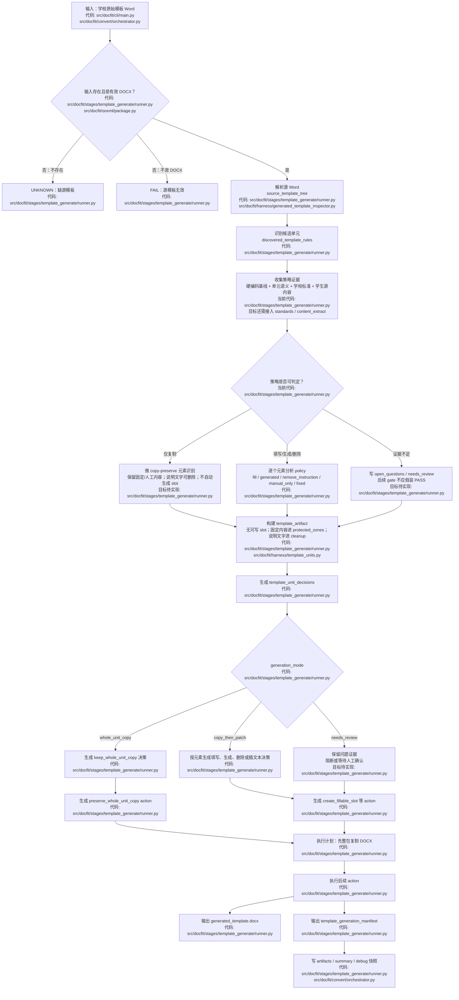
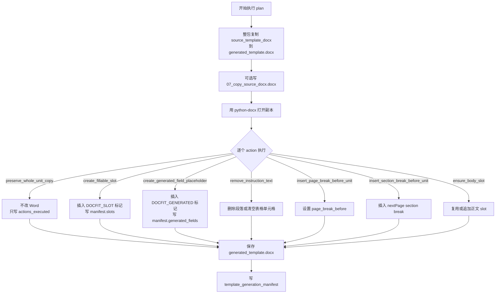

# 模板生成流程优化计划

Last updated: 2026-06-21

一句话结论：模板生成阶段应该从“先整包复制再局部 patch”的当前实现，升级为可解释的策略选择流程；仅复制单元只是其中一个策略点，最终应由硬编码基线、单元内容责任、学生源内容和学校标准共同决定。

## 这个文件做什么

这个文件是模板生成流程优化计划。它不是只讨论“默认仅复制单元”，而是把模板生成阶段里几个关键决策放到同一个流程里对齐：

- 哪些区域只保留学校原始模板；
- 哪些区域要生成字段或占位；
- 哪些区域要承载学生内容；
- 哪些区域需要线下人工填写；
- 当前无法判断时应该进入 `UNKNOWN`、`needs_review` 还是继续生成。

复制单元是这个流程里的一个决策结果，不是唯一目标。

它回答这些问题：

| 问题 | 本文件回答 |
| --- | --- |
| 模板生成要优化什么 | 从“按 unit_id 排除列表”升级为“硬编码基线 + 内容责任 + 学生源内容 + 学校标准”的策略选择 |
| 哪些区域可以仅复制 | 学校固定正文、签名日期、教师意见、成绩评定等不由机器填写的区域 |
| 哪些区域不能默认仅复制 | 中文摘要、英文摘要、目录族、正文、参考文献，以及有学生内容的致谢/附录 |
| 判定发生在哪一步 | `template_unit_decisions` 生成时确认 `generation_mode = whole_unit_copy` |
| 判定前上游给什么 | `source_template_tree` 和 `discovered_template_rules` 提供 unit、source_ref 和 source range |
| 判定后元素怎么处理 | copy-only 单元也要做受限元素识别：保留固定/人工内容，清理说明文字，但不自动生成学生填写 slot |
| 执行时 Word 怎么变 | `preserve_whole_unit_copy` 保留整体结构；copy-only 内部命中的说明文字仍可产生 `remove_instruction_text` |
| 和其他单元有什么不同 | copy-only 单元的元素处理只做清理和保护；非 copy-only 单元会按元素生成 slot、生成字段占位、删除说明文字或插入固定文本 |

## 当前真实实现

当前代码第一版的 copy-only 默认规则仍按 `unit_id` 判断。这是实现现状，不是长期定义。

当前代码还有一个需要修正的偏差：一旦判成 copy-only，代码会跳过单元内部元素分析，并且阶段三会排除 copy-only 单元的 `source_refs`，导致 copy-only 单元里的说明文字不会被清理。目标口径不是这样；`whole_unit_copy` 只表示“主体结构和固定内容通过整包复制保留”，不表示“内部说明文字免处理”。

这些单元不走默认仅复制：

| unit_id | 中文含义 | 为什么排除 |
| --- | --- | --- |
| `abstract_cn` | 中文摘要 | 通常需要承载学生摘要、关键词等可填写内容 |
| `abstract_en` | 英文摘要 | 通常需要承载英文摘要、关键词等可填写内容 |
| `toc` | 目录族 | 通常需要系统生成或保留字段机制；图目录、表目录当前可能作为 `toc` 内元素或字段要求出现 |
| `body_main` | 正文 | 学生正文内容的主要写入区域 |
| `references` | 参考文献 | 通常来自学生文档，不能默认把源模板里的参考文献区域当成最终内容 |

## 目标判断口径

下一步优化不应该只传硬编码列表，也不应该完全放弃硬编码。更稳的方式是：

```text
硬编码基线
  + 单元语义和内容责任
  + 学校标准里的 policy / source / handling
  + 学生源文档是否真的有对应内容
  + 证据不足时的 UNKNOWN / needs_review
```

也就是说，硬编码只能作为“已知通用单元”的起点，不能作为最终裁判。

建议使用下面的责任口径：

| 单元责任 | 例子 | 处理 |
| --- | --- | --- |
| 系统生成/更新 | 普通目录、图目录、表目录、页码、编号 | 不是默认仅复制；需要字段、占位或更新机制 |
| 学生内容写入 | 摘要、正文、参考文献、学生致谢、学生附录 | 不是默认仅复制；需要 slot 或 placement 去向 |
| 线下人工填写 | 签名、年月日、教师意见、成绩评定、答辩记录 | 可以仅复制；机器不为这些线下填写线生成 slot |
| 学校固定正文 | 原创性声明、授权说明、固定表单正文 | 可以仅复制；保留固定文本和结构 |
| 条件单元 | 致谢、附录、封面元数据 | 取决于学生源内容、学校标准和产品是否负责自动填写 |

例如 `acknowledgement` 不能永远写成 copy-only：如果学生源文档有致谢内容，或学校标准要求最终文档承载学生致谢正文，它应进入学生内容写入路径；如果学生没有致谢内容，当前可以保留模板里的标题、占位和人工提示，并把是否删除或保留写成条件规则或 `open_questions`。

如果后续新增 unit，先判断内容责任，再决定是否仅复制。不要只因为它不在排除列表里就默认仅复制。

## 策略判定优先级

目标规则可以按下面顺序执行。这样既保留硬编码的稳定性，也避免新学校单元被硬编码误伤。

| 优先级 | 证据来源 | 判定方式 | 输出 |
| --- | --- | --- | --- |
| 1 | 学校签收标准明确声明 `policy`、`source`、`handling` | 标准优先；例如“来源=学生内容”不能仅复制，“来源=学校模板固定表单”可仅复制 | `copy_then_patch` 或 `whole_unit_copy` |
| 2 | 学生源文档内容台账 | 如果学生源里有该单元内容，例如致谢、附录、成果、参考文献，则不能仅复制模板空壳 | `copy_then_patch` |
| 3 | 通用硬编码基线 | 对稳定通用单元给默认责任：目录族=生成，摘要/正文/参考文献=学生内容，声明/签名表单=固定或人工 | 初始策略 |
| 4 | 单元名称和元素语义 | 看标题、字段、占位、签名日期、教师意见、成绩评定等语义信号，对硬编码基线做校正 | 策略修正 |
| 5 | 解析证据是否充分 | 缺 source_ref、边界不稳定、有 unknown visible objects 时，不把猜测当成功 | `needs_review` / `UNKNOWN` |

推荐的判定伪流程：

```text
如果学校标准明确说该单元承载学生内容：
  copy_then_patch
否则如果学生源内容台账里有该单元内容：
  copy_then_patch
否则如果学校标准明确说该单元是固定模板或线下人工填写：
  whole_unit_copy
否则使用通用硬编码基线给出初始策略
再用单元名称和元素语义修正
如果证据不足：
  needs_review / UNKNOWN
```

这意味着硬编码可以存在，但它只能回答“常见情况下大概率是什么”，不能回答“这个学校这个单元最终一定怎么处理”。

## 上游输入

当前真实实现里，`docfit eval template-generate` 只接收源 Word 和输出目录；它还没有把学校签收标准和学生源内容作为正式输入。

| 当前输入 | 来源 | 作用 |
| --- | --- | --- |
| `source_template_docx` | CLI `--template` 或 e2e 传入 | 学校原始模板 Word，是整包复制和解析的源文件 |
| `out_dir` | CLI `--out` 或 e2e 输出目录 | 写 `generated_template.docx` 和 JSON 证据 |
| `strategy` | 默认 `source_copy_scaffold` | 记录本次生成策略；当前没有多策略分支 |
| `debug_root` | eval / e2e 包装层传入 | 写 00-10 调试快照 |

目标优化后，策略选择至少还需要消费这些上游信息：

| 目标输入 | 来源 | 用途 |
| --- | --- | --- |
| 学校结构化标准 | `template_unit_contract.yaml` 或其生成阶段中间产物 | 判断单元来源、处理方式、是否承载学生内容、是否线下人工填写 |
| 学生内容台账摘要 | content extract 输出，或 e2e 已知学生源内容摘要 | 判断致谢、附录、成果、参考文献等条件单元是否真的有学生内容 |
| 通用单元责任基线 | 代码或配置中的稳定表 | 给常见单元一个默认责任，例如目录族偏生成、正文偏学生内容、声明偏固定 |
| 学校例外配置 | 已签收标准或受控配置 | 覆盖通用基线，例如某校封面题目是否机器填写 |
| 不确定证据 | 解析器 warning、unknown visible objects、未识别单元 | 决定进入 `UNKNOWN` / `needs_review`，而不是硬猜 |

输入检查规则：

| 条件 | 当前结果 |
| --- | --- |
| 源 Word 不存在 | `UNKNOWN`，阻断在 `template_generate` |
| 源文件不是有效 DOCX | `FAIL`，阻断在 `template_generate` |
| 源 Word 有效 | 继续解析、推断、生成计划和执行 |

## 总流程



图里的“代码”是当前真实实现所在文件；标注“目标待实现”的节点表示计划里的策略能力还没有完整落到代码。

| 流程节点 | 当前主要代码文件 | 当前状态 |
| --- | --- | --- |
| CLI 输入和 eval 包装 | `src/docfit/cli/main.py`、`src/docfit/convert/orchestrator.py` | 已实现 |
| 输入存在性和 DOCX 有效性检查 | `src/docfit/stages/template_generate/runner.py`、`src/docfit/ooxml/package.py` | 已实现 |
| 源 Word 解析 | `src/docfit/stages/template_generate/runner.py`、`src/docfit/harness/generated_template_inspector.py` | 已实现 |
| 候选单元识别 | `src/docfit/stages/template_generate/runner.py` | 已实现，仍是启发式 |
| 策略证据收集 | `src/docfit/stages/template_generate/runner.py` | 部分实现；学校标准和学生内容台账尚未正式接入 |
| copy-only / patch 策略判定 | `src/docfit/stages/template_generate/runner.py` | 已实现第一版；仍按 `unit_id` 排除列表，且缺少 copy-only 内部 cleanup |
| slot、region、protected zone 构建 | `src/docfit/stages/template_generate/runner.py`、`src/docfit/harness/template_units.py` | 已实现 |
| decision 和 action plan 生成 | `src/docfit/stages/template_generate/runner.py` | 已实现 |
| Word 复制和 action 执行 | `src/docfit/stages/template_generate/runner.py` | 已实现 |
| 产物写出和 summary/debug | `src/docfit/stages/template_generate/runner.py`、`src/docfit/convert/orchestrator.py` | 已实现 |

## 阶段一：解析源 Word

产物：`source_template_tree.json`

这一阶段只记录源 Word 里实际观察到了什么，不判断某个单元是否应该复制或填写。

它提供后续规则需要的基础事实：

| 字段 | 用途 |
| --- | --- |
| `layers.body_flow[]` | 正文主流里的可见节点，后续用来识别单元和单元范围 |
| `layers.header_footer[]` | 页眉页脚事实，独立保留，不作为默认正文单元元素 |
| `layers.section_rules[]` | 页面、section、页眉页脚引用等结构事实 |
| `data.paragraphs[]` | 段落事实 |
| `data.tables[]` | 表格事实 |
| `layers.unknown_objects[]` | 当前解析器还不能解释的可见对象 |

重要边界：

| 不是这一阶段做的事 | 后续在哪里做 |
| --- | --- |
| 不判断 `cover` / `abstract_cn` / `body_main` 等单元 | `discovered_template_rules` |
| 不判断元素是否 `fill` | 非 copy-only 单元的元素分析 |
| 不决定 action | `template_generation_plan` |
| 不证明生成模板合格 | `template-gap` |

### 待排查问题：一句话被拆成多个节点

当前确认：

- 普通 Word 段落用 `python-docx` 的 `paragraph.text` 读取；如果一句话在源 DOCX 里真的是一个普通段落，当前解析器不会按视觉换行把它拆开。
- 本地用一句长文本临时生成普通段落 DOCX 验证后，`source_template_tree.layers.body_flow` 只产生一个 `word/document.xml:p[1]` 节点。
- `unit_copy_test_01.docx` 里的长说明段落也保持为一个 paragraph 节点，没有被拆成多个 body_flow 节点。

仍需排查：

| 可能原因 | 说明 | 下一步证据 |
| --- | --- | --- |
| 源 Word 自身把一句话存成多个段落 | 很多模板来自 PDF、复制粘贴或手工排版，视觉上是一句话，OOXML 里可能是多个 `<w:p>` | 看 `source_template_tree.data.paragraphs[]` 的 `source_ref` 和文本 |
| 文本在多个表格单元格里 | 视觉上连续，但 Word 结构是多个 cell | 看 `source_template_tree.data.tables[].cells[]` |
| 文本在文本框或其他 drawing 对象里 | 当前解析器会把文本框作为独立对象记录，后续正文流可能无法稳定合并 | 看 `data.text_boxes[]` 和 `unknown_visible_objects[]` |
| 解析器把不同结构混入同一搜索流 | body paragraph、table cell、header/footer 现在会进入可见文本入口，再由阶段二过滤 | 看 `layers.body_flow[].kind` 和 `structure_layer` |

这个问题的 `first_bad_stage` 是 `source_parse`。不要先改阶段二的单元边界规则；应该先证明源 Word 的 OOXML 结构到底是一段、多个段落、多个表格格子，还是文本框。

## 阶段二：识别单元和元素

产物：`discovered_template_rules.json`

阶段二真正应该承担的职责，不是把阶段一的 `body_flow entry` 换个名字叫 element。阶段一负责记录 Word 里“看见了什么”，包括文本、表格、source_ref、样式、顺序、结构层；阶段二应该把这些低层事实整理成后续生成策略能理解的单元和元素。

阶段二的目标意义应该是：

| 职责 | 说明 |
| --- | --- |
| 单元识别 | 把 Word 的连续内容划到封面、声明、摘要、正文、参考文献等 unit 里 |
| 元素合并 | 把阶段一的碎片 entry 合并成更接近业务含义的 logical element |
| 元素角色提示 | 给 logical element 标出候选角色，例如固定正文、说明文字、人工填写区、学生内容位、系统生成位、冲突证据 |
| 策略证据 | 为 `whole_unit_copy`、`copy_then_patch`、`needs_review` 提供证据和 hint，而不是生成阶段三/四的最终结构或动作 |

所以当前“一个 entry 变一个 element”的实现只是第一版占位，价值确实偏小。目标实现至少要加入元素合并层，再在合并后的 logical element 上给出 `role` / `policy_hint`。这里是“提示和证据”，不是最终 artifact 决策。

### 阶段二输入契约

阶段二的主输入是阶段一产物 `source_template_tree.json`。阶段二应该消费阶段一已经提取好的事实，不重新解析 Word，也不直接读写 DOCX。

必需输入：

| 输入 | 阶段一字段 | 阶段二用途 |
| --- | --- | --- |
| 可见正文流 | `layers.body_flow[]` | 识别单元锚点、划分 unit 范围、生成 element fragments |
| body 索引 | `indexes.body_order`、`indexes.by_source_ref` | 保持顺序、回查 source_ref、构建 source range |
| 段落事实 | `data.paragraphs[]` | 合并段落碎片、识别标题/正文/说明文字、读取段落样式 |
| 表格事实 | `data.tables[]` | 合并同一行 label/value、识别表单字段、保留 cell/table 坐标 |
| 样式事实 | entry 和 paragraph/cell 的 `style_details`、`runs`、`style` | 判断标题、正文、说明块、人工填写区和合并边界 |
| 全局编号 | `layers.package_global.numbering_definitions`、`data.numbering_refs` | 判断编号结构、目录/正文编号、标题层级 |
| section / 页面规则 | `layers.section_rules` | 保留分页、分节、页眉页脚引用等上下文 |
| 页眉页脚 | `layers.header_footer` | 传递给阶段三，不作为默认正文 unit element |
| 未知对象和 warning | `layers.unknown_objects`、`warnings` | 形成 unknowns、open_questions、needs_review 证据 |

可选输入：

| 输入 | 用途 |
| --- | --- |
| 通用单元定义和关键词表 | 辅助识别 `cover`、`abstract_cn`、`body_main` 等 unit |
| 通用内容责任基线 | 给 `content_responsibility_hint` 和 `generation_mode_hint` 一个默认起点 |
| 学校结构化标准 | 如果已接入，可覆盖通用规则；如果未接入，应在输出里明确证据不足 |
| 学生内容台账摘要 | 如果已接入，可判断致谢/附录等条件单元是否承载学生内容 |

阶段二不应该依赖这些输入：

| 不应依赖 | 原因 |
| --- | --- |
| 直接打开源 DOCX 重新解析 | 阶段一已经负责解析，重复解析会让证据链分叉 |
| 生成后的 Word | 阶段二发生在生成前 |
| 阶段五 action plan | 阶段二只给证据和提示，不消费执行计划 |
| 人工口头判断但没有写入标准/配置的规则 | 应进入 `open_questions` 或 `needs_review`，不要隐式硬编码 |

### 阶段二输出契约

阶段二交给阶段三的输出是 `discovered_template_rules.json`。它不应该直接生成 Word action，也不应该最终决定所有 `generation_mode`；它应该输出“识别结果 + 合并结果 + 策略证据”，供阶段三构建 `template_artifact`，再由阶段四生成正式 decisions。

顶层结构应该包含：

| 字段 | 含义 | 阶段三怎么用 |
| --- | --- | --- |
| `artifact_type` / `artifact_version` | 产物类型和版本 | 校验输入格式 |
| `input_hashes.source_template_tree` | 对应的阶段一输入 hash | 保证证据链可追溯 |
| `discovery_method` | 使用的识别/合并方法版本 | 调试和回归定位 |
| `source_context` | 从阶段一传下来的全局上下文摘要 | 构建样式、页面、编号、页眉页脚、unsupported 等 artifact 字段 |
| `units[]` | 识别出的模板单元 | 构建 artifact units、regions、slots、protected zones、instruction candidates |
| `unknowns[]` | 无法解释或证据不足的对象 | 进入 unsupported / needs_review |
| `open_questions[]` | 需要人工或学校标准确认的问题 | 阻断或降低后续 gate 结论 |

`source_context` 是阶段二对阶段一全局事实的传递层。它不必完整复制整个 `source_template_tree.data`，但必须保留阶段三和后续 gap 需要的全局上下文：

| 字段 | 来源 | 用途 |
| --- | --- | --- |
| `source_template_tree_ref` | 阶段一产物路径或 id | 必要时回查完整阶段一事实 |
| `body_order[]` / `by_source_ref` | `source_template_tree.indexes` | 让阶段三能按 source_ref 回查 entry 顺序 |
| `style_catalog` / `style_inventory` | 阶段一段落和 run 的 `style_details` 汇总 | 判断标题/正文/说明文字样式，生成 artifact styles |
| `numbering_definitions` / `numbering_refs` | 阶段一 `package_global` 和 `data.numbering_*` | 保留编号体系、目录/正文编号证据 |
| `section_rules` / `page_setup` | 阶段一 `layers.section_rules` | 保留页面、分节、页边距、页眉页脚引用证据 |
| `header_footer` | 阶段一 `layers.header_footer` | 后续检查页眉页脚和模板保真 |
| `unknown_objects` / `warnings` | 阶段一 unknown 和 warning | 进入 unsupported、needs_review 或降低置信度 |

也就是说，阶段二不仅输出“自己识别出了哪些 unit/element”，还要把阶段一的全局样式和结构上下文一起传递给阶段三。当前代码里阶段三直接从 `source_tree` 取 `page_setup`、`styles`、`numbering`、`headers_footers`；目标实现应把这些依赖收敛到阶段二输出的 `source_context`，减少阶段间隐式耦合。

每个 `unit` 至少应该输出：

| 字段 | 含义 |
| --- | --- |
| `unit_id` / `name` / `order` / `status` | 单元身份、名称、顺序、必选/可选状态 |
| `source_range` | 单元覆盖的源范围，例如起止 `source_ref`、entry order、完整 `source_refs` |
| `anchors[]` | 单元标题或锚点证据，例如命中文本、source_ref、置信度 |
| `content_responsibility_hint` | 内容责任提示：学校固定、人工填写、学生内容、系统生成、混合、未知 |
| `generation_mode_hint` | 策略提示：`whole_unit_copy_candidate`、`copy_then_patch_candidate`、`needs_review`；正式决定留给阶段四 |
| `elements[]` | 合并后的 logical elements，不是原始 body_flow entry 列表 |
| `conflicts[]` | 例如 copy-only 单元里出现强学生填写信号、目录字段出现在固定表单里 |
| `evidence[]` | 支撑上述判断的 source_ref、样式、结构、关键词证据 |

每个 `element` 至少应该输出：

| 字段 | 含义 |
| --- | --- |
| `element_id` / `order` | 单元内稳定编号和顺序 |
| `role` | 逻辑角色，例如 `heading`、`fixed_text`、`instruction_block`、`manual_field`、`student_field_candidate`、`generated_field_candidate`、`conflict_evidence` |
| `policy_hint` | 策略提示，例如 `preserve_fixed`、`remove_instruction`、`manual_only`、`fill_candidate`、`generated_candidate`、`needs_review` |
| `content` / `normalized_content` | 合并后的原文和规范化文本 |
| `source_refs[]` | 这个 logical element 覆盖的所有源位置 |
| `entry_refs[]` | 由哪些阶段一 body_flow entries 合并而来 |
| `merge` | 合并原因，例如 `same_table_row_label_blank`、`sentence_continuation`、`instruction_block_continuation` |
| `structure` | 结构证据，例如 paragraph、table_cell、table_row、container_ref |
| `style_summary` / `style_evidence` | 从阶段一传下来的字体、字号、加粗、对齐、缩进、style_id、style inheritance 等样式证据 |
| `confidence` | 当前判断置信度 |
| `review_notes[]` | 低置信度或需要标准确认的说明 |

阶段二输出的边界：

| 阶段二应该输出 | 阶段二不应该输出 |
| --- | --- |
| logical elements 和它们的 source_refs | Word 修改动作 |
| `policy_hint` / `generation_mode_hint` | 最终 action plan |
| copy-only 内部说明文字候选 | 直接删除 Word 内容 |
| copy-only 内部填空/系统生成冲突证据 | 直接插 slot 或 generated marker |
| unknowns / open_questions | 假装确定的 PASS 结论 |

### 阶段二和阶段三不重复

阶段二和阶段三的区别是：阶段二做识别和证据归纳，阶段三做 artifact 编译。

| 问题 | 阶段二回答 | 阶段三回答 |
| --- | --- | --- |
| 这段 Word 内容是什么 | 这是一个 logical element，候选角色是 `instruction_block` / `manual_field` / `fixed_text` 等 | 把它放进 artifact 的哪个集合 |
| 证据在哪里 | 输出 `source_refs[]`、`entry_refs[]`、`style_evidence`、`confidence` | 保留 provenance，并转成下游可消费的字段 |
| 是否可能需要删除说明文字 | 输出 `policy_hint = remove_instruction` | 写入 `data.instruction_paragraphs[]`，供后续 decision/action 使用 |
| 是否可能是人工填写区 | 输出 `policy_hint = manual_only` | 写入 `protected_zones[]` 或 manual placeholder 所需上下文 |
| 是否可能是学生内容位 | 输出 `policy_hint = fill_candidate` | 根据单元模式和责任口径决定是否生成 `slots[]` / `required_fields[]` |
| 是否是 copy-only 冲突 | 输出 `conflicts[]` 或 `needs_review` 证据 | 把冲突编入 artifact 的 unsupported/review 信息，不直接插 slot |

例如阶段二可以说：“这个 logical element 看起来是人工填写区，证据是 `签名`、`年月日` 和对应 source_ref。”阶段三才决定：“这个元素在 artifact 里进入 `protected_zones[]`，并且不生成 slot。”这样阶段三不是重复识别，而是把阶段二的识别结果转换成后续阶段稳定消费的数据结构。

### 阶段二仍需补齐的定义

目前阶段二目标已经比之前清楚，但还没有完全闭合。后续实现前至少要补齐这些细节：

| 缺口 | 为什么重要 |
| --- | --- |
| `style_catalog` 的精确结构 | 阶段一现在有 `style_details` 和 style inheritance，但阶段二输出里还没定义 catalog 的完整 schema |
| 表格坐标结构 | 需要明确 table_index、row_index、cell_index、row/col span、container_ref 怎么进入 element.structure |
| 合并规则优先级 | 例如先按表格行合并，还是先按句子连续性合并；规则不同会影响字段识别 |
| 合并停止条件 | 标题和正文、说明和正文、不同样式/不同表格行什么时候不能合并 |
| role / policy_hint 枚举 | 需要固定枚举，避免阶段三/四消费时出现自由文本 |
| confidence 口径 | 需要定义高/中/低置信度和何时进入 `needs_review` |
| copy-only 受限识别规则 | 需要明确哪些 policy 在 copy-only 内可以产生 cleanup，哪些只能产生 conflict |
| header/footer 处理边界 | 当前不作为正文 unit element，但仍要作为全局上下文传递；未来是否有独立 header/footer unit 需要定义 |
| source_context 与完整 source_tree 的关系 | 要决定是只传摘要，还是同时保留 ref + 必要快照，避免阶段三过度回读阶段一 |
| 阶段二到阶段三的兼容策略 | 当前代码的 `discovered_template_rules` schema 较薄，目标 schema 需要版本迁移或兼容读取 |

当前代码先在 `layers.body_flow[]` 里找单元锚点，例如封面、目录、摘要、正文、参考文献。每个单元拿到一个正文范围：

```text
当前单元 anchor -> 下一个单元 anchor 之前
```

然后进入分支。这里要区分当前代码和目标口径：

| 单元类型 | 当前代码 | 目标口径 |
| --- | --- | --- |
| 默认仅复制单元 | 不逐个元素分析；只写一个 `policy = fixed` 的单元级元素，表示整个区域靠复制保留 | 仍然逐 entry 做受限元素识别；固定/人工内容保留，说明文字可删除，填空/系统生成信号只作为冲突证据或复核证据，不直接生成 slot |
| 排除列表里的单元 | 逐个可见节点分析元素 policy | 继续逐 entry 做完整元素识别；可生成 slot、generated marker、删除说明文字或插入固定文本 |

当前代码里，默认仅复制单元的元素形状大致是：

```json
{
  "element_id": "e_001",
  "name": "封面整体复制区域",
  "policy": "fixed",
  "type": "fixed_text",
  "fill": "no",
  "relationship": "whole_unit_copy",
  "source_refs": [
    "word/document.xml:p[1]",
    "word/document.xml:p[2]"
  ]
}
```

这个元素不是说“封面里只有一个真实元素”，而是说当前实现把整个单元作为一个复制保留区域。

目标实现里，copy-only 单元应该同时有两层信息：

| 层级 | 作用 |
| --- | --- |
| 单元级 copy 元素 | 表示这个单元主体靠源 Word 整包复制保留 |
| 内部受限元素 | 只用于识别说明文字、固定内容、人工填写区和冲突信号；不会因为 `____`、`姓名：` 等占位符自动生成学生内容 slot |

也就是说，copy-only 单元需要做元素处理，但它的元素处理逻辑不同于非 copy-only 单元：

| 内部元素信号 | copy-only 目标处理 |
| --- | --- |
| 说明文字、格式要求、示例文本 | 生成 `remove_instruction_text` 候选；确认后删除或清空对应段落/单元格 |
| 学校固定正文、声明正文、表单结构文字 | 保留，进入 protected zone |
| 签名、日期、教师意见、成绩评定等人工区 | 保留，标为 manual-only 或 protected |
| 题目、姓名、学号、下划线等填写痕迹 | 默认不生成 slot；如果学校标准要求机器填写，应把该单元或该字段转入 `copy_then_patch` 或写 `needs_review` |
| 目录/页码/字段生成信号 | 默认不在 copy-only 内生成字段；作为策略冲突证据，必要时把单元改为非 copy-only |

## 元素分析策略

排除列表里的单元继续逐个元素分析。copy-only 单元也应逐 entry 扫描，但只能执行受限策略。

当前元素识别非常直接：阶段二不会理解复杂语义树，也不会做版面区域分析。它只是把当前单元范围里的每一个可见 `entry` 变成一个 element。当前代码对 copy-only 单元还没做到这一点，这是待修正项。

目标元素分析应该多一步：

```text
body_flow entries
  -> 候选元素片段 element fragments
  -> 合并成 logical elements
  -> 在 logical elements 上判断 policy
```

合并时应该优先使用阶段一已经提取出来的样式和结构证据，例如：

| 证据 | 用途 |
| --- | --- |
| `order` / source_ref 连续性 | 判断几个 entry 是否相邻、是否属于同一个块 |
| 段落样式、字号、字体、加粗、对齐、缩进 | 判断标题、正文、说明块是否连续 |
| 表格 row / cell / container_ref | 判断一个表格行里的 label 和填写线是否属于同一个字段 |
| 标点和句子完整性 | 判断被拆开的句子是否应该合并 |
| 冒号、下划线、占位符、标签词 | 判断 label + value / label + blank 是否是同一个可填写字段 |
| 说明文字关键词和样式提示 | 把连续说明段落合成一个说明块，而不是拆成多个删除动作 |

典型合并例子：

| 阶段一 entry | 目标阶段二 element |
| --- | --- |
| `paragraph: "现在的单元边界是启发式边界，不是真正"` + 下一段 `paragraph: "的 Word 结构边界；它等于..."` | 一个说明或正文 element，保留两个 source_ref |
| 表格同一行 `cell: "论文题目"` + `cell: "______"` | 一个字段 element：`论文题目：______`，而不是两个孤立 element |
| 连续几段 `说明：...`、`格式要求：...`、`小四宋体...` | 一个 instruction block element，后续作为一个清理对象或一组关联清理对象 |
| `paragraph: "中文摘要"` + 下一段摘要正文 | 不合并；标题和正文样式/职责不同，应分别成为 heading element 和 content element |

当前会进入元素识别的 entry 主要来自：

| entry 来源 | 当前怎么成为元素 |
| --- | --- |
| 正文段落 | `source_template_tree.layers.body_flow[]` 中 `kind = paragraph` 且有文本 |
| 表格单元格 | `kind = table_cell` 且 cell 有文本；当前作为一个元素，而不是拆每个 cell 内段落为多个元素 |
| copy-only 单元 | 当前不逐 entry 识别；目标应逐 entry 做受限识别，并保留单元级 copy 元素 |
| 页眉页脚 | 阶段二 `_body_entries()` 会过滤 `structure_layer != body_flow`，所以不作为正文单元元素 |

元素字段当前这样生成：

| 字段 | 当前来源 |
| --- | --- |
| `element_id` | 按当前单元内顺序生成 `e_001`、`e_002` |
| `name` | 根据 `policy` 和文本生成，例如“模板说明文字”“系统生成占位”“可填写内容”“人工填写位置” |
| `policy` | `_element_policy(unit_id, text, entry)` 的启发式结果 |
| `type` | 由 policy 映射，`fill -> fillable`、`generated -> generated`、`manual_only -> manual_only`、说明文字 -> `instruction_text` |
| `content` | 原文本；如果是 `remove_instruction`，当前写成空字符串 |
| `style` | 从字体、字号、加粗、对齐等样式摘要拼出来 |
| `position` / `source_refs` | 当前 entry 的 `source_ref` |

当前 `element.policy` 判断规则是：

| policy | 当前触发条件 | 后续含义 |
| --- | --- | --- |
| `remove_instruction` | 看起来像模板说明文字 | 后续生成删除动作 |
| `generated` | 普通目录、图目录、表目录、页码、编号、公式等 | 后续插生成字段占位 |
| `manual_only` | 签名、年月日、意见、成绩、评定等 | 保留，机器不填写 |
| `fill` | 有填写标记和填写标签，或中文摘要、英文摘要、正文、参考文献里的非标题内容 | 后续插可写 slot |
| `fixed` | 以上都不命中 | 保留源模板内容 |

更精确地说，`_element_policy(unit_id, text, entry)` 按下面顺序短路：

| 顺序 | 判断 | 当前代码规则 |
| --- | --- | --- |
| 1 | 说明文字 | `_looks_like_instruction(text)` 命中则 `remove_instruction` |
| 2 | 系统生成 | `unit_id == "toc"`，或文本里包含目录、页码、编号、图目录、表目录、公式 |
| 3 | 人工填写 | 文本里包含签名、年月日、年  月  日、意见、成绩、评定 |
| 4 | 明确填写位 | 同时命中填写标记和填写标签 |
| 5 | 内容单元正文 | `abstract_cn`、`abstract_en`、`body_main`、`references` 内，且当前 entry 不像标题 |
| 6 | 默认 | 其他都是 `fixed` |

当前填写标记包括：

```text
××、□□、____、——、：、:
```

当前填写标签包括：

```text
题名、题目、姓名、学号、学院、专业、班级、教师、日期、摘要正文、关键词
```

说明文字 `_looks_like_instruction(text)` 当前会看这些信号：

| 信号 | 结果 |
| --- | --- |
| 文本包含 `格式`、`要求`、`说明`、`模板`、`几号`、`号字`、`空一行`、`倍行距`、`页边距`、`附件` | 判为说明文字 |
| 文本包含括号内样式提示，例如宋体、黑体、楷体、居中、行距、字号、号字、pt | 判为说明文字 |
| 但如果文本本身是短的实质模板标题或字段，例如目录、摘要、关键词、论文题目等 | 不因为括号里的字体字号提示直接判为说明文字 |

阶段三会继续使用阶段二结果：`policy = remove_instruction` 的元素会进入 `instruction_paragraphs`，后续生成 `remove_instruction_text` 动作。同时阶段三还会对 `source_template_tree` 再扫一遍说明文字。当前代码会排除 copy-only 单元的 `source_refs`，这会让 copy-only 内部说明文字漏删；目标应改成只保护 copy-only 内部的固定/人工内容，而不是整段 source range 全部免于说明文字处理。

### 待排查问题：entry 颗粒度过细会放大元素误判

阶段二当前把一个 entry 当成一个 element。这个设计很直接，但会继承阶段一的颗粒度问题：

| 上游现象 | 阶段二后果 |
| --- | --- |
| 视觉上同一句话在 OOXML 里被拆成多个段落、多个表格单元格或文本框片段 | 阶段二会生成多个 element，而不是一个完整句子 element |
| 拆分后的片段分别命中 `说明`、`格式`、`：`、`题目` 等关键词 | 可能被分别判成 `remove_instruction`、`fill` 或 `fixed`，增加误删或误插 slot 风险 |
| 单元锚点或正文锚点刚好落在拆碎片段中间 | 单元范围可能被切得更碎，后续 copy-only / patch 选择会更难解释 |

这个问题的源头可能在 `source_parse`，但它首先会在阶段二的 `unit_detection` 和 `element_policy` 上产生可见负担。后续修改前，应该拿真实样本同时对照：

| 需要看的证据 | 用途 |
| --- | --- |
| `source_template_tree.data.paragraphs[]` | 确认视觉一句话是否在 Word 结构里已经是多个 `<w:p>` |
| `source_template_tree.data.tables[].cells[]` | 确认是否被表格 cell 切碎 |
| `source_template_tree.data.text_boxes[]` / `layers.unknown_objects[]` | 确认是否来自文本框或未解析 drawing |
| `source_template_tree.layers.body_flow[]` | 确认阶段二实际消费的 entry 顺序和 source_ref |
| `discovered_template_rules.units[].elements[]` | 确认碎片最终分别变成了哪些 element、policy 是什么 |

## 阶段三：构建 template_artifact

产物：`template_artifact.json`

这个阶段不重新识别元素语义，而是把阶段二输出的 `units[]`、logical `elements[]`、`policy_hint`、`source_context` 编译成后续 placement/render 可消费的模板结构。它负责生成 artifact 层面的 `slots[]`、`required_fields[]`、`protected_zones[]`、`instruction_paragraphs[]`、`unsupported[]` 等集合。

对于默认仅复制单元，当前代码和目标口径不同：

| 字段 | 当前代码 | 目标口径 |
| --- | --- | --- |
| `data.units[]` | 有这个 unit，但元素只有单元级 copy-only fixed 元素 | 保留单元级 copy 元素，同时记录内部受限元素 |
| `data.slots[]` | 不为 copy-only 单元生成 slot | 仍不为 copy-only 单元自动生成学生内容 slot |
| `data.required_fields[]` | 不为 copy-only 单元生成 required field | 仍不把 copy-only 内部占位符直接当 required field；冲突进入 `needs_review` 或驱动模式切换 |
| `data.protected_zones[]` | 会把 copy-only 单元作为固定/人工保护区域的一部分 | 保护固定/人工内容，但不要保护已判定为说明文字的 source_ref |
| `data.instruction_paragraphs[]` | 不收集 copy-only 单元内部说明文字作为删除对象 | 应收集 copy-only 内部说明文字，后续生成 `remove_instruction_text` |

这点很关键：如果封面里有 `论文题目：____` 和 `格式说明：小四宋体`，目标行为应该是：

| 内容 | 目标行为 |
| --- | --- |
| `论文题目：____` | 不因为它在 copy-only 单元里就自动生成 cover slot；如果学校标准要求机器填写，再把该字段或单元转到 patch 路径 |
| `格式说明：小四宋体` | 作为说明文字候选进入删除/清空动作 |

对于非 copy-only 单元：

| 元素 policy | `template_artifact` 后果 |
| --- | --- |
| `fill` | 生成可写 slot |
| `generated` | 生成生成字段或 slot 上下文 |
| `remove_instruction` | 进入 `instruction_paragraphs` |
| `fixed` / `manual_only` | 进入 protected zone，不生成可写 slot |

## 阶段四：生成 template_unit_decisions

产物：`template_unit_decisions.json`

这一阶段正式决定每个单元是 `whole_unit_copy` 还是 `copy_then_patch`。

当前代码判定规则：

```text
如果 unit_id 不在排除列表里，并且 unit 有 source_ref
=> generation_mode = whole_unit_copy

否则
=> generation_mode = copy_then_patch
```

这和更早的元素策略规则不同：

| 更早规则 | 当前代码第一版规则 |
| --- | --- |
| 看单元内部所有 element.policy 是否都是 `fixed` / `manual_only` | 先看 unit_id 是否属于默认 copy-only 单元 |
| 如果封面里有 `fill` 文本，会变成 patch | 封面默认 copy-only，不再分析内部 `fill` |
| 如果参考文献只有固定文本，可能被 whole copy | 参考文献在排除列表里，不默认 whole copy |

目标规则要再往前走一步：先决定单元是否以 copy-only 保存主体结构，然后仍对 copy-only 内部做受限元素识别。内部 `remove_instruction` 可以生成 cleanup decision；内部 `fill` / `generated` 不直接生成 slot，而是作为模式冲突、标准覆盖或 `needs_review` 的证据。

责任口径下的下一步规则应该是：

| 单元情况 | 目标 generation_mode |
| --- | --- |
| 学生源内容或学校标准要求机器写入 | `copy_then_patch` |
| 系统字段需要生成或更新 | `copy_then_patch` |
| 只保留固定学校内容或线下人工填写区 | `whole_unit_copy` |
| 当前无法判断 | 不靠猜测通过；写入 `open_questions` 或让后续 gate 输出 `UNKNOWN` |

copy-only 单元的决策形状：

```json
{
  "unit_id": "cover",
  "generation_mode": "whole_unit_copy",
  "generation_policy": "whole_unit_copy",
  "copy_source_ref": "word/document.xml:p[1]",
  "decisions": [
    {
      "decision_type": "keep_whole_unit_copy",
      "copy_scope": "whole_unit"
    },
    {
      "decision_type": "remove_instruction_text",
      "element_id": "e_003",
      "source_ref": "word/document.xml:p[4]"
    }
  ]
}
```

这里的关键是：`generation_mode = whole_unit_copy` 不排斥内部 cleanup decision。它只排斥“把这个单元当学生内容写入区来 patch”。

非 copy-only 单元的决策按元素展开：

| 元素 policy | decision_type |
| --- | --- |
| `fill` | `create_fillable_slot` |
| `generated` | `create_generated_field_placeholder` |
| `remove_instruction` | `remove_instruction_text` |
| `manual_only` | `create_manual_placeholder` |
| 缺源位置但可合成的固定文本 | `insert_fixed_text` |

## 阶段五：生成 action plan

产物：`template_generation_plan.json`

所有运行都会先有一个整包复制动作：

```text
copy_source_docx
```

它表示：

```text
把 source_template_docx 复制成 generated_template.docx
```

copy-only 单元的保留决策会转成：

```text
preserve_whole_unit_copy
```

这个 action 的含义是“记录该单元靠最开始整包复制保留”，不是再次复制一个 OOXML 单元块。

copy-only 内部命中的说明文字仍应转成：

```text
remove_instruction_text
```

非 copy-only 单元以及 copy-only 的受限 cleanup 可能生成这些 action：

| action_type | 做什么 |
| --- | --- |
| `create_fillable_slot` | 插入 `[[DOCFIT_SLOT:unit.element]]` |
| `create_generated_field_placeholder` | 插入 `[[DOCFIT_GENERATED:unit.element]]` |
| `remove_instruction_text` | 删除说明文字段落或清空表格单元格 |
| `create_manual_placeholder` | 不改 Word，只记录人工区 |
| `insert_fixed_text` | 插入缺失但应出现的固定文本 |
| `insert_page_break_before_unit` | 在单元前设置分页 |
| `insert_section_break_before_unit` | 在单元前插入 nextPage section break |
| `insert_synthetic_unit_title_before` | 在必要位置补一个合成单元标题 |
| `ensure_body_slot` | 确保正文写入点 `[[DOCFIT_SLOT:body]]` 存在 |

## 阶段六：执行 action

产物：

| 产物 | 用途 |
| --- | --- |
| `generated_template.docx` | 模板生成阶段正式 Word 输出 |
| `template_generation_manifest.json` | 记录执行过哪些 action、输出 hash、slot 和待复核项 |
| `07_copy_source_docx.docx` | 调试快照：只做整包复制后的 Word |
| `08_generated_template.docx` | 调试快照：执行所有 action 后的 Word |

执行顺序：



当前代码对默认 copy-only 单元不会打开内部元素做任何额外处理；这是待修正偏差。目标执行行为是：先靠整包复制保留原始结构，再执行 copy-only 内部允许的 cleanup action，例如删除说明文字；其余固定内容、人工填写区和表单结构继续保留。

## 和其他单元的核心差异

| 维度 | 默认仅复制单元 | 非 copy-only 单元 |
| --- | --- | --- |
| 单元范围 | 用 anchor 到下一个 anchor 之前作为复制保留范围 | 同样先识别范围 |
| 元素分析 | 做受限元素分析，只服务清理、保护和冲突识别 | 做完整元素分析 |
| `fill` 判断 | 可识别为冲突或复核信号，但不直接生成 slot | 做，命中后生成 slot |
| `generated` 判断 | 可识别为策略冲突，必要时切换模式或复核 | 做，命中后生成 generated marker |
| `remove_instruction` 判断 | 做，命中后可删除说明文字 | 做，命中后可删除说明文字 |
| slot | 不生成 | `fill` 元素会生成 |
| 说明文字删除 | 删除内部说明文字，但保护固定/人工内容 | `remove_instruction` 会删除 |
| manifest action | `preserve_whole_unit_copy` + 允许的 cleanup actions | 可能有插 slot、删说明、插字段等真实修改 |
| Word 改动来源 | 主要来自最开始的整包复制，辅以说明文字 cleanup | 整包复制后再局部 patch |
| 后续 placement | 通常不是学生内容写入目标 | slot 会成为学生内容候选写入位置 |

## 重要边界

### 当前真实实现

- `template-generate` 不读学校签收标准，也不接收 `--school`。
- 当前代码里的默认 copy-only 仍是按 `unit_id` 的生成策略，不是学校验收结论。
- 图目录、表目录当前还没有独立稳定 unit_id；它们应作为目录族的生成字段要求标注，后续如拆分可使用 `figure_toc`、`table_toc` 等稳定 ID。
- `preserve_whole_unit_copy` 不复制单元块，只记录该单元依赖初始整包复制保留。
- copy-only 单元不会因为内部有 `____`、`××`、`姓名：` 等文字就生成 slot。
- 当前代码不会删除 copy-only 单元内部看起来像说明文字的内容；这是与目标口径不一致的待修正项。
- 生成模板是否真正符合学校要求，仍然要看后续 `template-gap`。

### 已有设计意图

- 封面、声明、后置表单等固定学校区域优先保留原 Word 结构。
- 摘要、目录族、正文、参考文献这些学生内容或系统生成相关区域继续走局部 patch。
- 致谢、附录这类条件单元根据学生源内容和学校标准决定；有学生内容时不能默认仅复制。
- 签名、日期、教师意见、成绩评定等线下人工填写区不由机器填写，默认保留原模板结构。
- 减少对固定学校区域的误判，避免把模板里的占位符误当成学生内容写入口。
- copy-only 表示保留主体结构和固定内容，不表示跳过内部说明文字清理。

### 当前假设

- 固定学校内容和线下人工填写区里的可见内容应该跟随学校原始模板保留。
- 如果默认 copy-only 单元里实际存在必须自动填写的字段，需要以后通过明确标准或配置把该单元移出默认 copy-only，不能靠启发式猜。
- 参考文献虽然在源模板里可能只是标题，但当前不能默认保留为最终内容，因为它通常应来自学生论文。
- 致谢和附录是否填写，取决于学生源文档是否有对应内容，以及目标学校是否要求保留该区域。

### UNKNOWN

- 当前没有证明所有学校的封面、声明、后置表单都适合默认仅复制。
- 当前没有按学校标准配置 copy-only 例外列表；规则是全局默认。
- 当前没有完整实现“按学生源内容动态决定致谢/附录是否 copy-only”的生成策略。
- 当前没有做 unit 内部 OOXML 范围级复制；保留效果来自整份 DOCX 复制。
- 当前没有证明 Word 打开后的分页视觉效果一定正确；这仍要靠后续 gap、视觉证据或人工复核。
- 当前正文锚点启发式里仍有较宽的章节/编号识别规则；带编号的参考文献行是否会被误归到正文，需要另行用真实样本验证。

## first_bad_stage 判断

| 现象 | first_bad_stage | 先看什么 | 应该改哪里 |
| --- | --- | --- | --- |
| 某个单元没有被识别出来 | `unit_detection` | `discovered_template_rules.json` | 单元 anchor 识别 |
| 应该 copy-only 的单元仍被插 slot | `mode_selection` 或 `element_policy` | `template_unit_decisions.json`、`template_generation_plan.json` | copy-only 排除列表或单元识别 |
| copy-only 单元里的说明文字没有被删除 | `copy_only_element_policy` 或 `artifact_build` | `discovered_template_rules.json`、`template_artifact.data.instruction_paragraphs`、`template_generation_plan.actions[]` | copy-only 受限元素识别和 instruction source_ref 过滤 |
| copy-only 单元里的固定/人工内容被误删 | `copy_only_element_policy` 或 `plan_build` | `discovered_template_rules.json`、`template_generation_plan.actions[]` | 说明文字规则和 protected zone 边界 |
| 非 copy-only 单元没有 slot | `element_policy` | `discovered_template_rules.json` 的 elements | `_element_policy` |
| plan 正确但 Word 没变化 | `action_execution` | `07_copy_source_docx.docx` vs `08_generated_template.docx` | action 执行器 |
| manifest 说保留但 gap 找不到单元 | `gap_region_or_evidence` | `generated_template_tree.json` 和 `template_gap_report.json` | generated-template inspector 或 gap 单元定位 |

## 验证方式

聚焦测试：

```bash
uv run pytest tests/contract/test_template_generate.py -q
```

目标测试应覆盖：

| 用例 | 证明什么 |
| --- | --- |
| fixed/copy-only 单元会标成 `whole_unit_copy` | 默认 copy-only 规则能进入 decisions 和 plan |
| `references` 不默认 whole copy | 排除列表生效 |
| 参考文献正文占位能生成 slot | `references` 不是 copy-only 后会继续走元素分析和填写入口 |
| copy-only 单元做受限内部元素分析 | 封面里的 `论文题目：____` 不生成 cover slot，但内部说明文字可以被识别 |
| copy-only 单元内部说明文字会被清理 | 封面里的格式说明从输出 Word 删除或清空 |
| 非 copy-only 单元仍可清理表格说明文字 | 中文摘要里的表格说明文字仍会删除，填写位置仍会插 slot |

## 给人看的简短版本

```text
先整包复制 Word。

如果单元是固定学校正文或线下人工填写区，例如声明、签名、日期、教师意见、成绩评定：
  仍扫描内部元素，但只做受限判断。
  不插 slot。
  清理说明文字。
  固定正文、表单结构和人工填写区靠整包复制保留。

如果单元是中文摘要、英文摘要、普通目录、图目录、表目录、正文、参考文献：
  继续拆内部元素。
  该填的插 slot。
  该生成的插 generated marker。
  该删的说明文字删除。

如果单元是致谢或附录：
  先看学生源文档和学校标准。
  有学生内容或要求承载学生内容，就按填写/放置处理。
  没有学生内容且只是模板默认页，就保留或标记待确认。

最后 generated_template.docx 是否真的合格，交给 template-gap 检查。
```
