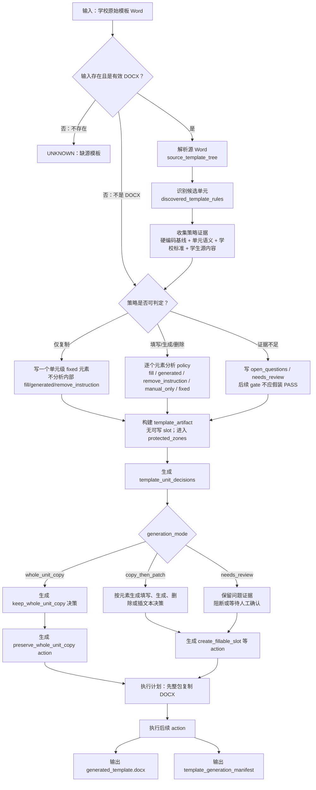
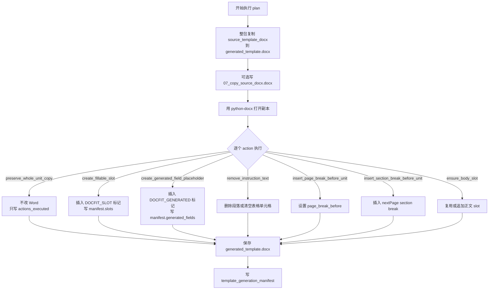

# 模板生成流程优化计划

Last updated: 2026-06-21

一句话结论：模板生成阶段应该从“先整包复制再局部 patch”的当前实现，升级为可解释的策略选择流程；仅复制单元只是其中一个策略点，最终应由硬编码基线、单元内容责任、学生源内容和学校标准共同决定。

## 这个文件做什么

这个文件是模板生成流程优化计划。它不是只讨论“默认仅复制单元”，而是把模板生成阶段里几个关键决策放到同一个流程里对齐：

- 哪些区域只保留学校原始模板；
- 哪些区域要生成字段或占位；
- 哪些区域要承载学生内容；
- 哪些区域需要线下人工填写；
- 当前无法判断时应该进入 `UNKNOWN`、`needs_review` 还是继续生成。

复制单元是这个流程里的一个决策结果，不是唯一目标。

它回答这些问题：

| 问题 | 本文件回答 |
| --- | --- |
| 模板生成要优化什么 | 从“按 unit_id 排除列表”升级为“硬编码基线 + 内容责任 + 学生源内容 + 学校标准”的策略选择 |
| 哪些区域可以仅复制 | 学校固定正文、签名日期、教师意见、成绩评定等不由机器填写的区域 |
| 哪些区域不能默认仅复制 | 中文摘要、英文摘要、目录族、正文、参考文献，以及有学生内容的致谢/附录 |
| 判定发生在哪一步 | `template_unit_decisions` 生成时确认 `generation_mode = whole_unit_copy` |
| 判定前上游给什么 | `source_template_tree` 和 `discovered_template_rules` 提供 unit、source_ref 和 source range |
| 判定后元素怎么处理 | copy-only 单元只保留一个单元级固定元素，不再逐个元素做 `fill` / `generated` / `remove_instruction` 分析 |
| 执行时 Word 怎么变 | `preserve_whole_unit_copy` action 不修改 Word，只记录该单元靠最开始整包复制保留 |
| 和其他单元有什么不同 | 其他单元会继续按元素生成 slot、生成字段占位、删除说明文字或插入固定文本 |

## 当前真实实现

当前代码第一版的 copy-only 默认规则仍按 `unit_id` 判断。这是实现现状，不是长期定义。

这些单元不走默认仅复制：

| unit_id | 中文含义 | 为什么排除 |
| --- | --- | --- |
| `abstract_cn` | 中文摘要 | 通常需要承载学生摘要、关键词等可填写内容 |
| `abstract_en` | 英文摘要 | 通常需要承载英文摘要、关键词等可填写内容 |
| `toc` | 目录族 | 通常需要系统生成或保留字段机制；图目录、表目录当前可能作为 `toc` 内元素或字段要求出现 |
| `body_main` | 正文 | 学生正文内容的主要写入区域 |
| `references` | 参考文献 | 通常来自学生文档，不能默认把源模板里的参考文献区域当成最终内容 |

## 目标判断口径

下一步优化不应该只传硬编码列表，也不应该完全放弃硬编码。更稳的方式是：

```text
硬编码基线
  + 单元语义和内容责任
  + 学校标准里的 policy / source / handling
  + 学生源文档是否真的有对应内容
  + 证据不足时的 UNKNOWN / needs_review
```

也就是说，硬编码只能作为“已知通用单元”的起点，不能作为最终裁判。

建议使用下面的责任口径：

| 单元责任 | 例子 | 处理 |
| --- | --- | --- |
| 系统生成/更新 | 普通目录、图目录、表目录、页码、编号 | 不是默认仅复制；需要字段、占位或更新机制 |
| 学生内容写入 | 摘要、正文、参考文献、学生致谢、学生附录 | 不是默认仅复制；需要 slot 或 placement 去向 |
| 线下人工填写 | 签名、年月日、教师意见、成绩评定、答辩记录 | 可以仅复制；机器不为这些线下填写线生成 slot |
| 学校固定正文 | 原创性声明、授权说明、固定表单正文 | 可以仅复制；保留固定文本和结构 |
| 条件单元 | 致谢、附录、封面元数据 | 取决于学生源内容、学校标准和产品是否负责自动填写 |

例如 `acknowledgement` 不能永远写成 copy-only：如果学生源文档有致谢内容，或学校标准要求最终文档承载学生致谢正文，它应进入学生内容写入路径；如果学生没有致谢内容，当前可以保留模板里的标题、占位和人工提示，并把是否删除或保留写成条件规则或 `open_questions`。

如果后续新增 unit，先判断内容责任，再决定是否仅复制。不要只因为它不在排除列表里就默认仅复制。

## 上游输入

当前真实实现里，`docfit eval template-generate` 只接收源 Word 和输出目录；它还没有把学校签收标准和学生源内容作为正式输入。

| 当前输入 | 来源 | 作用 |
| --- | --- | --- |
| `source_template_docx` | CLI `--template` 或 e2e 传入 | 学校原始模板 Word，是整包复制和解析的源文件 |
| `out_dir` | CLI `--out` 或 e2e 输出目录 | 写 `generated_template.docx` 和 JSON 证据 |
| `strategy` | 默认 `source_copy_scaffold` | 记录本次生成策略；当前没有多策略分支 |
| `debug_root` | eval / e2e 包装层传入 | 写 00-10 调试快照 |

目标优化后，策略选择至少还需要消费这些上游信息：

| 目标输入 | 来源 | 用途 |
| --- | --- | --- |
| 学校结构化标准 | `template_unit_contract.yaml` 或其生成阶段中间产物 | 判断单元来源、处理方式、是否承载学生内容、是否线下人工填写 |
| 学生内容台账摘要 | content extract 输出，或 e2e 已知学生源内容摘要 | 判断致谢、附录、成果、参考文献等条件单元是否真的有学生内容 |
| 通用单元责任基线 | 代码或配置中的稳定表 | 给常见单元一个默认责任，例如目录族偏生成、正文偏学生内容、声明偏固定 |
| 学校例外配置 | 已签收标准或受控配置 | 覆盖通用基线，例如某校封面题目是否机器填写 |
| 不确定证据 | 解析器 warning、unknown visible objects、未识别单元 | 决定进入 `UNKNOWN` / `needs_review`，而不是硬猜 |

输入检查规则：

| 条件 | 当前结果 |
| --- | --- |
| 源 Word 不存在 | `UNKNOWN`，阻断在 `template_generate` |
| 源文件不是有效 DOCX | `FAIL`，阻断在 `template_generate` |
| 源 Word 有效 | 继续解析、推断、生成计划和执行 |

## 总流程



## 阶段一：解析源 Word

产物：`source_template_tree.json`

这一阶段只记录源 Word 里实际观察到了什么，不判断某个单元是否应该复制或填写。

它提供后续规则需要的基础事实：

| 字段 | 用途 |
| --- | --- |
| `layers.body_flow[]` | 正文主流里的可见节点，后续用来识别单元和单元范围 |
| `layers.header_footer[]` | 页眉页脚事实，独立保留，不作为默认正文单元元素 |
| `layers.section_rules[]` | 页面、section、页眉页脚引用等结构事实 |
| `data.paragraphs[]` | 段落事实 |
| `data.tables[]` | 表格事实 |
| `layers.unknown_objects[]` | 当前解析器还不能解释的可见对象 |

重要边界：

| 不是这一阶段做的事 | 后续在哪里做 |
| --- | --- |
| 不判断 `cover` / `abstract_cn` / `body_main` 等单元 | `discovered_template_rules` |
| 不判断元素是否 `fill` | 非 copy-only 单元的元素分析 |
| 不决定 action | `template_generation_plan` |
| 不证明生成模板合格 | `template-gap` |

## 阶段二：识别单元和元素

产物：`discovered_template_rules.json`

当前代码先在 `layers.body_flow[]` 里找单元锚点，例如封面、目录、摘要、正文、参考文献。每个单元拿到一个正文范围：

```text
当前单元 anchor -> 下一个单元 anchor 之前
```

然后进入分支：

| 单元类型 | 当前处理 |
| --- | --- |
| 默认仅复制单元 | 不逐个元素分析；只写一个 `policy = fixed` 的单元级元素，表示整个区域靠复制保留 |
| 排除列表里的单元 | 逐个可见节点分析元素 policy |

默认仅复制单元的元素形状大致是：

```json
{
  "element_id": "e_001",
  "name": "封面整体复制区域",
  "policy": "fixed",
  "type": "fixed_text",
  "fill": "no",
  "relationship": "whole_unit_copy",
  "source_refs": [
    "word/document.xml:p[1]",
    "word/document.xml:p[2]"
  ]
}
```

这个元素不是说“封面里只有一个真实元素”，而是说当前生成阶段不再拆开封面内部内容做填写、生成或删除判断。

## 非 copy-only 单元的元素分析

排除列表里的单元继续逐个元素分析。

当前 `element.policy` 判断规则是：

| policy | 当前触发条件 | 后续含义 |
| --- | --- | --- |
| `remove_instruction` | 看起来像模板说明文字 | 后续生成删除动作 |
| `generated` | 普通目录、图目录、表目录、页码、编号、公式等 | 后续插生成字段占位 |
| `manual_only` | 签名、年月日、意见、成绩、评定等 | 保留，机器不填写 |
| `fill` | 有填写标记和填写标签，或中文摘要、英文摘要、正文、参考文献里的非标题内容 | 后续插可写 slot |
| `fixed` | 以上都不命中 | 保留源模板内容 |

当前填写标记包括：

```text
××、□□、____、——、：、:
```

当前填写标签包括：

```text
题名、题目、姓名、学号、学院、专业、班级、教师、日期、摘要正文、关键词
```

## 阶段三：构建 template_artifact

产物：`template_artifact.json`

这个阶段把单元和元素整理成后续 placement/render 可消费的模板结构。

对于默认仅复制单元：

| 字段 | 当前结果 |
| --- | --- |
| `data.units[]` | 有这个 unit，但元素只有单元级 copy-only fixed 元素 |
| `data.slots[]` | 不为 copy-only 单元生成 slot |
| `data.required_fields[]` | 不为 copy-only 单元生成 required field |
| `data.protected_zones[]` | 会把 copy-only 单元作为固定/人工保护区域的一部分 |
| `data.instruction_paragraphs[]` | 不收集 copy-only 单元内部说明文字作为删除对象 |

这点很关键：如果封面里有 `论文题目：____` 或 `格式说明：小四宋体`，当前默认仅复制规则下，这些文字不会让封面变成可填写区域，也不会被当成说明文字删除。它们会随源 Word 整包复制保留。

对于非 copy-only 单元：

| 元素 policy | `template_artifact` 后果 |
| --- | --- |
| `fill` | 生成可写 slot |
| `generated` | 生成生成字段或 slot 上下文 |
| `remove_instruction` | 进入 `instruction_paragraphs` |
| `fixed` / `manual_only` | 进入 protected zone，不生成可写 slot |

## 阶段四：生成 template_unit_decisions

产物：`template_unit_decisions.json`

这一阶段正式决定每个单元是 `whole_unit_copy` 还是 `copy_then_patch`。

当前代码判定规则：

```text
如果 unit_id 不在排除列表里，并且 unit 有 source_ref
=> generation_mode = whole_unit_copy

否则
=> generation_mode = copy_then_patch
```

这和更早的元素策略规则不同：

| 更早规则 | 当前代码第一版规则 |
| --- | --- |
| 看单元内部所有 element.policy 是否都是 `fixed` / `manual_only` | 先看 unit_id 是否属于默认 copy-only 单元 |
| 如果封面里有 `fill` 文本，会变成 patch | 封面默认 copy-only，不再分析内部 `fill` |
| 如果参考文献只有固定文本，可能被 whole copy | 参考文献在排除列表里，不默认 whole copy |

责任口径下的下一步规则应该是：

| 单元情况 | 目标 generation_mode |
| --- | --- |
| 学生源内容或学校标准要求机器写入 | `copy_then_patch` |
| 系统字段需要生成或更新 | `copy_then_patch` |
| 只保留固定学校内容或线下人工填写区 | `whole_unit_copy` |
| 当前无法判断 | 不靠猜测通过；写入 `open_questions` 或让后续 gate 输出 `UNKNOWN` |

copy-only 单元的决策形状：

```json
{
  "unit_id": "cover",
  "generation_mode": "whole_unit_copy",
  "generation_policy": "whole_unit_copy",
  "copy_source_ref": "word/document.xml:p[1]",
  "decisions": [
    {
      "decision_type": "keep_whole_unit_copy",
      "copy_scope": "whole_unit"
    }
  ]
}
```

非 copy-only 单元的决策按元素展开：

| 元素 policy | decision_type |
| --- | --- |
| `fill` | `create_fillable_slot` |
| `generated` | `create_generated_field_placeholder` |
| `remove_instruction` | `remove_instruction_text` |
| `manual_only` | `create_manual_placeholder` |
| 缺源位置但可合成的固定文本 | `insert_fixed_text` |

## 阶段五：生成 action plan

产物：`template_generation_plan.json`

所有运行都会先有一个整包复制动作：

```text
copy_source_docx
```

它表示：

```text
把 source_template_docx 复制成 generated_template.docx
```

copy-only 单元的决策会转成：

```text
preserve_whole_unit_copy
```

这个 action 的含义是“记录该单元靠最开始整包复制保留”，不是再次复制一个 OOXML 单元块。

非 copy-only 单元可能生成这些 action：

| action_type | 做什么 |
| --- | --- |
| `create_fillable_slot` | 插入 `[[DOCFIT_SLOT:unit.element]]` |
| `create_generated_field_placeholder` | 插入 `[[DOCFIT_GENERATED:unit.element]]` |
| `remove_instruction_text` | 删除说明文字段落或清空表格单元格 |
| `create_manual_placeholder` | 不改 Word，只记录人工区 |
| `insert_fixed_text` | 插入缺失但应出现的固定文本 |
| `insert_page_break_before_unit` | 在单元前设置分页 |
| `insert_section_break_before_unit` | 在单元前插入 nextPage section break |
| `insert_synthetic_unit_title_before` | 在必要位置补一个合成单元标题 |
| `ensure_body_slot` | 确保正文写入点 `[[DOCFIT_SLOT:body]]` 存在 |

## 阶段六：执行 action

产物：

| 产物 | 用途 |
| --- | --- |
| `generated_template.docx` | 模板生成阶段正式 Word 输出 |
| `template_generation_manifest.json` | 记录执行过哪些 action、输出 hash、slot 和待复核项 |
| `07_copy_source_docx.docx` | 调试快照：只做整包复制后的 Word |
| `08_generated_template.docx` | 调试快照：执行所有 action 后的 Word |

执行顺序：



对于默认 copy-only 单元，执行阶段不会打开单元内部元素做任何额外处理。它只靠最开始的整包复制保留源 Word 里的原始结构。

## 和其他单元的核心差异

| 维度 | 默认仅复制单元 | 非 copy-only 单元 |
| --- | --- | --- |
| 单元范围 | 用 anchor 到下一个 anchor 之前作为复制保留范围 | 同样先识别范围 |
| 元素分析 | 不逐个元素分析 | 逐个元素判断 policy |
| `fill` 判断 | 不做 | 做 |
| `generated` 判断 | 不做 | 做 |
| `remove_instruction` 判断 | 不做 | 做 |
| slot | 不生成 | `fill` 元素会生成 |
| 说明文字删除 | 不删除单元内部说明文字 | `remove_instruction` 会删除 |
| manifest action | `preserve_whole_unit_copy` 只记账 | 可能有插 slot、删说明、插字段等真实修改 |
| Word 改动来源 | 主要来自最开始的整包复制 | 整包复制后再局部 patch |
| 后续 placement | 通常不是学生内容写入目标 | slot 会成为学生内容候选写入位置 |

## 重要边界

### 当前真实实现

- `template-generate` 不读学校签收标准，也不接收 `--school`。
- 当前代码里的默认 copy-only 仍是按 `unit_id` 的生成策略，不是学校验收结论。
- 图目录、表目录当前还没有独立稳定 unit_id；它们应作为目录族的生成字段要求标注，后续如拆分可使用 `figure_toc`、`table_toc` 等稳定 ID。
- `preserve_whole_unit_copy` 不复制单元块，只记录该单元依赖初始整包复制保留。
- copy-only 单元不会因为内部有 `____`、`××`、`姓名：` 等文字就生成 slot。
- copy-only 单元内部看起来像说明文字的内容也不会被删除。
- 生成模板是否真正符合学校要求，仍然要看后续 `template-gap`。

### 已有设计意图

- 封面、声明、后置表单等固定学校区域优先保留原 Word 结构。
- 摘要、目录族、正文、参考文献这些学生内容或系统生成相关区域继续走局部 patch。
- 致谢、附录这类条件单元根据学生源内容和学校标准决定；有学生内容时不能默认仅复制。
- 签名、日期、教师意见、成绩评定等线下人工填写区不由机器填写，默认保留原模板结构。
- 减少对固定学校区域的误判，避免把模板里的占位符误当成学生内容写入口。

### 当前假设

- 固定学校内容和线下人工填写区里的可见内容应该跟随学校原始模板保留。
- 如果默认 copy-only 单元里实际存在必须自动填写的字段，需要以后通过明确标准或配置把该单元移出默认 copy-only，不能靠启发式猜。
- 参考文献虽然在源模板里可能只是标题，但当前不能默认保留为最终内容，因为它通常应来自学生论文。
- 致谢和附录是否填写，取决于学生源文档是否有对应内容，以及目标学校是否要求保留该区域。

### UNKNOWN

- 当前没有证明所有学校的封面、声明、后置表单都适合默认仅复制。
- 当前没有按学校标准配置 copy-only 例外列表；规则是全局默认。
- 当前没有完整实现“按学生源内容动态决定致谢/附录是否 copy-only”的生成策略。
- 当前没有做 unit 内部 OOXML 范围级复制；保留效果来自整份 DOCX 复制。
- 当前没有证明 Word 打开后的分页视觉效果一定正确；这仍要靠后续 gap、视觉证据或人工复核。
- 当前正文锚点启发式里仍有较宽的章节/编号识别规则；带编号的参考文献行是否会被误归到正文，需要另行用真实样本验证。

## first_bad_stage 判断

| 现象 | first_bad_stage | 先看什么 | 应该改哪里 |
| --- | --- | --- | --- |
| 某个单元没有被识别出来 | `unit_detection` | `discovered_template_rules.json` | 单元 anchor 识别 |
| 应该 copy-only 的单元仍被插 slot | `mode_selection` 或 `element_policy` | `template_unit_decisions.json`、`template_generation_plan.json` | copy-only 排除列表或单元识别 |
| copy-only 单元里的说明文字被删除 | `artifact_build` 或 `plan_build` | `template_artifact.data.instruction_paragraphs`、`template_generation_plan.actions[]` | instruction source_ref 过滤 |
| 非 copy-only 单元没有 slot | `element_policy` | `discovered_template_rules.json` 的 elements | `_element_policy` |
| plan 正确但 Word 没变化 | `action_execution` | `07_copy_source_docx.docx` vs `08_generated_template.docx` | action 执行器 |
| manifest 说保留但 gap 找不到单元 | `gap_region_or_evidence` | `generated_template_tree.json` 和 `template_gap_report.json` | generated-template inspector 或 gap 单元定位 |

## 验证方式

聚焦测试：

```bash
uv run pytest tests/contract/test_template_generate.py -q
```

这组测试现在覆盖：

| 用例 | 证明什么 |
| --- | --- |
| fixed/copy-only 单元会标成 `whole_unit_copy` | 默认 copy-only 规则能进入 decisions 和 plan |
| `references` 不默认 whole copy | 排除列表生效 |
| 参考文献正文占位能生成 slot | `references` 不是 copy-only 后会继续走元素分析和填写入口 |
| copy-only 单元跳过内部元素分析 | 封面里的 `论文题目：____` 不生成 cover slot |
| copy-only 单元内部说明文字不删除 | 封面里的格式说明保留在输出 Word |
| 非 copy-only 单元仍可清理表格说明文字 | 中文摘要里的表格说明文字仍会删除，填写位置仍会插 slot |

## 给人看的简短版本

```text
先整包复制 Word。

如果单元是固定学校正文或线下人工填写区，例如声明、签名、日期、教师意见、成绩评定：
  不拆内部元素。
  不判断 fill。
  不插 slot。
  不删说明文字。
  只在 manifest 里记录这个单元靠整包复制保留。

如果单元是中文摘要、英文摘要、普通目录、图目录、表目录、正文、参考文献：
  继续拆内部元素。
  该填的插 slot。
  该生成的插 generated marker。
  该删的说明文字删除。

如果单元是致谢或附录：
  先看学生源文档和学校标准。
  有学生内容或要求承载学生内容，就按填写/放置处理。
  没有学生内容且只是模板默认页，就保留或标记待确认。

最后 generated_template.docx 是否真的合格，交给 template-gap 检查。
```
