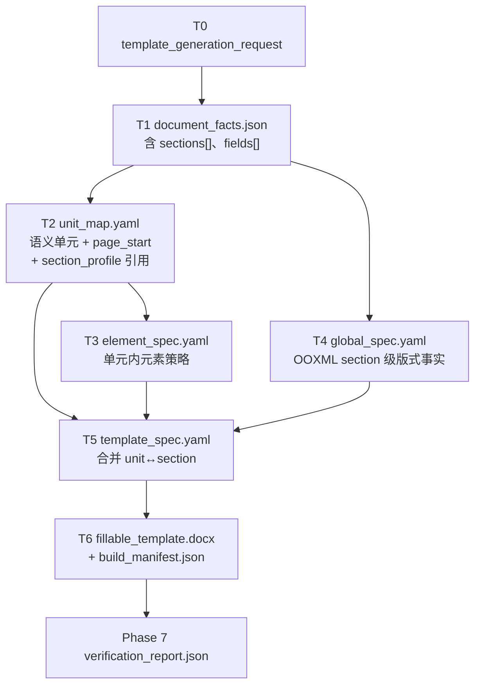

# 模板解析重构执行计划

Last updated: 2026-06-25

一句话结论：模板解析支撑流程只接受学校原始 Word，产出一条唯一的可追溯 artifact 链；学校 gold/config 只用于开发评测、已登记学校增强和验收，不是普通 `template-generate` 的必需输入。

## 阶段依赖与代码映射

`T1`–`T6` 是**阶段 ID / 产物类型 / verifier 分区**，不是严格的 `T1→T2→T3→T4→T5→T6` 串行编号。

### 构建时依赖（代码实际调用顺序）

生成器落盘时，T2 与 T4 **可以并行**，都只读 T1：

```text
T0 输入校验
  -> T1 document_facts
  -> T2 unit_map  ∥  T4 global_spec   （构建输入都只依赖 T1）
  -> T3 element_spec                    （依赖 T1 + T2）
  -> T5 template_spec                   （合并 T2 + T3 + T4）
  -> T6 fillable_template + build_manifest
  -> Phase 7 verification_report
```

调试落盘文件名按 `01`–`07` 编号（见 `outputs.py`）。`04_global_spec.yaml` 写在 `03_element_spec.yaml` 之后只是**写盘顺序**，不代表 T4 依赖 T3。

### 语义分工（页码 / 分节为什么不能只靠 T4）

页码体例在学校模板里通常**和单元相关**（封面无页码、摘要用罗马数字、正文用阿拉伯数字等），但 Word 里实际落在 **section（`sectPr`）** 上。因此拆成两套坐标，在 T5 汇合：

| 坐标系 | 含义 | 主要生产者 | 关键字段 |
| --- | --- | --- | --- |
| **模板 unit** | 封面、摘要、正文等语义单元 | T2 | `unit_id`、`source_range`、`page_start` |
| **Word section** | OOXML 物理分节、页眉页脚、`pgNumType` | T4（来自 T1 `sections[]`） | `section_profiles[]`、`header_footer`、`page_numbering` |
| **联结** | 某 unit 使用哪套 section 版式 / 何时另起节 | **T2 写引用，T5 合并** | `units[].section_profile` → `global.section_profiles[id]` |

```text
T1 sections[] + header/footer     T2 units[] + page_start
         \                               /
          \   units[].section_profile   /
           v             v             v
                 T5 template_spec
           （语义完整的页码/分节规格）
```

**注意**：T4 **不识别**「这是封面还是摘要」；它只搬运 OOXML section 级事实。单元级页码语义要靠 T2 的 `section_profile` / `page_start` 挂到 T4 的 `section_profiles` 上，在 T5 成为可执行规格。当前 `_section_profile_for_unit()` 仍为占位（有 section 时一律 `section_001`），这条联结尚未做实；见 `template-parse-refactor-stage-issues.md` T2/T4 节。



| 阶段 | 在做什么 | 构建时依赖 | 主产物 | 代码位置 | 入口函数 / 模块 |
| --- | --- | --- | --- | --- | --- |
| **编排** | 串联全流程、汇总 `StageResult` | — | — | `src/docfit/template_generation/runner.py` | `generate_template()` |
| **CLI** | `docfit eval template-generate` | 编排 | `out_dir/*` | `src/docfit/cli/main.py` → `src/docfit/convert/orchestrator.py` | `eval_template_generate()` → `run_template_generate_eval()` |
| **T0** | 记录源文件路径、hash、输出目录、策略 | 源 DOCX 存在且可读 | `template_generation_request.json` | `src/docfit/template_generation/request.py` | `build_template_generation_request()` |
| **T1** | 从 Word/OOXML 抽取 run 级事实，不做语义判断 | T0 | `document_facts.json` | `src/docfit/template_generation/source_tree.py`（底层 inspector：`src/docfit/template_gap/inspector.py`） | `inspect_document_facts_docx()` |
| **T2** | 识别模板单元边界、顺序、`page_start`；为每个 unit 指定 `section_profile`（应映射到 T4 的 section） | T1 | `unit_map.yaml` | 推断：`src/docfit/template_generation/structure_candidates.py`；单元定义：`src/docfit/template_generation/constants.py`；产物包装：`src/docfit/template_generation/artifacts.py`（`build_unit_map()`、`_section_profile_for_unit()`） | `build_unit_map()` |
| **T3** | 单元内元素策略（fill / instruction_remove / manual_only / generated 等） | T1 + T2（经 `structure_candidates` / `generation_model`） | `element_spec.yaml` | `src/docfit/template_generation/generation_model.py`、`ontology.yaml`、`artifacts.py` | `build_element_spec()` |
| **T4** | 从 T1 提取 **OOXML section 级**分节、页眉页脚、`pgNumType`、默认字体；**不**判定 unit 归属 | T1 | `global_spec.yaml` | `src/docfit/template_generation/artifacts.py`（`build_global_spec()`、`_page_numbering_from_facts()`） | `build_global_spec()` |
| **T5** | 合并 unit + element + global；`review_flags` 汇总待审项；**语义上**完成 unit↔section 的可执行规格 | T2 + T3 + T4 | `template_spec.yaml` | `src/docfit/template_generation/artifacts.py` | `build_template_spec()` |
| **T6 规划** | 把生成模型落成构建 action 列表 | T3（经 `generation_model`） | `template_generation_plan.json`（兼容调试视图） | `src/docfit/template_generation/plan.py` | `build_template_generation_plan()` |
| **T6 执行** | 复制源 DOCX 后做减法构建（删说明、插 SDT、分页/分节等） | T6 规划 + 源 DOCX + T5 | `fillable_template.docx` | `src/docfit/template_generation/executor.py`、`word_ops.py`、`refs.py` | `execute_template_generation_plan()` |
| **T6 追踪** | 记录每个 action 的 source/output、slots、hash | T6 执行结果 | `build_manifest.json` | `src/docfit/template_generation/manifest.py` | `build_template_generation_manifest()` |
| **Phase 7** | T1–T6 独立 `PASS/FAIL/UNKNOWN`，聚合 `first_bad_stage` | 全部阶段产物 | `verification_report.json`、`pm_report.md` | `src/docfit/template_generation/verifier.py`、`outputs.py` | `verify_template_parse_build()` |
| **落盘** | 写 `out_dir` 与 debug 快照（`01`–`07` 编号） | 编排结果 | 见下文「唯一流水线」 | `src/docfit/template_generation/outputs.py` | `write_template_generation_outputs()`、`write_template_generation_debug_snapshot()` |

**兼容调试视图**（不再拥有独立模板语义，由主产物派生）：`artifacts.source_tree_from_document_facts()` → `legacy_01_source_template_tree.json`；`structure_candidates` → `legacy_02_*`；`generation_model` → `legacy_03_*`；`plan` → `legacy_04_*`。

## 范围

本计划只覆盖模板解析和可填模板生成支撑，不处理学生内容提取、内容放置和最终渲染。旧的 `source_template_tree/template_structure_candidates/template_generation_model/template_generation_plan/template_generation_manifest/generated_template.docx` 不再作为主语义产物；如仍落盘，只能作为新产物的兼容包装或调试视图。

唯一流水线（主产物；`global_spec` 与 `unit_map` 在构建时并行自 T1 产出，在 T5 语义汇合）：

```text
source_template.docx
  -> document_facts.json
  -> unit_map.yaml          ─┐
  -> element_spec.yaml       │  T3 依赖 T2
  -> global_spec.yaml       ─┘  （与 T2 并行，均只读 T1）
  -> template_spec.yaml          （T5：unit + element + global，含 unit↔section 联结）
  -> fillable_template.docx + build_manifest.json
```

## 总门禁

| 门禁 | 判定 |
| --- | --- |
| 缺输入、输入不是 DOCX | `UNKNOWN` 或 `FAIL`，取决于文件是否存在和是否可打开 |
| 缺标准、缺 verifier、缺 coverage | `UNKNOWN` |
| 可见对象未建模且未登记 | `UNKNOWN` |
| 字段缺失导致无法追溯或执行 | `FAIL` |
| 规则与 AI 分歧、低置信 AI 项未审核 | `UNKNOWN` |
| 任一阶段 `FAIL/UNKNOWN` | 不能宣称模板解析成功 |

## Phase 1：统一 artifact 模型

目标：替换现有 01-05 和外部 T1-T6 双命名，形成唯一数据流。

输入：学校原始模板 Word。

输出：`document_facts.json`、`unit_map.yaml`、`element_spec.yaml`、`global_spec.yaml`、`template_spec.yaml`、`fillable_template.docx`、`build_manifest.json`。

阻断条件：同一业务含义同时由新旧产物独立承载；字段缺少 producer/consumer/缺失后果说明。

测试命令：

```bash
uv run pytest tests/contract/test_template_generate.py -q
uv run pytest tests/contract/test_contract_gates.py -q
```

## Phase 2：T1 document facts

目标：先把 Word 读对，不做语义判断。`document_facts.json` 是唯一事实库，后续只引用稳定 id/range，不复制事实。

输入：`source_template.docx`。

输出：`document_facts.json`。

必须覆盖：正文、表格、页眉页脚、文本框、脚注、图片、字段、分页、分节、编号、未知可见对象。run 级事实必须有 `raw_run_id`、`logical_run_id`、`merged_from`、文本、kind、有效样式和样式来源。

阻断条件：可见对象丢失；`unknown_objects` 非空却返回 `PASS`；raw/logical id 不唯一。

测试命令：

```bash
uv run pytest tests/contract/test_template_generate.py -q
```

## Phase 3：T2 unit map 与 T4 global spec

目标：用确定性规则识别单元边界，并从 T1 提取 OOXML section 级版式事实；不接 AI。

分工：

- **T2**：语义单元（`unit_id`、边界、`page_start`）；每个 unit 的 `section_profile` 应引用 T4 的 `section_profile_id`（按 `source_seq` 映射到 `document_facts.sections[]`）。
- **T4**：物理分节（`section_profiles[]`、页眉页脚部件、`pgNumType`、默认字体）；不判定 unit 归属。

输入：`document_facts.json`。

输出：`unit_map.yaml`、`global_spec.yaml`。

阻断条件：required unit 缺失；边界证据不足却写成确定；`section_profile` 无法解析或页面/分节规则既没有明确值也没有 `UNKNOWN`/flag。

测试命令：

```bash
uv run pytest tests/contract/test_template_generate.py -q
uv run pytest tests/contract/test_real_core_generated_template_gap.py -q
```

## Phase 4：T3 element spec

目标：把单元内部拆成可执行元素。确定性规则先覆盖占位符、下划线填空、格式说明、颜色说明、对齐空格、手打目录、PAGE/TOC/SEQ 候选；AI 只处理残余分类。

输入：`document_facts.json`、`unit_map.yaml`、`ontology.yaml`。

输出：`element_spec.yaml`。

阻断条件：`fill` 缺 `fill_source`；`manual_only` 没有人工填写语义；`generated` 没声明字段类型；可能是真内容的说明文字被删除；低置信 AI 项没有审核记录。

测试命令：

```bash
uv run pytest tests/contract/test_template_generate.py -q
```

## Phase 5：T5 template spec 与审核闭环

目标：合并 `unit_map + element_spec + global_spec` 为唯一主产物 `template_spec.yaml`；完成 **unit↔section** 可执行规格（`units[].section_profile` 指向 `global.section_profiles[]`）；让人工审核结果成为 gold 来源。

输入：`unit_map.yaml`、`element_spec.yaml`、`global_spec.yaml`、审核记录。

输出：`template_spec.yaml`、`review_queue.yaml`。

阻断条件：schema 非法；id 重复；引用不存在；required unit 不齐；`section_profile` / fill_source / page_start 不可解析；AI 低置信项缺审核记录。

测试命令：

```bash
uv run pytest tests/contract/test_template_generate.py -q
```

## Phase 6：T6 fillable template build

目标：在源 DOCX 副本上做减法构建，产出稳定可填模板。

输入：`source_template.docx`、`template_spec.yaml`。

输出：`fillable_template.docx`、`build_manifest.json`。

执行规则：施工定位使用 `raw_run_id`/source ref，不用段落文本搜索；`fixed/template_default` 原样保留；`instruction_remove` 删除 run 或字符 span 并保留必要 OOXML；`fill/manual_only` 生成带 `tag=element_id` 的 SDT 内容控件；`generated` 生成 Word 字段或字段占位能力；不得再插入内部 `[[DOCFIT_*]]` 文本 marker。

阻断条件：manifest 无 action/source/output 追踪；成品不是有效 DOCX；成品残留内部 marker；fill/manual_only 不是带 tag 的 SDT；generated field 无法定位。

测试命令：

```bash
uv run pytest tests/contract/test_template_generate.py -q
uv run pytest tests/contract/test_real_core_generated_template_gap.py -q
```

## Phase 7：阶段 verifier 与聚合报告

目标：T1-T6 每一步都能独立输出 `PASS/FAIL/UNKNOWN`，并能报告 `first_bad_stage`。

输入：阶段产物、expected/gold、输入输出 hash、审核记录。

输出：`verification_report.json`、`pm_report.md`。

阻断条件：缺标准、缺 verifier、hash 不匹配、coverage 不足、阶段报告缺状态。

测试命令：

```bash
uv run pytest tests/contract -q
```

## 三校开发评测

三校 gold/config 只用于开发评测、已签收学校验收和可选配置增强。普通 `template-generate` 仍只要求：

```bash
uv run docfit eval template-generate --template <source_template.docx> --out <out_dir>
```

三校 probe 应分别运行模板解析、构建、gap 聚合入口，并把样式、页码、单元顺序、字段问题定位到 T1-T6 的首次出错阶段。
