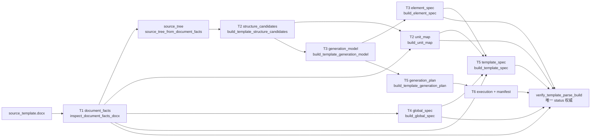
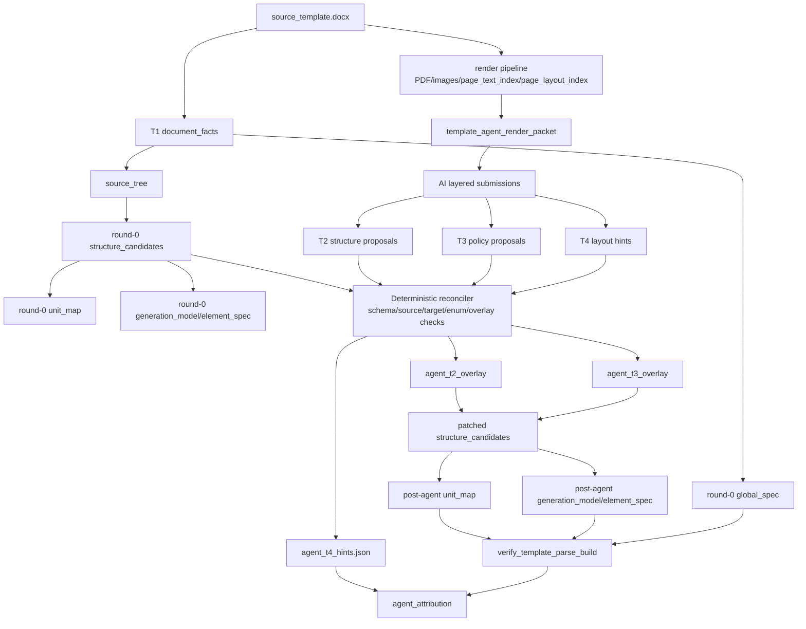
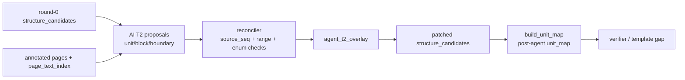
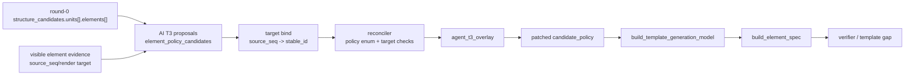
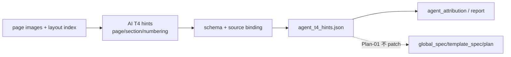
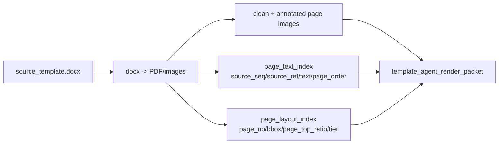
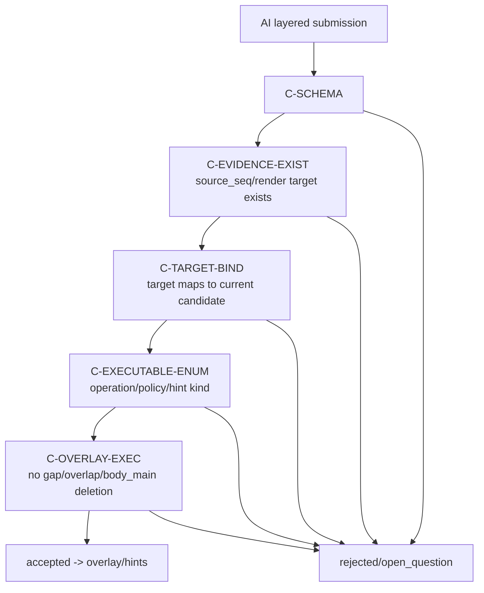
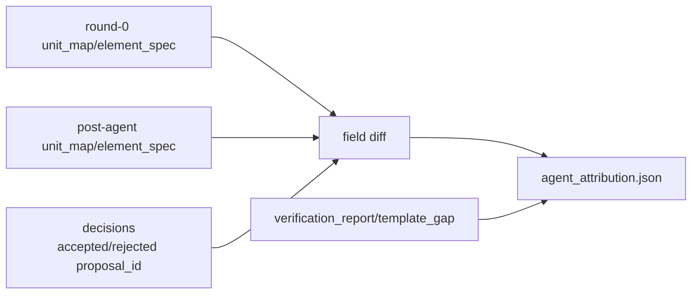

---

## status: draft
owner: template-generation
stage: T2T3
topic: agent-proposal
doc_type: implementation_plan
plan_id: T2T3-AGENT-PLAN-01
created: 2026-06-27
last_updated: 2026-06-27
model_transport: openai-sdk-kimi-minimax
related_docs:
  - docs/plans/template-parse-refactor-t2-unit-recognition-issue-03-state-machine-standard-gates.md
  - docs/plans/template-parse-refactor-t3-element-policy-issue-02-post-confidence-residuals.md
  - docs/plans/template-parse-refactor-t2-open-label-unit-recognition.md
  - docs/plans/template-parse-refactor-t2-visual-pagination.md
related_code:
  - src/docfit/template_generation/runner.py
  - src/docfit/template_generation/artifacts.py
  - src/docfit/template_generation/generation_model.py
  - src/docfit/template_generation/structure_candidates.py
  - src/docfit/template_generation/verifier.py

# T2/T3 Agent Plan 01：AI 输出与模板生成耦合

## 0. 核心结论

AI 在模板生成链路里的角色不是“改代码”、不是“裁判”、也不是“直接生成最终模板”。AI 只产出三类结构化中间建议，由确定性代码校验、落地和重生：

```text
T2 输出：结构建议
  unit_candidates / block_candidates / boundary_adjustments
  -> agent_t2_overlay
  -> patch structure_candidates
  -> regenerate unit_map

T3 输出：元素策略建议
  element_policy_candidates
  -> agent_t3_overlay
  -> patch structure_candidates.units[].elements[].candidate_policy
  -> regenerate generation_model / element_spec

T4 输出：版式 hints
  page_policy_hints / section_profile_hints / page_numbering_hints
  -> agent_t4_hints.json
  -> 首轮只记录和归因，不 patch global_spec/template_spec/plan
```

所有 AI 输出都必须绑定 `source_seq` 或 render target；所有落地都必须经过 schema、source binding、target binding、executable enum 和 overlay 可执行性校验。`verify_template_parse_build` 仍是唯一 status 权威。

## 1. 当前模板生成主流程




| 阶段                | 当前输入                                      | 当前输出                                  | AI 是否直接写                              |
| ----------------- | ----------------------------------------- | ------------------------------------- | ------------------------------------- |
| T1 document facts | `source_template.docx`                    | `document_facts`                      | 否。T1 保持 fact-only                     |
| T2 candidates     | `source_tree`                             | `structure_candidates`                | 否。AI 只能给 overlay proposal             |
| T2 unit map       | `document_facts` + `structure_candidates` | `unit_map`                            | 否。由 patched `structure_candidates` 重生 |
| T3 model/spec     | `request` + `structure_candidates`        | `generation_model` / `element_spec`   | 否。由 patched `candidate_policy` 重生     |
| T4 global spec    | `document_facts`                          | `global_spec`                         | 首轮否。AI 只写 hints                       |
| T5/T6             | T1-T4 产物                                  | `template_spec` / `plan` / `manifest` | 否                                     |
| verifier          | T1-T6 产物                                  | status / report                       | 否。AI 不裁判                              |


## 2. AI 输出总模型

### 2.1 输出总表


| AI 输出                          | 目标阶段     | 最终落地                                                  | 解决的主要问题            | 首轮是否影响生成 |
| ------------------------------ | -------- | ----------------------------------------------------- | ------------------ | -------- |
| `unit_candidates[]`            | T2       | `agent_t2_overlay` patch `structure_candidates.units` | 缺单元、标题变体识别、开放标签    | 是        |
| `block_candidates[]`           | T2       | `agent_t2_overlay` patch block / locked range         | 目录、表单块、声明页被误切或漏切   | 是        |
| `boundary_adjustments[]`       | T2       | `agent_t2_overlay` 调整 start/end/source refs           | 正文过切、后置表单吞并、单元范围错  | 是        |
| `element_policy_candidates[]`  | T3       | `agent_t3_overlay` patch `candidate_policy`           | 填写区、说明文字、表格元素策略误判  | 是        |
| `page_policy_hints[]`          | T4       | `agent_t4_hints.json`                                 | 另起页、独占页、同页约束需要视觉证据 | 否，首轮只归因  |
| `section_profile_hints[]`      | T4       | `agent_t4_hints.json`                                 | 分节、页眉页脚、页码模式疑似变化   | 否，首轮只归因  |
| `page_numbering_hints[]`       | T4       | `agent_t4_hints.json`                                 | 页码样式/起始页/罗马数字等视觉线索 | 否，首轮只归因  |
| `open_questions[]` / `abstain` | T2/T3/T4 | transcript / attribution                              | 证据不足或无法绑定时显式留空     | 否        |


### 2.2 输出形态

每轮 AI 提交统一落为 `template_agent_layered_submission_round_*.json`：

```text
schema_version
prompt_version
source_render_hash
round_id
model
layers:
  t2:
    unit_candidates[]
    block_candidates[]
    boundary_adjustments[]
    open_questions[]
  t3:
    element_policy_candidates[]
    open_questions[]
  t4:
    page_policy_hints[]
    section_profile_hints[]
    page_numbering_hints[]
    open_questions[]
```

AI 输出只表达“建议”和“证据绑定”，不表达 PASS/FAIL，不直接写 `unit_map`、`element_spec`、`global_spec`、`template_spec`、`plan` 或 `manifest`。

## 3. AI 与各阶段的耦合

### 3.1 总体耦合图




### 3.2 T2 耦合：结构识别




T2 AI 输出解决的问题：


| 现有问题                        | AI 输出                                                                   | 落地方式                                | 质量提升路径           |
| --------------------------- | ----------------------------------------------------------------------- | ----------------------------------- | ---------------- |
| 单元漏识别，如声明、版权、致谢、附录          | `unit_candidates[]`                                                     | 新增或 relabel structure candidate     | `unit_map` 单元更完整 |
| 目录/表单块被拆散或吞并                | `block_candidates[]`                                                    | 锁定 block range 或调整单元范围              | 减少过切/欠切          |
| 正文标题被过切成多个 top-level custom | `boundary_adjustments[]`                                                | 调整 boundary start/end               | 正文单元连续性更好        |
| 学校标题变体不在关键词表                | `raw_label` + `display_name` + optional `canonical_label_id_suggestion` | canonical 命中则落 canonical，否则落 custom | 不再依赖闭集关键词才能识别结构  |


### 3.3 T3 耦合：元素策略




T3 AI 输出解决的问题：


| 现有问题                      | AI 输出                                    | 落地方式                               | 质量提升路径                                  |
| ------------------------- | ---------------------------------------- | ---------------------------------- | --------------------------------------- |
| 填写区和固定说明文字混淆              | `element_policy_candidates[]`            | patch `candidate_policy`           | `element_spec` 的 fill/fixed/manual 策略更准 |
| 表格中的 label/value 关系难靠规则判断 | `element_policy_candidates[]` + evidence | patch 目标 element                   | 表格元素策略减少误判                              |
| 行内格式说明残留                  | policy suggestion                        | patch 为 remove/manual/fixed 等可执行枚举 | 生成模板少保留说明性垃圾                            |
| 高置信错误静默通过                 | proposal -> attribution                  | post-agent diff 可追踪                | 错误可归因到 AI 或 round-0                     |


T3 target 决策：

```text
AI 只给 source_seq/render_target_id。
reconciler 只能在唯一映射到 round-0 element stable_id 时 accepted。
0 个或多个候选 -> rejected(C-TARGET-AMBIGUOUS) 或 open_question。
不做 best-effort 猜测。
```

### 3.4 T4 耦合：版式 hints




T4 AI 输出解决的问题：


| 现有问题                    | AI 输出                     | Plan-01 落地               | 后续用途                      |
| ----------------------- | ------------------------- | ------------------------ | ------------------------- |
| 湖南这类无机械分页符但视觉上另起页       | `page_policy_hints[]`     | 只落 `agent_t4_hints.json` | 后续 T4/page_policy plan 消费 |
| 分节/页眉页脚模式需要视觉判断         | `section_profile_hints[]` | 只归因，不改 `global_spec`     | 用于设计 T4 overlay           |
| 页码样式/起始页视觉可见但 OOXML 证据弱 | `page_numbering_hints[]`  | 只归因，不改 plan              | 后续 page numbering 修复依据    |


Plan-01 明确不让 T4 hints 直接改变生成结果，避免一次性扩大到 global layout / executor 行为。

## 4. AI 输入从哪里来

AI 主输入是 render 可见层，不是 T1 OOXML 语义投影：




`template_agent_render_packet.json` 最少包含：

```text
advisory_only / status_authority / allowed_ai_tasks / forbidden_ai_tasks
render_artifacts:
  clean_page_images[]
  annotated_page_images[]
  page_text_index[]
  page_layout_index[]
  render_hash / render_engine / render_version
input_windows:
  full_pass: {page_thumbnails[], page_index_summary}
  focused_pass[]: {layer: t2|t3|t4, page_nos[], reason}
optional_reference:
  canonical unit_id 建议列表，仅作 non-binding naming reference
round0_snapshot_id:
  只用于归因关联
```

明确不给 AI 作为主输入：

```text
T1 body_flow 全文
t2_derived_signals
deterministic_candidates
round-0 draft_unit_map / draft_element_spec
standards/targets/**
```

## 5. 输出如何被管住




探索期不做：

```text
confidence floor / requires_review 拦截
label 是否属于 UNIT_DEFINITIONS 闭集拦截
policy 语义合理性二审
AI status / PASS / FAIL 裁判
```

## 6. 归因和质量闭环




`agent_attribution.json` 最少包含：

```text
rounds[]{round_id, tool_calls[], accepted_proposal_ids[], rejected_proposal_ids[]}
round0_hashes
post_agent_hashes
field_diffs[]{path, before, after, from_round_id, from_proposal_ids[]}
applied_proposal_ids[]
rejected_proposal_ids[]
standard_probe_delta optional
```

Plan-01 只写 attribution，不直接改写 `verification_report` 或 `template_gap_report`。后续通过 `round_id`、`proposal_id`、`target_path`、`source_seq_refs`、`field_path` 做 join。

## 7. 不变量

```text
1. T1 只产事实，不新增 semantic fields。
2. AI 不改 document_facts、standards、hash、manifest。
3. AI 不直接写 unit_map、element_spec、global_spec、template_spec、plan。
4. T2/T3 只通过 patched structure_candidates 重生。
5. T4 首轮只产 hints，不 patch global_spec/template_spec/plan。
6. verify_template_parse_build 是唯一 status 权威。
7. standards/targets/** 不作为生成算法输入。
8. 默认关闭时现有输出必须保持不变。
```

## 8. 实现方式

实现方式服务于上面的输出契约，不作为顶层目标。

```text
src/docfit/template_generation/agent/
  config.py       AgentConfig(enabled=False, max_rounds=4, transport="replay")
  packet.py       build_template_agent_render_packet(...)
  schema.py       tool schemas / layered submission schema
  replay.py       transcript replay, CI zero-network
  tools.py        view_pages / query_text / submit_t2 / submit_t3 / submit_t4 / abstain
  loop.py         round control, stop condition, focused-pass selection
  reconciler.py   hard checks -> decisions
  overlay.py      T2/T3 overlay builders
  regenerate.py   rebuild unit_map / generation_model / element_spec
  attribution.py  diff + proposal/round mapping
  transport.py    OpenAI SDK compatible live transport
```

Live transport：

```text
统一用 openai Python SDK。
Kimi（Moonshot）与 Minimax 均走 OpenAI-compatible endpoint：
  base_url + api_key + model 配置切换。
使用 vision content blocks + tools/function calling。
不引入 LangChain / LangGraph / CrewAI / 云 Agent 平台作为主架构。
```

默认配置：

```text
max_rounds = 4
Round 1: full-pass overview，全书低清缩略图 + page index
Round 2: T2 focused-pass，最多 12 页高清
Round 3: T3 focused-pass，最多 12 页高清
Round 4: T4 hints 或 verifier 定向修复，最多 12 页高清
```

## 9. 实施阶段

```text
Phase 1 输出 schema 与 replay
  - T2/T3/T4 layered submission schema
  - tool schema
  - transcript schema
  - single-round fixture
  - replay transport

Phase 2 T2 overlay
  - unit_candidates / block_candidates / boundary_adjustments
  - source_seq range checks
  - patch structure_candidates
  - regenerate unit_map

Phase 3 T3 overlay
  - element_policy_candidates
  - source_seq/render target -> stable_id unique mapping
  - candidate_policy executable enum
  - regenerate generation_model / element_spec

Phase 4 T4 hints
  - page_policy_hints / section_profile_hints / page_numbering_hints
  - artifact only
  - attribution/report join

Phase 5 Agent loop
  - view/query/submit/abstain tools
  - max_rounds / changed=False / verifier peek stop
  - focused-pass window selection
  - multi-round transcript replay

Phase 6 runner / CLI
  - generate_template(..., agent_config=None)
  - debug snapshot writes agent artifacts
  - CLI/env switch
  - default off

Phase 7 live eval
  - OpenAI SDK compatible Kimi or Minimax transport
  - three-school manual eval
  - not CI gate
```

## 10. 验收门禁

```text
1. 默认关闭：不传 agent_config 时现有输出不变。
2. 零网络：single-round 与 multi-round transcript replay/fixture 全链路可测。
3. T1 边界：不新增任何 semantic fields。
4. 输出边界：AI 只产 T2/T3/T4 structured suggestions。
5. T2/T3 落地：只能 patch structure_candidates 后重生。
6. T4 边界：只落 hints artifact，不 patch T4 产物。
7. T3 target：无法唯一映射 stable_id 则 rejected/open_question。
8. 可执行性：未知 operation/policy/hint kind rejected。
9. 权威裁判：verify_template_parse_build 仍是唯一 status 来源。
10. 归因：同一模板可对比 agent off/on，并映射到 round_id / proposal_id。
11. 框架边界：不新增通用 Agent 框架依赖；live 只通过 OpenAI SDK compatible transport 接入。
```

## 11. 待确认问题

```text
Q1 T2 label suggestion 落 canonical/custom 的具体 trace 字段名。
Q2 attribution 与 verification_report / template_gap_report 的最终 join 输出文件名。
Q3 产品化阶段是否恢复语义/置信 gate。
Q4 T4 hints 后续是否升级成 T4 overlay，另开 plan 决定。
```

