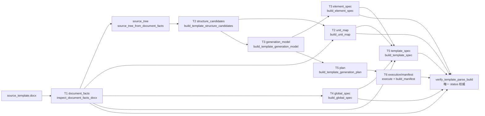
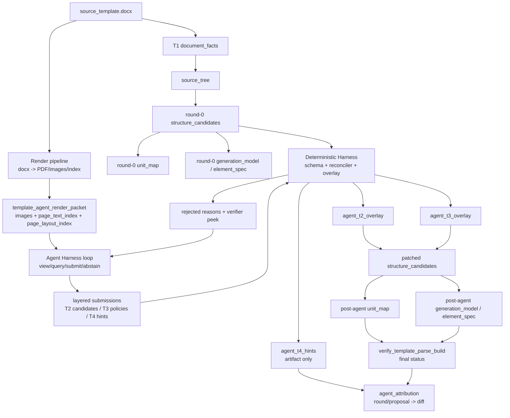

# T2/T3 Agent 方案 Plan 01：Agent Harness + AI Overlay

## 0. 流程总览

### 0.1 当前已有主链路



现状阶段 I/O：

| 阶段 | 当前代码入口 | 输入 | 输出 | 责任边界 |
| --- | --- | --- | --- | --- |
| T1 | `inspect_document_facts_docx` | `source_template.docx` | `document_facts` | 只产 DOCX 事实，不产语义判断 |
| source tree | `source_tree_from_document_facts` | `document_facts` | `source_tree` | 将 T1 事实组织成 T2 可消费索引 |
| T2 candidates | `build_template_structure_candidates` | `source_tree` | `structure_candidates` | 生成候选单元、元素、T2 调试信号 |
| T2 unit map | `build_unit_map` | `document_facts` + `structure_candidates` | `unit_map` | 从候选结构派生最终单元图 |
| T3 model/spec | `build_template_generation_model` / `build_element_spec` | `request` + `structure_candidates` | `generation_model` / `element_spec` | 由 `candidate_policy` 派生元素策略 |
| T4 | `build_global_spec` | `document_facts` | `global_spec` | 全局页眉页脚、分节、页码等事实/策略 |
| T5/T6 | `build_template_spec` / `build_template_generation_plan` / executor | T1-T4 产物 | `template_spec` / `plan` / `manifest` | 生成可执行计划并写 DOCX |
| verifier | `verify_template_parse_build` | T1-T6 产物 | `verification_report` / status | 唯一 PASS/FAIL/UNKNOWN 权威 |

### 0.2 加入 AI 后的耦合点



AI 只耦合在 `structure_candidates` 重生 seam 周围：

| AI 组件 | 输入 | 输出 | 耦合到当前阶段 | 不允许做 |
| --- | --- | --- | --- | --- |
| Render packet | `annotated_page_images` + `page_text_index` + `page_layout_index` | `template_agent_render_packet.json` | 给 Agent 提供可见层观察面；通过 `source_seq` 回绑 T1/T2 | 不替代 `document_facts`，不生成语义事实 |
| Agent Harness | render packet + allowed windows + deterministic feedback | `template_agent_transcript.json` / `layered_submission_round_*` | 编排多轮 `view/query/submit` | 不直接改文件，不直接写 T2/T3/T4 正式产物 |
| T2 submission | page/source evidence | unit/block/boundary proposals | 投影为 `agent_t2_overlay` 后 patch `structure_candidates.units` | 不直接写 `unit_map` |
| T3 submission | `source_seq` / render target | element policy proposals | 映射 round-0 element stable_id 后写 `agent_t3_overlay` | 不绕过 `candidate_policy` enum |
| T4 submission | page/section/page-number hints | `agent_t4_hints.json` | 首轮只供归因和后续计划使用 | 不 patch `global_spec` / `template_spec` / `plan` |
| Deterministic Harness | submissions + round-0 `structure_candidates` | decisions / overlays / feedback | schema、reconciler、overlay、regenerate、verifier peek | 不做语义二审，不改 verifier status |
| Attribution | round-0/post-agent 产物 + decisions | `agent_attribution.json` | 连接 proposal/round 与字段 diff、verification/template-gap | 不修改验收标准 |

## 1. 目标

在当前模板生成代码基础上推进两类工作：

```text
1. 当前代码改进：
   - 保持 T1 fact-only 边界；
   - 明确 T2/T3 可重生 seam；
   - 增加默认关闭的 agent 配置、replay/fixture transcript、artifact 与归因能力；
   - 收口 overlay operation / T3 candidate_policy / T4 hint 的可执行枚举，避免未知值进入后续生成链路。

2. AI 增量：
   - 用 docx→PDF/render 的人类可见层作为 AI 主输入；
   - 用 Agent Harness 编排多轮 view/query/submit，而不是把 one-shot JSON 调用作为目标形态；
   - AI 只能通过 submit_* 工具输出结构化语义建议，不裁判 PASS/FAIL；
   - T2/T3 建 overlay 后重生，T4 首轮只落 hints；
   - 用 round-0 vs post-agent 对照回答 mismatch 是原有问题、AI 改善，还是 AI 引入。
```

## 2. 非目标

```text
1. 不让 AI 修改 document_facts、standards、hash、manifest 或 verifier status。
2. 不把 standards/targets/** 作为生成算法输入。
3. 不把 T1 body_flow、t2_derived_signals、deterministic_candidates、round-0 draft_unit_map / draft_element_spec 作为 AI 主输入。
4. 不在探索期做语义二审、置信度拦截或闭集关键词拦截。
5. 不在首轮直接 patch T4 global_spec/template_spec/plan。
6. 不让 live API 成为 CI 或默认开发流依赖。
7. 不给 AI 自由文件/代码执行能力；AI 只能调用 Agent Harness 暴露的窄工具。
8. 不引入 LangChain / LangGraph / CrewAI / 云 Agent 平台作为主架构；不把 harness、replay、verifier feedback 交给通用 Agent 框架管理。
```

## 3. 当前代码基线

主链路仍以 `runner.py::generate_template` 为边界：

```text
T1 inspect_document_facts_docx
→ source_tree_from_document_facts
→ T2 build_template_structure_candidates / build_unit_map
→ T3 build_template_generation_model / build_element_spec
→ T4 build_global_spec
→ T5 build_template_spec / plan
→ T6 execute / manifest
→ verify_template_parse_build
```

可利用的重生 seam：

```text
build_unit_map(document_facts, structure_candidates)
  只读 structure_candidates["units"] 并重算派生字段。

build_template_generation_model(request, structure_candidates)
  元素策略由 structure_candidates.units[].elements[].candidate_policy 驱动。

结论：
  Agent 只 patch structure_candidates；
  patch 后重跑 build_unit_map + build_template_generation_model + build_element_spec；
  AI 不直接写 unit_map、element_spec 或 verifier 产物。
```

## 4. 运行时形态

```text
round-0 deterministic T2/T3
  → build render packet
  → Agent Harness loop
      - view/query allowed windows
      - submit T2/T3/T4 structured proposals
      - receive deterministic feedback
      - decide focused next round or stop
  → Deterministic Harness
      - schema/reconciler hard checks
      - T2/T3 overlay patch structure_candidates
      - T4 hints artifact only
      - regenerate unit_map / generation_model / element_spec
      - verifier peek feedback
  → final verify_template_parse_build 仍为唯一 status 权威
  → attribution：round-0 vs post-agent diff + proposal_id/round_id 映射
```

默认行为：

```text
agent_config=None 或 enabled=false:
  不构造 transport；
  不读 response；
  不触网；
  现有输出字节级保持不变。
```

单次 structured output 仍可作为最小实现，但只视为 `max_rounds=1` 的 transcript，不作为最终目标形态。

## 5. 运行时选型

采用**仓库自研薄 Agent Harness + 厂商 SDK transport**：

```text
自研 Agent Harness（业务核心）
  - loop.py：轮次、window 选择、终止条件、transcript 落盘；
  - tools.py：view_pages / query_text / submit_t2 / submit_t3 / submit_t4 / abstain；
  - replay.py：按 transcript 零网络重放；
  - feedback.py：把 reconciler/verifier peek 转成下一轮可行动反馈。

OpenAI SDK transport（live eval 才启用）
  - 统一用 `openai` Python SDK；Kimi（Moonshot）与 Minimax 均走 OpenAI-compatible endpoint，通过 `base_url` + `api_key` 切换，二者任选其一即可；
  - `chat.completions.create`（或厂商等价的 completions 路径）；
  - vision：`image_url` / base64 image content blocks；
  - `tools` + `tool_choice` 约束 submit_* 参数（等价于 function calling）；
  - `tool` role messages 回传 deterministic feedback；
  - 默认模型示例：Kimi `moonshot-v1-8k-vision-preview` / Minimax 对应 vision+tools 型号，以 eval 时厂商文档为准。

Provider 配置（live eval，二选一即可）：

```text
Kimi (Moonshot):
  base_url: https://api.moonshot.cn/v1
  api_key: MOONSHOT_API_KEY
  model: moonshot-v1-8k-vision-preview  # eval 时按厂商文档选型

Minimax:
  base_url: <Minimax OpenAI-compatible endpoint>
  api_key: MINIMAX_API_KEY
  model: <vision + tools 型号>

二者共用同一 OpenAI SDK client 构造方式；transport 实现不 fork 两套调用逻辑。
```

不采用通用 Agent 框架作为主路径：

```text
LangChain / LangGraph / CrewAI:
  不作为 Plan-01 主架构依赖。

原因：
  1. 本项目要求 replay-first，CI 要能零网络重放 transcript。
  2. source_seq 绑定、C-OVERLAY-EXEC、candidate_policy enum、verifier peek 是 DocFit 产品契约，不能交给通用 guardrail。
  3. 当前依赖极简；Agent 框架生态会带来版本漂移和调试噪声。
  4. T1 fact-only / verifier status 权威边界必须保留在本仓库 Python 代码中。
```

因此，“成熟能力”只用在底层模型 API 与 tool schema；“决策编排”和“确定性边界”留在仓库内。

## 6. Agent 输入 / 工具 / 输出契约

### 6.1 输入：render packet

AI 主输入是 `template_agent_render_packet.json`：

```text
advisory_only / status_authority / allowed_ai_tasks / forbidden_ai_tasks
render_artifacts:
  clean_page_images[]
  annotated_page_images[]       # 页面叠 source_seq 标签
  page_text_index[]             # source_seq/source_ref/text/page_order
  page_layout_index[]           # page_no/bbox/page_top_ratio/tier
  render_hash / render_engine / render_version
input_windows:
  full_pass: {page_thumbnails[], page_index_summary}
  focused_pass[]: {layer: t2|t3|t4, page_nos[], reason}
optional_reference:
  canonical unit_id 建议列表，仅作 non-binding naming reference
round0_snapshot_id:
  仅用于归因关联，不作为 AI 推理主输入
```

硬要求：

```text
1. AI 引用的 source_seq 必须能在 page_text_index 中绑定。
2. 没有 annotated source_seq / page_text_index 可绑定的输出不得进入 overlay。
3. T3 目标用 source_seq/render_target_id 表达，由 reconciler 映射到 round-0 element stable_id。
4. AI 可给 raw_label/display_name/canonical_label_id_suggestion，但不直接写 final unit_id。
```

### 6.2 工具边界

Agent 只能通过以下工具观察和提交结果：

```text
view_pages(page_nos[])
  返回 allowed window 内的 clean/annotated images + page index slice。

query_text(source_seq_range)
  返回 page_text_index/page_layout_index 切片；不回退到 T1 body_flow 语义投影。

submit_t2_candidates(...)
  提交 unit/block/boundary candidates。

submit_t3_policies(...)
  提交 element_policy candidates。

submit_t4_hints(...)
  提交 section/page/page-numbering hints；首轮不 patch T4。

abstain(question)
  无法绑定 source_seq 或证据不足时显式弃权。
```

每个 `submit_*` 都必须生成 `round_id` / `proposal_id`，进入 schema 校验、reconciler、overlay 或 hints artifact。AI 不能绕过这些工具直接写文件或直接改中间产物。

### 6.3 输出：layered submission

```text
每轮提交可以落为 template_agent_layered_submission.json：

schema_version / prompt_version / source_render_hash / model / round_id
layers:
  t2: {unit_candidates[], block_candidates[], boundary_adjustments[], open_questions[]}
  t3: {element_policy_candidates[], open_questions[]}
  t4: {section_profile_hints[], page_numbering_hints[], page_policy_candidates[], open_questions[]}

T2/T3 可投影为 overlay proposals 并 patch structure_candidates。
T4 首轮只写 agent_t4_hints.json，不 patch global_spec/template_spec/plan。
```

## 7. Deterministic Harness 契约

Deterministic Harness 包含 schema、reconciler、overlay、regenerate、verifier peek。探索期不判断 AI 语义是否正确，只防止不可执行输出进入主链，并给 Agent Harness 返回可行动反馈。

保留硬校验：

```text
C-SCHEMA           response/proposal 满足 schema
C-EVIDENCE-EXIST   source_seq_refs/evidence_refs 存在于 document_facts/page_text_index
C-TARGET-BIND      target 可映射到当前 structure_candidates 中的 unit/element
C-OVERLAY-EXEC     overlay 应用后不制造 gap/overlap；不得移除 body_main
C-EXECUTABLE-ENUM  operation kind、T3 candidate_policy、T4 hint kind 属于当前代码可消费集合
```

明确不做：

```text
1. confidence floor / requires_review 拦截。
2. new label 是否属于 UNIT_DEFINITIONS 闭集拦截。
3. fill/manual/remove_instruction 等 policy 的语义合理性二审。
4. 用 AI 输出改写 verifier status。
```

每轮反馈给 Agent Harness：

```text
accepted_proposal_ids[]
rejected[]{proposal_id, check_id, reason}
changed: true|false
findings_peek:
  first_bad_stage optional
  t2_t3_findings[] optional
next_window_suggestions[] optional
```

## 8. Artifact

首轮需要落盘的 artifact：

```text
template_agent_render_packet.json
template_agent_transcript.json
template_agent_layered_submission_round_*.json
template_agent_decisions.json
agent_t2_overlay.json
agent_t3_overlay.json
agent_t4_hints.json
agent_attribution.json
```

`agent_attribution.json` 最少包含：

```text
rounds[]{round_id, tool_calls[], accepted_proposal_ids[], rejected_proposal_ids[]}
round0_hashes
post_agent_hashes
field_diffs[]{path, before, after, from_round_id, from_proposal_ids[]}
applied_proposal_ids[]
rejected_proposal_ids[]
standard_probe_delta optional
```

## 9. 实施阶段

```text
Phase 1 当前代码契约收口
  - AgentConfig(enabled=False)；
  - runner seam 保持默认零变化；
  - 可执行 enum 常量；
  - round-0 snapshot / artifact 命名。

Phase 2 schema + transcript replay/fixture
  - render packet schema；
  - submit_* tool schema；
  - layered submission schema；
  - single-round transcript fixture（one-shot 最小实现）；
  - ReplayTemplateAgentTransport / FixtureTemplateAgentTransport；
  - 不接 runner、不接 live。

Phase 3 Deterministic Harness
  - layered submission → overlay proposals；
  - T3 source_seq/render target → stable_id 映射；
  - hard-check reconciler；
  - T2/T3 overlay + regenerate；
  - verifier peek feedback。

Phase 4 Agent Harness loop
  - view_pages / query_text / submit_t2 / submit_t3 / submit_t4 / abstain；
  - max_rounds / changed=False / findings_peek stop 条件；
  - focused-pass next window selection；
  - multi-round transcript replay。

Phase 5 attribution
  - round-0 vs post-agent diff；
  - round_id/proposal_id → field_diffs；
  - mismatch delta 与 verification/template-gap 对接。

Phase 6 runner / CLI 接线
  - generate_template(..., agent_config=None)；
  - debug snapshot 写 agent artifacts；
  - CLI/env 开关；
  - 默认关闭、convert/orchestrator 默认不变。

Phase 7 live eval
  - OpenAI SDK transport：`chat.completions.create` + vision + tools/function calling；
  - 模型后端接 Kimi 或 Minimax（OpenAI-compatible `base_url`，eval 时二选一或 A/B 对比均可）；
  - 不引入 LangChain/LangGraph/CrewAI 主架构；
  - 三校人工 eval；
  - 非 CI 门禁。
```

## 10. 验收门禁

```text
1. 默认关闭：不传 agent_config 时现有输出不变。
2. 零网络：single-round 与 multi-round transcript replay/fixture 全链路可测，CI 不调用 live API。
3. T1 边界：不新增任何 semantic fields。
4. 权威裁判：verify_template_parse_build 仍是唯一 status 来源。
5. 可执行性：未知 operation/policy/hint kind rejected，不进入 generation model。
6. T3 target：AI 只给 source_seq/render target；无法唯一映射 stable_id 则 rejected/open_question。
7. T4 边界：首轮只产 hints artifact，不 patch T4 产物。
8. 工具边界：AI 只能通过 Agent Harness 工具观察/提交；不能直接改文件或最终 artifact。
9. 终止条件：changed=False、max_rounds、或 verifier peek 无 T2/T3 finding 时停止。
10. 框架边界：Plan-01 不新增通用 Agent 框架依赖；live 只通过 OpenAI SDK transport 接入 Kimi / Minimax。
11. 归因：同一模板可对比 agent off/on，并把变化映射到 round_id / applied_proposal_ids。
12. 非回归：standards/targets/** 不被自动更新；t2_standard gate 接线不被本路径触碰。
```

## 11. 待确认问题

```text
Q1 render packet 的 full-pass / focused-pass 页数上限。
Q2 每轮 focused-pass 高清页上限与 max_rounds 默认值。
Q3 Harness 反馈源是否只用 reconciler，还是加 verifier peek + optional t2_standard mismatch 区间。
Q4 T3 source_seq/render target → stable_id 的多候选处理：rejected 还是 open_question。
Q5 T2 label suggestion 如何落 canonical/custom trace。
Q6 attribution 与 verification_report / template_gap_report 的最终字段合流方式。
Q7 产品化阶段是否恢复语义/置信 gate。
```
