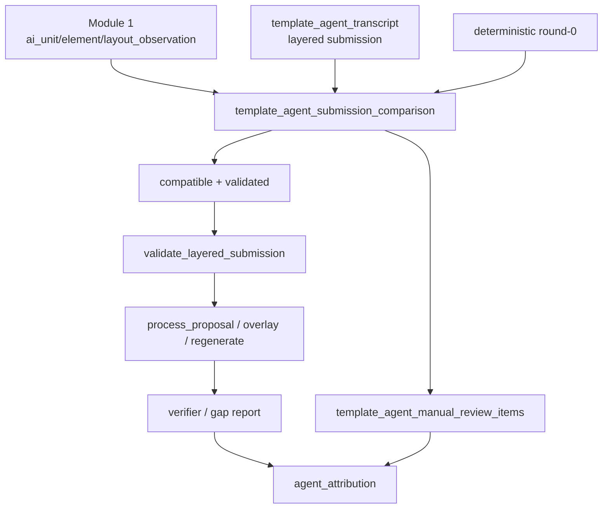

# T2/T3/T4 Agent Plan 04：AI 与代码生成衔接计划（合并版）

> 本文是 T2T3T4 agent-proposal 阶段的**唯一保留文档**。主线是 **Module 2（AI 与代码生成衔接）**；
> Module 1（AI 独立同形产物）作为上游输入收敛在“上游输入：Module 1”一节；
> 阶段演进史、当前实现现状、数据契约、验证矩阵、风险与待决项收敛在附录 A/B。

## 目的

本计划说明 AI 侧产出的 `template-agent-layered-submission-1.0` / AI 独立同形产物如何进入代码生成链路：代码如何消费 AI 输出，并生成最终模板相关 artifact。

它不是当前优先执行项。执行顺序是：

```text
1. 先完成 AI 观察链路（clean render packet、open_questions、transcript、replay 合同；见附录 A）。
2. 再执行本计划：代码如何消费 AI 输出，并生成最终模板相关 artifact。
```

## 两模块定位

AI 介入拆成两个模块。本计划是 **Module 2**，Module 1 只作为上游输入。

| 模块 | 职责 | 在本文的位置 |
| --- | --- | --- |
| **Module 1（上游输入）** | AI 基于干净事实**独立产出与代码同形的完整阶段产物**（AI 版 unit_map / element_spec / global_spec），不读、不改代码阶段结论 | “上游输入：Module 1”一节 + 附录 A.3 |
| **Module 2（本计划主线）** | 每阶段把**代码输出 + AI 输出做合并/对账**，冲突直接报出，人 / Claude Code 拿已签收阶段标准裁决；多轮后再定永久合并策略 | 本文主体 |

隐喻：**两个互不通气的证人各出一份答案，一致就信、不一致就亮灯交人或规矩判。** Module 1 让 AI 这个证人独立、可靠地出一份答案；Module 2 负责对账与裁决。

## 核心原则

AI 和代码都不是最终裁判。

```text
1. 模型只“提”，确定性代码“定形”。每个质量保证都是确定性闸门，不“信任模型”。
2. AI 负责提交 layered submission / 独立同形产物：`layers.t2/t3/t4.*`、`layers.*.open_questions`，
   或 `ai_unit_observation` / `ai_element_observation` / `ai_layout_observation`。
3. 代码负责 `validate_layered_submission`、`process_proposal`、`overlay/regenerate`、comparison、verification。
4. AI 与代码一致且结构校验通过时，才进入自动执行候选。
5. AI 与代码冲突、双方都不确定、或代码无法校验时，直接生成待人工决定问题。
6. 本阶段不做复杂 evidence scoring，不做自动加权仲裁。
7. `verify_template_parse_build` 仍是唯一 status 权威。
8. default-off：不传 `agent_config` 时现有输出和测试必须保持不变。
```

## 上游输入：Module 1（AI 独立同形产物）

Module 1 在本计划中**只作为输入**，不在此展开实施。要点（完整细节见附录 A.3）：

```text
1. 产出三份与代码同形的独立产物，不 patch 代码结构：
   - ai_unit_observation     （镜像 unit_map）
   - ai_element_observation  （镜像 element_spec）
   - ai_layout_observation   （镜像 global_spec）
   外加 quality_report.json（降级 demotions、覆盖、窗口来源、abstain）与 transcript。
2. AI 第一相只看 clean evidence（T1 事实 + 页图 + source_seq/page 锚点 + 最小 taxonomy），
   不含任何代码阶段结论（unit_map / structure_candidates / element_spec / candidate_policy），
   也不含 standards / targets / gold / judge（防火墙）。
3. 物化校验闸门保证“无论模型质量，产物都良构”：标签闭合、证据绑定、必填规则、覆盖不重叠；
   越界即降级 unknown 并写 quality_report.demotions（也是 Module 2 的冲突种子）。
4. 覆盖不变量：coverage.owned ∪ unknown == total，无 silent gap。
5. 自一致性多采样：N 份 submission 按 source_seq 多数投票，一致率 -> confidence，平票 -> unknown。
```

衔接到 Module 2：

```text
Module 1 产出 ai_unit/element/layout_observation
  -> 喂本计划的 comparison，使对账成为“代码产物 vs AI 同形产物”的两份对照
  -> coverage / items[].source_seq_refs / quality_report.demotions 即对账与冲突定位接口
  -> 冲突 / 不确定 -> 本计划的 manual_review_items（人 / Claude Code 拿阶段标准裁决）
  -> 多轮后用 demotions + comparison 数据决定永久合并策略
```

> 兼容说明：本计划同时支持两种 AI 输入形态——Module 1 的“独立同形产物对账”（推荐，两份对照）
> 与历史 overlay-on-parse 的“layered submission vs deterministic round-0”对账。两者都进入下面的决策规则。

## 输入与输出

### 输入

来自 AI 侧（Module 1 / 观察链路）：

```text
1. `template_agent_render_packet`
2. `template_agent_pass_plan`
3. `template_agent_transcript`
4. `template-agent-layered-submission-1.0` 与 `layers.t2/t3/t4.open_questions`
   或 `ai_unit_observation` / `ai_element_observation` / `ai_layout_observation` + `quality_report.json`
```

来自现有代码：

```text
1. deterministic round-0 的 `unit_map` / `element_spec` / `global_spec` 候选结果。
2. `validate_layered_submission` / `process_proposal` / `overlay` / `regenerate` 能执行的 proposal contract。
3. verifier / gap report / attribution 当前报告链路。
```

### 输出

```text
1. `template_agent_submission_comparison`：AI 输出与 deterministic 当前结果的兼容/冲突/缺失关系。
2. `template_agent_decisions`：现有 reconciler 的 accepted/rejected 决策，必要时扩展 `manual_review_required`。
3. `agent_t2_overlay` / `agent_t3_overlay` / `agent_t4_hints`：已校验且可执行的 T2/T3/T4 输出。
4. `template_agent_manual_review_items`：冲突、不确定、无法校验、风险较高的人工待决问题。
5. `agent_attribution`：说明哪些最终变化来自 AI，哪些来自代码，哪些交给人工。
```

## 决策规则

### 自动进入 proposal 的条件

只有同时满足以下条件，AI 输出中的 proposal/hint 才能进入 `process_proposal`：

```text
1. 所在 layer 没有 blocking `open_questions`。
2. proposal/hint 的 `source_seq_refs`、`page_no/page_nos` 或 `render_target_refs` 全部存在于 `template_agent_render_packet`。
3. 代码结构校验通过：无重叠、无反向 span、无跨 scope、enum 合法。
4. proposal/hint 与 deterministic 当前结果不冲突，或 deterministic 当前结果为空/缺失。
5. 变更不属于高风险类型。
```

高风险类型包括：

```text
1. 删除或忽略大段内容。
2. 把固定模板内容改成学生填写。
3. 把学生填写区域改成直接保留。
4. 调整跨页或跨 region 边界。
5. 修改页眉、页脚、页码、分节、目录字段等全局布局规则。
```

高风险类型默认进入人工待决，不自动执行。

### 直接上报人工的条件

以下情况直接生成 `template_agent_manual_review_items`：

```text
1. AI 输出 unknown / ambiguous / needs_human_review。
2. AI 和 deterministic 当前结果冲突。
3. AI 和代码都没有足够依据。
4. proposal/hint 缺少可反查 refs。
5. 代码校验失败。
6. 同一 source_seq 被多个 unit/element 争用。
7. 变更属于高风险类型。
```

人工待决项需要清楚说明：

```text
1. 冲突是什么。
2. AI 怎么看。
3. 代码怎么看。
4. 影响哪些 source_seq/page/region/element。
5. 需要人工选择什么。
```

## 模块边界

| 模块 | 责任 | 不负责 |
| --- | --- | --- |
| `agent/comparison.py` | 比较 AI 输出与 deterministic 当前结果，产出 compatible/conflict/missing/unknown | 不判断谁一定正确 |
| existing `agent/schema.py` | `validate_layered_submission`，校验 `schema_version`、`layers`、`proposal_id`、source/render/page binding | 不自动接受 proposal |
| existing `agent/reconciler.py` | `process_proposal`，把 validated proposal 交给 T2/T3/T4 执行分支 | 不绕过人工待决规则 |
| `agent/manual_review.py` | 汇总 `layers.*.open_questions`、conflicts、validation failures、Module 1 demotions | 不自动学习人工答案 |
| `agent/attribution.py` | 记录最终 artifact 中 AI/代码/人工来源 | 不决定 PASS/FAIL |
| existing `reconciler/overlay/regenerate` | 执行结构校验与 artifact 重建 | 不接收未校验 AI patch |

## 数据流



## 实施阶段

### Phase 0：等待 AI 观察链路完成

门禁：

```text
1. `template-agent-layered-submission-1.0` schema / Module 1 observation schema 已稳定。
2. `layers.*.open_questions` 已能落盘到 `template_agent_transcript`。
3. `template_agent_transcript` 能复现一次 staged run。
4. `template_agent_render_packet` / prompt payload 防锚定测试通过。
```

### Phase 1：Comparison only

目标：只比较，不执行。

改动范围：

```text
1. 新增 agent/comparison.py。
2. 输入 AI 输出（layered submission / Module 1 observation）与 deterministic 当前结果。
3. 输出 compatible/conflict/missing/unknown/manual_review_required。
4. 所有 conflict 默认进入 `template_agent_manual_review_items`。
```

门禁：

```text
1. 冲突不会被自动吞掉。
2. compatible 只表示“可进入下一步校验”，不表示最终正确。
3. `template_agent_submission_comparison` 可被人工读懂。
```

### Phase 2：Schema / reconciler 接入

目标：只把 compatible + validated 的 AI 输出交给现有 schema/reconciler。

改动范围：

```text
1. 优先复用 `validate_layered_submission` 和 `process_proposal`。
2. 支持现有 `add_unit`、`adjust_unit_range`、`set_candidate_policy`、T4 hints 等最小集合。
3. 缺 ref、跨 scope、重叠、enum 非法时拒绝执行并生成 `template_agent_manual_review_items`。
```

门禁：

```text
1. proposal 不能来自 unknown/ambiguous/open_question。
2. proposal 必须可追溯到 `template_agent_transcript` 和 `template_agent_render_packet` refs。
3. 高风险类型不自动转换。
```

### Phase 3：Manual review report

目标：把 AI/代码决定不了的问题做成可行动报告。

改动范围：

```text
1. 新增 `template_agent_manual_review_items` artifact。
2. 汇总 `layers.*.open_questions`、comparison conflicts、validation failures、Module 1 demotions。
3. 给每个问题生成稳定 id、影响范围、候选选择、阻塞级别。
```

门禁：

```text
1. blocking 问题不能被自动忽略。
2. 报告中能看到 AI 观察和代码判断。
3. 人工处理结果可以作为后续 fixture 输入，但本阶段不自动训练或自动学习。
```

### Phase 4：执行与归因

目标：把通过校验的 proposal 接入现有执行层，并记录来源。

改动范围：

```text
1. 接入现有 process_proposal / overlay / regenerate。
2. `agent_attribution` 标记每个最终变化来源：layered_submission、ai_observation、deterministic、human_review、fallback。
3. verifier/gap report 保持最终质量门禁。
```

门禁：

```text
1. default-off 输出不变。
2. AI 失败或全部进入 `template_agent_manual_review_items` 时，当前确定性主流程不劣化。
3. 所有自动执行项都能追溯到 compatible comparison + schema validation + `process_proposal` + verifier。
```

## 完成定义

本计划完成时，应满足：

```text
1. AI 输出可以进入代码链路，但不能绕过校验。
2. AI 与代码冲突时直接上报人工，不做复杂自动裁判。
3. 可自动执行的只限于 compatible、validated、低风险的 proposal/hint。
4. 高风险、不确定、冲突、无法校验的问题都有 `template_agent_manual_review_items`。
5. attribution 能说明最终模板中每个 AI 相关变化来自哪里、经过了什么校验、是否需要人工。
```

---

## 附录 A：阶段演进背景与现状（合并自 issue-01/02/03、plan-01/02/03/05）

> 本附录保留早期迭代中仍然有效的事实、契约和约束。它是背景与参考，主线决策仍以正文为准。

### A.1 迭代脉络

| 顺序 | 文档（已合并删除） | 结论 / 贡献 |
| --- | --- | --- |
| issue-01 | one-shot-vs-agent | 当前代码无 one-shot/agent runtime；单次 LLM 只能作为 `max_rounds=1` transcript，不能替代 harness/replay/overlay/verifier feedback；需仓库内薄 Agent Harness，不引入 LangChain/LangGraph/CrewAI。 |
| plan-01 | current-code-ai-overlay | overlay-on-parse 首版：AI 出 proposal -> patch `structure_candidates` -> 重生 unit_map/element_spec；T4 首轮只落 hints；default-off/replay/schema/reconciler/overlay/attribution。 |
| issue-02 | current-ai-flow-and-gaps | plan-01 首版实现审查：落地层基本达标，输入层（packet=facts 文本投影、无图）与调用层（loop 实为单发 JSON × N、工具是死代码）是占位实现。 |
| plan-02 | staged-ai-flow | 改为分阶段 pass：T2 扫单元并 checkpoint -> T3 按 unit window 判断元素 -> T4 只落全局版式 hints；补真实 render packet、tool loop、pass plan、conflict 决策、staged replay。 |
| issue-03 | ai-quality-context-architecture | 分阶段后仍把事实证据与代码解析结论混在一起，AI 易被锚定；需 clean evidence / independent observation / comparison 分工。 |
| plan-03 | ai-quality-context-architecture | clean render packet + AI 独立观察 + 不确定/冲突直接上报人工；定义 pass 合同、工具策略、open_questions 合同、验证矩阵。 |
| plan-05 | module1-independent-stage-output | Module 1：AI 产出独立同形产物（不 patch 代码结构），含 clean-evidence+防火墙、物化质量闸门、自一致性、覆盖不变量。 |

### A.2 当前实现现状（以已落地代码为准）

Agent 集成架构四层状态：

| 子层 | 职责 | 状态 |
| --- | --- | --- |
| 输出契约 | AI 每轮交的 `layered_submission` JSON | ✅ schema 已落地 |
| 落地层 | proposal 校验、overlay patch、regenerate、归因 | ✅ 基本达标 |
| 编排层 | round 循环、停止条件、轮间上下文 | ⚠️ 有壳子，逻辑未达设计 |
| 运行时输入/调用 | render packet、transport、tool loop、vision | ❌ 占位实现 |

关键坐标澄清（避免混淆）：

```text
T1–T6 = 模板生成确定性流水线阶段（正交于 agent 轮次）。
round-0 = 问 AI 之前规则算出的第一版 T1–T4 产物；round-1…N = AI 第 N 次 submission。
round-0 ≠ T1；debug 落盘序号（01_/02_…）≠ agent round。
Agent 耦合层嵌在 T2/T3 与 T5 之间；T4 global_spec 在 agent 前由 build_global_spec 定死，agent 不碰。
一轮 = 一整包 layered submission（t2 结构 + t3 元素策略 + t4 hints），不是三份终稿。
终稿由 regenerate + T5/T6 确定性代码生成。
```

仍待修的分级 gap（供执行排序）：

```text
Blocker
  B1 输入层与设计相反：packet = facts 文本投影、无图，T4 视觉用例不可做。
  B2 agent loop 名不副实：工具不回灌、轮间无上下文，实质“同一问题问 N 次”。
  B3 live 请求缺陷：tools 与 response_format=json_object 冲突；无 vision；packet 非 JSON 注入。
High
  H1 overlay 无法认领 round-0 未分配（纯 gap）的 source_seq，漏识别核心用例被挡。
  H2 CLI/live 输入闭环不完整：缺 packet 时入口语义不一致（自动 facts-projection vs 要求 render_packet_path）。
  H3 T4 无版式证据：page_no 恒 1、bbox/page_top_ratio 为空。
  H4 live SDK 依赖缺失：pyproject 未声明 openai，live 路径 import 失败。
Medium / Low
  M1 env 静默启用；M2 归因按下标 diff；M3 t2_input stale；M4 token/温度硬编码；
  L1 T4 hint 无 payload schema；L2 Kimi 端点 UA 伪装；L3 max_rounds 解析失败退化为 0；
  L4 round-0+regenerate 双重全算；L5 缺 staged replay 端到端 accept 合同 fixture。
```

依赖：B 依赖 A（输入真实化）；C（编排）依赖 B；D（overlay/归因/t2_input）/E（CLI/config）/F（测试）可与 A–C 并行。

### A.3 Module 1 详细契约（AI 独立同形产物）

目标数据流：

```text
document_facts (T1, fact-only)
  -> 渲染包（防火墙干净）
  -> Pass-T2 : T2 clean evidence（全文压缩）   -> 物化校验 -> ai_unit_observation
  -> Pass-T3 : 按【AI 自己的 T2 单元】切窗口     -> 物化校验 -> ai_element_observation
               T3 clean evidence（单元窗口全文）    （每窗口可 N 采样）
  -> Pass-T4 : T4 clean evidence（真实页图）     -> 物化校验 -> ai_layout_observation
  -> bundle.json + transcript + quality_report.json
```

三份产物 schema（`agent/observation_schema.py`，NEW）共享信封：
`artifact_type, schema_version="ai-observation-1.0", prompt_contract_version, source_render_hash, model, stage, created_at, coverage{owned_source_seq[], unknown_source_seq[], total}, items[], unknown_items[], open_questions[], abstain, self_consistency`。

```text
ai_unit_observation（镜像 unit_map）
  item = {unit_id(∈22单元 或 "unknown_unit"), name, order, source_seq_refs[], source_seq_range,
          page_start, confidence(low|medium|high), anchors[],
          evidence_refs[]{source_seq,page_no,render_target_id,derives_from}, flags[], ai_rationale}
  不含 section_profile_refs（属 T4，防跨阶段臆造）。

ai_element_observation（镜像 element_spec）
  item = {element_id="{unit_id}.{ord}", unit_id, order, policy(∈6枚举), role, content,
          source_seq_refs[], raw_run_ids[], confidence, evidence_refs[],
          fill_source(fill 必填), generated.field_type(generated 必填,∈{TOC,PAGE,SEQ,FIELD_PLACEHOLDER}),
          manual_semantics(manual_only 必填), ai_rationale, ai_decision_path}
  Module 2 以 (unit_id, source_seq_refs, order) 对齐代码元素。

ai_layout_observation（镜像 global_spec）
  section_profiles[]{section_profile_id, boundary{start/end_source_seq, confidence}, page_setup,
                     header_footer, page_numbering, evidence_refs[]（需 page_no+render_target）},
  default_font, page_numbering, header_footer[], numbering_rules, unknown_items[]
```

物化 / 校验闸门（`agent/observation_materialize.py`，NEW），逐 item：

```text
① schema 形状校验（复用现有 layered submission 校验模式）+ source_render_hash 对齐。
② 标签闭合：unit_id∈22∪{unknown_unit}、policy∈6、confidence∈{low,medium,high}、field_type∈4集；越界 -> 降级 unknown。
③ 证据绑定：复用现有 source binding 校验对渲染包验 refs；未绑定 -> 降级。
④ 必填规则（镜像 ontology）：fill->fill_source、generated->field_type、manual_only->manual_semantics；缺失 -> 降级。
⑤ 覆盖/不重叠：owned=∪item.source_seq_refs；重叠时低 confidence 让位；unknown=total−owned；写 coverage。
每次降级写 quality_report.demotions[]（item id、原因、check_id）—— 也是 Module 2 的冲突种子。
空/垃圾响应也产出 schema-valid 产物（全 unknown，abstain=true）。
```

Clean-evidence 与防火墙（`agent/evidence.py`，NEW）：

```text
字段白名单 EVIDENCE_FIELD_WHITELIST（唯一真相，单测护）。
防火墙断言 assert_firewall_clean(view)：命中 deny-set
  {unit_map, structure_candidates, candidate_policy, element_spec, global_spec,
   candidate_targets, standards, gold, judge, expected_*} 即抛 EvidenceFirewallError；
  在每个 scope 末尾与渲染包构建后各跑一次。
三 scope：
  T2 = 全文压缩（每页文本摘要 + 缩略图 refs + source_seq 索引 + 标题候选样式事实，只给事实不给标签）。
  T3 = 单元窗口全文（区域内每 source_seq 全文 + run/style/field 事实 + 区域页裁剪 + 命中窗口的 fields）。
  T4 = 真实页图（要求 real_render，否则该阶段 abstain）+ 页眉脚/sections/numbering/页码 fields + 版面位置索引。
```

质量机制：分解式 rubric（T3 给显式决策树并要模型回报 `ai_decision_path`）、taxonomy/枚举接地（22 unit_id + 6 policy 作为允许标签集注入 prompt，领域先验非 gold）、自一致性多采样（v1 即加，N 份按 source_seq 多数投票，>=0.8 high / >=0.5 medium / 平票 unknown）、证据绑定强制 + abstain 一等公民、工具策略分阶段（T2 query_text 必/view_pages 选；T3 query_text 必；T4 view_pages 必）。

Module 1 文件清单：

```text
NEW（src/docfit/template_generation/agent/）：
  observation_schema.py、evidence.py、observation_windows.py、observation_tools.py、
  observation_prompts.py、observation_materialize.py、observation_loop.py、observation_config.py。
REUSE（不改）：packet.py（以 structure_candidates={} 调用得防火墙干净渲染包）、transport.py(ReplayTransport)、
  replay.py、reconciler 的 source binding 校验、schema 的 layered submission 校验模式、
  constants.UNIT_DEFINITIONS、ontology.yaml。
MODIFY（极小）：agent/__init__.py 导出 run_observation_pipeline / ObservationConfig；
  不动 loop.py / overlay.py / regenerate.py / reconciler.process_proposal / windows.py / attribution.py。
```

Module 1 本轮范围（已确认）：replay 核心（Phase 1 合同+fixture+schema；Phase 2 clean-evidence；Phase 3 三阶段 pass + 物化 + 自一致性）。
Out of scope（后续）：live(kimi/minimax)、响应缓存（`source_render_hash + contract + model` 为键）、CLI `template-observe` 子命令。

### A.4 Staged pass 数据契约（来自 plan-02/03）

历史 overlay-on-parse / staged pass 路线仍提供这些可复用契约：

```yaml
# Pass plan：把 round-1/2/3/4 改成明确任务
artifact_type: template_agent_pass_plan
passes:
  - {pass_id: t2_unit_scan,            pass_kind: t2_unit_scan,     allowed_layers: [t2], input_window: full_document}
  - {pass_id: t3_unit_elements_cover, pass_kind: t3_unit_elements, allowed_layers: [t3], unit_id: cover, input_window: unit:cover}
  - {pass_id: t4_global_layout,       pass_kind: t4_global_layout, allowed_layers: [t4], input_window: global_layout}
```

```yaml
# Unit window：T3 按单元切窗口的边界
window_id: unit:cover
unit_id: cover
source_seq_refs: [1, 2, 3]
page_nos: [1]
candidate_targets:
  - {target_candidate_id: cover.e_001, source_seq_refs: [1], current_candidate_policy: fixed}
neighbor_context: {previous_unit_id: none, next_unit_id: integrity_statement}
```

```yaml
# Conflict decision：冲突必须进 decisions，不能后者静默覆盖前者
decision: rejected
reason_code: C-CONFLICT          # 或 C-WINDOW-BOUNDARY / C-TARGET-AMBIGUOUS
proposal_id: t3_cover_002
conflicts_with: t3_cover_001
target_candidate_id: cover.e_001
```

合并规则：同一 `target_candidate_id` 只能有一个 accepted policy；多 pass 改同一 target 且 policy 不同 -> rejected/open_question；source_seq 不在该 unit window 内 -> rejected(C-WINDOW-BOUNDARY)。

open_questions 合同（最重要的安全阀，含 `question_id`、`blocking_level`、`affected_refs`、`agent_submission_summary`、`deterministic_summary`、`suggested_candidate_policies`、`required_human_action`）：blocking 问题不能被自动吞掉；非 blocking 可进报告但不偷偷改最终 artifact。

### A.5 不变量（来自 plan-01 §7，仍然有效）

```text
1. T1 只产事实，不新增 semantic fields；AI 不改 document_facts、standards、hash、manifest。
2. AI 不直接写 unit_map、element_spec、global_spec、template_spec、plan、manifest。
3. T2/T3 只通过 patched structure_candidates 重生（overlay-on-parse 路线）；
   Module 1 路线下 AI 出独立同形产物，由 comparison/人工裁决后再由代码落地。
4. T4 首轮只产 hints，不 patch global_spec/template_spec/plan。
5. verify_template_parse_build 是唯一 status 权威。
6. standards/targets/** 不作为生成算法输入，只能作为显式 report/join 或人工裁决标准。
7. 默认关闭时现有输出必须保持不变。
8. 不引入通用 Agent 框架依赖；live 只通过 OpenAI SDK compatible transport 接入。
```

## 附录 B：验证矩阵、风险与待决策项

### B.1 验证矩阵

| 验证项 | 覆盖风险 | 建议测试 |
| --- | --- | --- |
| default-off output unchanged | agent 开关污染主流程 | `tests/contract/test_template_generate_agent_default_off.py` |
| clean render packet / firewall whitelist | AI 第一相被 deterministic parse 锚定 | `agent/packet.py`、`agent/evidence.py` 字段白名单单测；注入结论字段 assert_firewall_clean 抛错 |
| prompt contract prohibited fields | prompt 混入当前代码答案 | staged replay snapshot |
| 覆盖不变量 | silent gap | 三份产物 `coverage.owned ∪ unknown == total` 断言 |
| 物化闸门 | 越界标签/未绑定证据/缺必填 | 全部降级且产物仍 schema-valid，`quality_report.demotions` 有记录 |
| 自一致性 | 多采样聚合 | 3 份分歧 submission -> 多数 high、平票 unknown |
| T2 source coverage | `t2_unit_scan` 漏 source_seq 或重叠 | T2 proposal validation 单测 |
| T3 unit window boundary | 读跨 `unit_window` 或 range 过宽 | staged replay fixture |
| comparison conflict | AI vs deterministic 差异被吞掉 | comparison 单测 + 冲突 fixture |
| layout abstain | 无真实图像时幻觉 T4 | staged replay test |
| open questions | 不确定问题被静默吞掉 | ambiguous/conflict fixture |
| transcript replay | live 难复盘 | replay fixture roundtrip |

候选命令：

```bash
uv run pytest tests/contract/test_template_generate_agent_default_off.py
uv run pytest tests/contract/test_template_generate_agent_replay.py
uv run pytest tests/contract/test_template_generate_agent_staged_replay.py
uv run pytest tests/unit/template_generation_agent
```

### B.2 风险与缓解

| 风险 | 表现 | 缓解 |
| --- | --- | --- |
| render packet / prompt payload 混入 parse 结论 | 字段名换了仍给当前 unit/policy | whitelist test + prohibited field snapshot + 防火墙断言 |
| AI 被迫硬猜 | prompt 要求必须给确定答案 | unknown/ambiguous/open_question/abstain 是合法输出 |
| T2 错误传导到 T3 | unit window scope 错，后续全错 | T2 validator + open_questions；窗口来源记入 quality_report |
| vision 成本失控 | 每 pass 发整本图片 | T2 缩略/摘要、T3 window crop、T4 才用全页 |
| annotated SVG 不可读 | 模型拿到外链 SVG 或丢图 | clean PNG + anchor table 优先；标注图必须栅格化 |
| DOCX 渲染不稳定 | T4 视觉用例被平台工具卡住 | packet 明确 render_status；live 严格拒绝假视觉；replay 用固定 packet |
| 人工待决太多 | AI 过度保守 | 用 fixture 调 prompt，但不引入自动证据打分 |
| live provider 不稳定 | live 阻塞架构验证 | replay fixture 是主验收，live 只验证 transport/vision 通道 |

### B.3 待决策项

| 决策 | 默认 / 取法 | 决策时点 |
| --- | --- | --- |
| AI 产出形态 | 独立同形产物（不 patch 代码结构），按两模块对账走（推荐） | 已确认 |
| T3 窗口来源 | 用 AI 自己的 T2 单元（端到端独立）；级联记入 quality_report | 已确认 |
| 自一致性 | v1 即加 | 已确认 |
| `t2_unit_scan` 粒度 | 混合：先按页形成候选，再按 text/page evidence 合并连续 source_seq | Module 1 Phase 实测后 |
| `t3_unit_elements` 是否并行 live | 初版串行，transcript 保留可并行结构 | 不阻塞 |
| vision model 选择 | 配置项，不写死；无配置则 text/replay only | live 多模态阶段 |
| open_question blocking 标准 | 影响最终模板结构/策略为 blocking，其余 non_blocking | 人工复核报告阶段 |
| T4 hints 是否升级为 T4 overlay | 另开 issue/plan 决定 | 后续 |
| attribution 接入 standard judge | key 对齐后再定 | 后续 |
| live transport / Kimi 端点策略 | OpenAI SDK compatible；openai 进 pyproject 或 optional-extra + 明确 CLI 错误 | live 阶段 |
